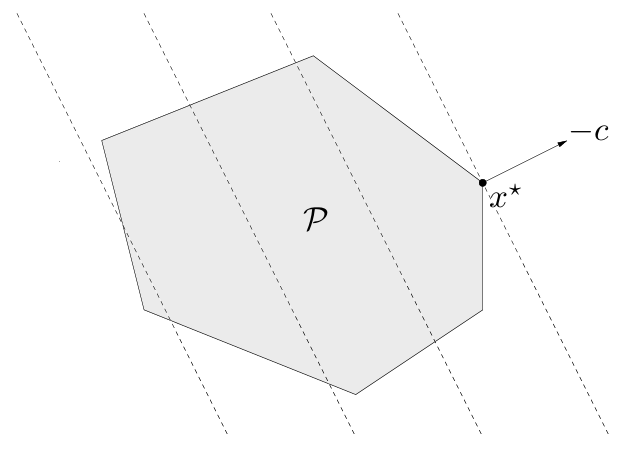
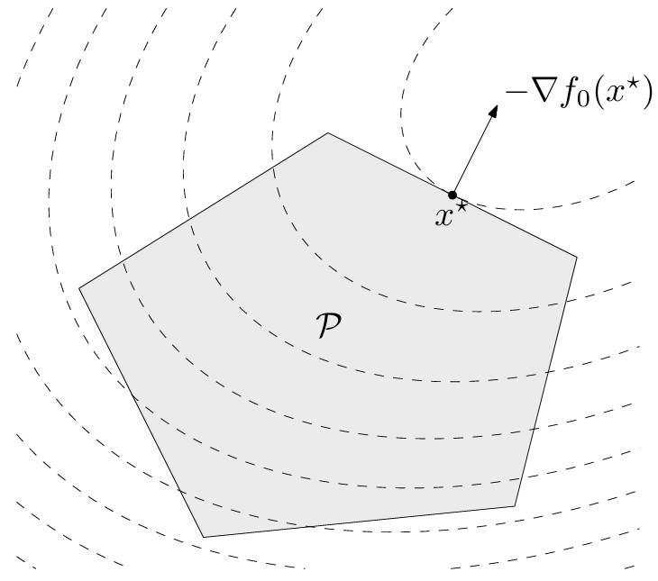

<hr style="border: 1px solid rgba(50, 0, 0, 1);">




Una vez que hemos definido qué es un problema de optimización convexa, es natural preguntarse cómo se abordan estos problemas en la práctica. Afortunadamente, existen herramientas computacionales accesibles que permiten resolver problemas convexos de forma eficiente. En particular, en este curso utilizaremos dos librerías utilizadas en Python:

- [`CVXPY`](https://www.cvxpy.org/): es una librería especializada en modelar y resolver problemas de optimización convexa. Permite expresar un problema con una sintaxis muy cercana a la notación matemática, y se encarga automáticamente de verificar si el problema es convexo y de seleccionar el solucionador adecuado.

- [`scipy.optimize`](https://docs.scipy.org/doc/scipy/tutorial/optimize.html): es una colección de algoritmos de optimización general, que incluye métodos para resolver problemas con restricciones lineales y no lineales, tanto convexos como no convexos. Es útil para ilustrar problemas sencillos y ver qué sucede cuando no se garantiza convexidad.

A través de ejemplos concretos, veremos cómo utilizar estas herramientas para formular y resolver problemas de optimización. Esto también nos ayudará a motivar tanto el estudio de las condiciones de optimalidad como los métodos de optimización, que abordaremos en las proximas secciones, lo cual permitirá justificar porqué y cómo estas herramientas funcionan.

<div style="margin-top:2.5em;"></div>


## Sintaxis básica

### `CVXPY`

<div class="alert alert-light text-dark" role="important">
<span class="badge bg-success">Pasos a seguir:</span>

El uso básico de la librería cargada como `cp` es:

1. Definir las variables independientes con la clase `cp.Variable`.
2. Definir las restricciones.
3. Definir la función objetivo dentro de la clase `cp.Minimize` o `cp.Maximize`.
4. Definir el problema de optimización `prob` con la clase `cp.Problem`.
5. Resolver el problema con el método `prob.solve()`.

</div>

Los siguientes ejemplos se encuentran disponibles en la [guía de usuario](https://www.cvxpy.org/tutorial/index.html) de la librería.


::: {.callout-example}

<span class="badge bg-primary">Ejemplo 1</span> Resolveremos el problema de optimización convexa:

$$ 
\begin{array}{ll} 
\text{minimizar } & (x-y)^2\\ 
\text{sujeto a }  & y-x+1\leq 0\\
                  & x+y-1=0
\end{array}
$$ 

```{python}
#| code-summary: "Mostrar código"
#| code-fold: false
#| fig-align: "center"
import cvxpy as cp

# 1. Creamos dos variables:
x = cp.Variable()
y = cp.Variable()

# 2. Definimos dos restricciones:
constraints = [x + y == 1,
               x - y >= 1]

# 3. Definimos la función objetivo:
obj = cp.Minimize((x - y)**2)

# 4. Definimos el problema de optimización:
prob = cp.Problem(obj, constraints)

# 5. Resolvemos:
prob.solve() 
print("Estado:", prob.status)
print("Valor objetivo óptimo:", prob.value)
print("Punto óptimo", x.value, y.value)
```


A continuación, vamos a representar geométricamente este problema: del lado izquierdo, el grafo en $\RR^3$ de la función objetivo; del lado derecho, el conjunto factible como intersección de las restricciones dadas.


```{python}
#| code-summary: "Mostrar código"
#| fig-align: "center"
import numpy as np
import matplotlib.pyplot as plt
from matplotlib.patches import Patch

# Función:
def f(x, y):
    return (x - y)**2

# Grid:
x = np.linspace(-2, 3, 100)
y = np.linspace(-2, 3, 100)
X, Y = np.meshgrid(x, y)
Z = f(X, Y)

# Solución del problema:
solucion = 1,0
valor_optimo = f(solucion[0],solucion[1])


# GRÁFICAS:
fig = plt.figure(figsize=(10, 4))

## Funcion objetivo:
ax1 = fig.add_subplot(121, projection='3d')
ax1.plot_surface(X, Y, Z, cmap='viridis', alpha=0.7)
ax1.scatter(solucion[0], solucion[1], valor_optimo, color='red', edgecolors='black', s=50)
ax1.set_title('Superficie y punto solución')
ax1.set_xlabel('x')
ax1.set_ylabel('y')

## Conjunto factible:
ax2 = fig.add_subplot(122)
ax2.set_xlim(-2, 3); ax2.set_ylim(-2, 3)
x_line = np.linspace(-2, 3, 100)
# Restricción de igualdad:
ax2.plot(x_line, 1-x_line, color = 'lightgreen', label='$x + y - 1 = 0$')
# Restricción de desigualdad:
yy, xx = np.meshgrid(np.linspace(-2, 3, 100), np.linspace(-2, 3, 100))
ax2.contourf(xx, yy, yy <= xx - 1, levels=[0.5, 1], colors=['lightblue'], alpha=0.5)
ax2.plot(x_line, x_line-1, color='lightblue', linestyle='-')
patch = Patch(facecolor='lightblue', edgecolor='none', alpha=0.5, label=r'$y \leq x - 1$')
# Intersección de restricciones:
x_aux = np.linspace(1,3,100)
ax2.plot(x_aux, 1-x_aux, color = 'black', linewidth = 3, label = 'Conjunto factible')
# Punto solución:
ax2.scatter(solucion[0], solucion[1], color='red', edgecolors='black', s=50, zorder=10, label='Punto solución (1,0)')
#
ax2.set_title('Región factible en plano xy')
ax2.set_xlabel('x')
ax2.set_ylabel('y')
ax2.legend()
ax2.legend(handles=[patch] + ax2.get_legend_handles_labels()[0])

plt.show()
```

:::


::: {.callout-example}

<span class="badge bg-primary">Ejemplo 2</span> Resolveremos el problema de optimización convexa:

$$ 
\begin{array}{ll} 
\text{minimizar } & \|A\xx-\bb\|_2^2\\ 
\text{sujeto a }  & 0\leq x_i\leq 1,\quad i=1,\cdots,n
\end{array}
$$ 

con $A\in\RR^{n\times m}$ y $\bb\in\RR^m$ aleatorios, para $n,m\in\mathbb{N}$ fijos.

```{python}
#| code-summary: "Mostrar código"
#| code-fold: false
#| fig-align: "center"
import cvxpy as cp
import numpy as np

# Datos:
m = 10; n = 5
np.random.seed(1)
A = np.random.randn(m, n)
b = np.random.randn(m)

# 1. Creamos variables:
x = cp.Variable(n)

# 2. Definimos restricciones:
constraints = [0 <= x, x <= 1]

# 3. Definimos la función objetivo:
obj = cp.Minimize(cp.sum_squares(A @ x - b))

# 4. Definimos el problema de optimización:
prob = cp.Problem(obj, constraints)

# 5. Resolvemos:
prob.solve()
print("Valor objetivo óptimo:", prob.value)
print("Punto óptimo:", x.value)
```


:::


### `scipy.optimize`

<div class="alert alert-light text-dark" role="important">
<span class="badge bg-success">Pasos a seguir:</span>

El uso básico de la librería `scipy.optimize` es:

1. Definir la función objetivo como una función de Python. 
2. Definir las restricciones con las clases `Bounds` y `LinearConstraint`.
3. Proponer un punto inicial (guess) para las variables.
4. Resolver el problema con el método `minimize`.

</div>

El siguiente ejemplo se encuentra disponible en la [documentación](https://docs.scipy.org/doc/scipy/tutorial/optimize.html#) de la librería.


::: {.callout-example}

<span class="badge bg-primary">Ejemplo 3</span> La *función de Rosenbrock* es una función no convexa que se utiliza para evaluar el rendimiento de métodos de optimización numérica, debido a la dificultad para converger al valor mínimo. Para dos variables, está definida por
$$
f(x,y)=(a-x)^2+b(y-x^2)^2,
$$

con $a,b\in\RR$. En este ejemplo, consideraremos $a=1$ y $b=100$ y resolveremos el problema de optimización convexa:

$$
\begin{array}{ll}
\text{minimizar } & (1-x)^2+100(y-x^2)^2\\
\text{sujeto a }  & x+2y\leq 1\\
                  &  x^2+y\leq 1\\
                  & x^2-y\leq 1\\ 
                  & 2x+y=1\\
                  & 0\leq x\leq 1\\
                  &-0.5\leq y\leq 2
\end{array}
$$

Las restricciones se pueden separar en:

- *Cotas*: $0\leq x\leq 1$, $-0.5\leq y\leq 2$.

- *Restricciones lineales*: $x+2y\leq 1$, $2x+y=1$. Pueden reescribirse como:
$$
\begin{pmatrix}
-\infty\\1
\end{pmatrix}
\leq
\begin{pmatrix}
1&2 \\
2&1 \\
\end{pmatrix}
\begin{pmatrix}
x\\ y
\end{pmatrix}
\leq 
\begin{pmatrix}
1\\1
\end{pmatrix}
$$

- *Restricciones no lineales*: $x^2+y\leq 1$, $x^2-y\leq 1$. Pueden reescribirse como:
$$
\begin{pmatrix}
-\infty\\-\infty
\end{pmatrix}
\leq
\begin{pmatrix}
x^2+y \\
x+y^2 \\
\end{pmatrix}
\leq 
\begin{pmatrix}
1\\1
\end{pmatrix}
$$

```{python}
#| code-summary: "Mostrar código"
#| code-fold: false
#| fig-align: "center"
from scipy.optimize import minimize
from scipy.optimize import Bounds
from scipy.optimize import LinearConstraint
from scipy.optimize import NonlinearConstraint
import numpy as np

# 1. Definimos la función objetivo:
def rosen2d(x):
    """Función de Rosenbrock para dos variables"""
    return 100 * (x[1] - x[0]**2)**2 + (1 - x[0])**2

# 2. Definimos las restricciones:
## Cotas:
bounds = Bounds([0, -0.5], [1, 2])
## Restricciones lineales:
linear_constraint = LinearConstraint([[1, 2], [2, 1]], lb=[-np.inf, 1], ub=[1, 1])
## Restricciones no lineales:
def cons_f(x):
    return [x[0]**2 + x[1], x[0]**2 - x[1]]
nonlinear_constraint = NonlinearConstraint(cons_f, lb=-np.inf, ub=1)

# 3. Punto inicial:
x0 = np.array([0.5, 0])

# 4. Resolvemos:
res = minimize(rosen2d, x0, method='trust-constr',
               constraints=[linear_constraint, nonlinear_constraint],
               options={'verbose': 1}, bounds=bounds)
print("Éxito en optimización:", res.success)
print("Valor objetivo óptimo:", res.fun)
print("Punto óptimo:", res.x)
```

:::


<div style="margin-top:2.5em;"></div>


## Tipos de problemas de optimización convexa

Vamos a estudiar diversos tipos de problemas de optimización convexa y, en paralelo, su implementación mediante las librerías `CVXPY` y `scipy.optimize`. Organizaremos el contenido según categorías, siguiendo la clasificación del libro de Boyd.


### Programación lineal

Cuando tanto la función objetivo como todas las restricciones son afines, el problema de optimización se llama *programa lineal* (LP).

<div class="alert alert-light text-dark" role="alert">
<span class="badge bg-dark">Forma básica</span>


$$ 
\begin{array}{ll} 
\text{minimizar } & \cc^\top\xx+d\\ 
\text{sujeto a } & \xx\in\left\{\xx\in\RR^p\left|\begin{array}{cl}
G\xx\preceq \hh\\
A\xx=\bb
\end{array}\right.\right\},
\end{array}
$$ 

donde $\cc\in\RR^p$, $G\in\RR^{r\times p}$, $\hh\in\RR^r$, $A\in\RR^{m\times p}$ y $\bb\in\RR^m$.

</div>

<details>
<summary>Mostrar detalles</summary>

::: {.panel-tabset}

### <span style="font-size: 1.25em;">&#x2460;</span>

El conjunto factible de un LP es un poliedro $\mathcal{P}$. Los conjuntos de nivel de la función objetivo son hiperplanos ortogonales a la dirección $\cc$. En consecuencia, el punto óptimo $x^{\star}$ es aquel punto de $\mathcal{P}$ lo más alejado posible en la dirección de $-\cc$.

<figure style="text-align: center;">
  
  <figcaption>Interpretación geométrica de un LP.</figcaption>
</figure>
<span style="display:block; height:0.25em;"></span>


### <span style="font-size: 1.25em;">&#x2461;</span>

Los programas lineales son, por supuesto, problemas de optimización convexa. Observar que, si $\bfg_i$ es la $i$-ésima fila de $G$, escribir $G\xx\preceq \hh$ es equivalente a escribir
$$g_i(\xx)=\bfg_i\xx-h_i\leq 0,\quad i=1,\cdots,r.$$

Lo mismo ocurre con las restricciones de igualdad.

### <span style="font-size: 1.25em;">&#x2462;</span>

Dos casos especiales de LP son tan comunes que se les ha dado nombres específicos. En un LP *en forma estándar*, las desigualdades son restricciones de no negatividad sobre las componentes de $\xx$; es decir, $\xx\succeq 0$. Por otra parte, si un LP no tiene restricciones de igualdad, se dice que está *en forma de desigualdad*.

:::
</details>

<div style="margin-top:2em;"></div>


::: {.callout-tip}
### La dieta

Una dieta saludable contiene $m$ nutrientes diferentes en cantidades al menos iguales a $b_1, \ldots, b_m$. Podemos componer tal dieta eligiendo cantidades no negativas $x_1, \ldots, x_n$ de $n$ alimentos diferentes. Una unidad de cantidad del alimento $j$ contiene una cantidad $a_{ij}$ del nutriente $i$ y tiene un costo de $c_j$. Queremos determinar la dieta más barata que satisfaga los requisitos nutricionales. Esto conduce al siguiente LP:

$$ 
\begin{array}{ll} 
\text{minimizar } & \cc^\top\xx\\ 
\text{sujeto a }  & A\xx\succeq \bb\\
                  & \xx\succeq \mathbf{0}
\end{array}
$$ 

Varias variaciones de este problema también se pueden formular como LPs. Por ejemplo, podemos insistir en una cantidad exacta de un nutriente en la dieta (lo que da una restricción de igualdad lineal), o podemos imponer un límite superior en la cantidad de un nutriente, además del límite inferior como se indicó anteriormente.


::: {.callout .question}

<span style="font-size: 1.3em;">📝</span><br>
Desarrolla un ejemplo con valores concretos y resuelvelo utilizando alguna librería.

```{pyodide-python}
# Resolver aquí
```

:::

<div style="margin-top:2em;"></div>

:::


::: {.callout-tip}
### El centro de Chebyshev

Consideremos el problema de encontrar la bola euclidiana más grande que se encuentra contenida en un poliedro descrito por desigualdades lineales:
$$
\mathcal{P} = \{\xx \in \RR^p \mid \aa_i^\top\xx \leq b_i,\quad i = 1, \ldots, m\}.
$$

El centro de la bola óptima se llama *centro de Chebyshev* del poliedro. Para poder formular el problema, debemos representar la bola mediante
$$
\mathcal{B}(\xx,r) = \{\xx + \uu \mid \|\uu\|_2 \leq r\}.
$$

Las variables en el problema son el centro $\xx\in\RR^p$ y el radio $r\in\RR$. El objetivo, por lo tanto, es maximizar $r$ sujeto a la restricción $\mathcal{B}(\xx,r)\subset\mathcal{P}$.

Para definir las restricciones, vamos a usar el hecho que
$$
\sup\{\aa_i^\top\uu \mid \|\uu\|_2\leq r\}=r\|\aa_i\|_2\qquad\text{¿Porqué?}
$$

En consecuencia, el requisito de que $\mathcal{B}(\xx,r)$ pertenezca a cada subespacio $\aa_i^\top \xx\leq b_i$ puede escribirse como
$$
\aa_i^\top(\xx+\uu)=\aa_i^\top\xx+r\|\aa_i\|_2\leq b_i,
$$
lo cual es una desigualdad lineal. En conclusión, hallar el centro de Chebyshev es el siguiente LP en forma de desigualdad:

$$ 
\begin{array}{ll} 
\text{maximizar } & r\\ 
\text{sujeto a }  & \aa_i^\top\xx+r\|\aa_i\|_2\leq b_i,\quad i=1,\cdots, m
\end{array}
$$ 


::: {.callout .question}

<span style="font-size: 1.3em;">📝</span><br>
Desarrolla un ejemplo con valores concretos y resuelvelo utilizando alguna librería.

```{pyodide-python}
# Resolver aquí
```

:::

<div style="margin-top:2em;"></div>

:::


### Programación cuadrática

Cuando la función objetivo es cuadrática (convexa) y las restricciones son afines, el problema de optimización se llama *programa cuadrático* (QP).

<div class="alert alert-light text-dark" role="alert">
<span class="badge bg-dark">Forma básica</span>

$$ 
\begin{array}{ll} 
\text{minimizar } & \frac{1}{2}\xx^\top P \xx+\qq^\top\xx+r\\ 
\text{sujeto a } & \xx\in\left\{\xx\in\RR^p\left|\begin{array}{cl}
G\xx\preceq \hh\\
A\xx=\bb
\end{array}\right.\right\},
\end{array}
$$ 

donde $P\in\mathbf{S}_{+}^p$, $\qq\in\RR^p$, $r\in\RR$, $G\in\RR^{r\times p}$, $\hh\in\RR^r$, $A\in\RR^{m\times p}$ y $\bb\in\RR^m$.

</div>

<details>
<summary>Mostrar detalles</summary>

::: {.panel-tabset}

### <span style="font-size: 1.25em;">&#x2460;</span>

El conjunto factible de un QP es un poliedro $\mathcal{P}$. La figura muestra el punto óptimo $x^{\star}$ y el vector  gradiente $-\nabla f(\xx^{\star}$, perpendicular tanto al conjunto de nivel (propiedad del vector gradiente) como a uno de las caras del poliedro.

<figure style="text-align: center;">
  
  <figcaption>Interpretación geométrica de un QP.</figcaption>
</figure>
<span style="display:block; height:0.25em;"></span>


### <span style="font-size: 1.25em;">&#x2461;</span>

- Los programas cuadráticos son, por supuesto, problemas de optimización convexa. Si la restricción de desigualdad también es cuadrática, el problema se denomina *programa cuadrático con restricción cuadrática* (QCQP).

:::
</details>


::: {.callout-tip}
### Distancia entre poliedros

La distancia euclidiana entre los poliedros $\mathcal{P}_1 = \{\xx \mid A_1 \xx \preceq \bb_1\}$ y $\mathcal{P}_2 = \{\xx \mid A_2 \xx \preceq \bb_2\}$ en $\RR^p$ se define como

$$
\text{dist}\,(\mathcal{P}_1, \mathcal{P}_2) = \inf \{ \|\xx_1 - \xx_2\|_2 \mid \xx_1 \in \mathcal{P}_1, \xx_2 \in \mathcal{P}_2 \}.
$$

Si los poliedros se intersecan, la distancia es cero.

Para encontrar la distancia entre $\mathcal{P}_1$ y $\mathcal{P}_2$, podemos resolver el QP con variables $\xx_1$ y $\xx_2$ definido como
$$ 
\begin{array}{ll} 
\text{minimizar } & \|\xx_1-\xx_2\|_2^2\\ 
\text{sujeto a }  & A_1\xx_1\preceq \bb_1\\
                  & A_2\xx_2\preceq \bb_2
\end{array}
$$ 

El único caso en que este problema no tiene solución es si uno de los poliedros está vacío. Por otro lado, el valor óptimo es cero si y solo si los poliedros se intersecan, en cuyo caso $\xx_1=\xx2$. En cualquier otro caso, los puntos óptimos $\xx_1$ y $\xx_"$ son los puntos en $\mathcal{P}_1$ y $\mathcal{P}_2$, respectivamente, que están más cerca el uno del otro.


::: {.callout .question}

<span style="font-size: 1.3em;">📝</span><br>
Desarrolla un ejemplo con valores concretos y resuelvelo utilizando alguna librería.

```{pyodide-python}
# Resolver aquí
```

:::

<div style="margin-top:2em;"></div>

:::


<div style="margin-top: 5em;"></div>

::: {.refs}
<span style="color: #444;"><strong>Referencias</strong></span>

Diamond, S., & Boyd, S. (s.f.). CVXPY: A Python-embedded modeling language for convex optimization. CVXPY. https://www.cvxpy.org

SciPy Developers. (s.f.). SciPy optimize tutorial. SciPy. https://docs.scipy.org/doc/scipy/tutorial/optimize.html

:::