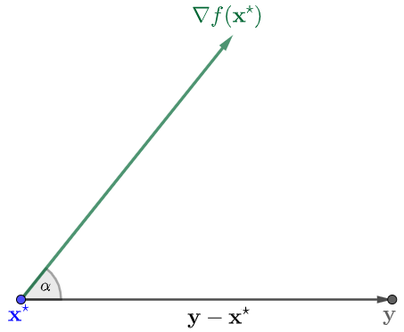
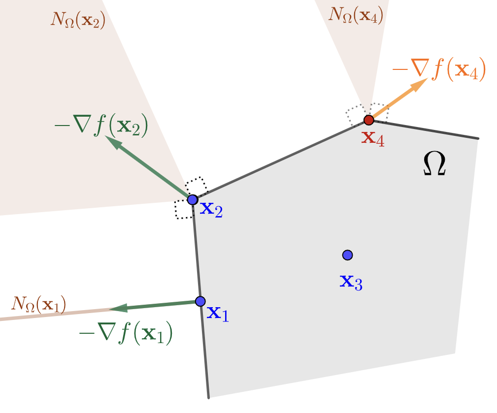
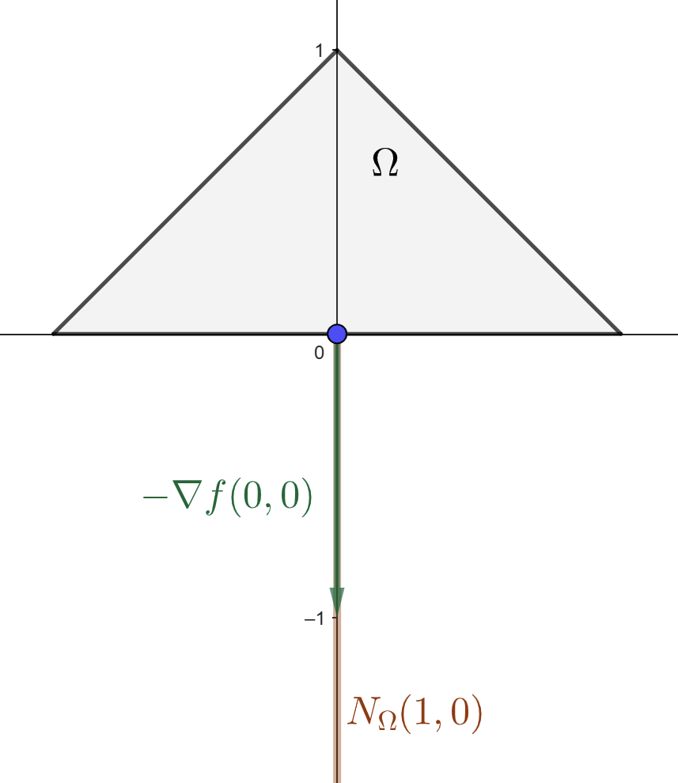
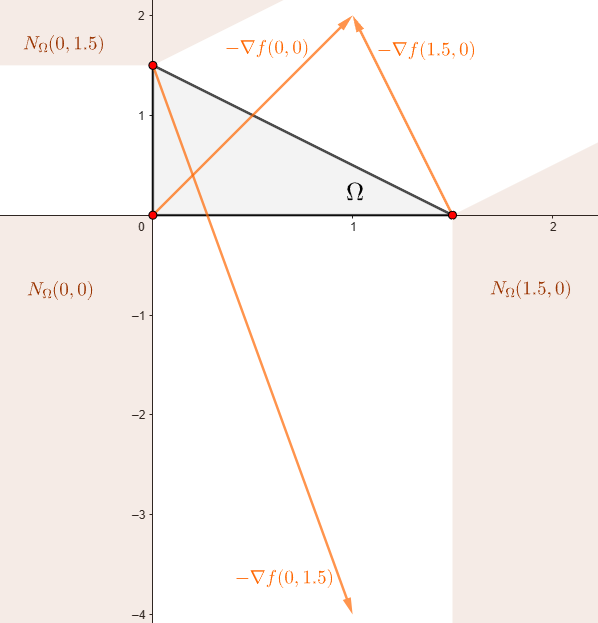
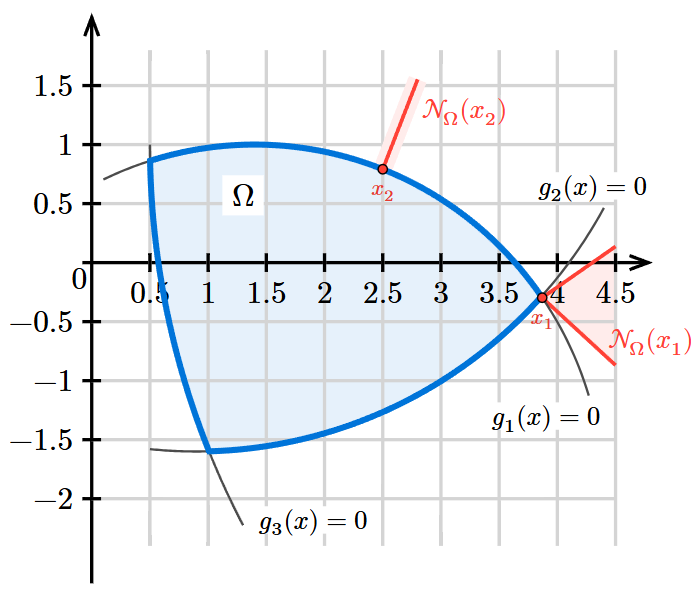
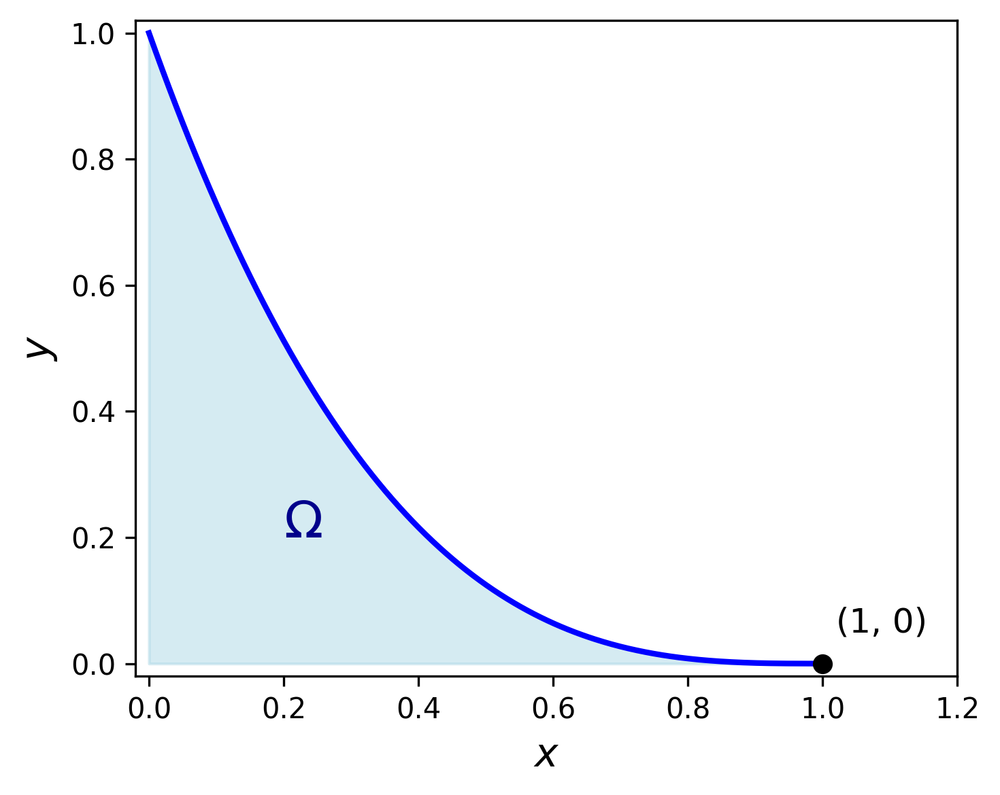
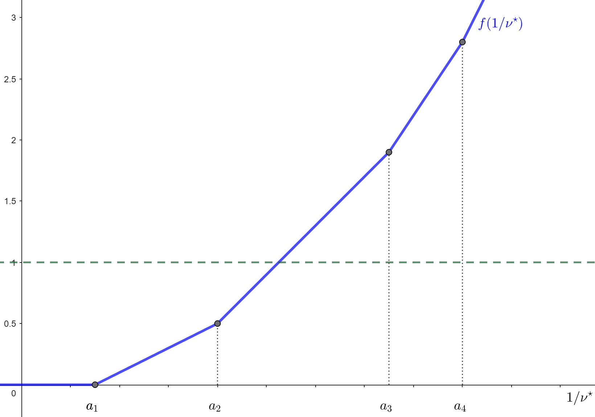
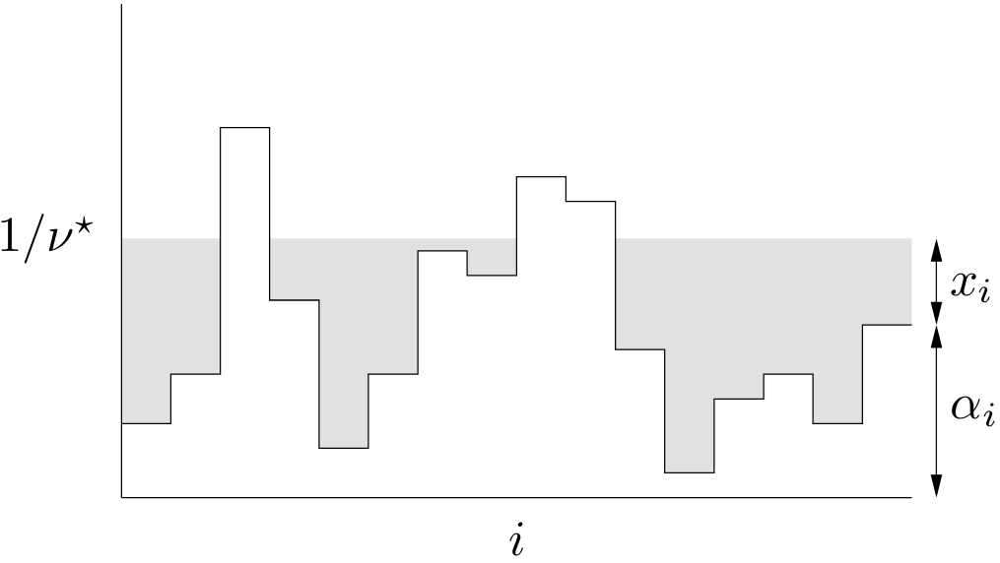
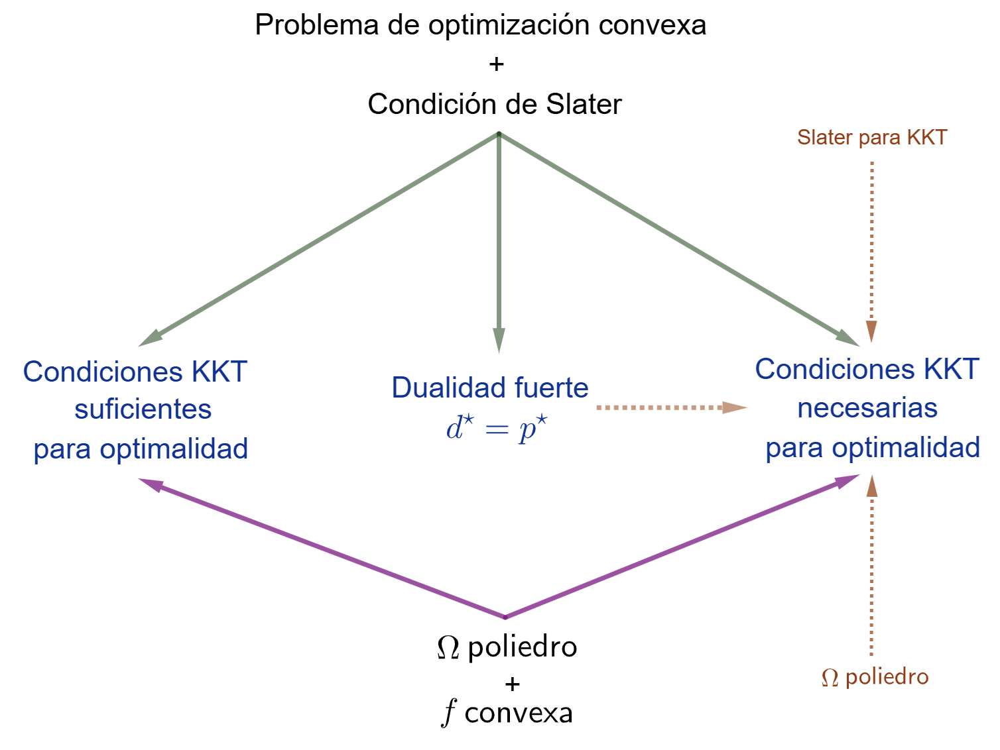



En un problema de optimización general con restricciones funcionales, de la forma
$$ 
\begin{array}{ll} 
\text{minimizar } & f(\xx)\\ 
\text{sujeto a } & \xx\in\left\{\xx\in\RR^p\left|\;\begin{array}{ll}
g_i(\xx)\leq 0,& i=1,\cdots,r\\
h_j(\xx)=0, & j=1,\cdots,m
\end{array}\right.\right\},
\end{array}
$$ 

las condiciones de optimalidad definen los requisitos que deben cumplir los puntos óptimos. En lo que sigue, <mark>asumiremos que trabajamos con funciones diferenciables</mark>.

## Condiciones de optimalidad de primer orden

### Optimización sin restricciones

De cursos anteriores recordemos que, cuando se pretende optimizar una función $f$ en su dominio, una condición necesaria (siempre que $\text{dom}\,f$ sea un  conjunto abierto) para que un punto sea óptimo es que verifique 
$$
\nabla f(\xx)=\mathbf{0}.
\tag{1}
$$

Mostrar detalles

::: {.panel-tabset}

### &#x2460;

La condición $\nabla f(\xx)=\bfzero$ no caracteriza únicamente puntos óptimos en un sentido global, sino también a aquellos donde $f$ alcanza un extremo local. De hecho, la prueba puede adaptarse a tal caso escribiendo 
$$
f(\xx + t\dd) \geq f(\xx) \quad \text{para todo } 0\leq t<\varepsilon,
$$
donde $\xx$ es un punto de extremo local, $\dd$ es una dirección arbitraria y $\varepsilon>0$ es lo suficientemente pequeño como para que $\xx+t\dd$ permanezca en un entorno donde se verifica la definición de mínimo local.

### *Prueba*

Sea $\xx^\star\in\RR^p$ un minimizador de la función $f: \RR^p \to \RR$ y sea $\dd\in\RR^p$ una dirección arbitraria. Entonces se cumple

$$
f(\xx^\star + t \dd) \geq f(\xx^\star) \qquad\forall t\in\RR:\xx^\star+t\dd\in\text{dom}\,f.
$$

Así, tenemos que
$$
\lim_{t \to 0^-} \frac{f(\xx^\star + t\dd) - f(\xx^\star)}{t} \leq 0
\quad\mbox{y}\quad
\lim_{t \to 0^+} \frac{f(\xx^\star + t\dd) - f(\xx^\star)}{t} \geq 0.
$$

En consecuencia, como $f$ es diferenciable, la derivada direccional de $f$ en $\xx^\star$ a lo largo de $\dd$ existe y debe ser

$$
\frac{\partial f}{\partial \dd}(\xx^\star):= \lim_{t \to 0} \frac{f(\xx^\star + t\dd) - f(\xx^\star)}{t} = 0.
$$

Usando la propiedad $\frac{\partial f}{\partial \dd}(\xx)=\langle \nabla f(\xx), \dd \rangle_2$ para toda dirección $\dd\in\RR^p$,  se deduce
$$
\langle \nabla f(\xx^\star), \dd \rangle_2 = 0.
$$

Finalmente, dado que $\dd$ es arbitrario, concluimos que $\nabla f(\xx^\star)=\mathbf{0}$. $\qquad\blacksquare$

:::

Pero cuidado: lo anterior es *solo una condición necesaria* que todos los puntos óptimos deben cumplir, pero no implica que cualquier punto que la satisfaga sea automáticamente óptimo. En otras palabras, las soluciones de $\nabla f(\xx) = \bfzero$ forman una lista de puntos candidatos para minimizar, llamados *puntos críticos*.

De inmediato surgen dos preguntas claves:

:::{.myhighlight4}

¿Cuál es la generalización de la condición necesaria $\nabla f(\xx) = 0$ cuando enfrentamos un problema de optimización con restricciones?

¿Bajo qué circunstancias $\nabla f(\xx) = \bfzero$ también se convierte en una condición suficiente para la optimalidad?

:::

Para el caso de optimización sin restricciones, podemos responder a la segunda pregunta con un resultado muy importante dentro de la optimización convexa, relacionado con el Teorema 3 del [C1-S2](A2_optimizacion_convexa.html#problemas-de-optimización-convexa).

::: {.teorema}
**Teorema 1.** (Condición suficiente y necesaria de optimalidad de primer orden sin restricciones para funciones convexas) 
Sea $f:\RR^p\to\RR$ una función diferenciable y  convexa. Entonces $\xx^\star\in \text{dom}\,f$ es un minimizador de $f$ si y solo si
$$
\nabla f(\xx^\star)=\bfzero.
$$  
:::

### Optimización con restricciones

La clave para generalizar la condición necesaria $\nabla f(\xx)=\mathbf{0}$ al caso de optimización con restricciones surge de la prueba anterior, más precisamente de la desigualdad 
$$
\langle\nabla f(\xx),\dd\rangle_2\geq 0.
\tag{2}
$$

Debemos ajustar (2) de manera tal de asegurarnos que las posibles direcciones de movimiento nos permitan aproximarnos a puntos factibles $\xx$ sin salirnos del conjunto factible $\Omega$. Esto conduce a la siguiente reformulación:

$$
\langle\nabla f(\xx),\dd\rangle_2\geq 0\qquad \forall\dd\in\RR^p: \xx+t\dd\in\Omega,
\tag{3}
$$

para cualquier $t>0$ lo suficientemente pequeño. A partir de esto:

:::{.myhighlight3}

¿Cuáles son las direcciones $\dd$ que nos permiten permanecer en $\Omega$ desde el punto $\xx$?

¿Qué implicancias tiene (3) para el vector gradiente $\nabla f(\xx)$?

:::

Una idea inicial para caracterizar el conjunto de direcciones permitidas es tomar cualquier otro punto $\yy\in\Omega$ y observar qué sucede con la dirección desde $\xx$ hacia $\yy$. Esta dirección, $\dd=\yy-\xx$, será válida siempre que $\Omega$ sea convexo (ver Definición 3 de [C1-S2](A2_optimizacion_convexa.html#definiciones-básicas)). Claramente, en tal caso, (3) se verifica trivialmente tomando $t=1$. Por ese motivo, podemos hacer la primera suposición para formalizar una condición necesaria de optimalidad:

:::{.myhighlight2}

*Primer supuesto*

**$\Omega$ un conjunto convexo**

:::

Bajo esta suposición, tenemos el siguiente resultado, cuya demostración se obtiene directamente de ajustar la prueba vista para (1).

::: {.teorema}
**Teorema 2.** (Condición necesaria de optimalidad de primer orden para un conjunto factible convexo) 
Sea $\Omega\subset\RR^p$ convexo y sea $f:\RR^p\to\RR$ una función diferenciable. Si $\xx^\star\in \Omega$ es un minimizador de $f$ sobre $\Omega$, entonces
$$
\langle \nabla f(\xx^\star), \yy - \xx^\star\rangle_2 \geq 0 \qquad \forall\yy\in\Omega.
\tag{4}
$$  
:::

<figure style="text-align: center;">
  
  <figcaption> **Figura 1**. Interpretación geométrica de la condición necesaria (4) del Teorema 2.   </figcaption>
</figure>

Como se puede apreciar en la Figura 1, para un punto óptimo $\xx^\star$, el vector gradiente forma un ángulo agudo (o recto) con todas las direcciones de la forma $\yy-\xx^\star$. Esto se deduce del hecho que
$$
\langle \nabla f(\xx^\star), \yy - \xx^\star\rangle_2=\underbrace{\|\nabla f(\xx^\star)\|_2}_{\geq 0}\underbrace{\|\yy-\xx^\star\|_2}_{\geq 0}\cos \alpha\geq 0
$$

si y solo si $\cos\alpha\geq 0$ (o equivalentemente,  $0\leq\alpha\leq\pi/2$).

Ahora bien, nosotros estamos interesados en hallar $\xx^\star$. En este sentido, la condición (4) nos sirve para identificar aquellos puntos $\xx\in\Omega$ candidatos a ser óptimos (siguiendo la terminología habitual, los llamaremos <mark>*puntos críticos*</mark>). Si pensamos en el vector opuesto al gradiente, la expresión (4) se reescribe como
$$
\langle -\nabla f(\xx),\yy-\xx\rangle_2\leq 0\qquad \forall\yy\in\Omega.
\tag{5}
$$

Esto vincula nuestro análisis con la definición de cono normal (Definición 7 de [C1-S2](A2_optimizacion_convexa.html#conos-normales)): la ecuación (5) es equivalente a  escribir $-\nabla f(\xx)\in N_{\Omega}(\xx)$. Así, el Teorema 2 puede ser interpretado en términos de conos normales como sigue:

:::{.myhighlight}
Bajo las condiciones del Teorema 2, si $\xx^\star$ es un minimizador de $f$ sobre $\Omega$, entonces
$$
-\nabla f(\xx^\star)\in N_{\Omega}(\xx^\star).
$$

:::

<figure style="text-align: center;">
  
  <figcaption>**Figura 2**. Idea geométrica de la condición del gradiente para tres puntos críticos $\xx_1,\xx_2,\xx_3\in\Omega$ y un punto no crítico $\xx_4\in\Omega$. En el caso de $\xx_3$, se tiene $\nabla f(\xx_3)=\bfzero$.</figcaption>
</figure>

En la Figura 2 se presenta la geometría derivada de la condición necesaria establecida, para el caso en que $\Omega$ es un poliedro. Las posiciones de los puntos críticos corresponden a los Ejemplos 9-12 de conos normales, vistos en el [C1-S2](A2_optimizacion_convexa.html#conos-normales). En particular, para puntos interiores de $\Omega$, la condición se reduce a la ecuación $\nabla f(\xx)=\bfzero$, típica de los problemas sin restricciones.

Todos los casos están caracterizados por el siguiente hecho: 

::: {.myhighlight}

Los puntos críticos son aquellos en los cuales el opuesto del gradiente forma ángulos no agudos con todas las direcciones factibles.

:::

Esta es, sin dudas, la idea principal de nuestro análisis, que procuraremos extender a formas más generales de $\Omega$.

¡Cuidado! La condición provista por el Teorema 2 es necesaria pero no suficiente. Podemos pensar rápidamente en ejemplos de mínimos locales en el interior de $\Omega$, tales como el Ejemplo 3 de [C1-S1](A1_intro_optimizacion.html). A continuación, veremos un ejemplo para cuando el punto crítico ocurre en la frontera de $\Omega$, pero no es cierto que sea un punto óptimo.

::: {.callout-example}

Ejemplo 1 

Punto crítico pero no óptimo en un poliedro

$$
\begin{array}{ll}
\text{minimizar } & x_2-x_1^2\\
\text{sujeto a }  & 2x_1+x_2\leq 1,\\
                  & -2x_1+x_2\leq 1,\\
                  & x_2\geq 0.
\end{array}
$$

El conjunto factible $\Omega$ es el triángulo de vértices $(-\frac{1}{2},0)$,  $(\frac{1}{2},0)$ y $(0,1)$. En $\xx=(0,0)$ se tiene $\nabla f(0,0)=(0,1)$. La condición del Teorema 2 para este punto se expresa como 
$$
\langle (0,1),\yy-(0,0)\rangle_2=y_2\geq 0\qquad\forall \yy\in\Omega.
$$

Esto es cierto, de acuerdo a la definición de $\Omega$. De hecho, en la siguiente figura se puede ver que, efectivamente, $-\nabla f(0,0)\in N_{\Omega}(0,0)$. 

<figure style="text-align: center;">
  
</figure>

Pese a verificar la condición necesaria (4), el punto $(0,0)$ no es óptimo. De hecho, $f(0,0)=0$, mientras que el valor óptimo es $-\frac{1}{4}$ y ocurre en los vértices $(\pm\frac{1}{2},0)$.

:::

:::{.myhighlight2}
*Segundo supuesto*

**$f$ una función convexa**

:::

Para el notable caso de las <mark>funciones convexas</mark> ([Definición 8 de C1-S2](A2_optimizacion_convexa.html#funciones-convexas)) la condición establecida en el Teorema 2 sí es suficiente.

::: {.teorema}
**Teorema 3.** (Condición suficiente y necesaria de optimalidad de primer orden para un conjunto factible convexo y una función  objetivo convexa) 
Sea $\Omega \subseteq\RR^p$ convexo y sea $f:\RR^p\to\RR$ una función diferenciable convexa. Entonces $\xx^\star$ es un minimizador de $f$ en $\Omega$ si y solo si se verifica
$$
-\nabla f(\xx^\star)\in N_{\Omega}(\xx^\star).
\tag{6}
$$  

:::

Mostrar detalles

::: {.panel-tabset}

### &#x2460;

El Teorema 3 se puede aplicar a todo problema de optimización convexa, pero es un resultado más general.

### *Demostración*

En virtud del Teorema 2, debemos probar únicamente la suficiencia. Sea $\xx\in\Omega$ tal que $-\nabla f(\xx)\in N_{\Omega}(\xx)$, entonces
$$
\langle\nabla f(\xx),\yy-\xx\rangle_2\geq 0\qquad\forall\yy\in\Omega.
$$

Por condición de primer orden para convexidad (Teorema 1 de [C1-S2](A2_optimizacion_convexa.html#condiciones-de-convexidad)), resulta
$$
f(\yy)\geq f(\xx)+\underbrace{\langle\nabla f(\xx),\yy-\xx\rangle_2}_{\geq 0}\geq f(\xx)
$$
para todo $\yy\in\Omega$, lo cual significa que $\xx$ es un minimizador de $f$ en $\Omega$. $\qquad\blacksquare$

:::

::: {.callout-example}

Ejemplo 2

Aplicación de condición suficiente y necesaria de optimalidad en un problema de optimización convexa

$$
\begin{array}{ll}
\text{minimizar } & \frac{1}{2}\|A\xx-\bb\|_2^2\\
\text{sujeto a }  & x_1+x_2\leq 1.5,\\
                  &x_1\geq 0,\; x_2\geq 0.
\end{array}
$$

con
$$
A=\begin{pmatrix}1&0\\0&2\end{pmatrix}\quad\mbox{y}\quad\bb=\begin{pmatrix}1\\1\end{pmatrix}. 
$$

El conjunto factible $\Omega$ es el triángulo con vértices $(0,0)$, $(1.5,0)$ y $(0,1.5)$, por lo tanto es convexo. Respecto a la función objetivo, tenemos
$$
\nabla f(\xx)=A^\top(A\xx-\bb)=\begin{pmatrix}1&0\\0&2\end{pmatrix}\left[\begin{pmatrix}1&0\\0&2\end{pmatrix}\xx-\begin{pmatrix}1\\1\end{pmatrix}\right]=\begin{pmatrix}x_1-1\\4x_2-2\end{pmatrix},
$$

y

$$
\nabla f^2(\xx)=A^\top A = \begin{pmatrix}1&0\\0&2\end{pmatrix}\begin{pmatrix}1&0\\0&2\end{pmatrix}=\begin{pmatrix}1&0\\0&4\end{pmatrix}
$$

Claramente $\nabla^2 f(\xx)\succeq 0$, lo cual significa que $f$ es convexa. Así, por Teorema 3, la condición (6) es suficiente y necesaria para que $\xx$ sea un punto óptimo. Esto nos permite hacer el siguiente análisis:

- $\nabla f(\xx)\neq \bfzero$ para todo punto interior de $\Omega$, lo cual implica que no hay puntos óptimos en el interior.

- En el lado $\{(0,t) \mid 0<t<1.5\}$, $-\nabla f(\xx)=(1,2-4t)$. Pero  el cono normal está determinado por la dirección normal $(-1,0)$, lo cual significa que $-\nabla f(\xx)\in N_{\Omega}(\xx)$ si y solo si es de la forma $(-a,0)$ con $a>0$, lo cual no puede ocurrir. Por lo tanto, no hay puntos óptimos en esta porción de frontera.

- De manera similar al caso anterior, tampoco hay puntos óptimos en el lado $\{(t,0)\mid 0<t<1.5\}$, ya que $-\nabla f(\xx)=(1-t,2)$ y la dirección normal es $(0,-1)$.

- En el lado $\{(t,1.5-t)\mid 0<t<1.5\}$,  tenemos que $-\nabla f(\xx)=(1-t,4t-4)$ y la dirección normal es $(1,1)$. Esto significa que (6) es cierto si ambas componentes de $-\nabla f(\xx)$ son iguales:
$$
\begin{align*}
1-t&=4t-4\\
t &= 1
\end{align*}
$$

  Por lo tanto, el punto $(1,0.5)$, con $\nabla f(1,0.5)=\bfzero$, es un punto óptimo del problema.

- Faltan los vértices del triángulo. En la siguiente figura se muestra el comportamiento de $-\nabla f(\xx)$ en cada uno de ellos.

<figure style="text-align: center;">
  
</figure>

Dado que no cumplen la condición suficiente y necesaria (6), ningun vértice es un punto óptimo. En conclusión, el problema tiene solución única 
$$
\xx^\star=(1,0.5)\qquad\text{y}\qquad p^\star=f(1,0.5)=0.
$$

:::

## Condiciones de Karush-Kuhn-Tucker (KKT)

Hasta ahora hemos visto que, para $\Omega$ convexo (*primer supuesto*), una condición necesaria para que un punto $\xx$ sea óptimo es que el vector opuesto al gradiente de la función objetivo pertenezca al cono normal $N_{\Omega}(\xx)$. Además, si la función objetivo es convexa (*segundo supuesto*), dicha condición resulta también suficiente.

Aunque el Teorema 3 es general, y contempla los problemas de optimización convexa, su aplicación práctica puede resultar poco directa. Afortunadamente, cuando el conjunto factible $\Omega$ está definido por restricciones funcionales diferenciables, es posible expresar estas condiciones de manera más estructurada a partir de la caracterización de los conos normales, lo cual conduce a las que se conocen como *condiciones de Karush-Kuhn-Tucker* (o, simplemente, condiciones KKT).

Nuestro objetivo es formular dichas condiciones. Comenzaremos analizando el caso particular de restricciones afines, para lograr intuición, y luego generalizaremos al caso de restricciones no lineales.

### El caso particular de restricciones afines

:::{.myhighlight2}

*Caso especial*

**$\Omega$ un poliedro**

:::

Vamos a considerar el caso en que $\Omega$ es un poliedro definido a partir de la intersección de un número finito de semiespacios e hiperplanos. Es decir, es de la forma
$$
\Omega=\{\xx\in\RR^p \mid A\xx\preceq \bb,\; C\xx=\dd\},
\tag{7}
$$

donde $A\in\RR^{r\times p}$, $C\in\RR^{m\times p}$, $\bb\in\RR^r$ y $\dd\in\RR^m$. 

::: {.definicion}
**Definición 1.** (Restricción activa) Una restricción de desigualdad $g(\xx)\leq 0$ se dice que está *activa* en un punto $\xx_0$ si allí se cumple con igualdad; es decir, si
$$
g(\xx_0)= 0.
$$

Esto significa que $\xx_0$ pertenece a la frontera del conjunto $\{\xx\in\RR^p \mid g(\xx)\leq 0\}$.

:::

En los Ejemplos 9-12 de conos normales en [C1-S2](A2_optimizacion_convexa.html#conos-normales), analizamos su definición según la posición del punto de interés: si $\xx$ es interior a $\Omega$, resulta simplemente $N_{\Omega}(\xx)=\{\bfzero\}$, mientras que si $\xx$ pertenece a la frontera de $\Omega$, el cono normal queda determinado por las direcciones que definen los semiespacios e hiperplanos. Para este último caso, podemos resumirlo de la siguiente manera:

:::{.myhighlight}

El cono normal en un punto en la frontera es la envolvente cónica de las direcciones ortogonales a las restricciones activas.

:::

No obstante, en dichos ejemplos hemos considerado casos particulares de $\Omega$:  un hiperplano, un semiespacio y la intersección de dos semiespacios. Necesitamos extender ese análisis a cualquier poliedro $\Omega$ y caracterizar el cono normal en cualquier punto de $\Omega$. El siguiente resultado nos proporciona dicha caracterización.

::: {.teorema}
**Teorema 4.** (Cono normal a un punto de un poliedro)
Sea $\Omega$ el poliedro definido por (7). Para $\xx\in\Omega$, sea $I(\xx)$ el conjunto de índices de las restricciones activas; esto es
$$
I(\xx):=\left\{i\in\{1,\cdots,r\} \mid \aa_i^\top\xx=b_i\right\}.
$$
Entonces, el cono normal en $\xx$ está dado por

$$
N_{\Omega}(\xx)=\left\{\left.\sum_{i\in I(\xx)}\lambda_i\aa_i+\sum_{j=1}^m\nu_j\cc_j\,\right| \lambda_i\in\RR_0^+,\;\nu_j\in\RR\right\}.
$$
:::

Mostrar detalles

::: {.panel-tabset}

### &#x2460;

La suma en la expresión del cono normal puede ser reescrita sin restringir $i\in I(\xx)$, simplemente imponiendo $\lambda_i=0$ para todo $i\notin I(\xx)$. Esta imposición queda ímplicita de forma inmediata si se escribe

$$
\sum_{i=1}^r\lambda_i\left(\aa_i^\top\xx-b_i\right)=0\qquad\lambda_i\in\RR_0^+.
\tag{8}
$$

En forma vectorial, (8) puede escribirse como $\bflambda^\top\left(A\xx-\bb\right)=0$, donde $\bflambda=(\lambda_1,\cdots,\lambda_m)^\top$. Con esta notación, podemos escribir el cono normal del Teorema 4 así:
$$
N_{\Omega}(\xx)=\left\{A^\top\bflambda+C^\top\bfnu \mid \bflambda^\top(A\xx-\bb)=0,\;\bflambda\in(\RR_0^+)^r,\;\bfnu\in\RR^m\right\}.
$$

### &#x2461;

La condición de optimalidad $-\nabla f(\xx)\in N_{\Omega}(\xx)$ se traduce como
$$
-\nabla f(\xx)=\sum_{i\in I(\xx)}\lambda_i\aa_i+\sum_{j=1}^m\nu_j\cc_j,\qquad\lambda_i\in\RR^+,\;\nu_j\in\RR.
$$

O, equivalentemente,
$$
-\nabla f(\xx)=\sum_{i\in I(\xx)}\lambda_i \nabla g_i(\xx)+\sum_{j=1}^m\nu_j\nabla h_j(\xx),\qquad\lambda_i\in\RR^+,\;\nu_j\in\RR.
$$
donde $g_i(\xx)=\aa_i^\top\xx-b_i$ y $h_j(\xx)=\cc_j^\top\xx-d_i$. Esta última expresión resulta familiar, ya que los coeficientes $\lambda_i$ y $\nu_j$ son precisamente los <mark>*multiplicadores de Lagrange*</mark> asociados a las funciones de restricción.
:::

::: {.callout .question}
📝 
Verifique que el resultado del Teorema 4 contempla los ejemplos de conos normales.

:::

Ahora bien, dado que $\Omega$ es un poliedro (y, por lo tanto, un conjunto convexo), los Teoremas 2 y 3 pueden ser aplicados en este contexto. Obtenemos así el siguiente resultado.

::: {.teorema}
**Corolario 1.** (Condición necesaria de optimalidad de primer orden para un conjunto factible poliedral) Sea $\Omega$ el poliedro definido por (7), y sea $f:\RR^p\to\RR$ una función diferenciable. Si $\xx^\star\in \Omega$ es un minimizador de $f$ sobre $\Omega$, entonces existen $\bflambda\in(\RR_0^+)^r$ y $\bfnu\in\RR^m$ tales que $\lambda_i(\aa_i^\top\xx-b_i)=0$ para todo $i=1,\ldots,r$ y
$$
-\nabla f(\xx^\star)=\sum_{i=1}^r\lambda_i\aa_i+\sum_{j=1}^m \nu_j\cc_j.
$$  

Además, si $f$ es convexa, esta condición es también suficiente.

:::

Importante

Las condiciones del Corolario 1, conocidas como *condiciones de Karush-Kuhn-Tucker* (KKT), permiten definir un criterio para obtener puntos críticos. Se formulan a partir de diferentes componentes:

- **Factibilidad primal**: El punto $\xx$ debe ser un punto factible.

- **Factibilidad dual**: Los multiplicadores de Lagrange asociados a las restricciones de desigualdad deben ser no negativos.
$$
\lambda_i\geq 0 \quad \forall i=1,\cdots,r.
$$

- **Holgura complementaria**: Los multiplicadores de Lagrange asociados a las restricciones de desigualdad solo pueden ser positivos si la restricción está activa.
$$
\lambda_i\left(\aa_i^\top\xx-b_i\right)=0 \qquad \forall i=1,\cdots,r.
$$

- **Estacionariedad**: El opuesto del vector gradiente debe ser una combinación lineal de los gradientes de las restricciones.
      $$
      -\nabla f(\xx)=\sum_{i=1}^{r}\lambda_i\aa_i+\sum_{j=1}^m\nu_j\cc_j,
      $$

    o bien
      $$
      \nabla f(\xx)+\sum_{i=1}^{r}\lambda_i\aa_i+\sum_{j=1}^m\nu_j\cc_j=\bfzero.
      $$

En particular, si $\xx$ es un punto interior de $\Omega$, las condiciones KKT se reducen a 
$$
\nabla f(\xx)=\bfzero.
$$

Por supuesto, el resultado presentado en el Corolario 1 representa un criterio para obtener puntos críticos si $\Omega$ es un poliedro. En resumen:

:::{.myhighlight}

Si $\Omega$ es un conjunto convexo de la forma 
$$
\Omega:=\{\xx\in\RR^p \mid A\xx\preceq \bb,\;C\xx=\dd\},
$$
entonces las condiciones KKT son necesarias para que un punto sea óptimo.

Si, además, $f$ es convexa, las condiciones KKT son también suficientes.

:::

::: {.callout-example}
Ejemplo 3 

  Minimización cuadrática convexa con restricciones de igualdad

Sean $P\in\SS_+^p$, $\mathbf{q}\in\RR^p$, $c\in\RR$, $A\in\RR^{m\times p}$ y $\bb\in\RR^p$. Consideremos el problema

$$
\begin{array}{ll}
\text{minimizar } & \frac{1}{2}\xx^\top P\xx+\mathbf{q}^\top \xx+c\\
\text{sujeto a }  & A\xx=\bb.
\end{array}
$$

Dado que la función objetivo es convexa, las condiciones KKT son suficientes y necesarias. Además, teniendo en cuenta que solo hay restricciones de igualdad, a saber, $h_j(\xx)=\aa_j^\top\xx-b_j$, únicamente debemos analizar las condiciones de factibilidad primal y estacionariedad. La condición de estacionariedad es:

$$
\begin{align*}
-\nabla f(\xx^\star)&=\sum_{j=1}^m\nu_j^\star\nabla h_j(\xx^\star)\\
-(P\xx^\star+\qq)&= A^\top\bfnu^\star\\
P\xx^\star+\qq+A^\top\bfnu^\star &=\bfzero.
\end{align*}
$$

Agregando la factibilidad primal $A\xx^\star=\bb$, obtenemos finalmente un sistema de $p+m$ ecuaciones con $p+m$ incógnitas:
$$
\begin{pmatrix}P&A^\top\\A&0\end{pmatrix}\begin{pmatrix}\xx^\star\\\bfnu^\star\end{pmatrix}=\begin{pmatrix}-\qq\\\bb\end{pmatrix}.
$$

:::

::: {.callout .question}
📝 
Proponga casos para el Ejemplo 3, con $\xx\in\RR^2$ y $m=2$.

:::

::: {.callout-example}
Ejemplo 4 

  Minimización cuadrática convexa con restricciones de desigualdad

Sean 
$$
P=\begin{pmatrix}1&0\\0&4\end{pmatrix},\qquad \qq=\begin{pmatrix}-2\\-2\end{pmatrix}.
$$

Consideramos el problema
$$
\begin{array}{ll}
\text{minimizar } & \frac{1}{2}\xx^\top P\xx+\mathbf{q}^\top \xx\\
\text{sujeto a }  & x_1+x_2\leq 1.5,\\
                  & x_1\geq 0,\; x_2\geq 0.
\end{array}
$$

Dado que $P\succeq 0$, la función objetivo es convexa. Además, el conjunto factible $\Omega$ es un poliedro. Por lo tanto, por Corolario 1, las condiciones KKT son suficientes y necesarias para la optimalidad. Las definimos a continuación:

$$
\begin{array}{cl}
x_1^\star+x_2^\star-1.5\leq 0,\; x_1^\star\geq 0,\; x_2^\star\geq 0\qquad&\text{(Factibilidad primal)}\\[3pt]
\lambda_i^\star\geq 0\qquad\forall i=1,2,3\qquad &\text{(Factibilidad dual)}\\[3pt]
\lambda_1^\star(x_1^\star+x_2^\star-1.5)=0,\; \lambda_2^\star x_1^\star=0,\;\lambda_3^\star x_2^\star=0\qquad&\text{(Holgura complementaria)}\\[3pt]
(P\xx^\star+\qq)+\lambda_1^\star\begin{pmatrix}1\\1\end{pmatrix}-\begin{pmatrix}\lambda_2^\star\\\lambda_3^\star\end{pmatrix}=\bfzero\qquad&\text{(Estacionariedad)}
\end{array}
$$

Reemplazando $P$ y $\qq$, de la condición de estacionariedad resulta
$$
\begin{pmatrix}
x_1^\star -2 + \lambda_1^\star-\lambda_2^\star  \\
4x_2^\star -2 +\lambda_1^\star-\lambda_3^\star 
\end{pmatrix}
= \begin{pmatrix}0\\0\end{pmatrix}.
\tag{9}
$$

Si $\lambda_1^\star=0$, se deduce $\lambda_2^\star=x_1^\star-2$ y $\lambda_3^\star=4x_2^\star-2$. Luego, por holgura complementaria, resultan $(x_1^\star-2)x_1^\star=0$ y $(4x_2^\star-2)x_2^\star=0$, con soluciones factibles $(0,0)$ y $(0,0.5)$. Ambas deben ser descartadas, pues violan la factibilidad dual.

En consecuencia, debe ser $\lambda_1^\star\neq 0$. Esto significa que la restricción $x_1+x_2\leq 1.5$ está activa, tal que 
$$
x_1^\star+x_2^\star-1.5=0.
$$

Ahora, veamos que $x_1^\star\neq 0$ y $x_2^\star\neq 0$. Si $x_1^\star=0$ (análogamente para $x_2^\star$), de la primera ecuación en (9) se deduce $\lambda_2^\star=\lambda_1^\star-2$, tal que $\lambda_1^\star\geq 2$. La holgura complementaria resulta en $x_2^\star=1.5$, lo cual nos lleva una contradicción entre la segunda ecuación de (9), que resulta en $\lambda_3^\star=4$, y la holgura complementaria, que exige $\lambda_3^\star=0$.

En limpio, sabemos que debe ser $\lambda_1^\star\neq 0$, $x_1^\star\neq 0$, $x_2^\star\neq 0$. Además, por holgura complementaria, $\lambda_2^\star=0$ y $\lambda_3^\star=0$.

Luego, las condiciones KKT se reducen al siguiente sistema, que resulta de agregar a (9) la restricción activa:
$$
\begin{pmatrix}
1&0&1\\
0&4&1\\
1&1&0
\end{pmatrix}
\begin{pmatrix}
x_1^\star\\
x_2^\star\\
\lambda_1^\star
\end{pmatrix}
=
\begin{pmatrix}
2\\
2\\
1.5
\end{pmatrix}.
$$

La solución del sistema nos da el único punto óptimo del problema:
$$
\xx^\star=(1.2,0.3)\qquad\text{con}\;\lambda_1^\star=0.8.
$$

:::

### Generalización

Volvamos al caso general de nuestro interés:
$$ 
\begin{array}{ll} 
\text{minimizar } & f(\xx)\\ 
\text{sujeto a } & \xx\in\left\{\xx\in\RR^p\left|\;\begin{array}{ll}
g_i(\xx)\leq 0,& i=1,\cdots,r\\
h_j(\xx)=0, & j=1,\cdots,m
\end{array}\right.\right\},
\end{array}
\tag{10}
$$ 

donde $\Omega$ está definido como una intersección de restricciones funcionales diferenciables.

Supongamos que $\xx^\star$ es un punto óptimo en la frontera del conjunto factible $\Omega$ correspondiente a tres condiciones de desigualdad $g_i(x) \le 0$ para $i=1,2,3$. En la siguiente figura se grafica la idea principal que subyace a la definición de cono normal para el caso de restricciones no lineales. 

<figure style="text-align: center;">
  
  <figcaption>**Figura 3**. Envolvente cónica de la intersección de restricciones $g_i(\xx)\leq 0$, para $i=1,2,3$.</figcaption>
</figure>

:::{.myhighlight}
El conjunto de direcciones que forma un ángulo obtuso (o recto) con todas las direcciones desde $\xx^\star$ que permanecen en $\Omega$ coincide con el cono normal de la linearización de las restricciones activas en $\xx^\star$.
:::

Esta idea es más bien intuitiva, por lo cual no estamos en condiciones de extender el Teorema 4 ni el Corolario 1 de manera rigurosa. Sin embargo, lo que sí haremos es extender el concepto de las condiciones KKT, dejando para más adelante el análisis de su aplicabilidad. Para ello, utilizaremos los resultados de la sección anterior en $\tilde{\Omega}$, la *linearización* de $\Omega$ en un punto dado. En particular, para un punto óptimo $\xx^\star$, la linearización de las restricciones queda determinada por:

$$
\tilde{g}_i(\xx):=g_i(\xx^\star)+\nabla g_i(\xx^\star)^\top (\xx-\xx^\star),
$$
$$
\tilde{h}_i(\xx):=h_i(\xx^\star)+\nabla h_i(\xx^\star)^\top(\xx-\xx^\star).
$$

Es decir, resulta
$$
\tilde{\Omega}:=\left\{\xx\in\RR^p\left|\;\begin{array}{ll}
\tilde{g}_i(\xx)\leq 0,& i=1,\cdots,r\\
\tilde{h}_j(\xx)=0, & j=1,\cdots,m
\end{array}\right.\right\}.
$$ 

Es importante notar que $\nabla \tilde{g}_i(\xx)=\nabla g_i(\xx^\star)$ y $\nabla \tilde{h}_i(\xx)=\nabla h_i(\xx^\star)$. En consecuencia, la aplicación del Teorema 4 a $\tilde{\Omega}$ resulta en el siguiente cono normal:

$$
\left.N_{\tilde{\Omega}}(\xx^\star)=\left\{\sum_{i\in I(\xx^\star)}\lambda_i\nabla g_i(\xx^\star)+\sum_{j=1}^m\nu_j\nabla h_j(\xx^\star)\;\right|\; \lambda_i\in\RR_0^+, \nu_j\in\RR\right\},
\tag{11}
$$

donde el conjunto de restricciones activas está determinado por $I(\xx^\star):=\left\{i\in\{1,\cdots,r\} \mid g_i(\xx^\star)=0\right\}$. Por supuesto, el uso del conjunto índice $I$ puede evitarse utilizando holgura complementaria, tal como antes. 

**Estamos en condiciones de formalizar el concepto de las condiciones KKT.**

⚠️ ¡Atención! Aún no vamos a podemos afirmar que se tratan de condiciones de optimalidad. De hecho, veremos más adelante que no siempre lo son. Afortunadamente, existen ciertas hipótesis bajo las cuales sí constituyen condiciones necesarias de optimalidad, a las cuales se conoce como *cualificación de restricciones*. Pero vamos paso a paso.

::: {.definicion}
**Definición 2.** (Condiciones de Karush-Kuhn-Tucker (KKT))
Sea un problema de optimización con función objetivo diferenciable y restricciones funcionales, de la forma
$$ 
\begin{array}{ll} 
\text{minimizar } & f(\xx)\\ 
\text{sujeto a } & \xx\in\left\{\xx\in\RR^p\left|\;\begin{array}{ll}
g_i(\xx)\leq 0,& i=1,\cdots,r\\
h_j(\xx)=0, & j=1,\cdots,m
\end{array}\right.\right\},
\end{array}
$$ 

Las *condiciones KKT* en $\xx$ están dadas por:

- **Factibilidad primal**:
$$
g_i(\xx)\leq 0\qquad\forall i=1,\ldots,r,
$$
$$
h_j(\xx)=0\qquad\forall j=1,\ldots,m.
$$

- **Factibilidad dual**:
$$
\lambda_i\geq 0\qquad\forall i=1,\cdots,r.
$$

- **Holgura complementaria**:
$$
\lambda_i g_i(\xx)=0\qquad \forall i=1,\cdots,r.
$$

- **Estacionariedad**:
$$
-\nabla f(\xx)=\sum_{i=1}^r\lambda_i\nabla g_i(\xx)+\sum_{j=1}^m\nu_j\nabla h_j(\xx).
$$

:::

Importante

- Las condiciones KKT indican que $-\nabla f(\xx)$ debe estar en el cono normal a la linearización $\tilde{\Omega}$ del conjunto de restricciones $\Omega$.

- La condición de holgura complementaria se resume en:

:::{.myhighlight}
Si la restricción $g_i(\xx)\leq 0$ no está activa, entonces $\lambda_i=0.$
:::

- Insistimos:

:::{.myhighlight}
Las condiciones KKT a menudo son necesarias para la optimalidad, pero no siempre. 
:::

Hasta ahora, tenemos claro que, si el conjunto factible es un poliedro, las condiciones KKT se cumplen en los puntos óptimos. Sin embargo, hemos advertido que esto no siempre es cierto en condiciones generales; es decir, existen situaciones en las que un punto óptimo no satisface las condiciones KKT. 

A continuación, veremos un ejemplo que ilustra precisamente esta situación. Luego, estudiaremos bajo qué circunstancias podemos asegurar que las condiciones KKT sí constituyen un criterio necesario de optimalidad, análisis que se conoce bajo el concepto de *cualificación de restricciones*.

::: {.callout-example}

Ejemplo 5 

$$
\begin{array}{ll}
\text{minimizar } & -x\\
\text{sujeto a }  & y-(1-x)^3\leq 0,\\
                  & x\geq 0,\;y\geq 0. 
\end{array}
$$

La función objetivo es $f(x,y)=-x$, y las restricciones funcionales son $g_1(x,y)=y-(1-x)^3\leq 0$, $g_2(x,y)=-x\leq 0$ y $g_3(x,y)=-y\leq 0$. Entonces
$$
\nabla f(x,y)=(-1,0),
$$
$$
\nabla g_1(x,y)=(-3(1-x)^2,1),\qquad\nabla g_2(x,y)=(-1,0),\qquad\nabla g_3(x,y)=(0,-1).
$$

<figure style="text-align: center;">
  
</figure>

Como se puede apreciar en la figura, $(x^\star,y^\star)=(1,0)$ es el único punto óptimo de este problema. Pero en él, los gradientes de la función objetivo y de las restricciones activas son
$$
\nabla f(x^\star,y^\star)=(-1,0),
$$
$$
\nabla g_1(x^\star,y^\star)=(0,1),\qquad\nabla g_3(x^\star,y^\star)=(0,-1).
$$

Claramente, no hay manera de encontrar multiplicadores de Lagrange $\lambda_1$ y $\lambda_3$ que verifiquen la condición de estacionariedad
$$
\underbrace{-\nabla f(x^\star,y^\star)}_{(1,0)}=\lambda_1\underbrace{\nabla g_1(x^\star,y^\star)}_{(0,1)}+\lambda_3\underbrace{\nabla g_3(x^\star,y^\star)}_{(0,-1)}.
$$

En consecuencia, las condiciones KKT fallan en este caso.
:::

### Cualificación de restricciones

Una *cualificación de restricciones* es una condición adicional que se impone sobre las restricciones de un problema de optimización, con el fin de evitar comportamientos degenerados y garantizar ciertas propiedades teóricas deseables. En particular, nuestro interés es asegurar que las condiciones KKT sean efectivamente condiciones necesarias de optimalidad.

Sea $\xx^\star$ un punto óptimo de $\Omega$. Las cualificaciones de restricciones más frecuentes son:

- **Restricciones afines**: Esto lo hemos estudiado como caso particular en la sección anterior, por lo cual no hace falta imponer cualificaciones adicionales.

- **Restricciones de desigualdad cóncavas y restricciones de igualdad afines**: Si las restricciones de desigualdad activas $\{g_i \mid i\in I(\xx^\star)\}$ son funciones diferenciables cóncavas en una vecindad convexa de $\xx^\star$ y las restricciones de igualdad $\{h_j \mid j=1,\ldots, m\}$ son funciones afines, entonces las condiciones KKT se cumplen para $\xx^\star$.

- **Independencia lineal de los gradientes (LICQ)**: Si todas las funciones de restricción son continuamente diferenciables y el conjunto
$$
\{\nabla g_i(\xx^\star) \mid i\in I(\xx^\star)\}\cup\{\nabla h_j(\xx^\star) \mid j=1,\ldots,m\}
$$
es linealmente independiente, entonces las condiciones KKT se cumplen para $\xx^\star$.

- **Condición de Slater**: Si las restricciones de desigualdad $\{g_i \mid i=1,\ldots,r\}$ son funciones diferenciables convexas, las restricciones de igualdad $\{h_j \mid j=1,\ldots, m\}$ son funciones afines y, además, existe un punto *estrictamente factible*; esto es 
$$
\exists\xx_0:g_i(\xx_0)<0\;\land\; h_j(\xx_0)=0\qquad\forall i=1,\ldots,r,\;\forall j=1,\ldots,m,
$$
entonces las condiciones KKT se cumplen para $\xx^\star$.

::: {.callout .question}

📝 

Exprese la condición LICQ para el caso en que hay una única restricción. Luego, utilice dicho resultado para el siguiente problema:

$$
\begin{array}{ll}
\text{maximizar } & \|\XX-\mathbf{w}\mathbf{w}^\top\XX\|_F^2\\
\text{sujeto a }  & \|\mathbf{w}\|_2=1, 
\end{array}
$$
con $\XX\in\RR^{n\times p}$ y $\mathbf{w}\in\RR^p$. Este problema corresponde a la formulación de PCA para hallar la primer componente principal de $\XX$.

:::

La condición de Slater es la cualificación de restricciones más común para garantizar que las condiciones KKT son necesarias para que un punto sea óptimo. Es importante remarcar que la condición de *factibilidad estricta* es fundamental y no puede relajarse.

::: {.callout .question}
📝 

Analice las condiciones KKT en el punto óptimo del problema
$$
\begin{array}{ll}
\text{minimizar } & x\\
\text{sujeto a }  & x^2\leq 0. 
\end{array}
$$

:::

Además, la condición de convexidad tampoco puede relajarse, como se ve en el Ejemplo 5, donde la función de restricción $g_1(x,y)=y-(1-x)^3$ no es convexa. En efecto,
$$
\nabla^2 g_1(x,y)=\begin{pmatrix}
-6(1-x)&0\\
0&0
\end{pmatrix},
$$
lo cual implica que no es semidefinida positiva en un entorno del punto óptimo $(1,0)$.

Ahora bien, si a la condición de Slater le añadimos la hipótesis de que la función objetivo $f$ es convexa, entonces las condiciones KKT no solo son necesarias, sino que también resultan suficientes para garantizar la optimalidad. Este escenario corresponde a los problemas de optimización convexa con funciones diferenciables, en los cuales el punto óptimo queda completamente caracterizado por las condiciones KKT.

::: {.teorema}
**Teorema 5.** Sea un problema de optimización convexa de la forma
$$ 
\begin{array}{ll} 
\text{minimizar } & f(\xx)\\ 
\text{sujeto a } & \xx\in\left\{\xx\in\RR^p\left|\;\begin{array}{ll}
g_i(\xx)\leq 0,& i=1,\cdots,r\\
A\xx=\bb
\end{array}\right.\right\},
\end{array}
$$ 
con $A\in\RR^{m\times p}$ y $\bb\in\RR^m$. Si la función objetivo $f$ y las funciones de restricción $g_i$ ($i=1,\ldots,r$) son diferenciables, y además las restricciones verifican la condición de Slater, entonces las condiciones KKT son suficientes y necesarias para que un punto sea óptimo.
:::

Mostrar detalles

::: {.panel-tabset}

### *Demostración*

Probaremos únicamente la suficiencia. Sea $\xx_0$ un punto factible que verifica las condiciones KKT. Entonces, la condición de estacionariedad nos permite afirmar que existen $\bflambda\in\RR^r$, con $\bflambda\succeq\bfzero$, y $\bfnu\in\RR^m$ tales que
$$
\nabla f(\xx_0)+\sum_{i=1}^r\lambda_i\nabla g_i(\xx_0)+A^\top\bfnu=\bfzero.
\tag{12}
$$

Dado que $f$ y $g_i$ son funciones convexas, también es convexa la función $L:\RR^p\to\RR$ definida por
$$
L(\xx):=f(\xx)+\sum_{i=1}^r\lambda_i g_i(\xx)+\bfnu^\top(A\xx-\bb).
$$

Por condición de optimalidad de primer orden sin restricciones para funciones convexas (Teorema 1), la expresión (12) implica que $\xx_0$ es el minimizador de $L(\xx_0)$. Además, es fácil ver que $L(\xx)\leq f(\xx)$ para todo $\xx$ factible. En consecuencia, se deduce
$$
f(\xx_0)=L(\xx_0)\leq L(\xx)\leq f(\xx)\qquad\forall\xx\text{ factible},
$$
donde la primera igualdad es cierta gracias a la condición de holgura complementaria $\lambda_i g_i(\xx_0)=0$ para todo $i=1,\ldots,r$. Luego, $\xx_0$ es punto óptimo del problema, tal como queríamos probar.$\qquad\blacksquare$

::: {.callout .question}
📝 
En la demostración anterior, verifique que $L$ es una función convexa, $L(\xx)\leq f(\xx)$ para todo $\xx$ factible y $L(\xx_0)=f(\xx_0)$.

:::

:::

::: {.callout-example}

Ejemplo 6 

$$
\begin{array}{cl}
\text{minimizar } & x_1^2+x_2^2\\
\text{sujeto a }  & x_1+x_2\leq 1,\\
                  & x_1\geq 0,\; x_2\geq 0. 
\end{array}
$$

Claramente el único punto óptimo es $\xx^\star=\bfzero$. Además, se cumple la condición de Slater para KKT: en primer lugar, las restricciones de desigualdad están definidas por funciones afines (y, por lo tanto, convexas); en segundo lugar, el punto $(0.2,0.2)$ es estrictamente factible para las restricciones activas en $\bfzero$. Por lo tanto, podemos afirmar que las condiciones KKT son suficientes y necesarias para la optimalidad.

Vamos a verificar la conclusión anterior. Las condiciones KKT son:
$$
\begin{array}{cl}
x_1^\star+x_2^\star-1\leq 0,\; x_1^\star\geq 0,\; x_2^\star\geq 0\qquad&\text{(Factibilidad primal)}\\[3pt]
\lambda_i^\star\geq 0\qquad\forall i=1,2,3\qquad &\text{(Factibilidad dual)}\\[3pt]
\lambda_1^\star(x_1^\star+x_2^\star-1)=0,\; \lambda_2^\star x_1^\star=0,\;\lambda_3^\star x_2^\star=0\qquad&\text{(Holgura complementaria)}\\[3pt]
-2x_1^\star=\lambda_1^\star-\lambda_2^\star,\;-2x_2^\star=\lambda_1^\star-\lambda_3^\star\qquad&\text{(Estacionariedad)}
\end{array}
$$

El único punto que cumple todas estas condiciones es $\xx^\star=\bfzero$, con $\bflambda^\star=\bfzero$. Para justificar esto, veamos que suponer $x_1^\star> 0$ (análogamente para $x_2^\star>0$) conduce a un absurdo:

1. Por holgura complementaria, debe ser $\lambda_2^\star=0$.
2. La primera condición de estacionariedad implica $\lambda_1^\star<0$. Esto contradice la factiibilidad dual $\lambda_1^\star\geq 0$.

:::

## Dualidad

La teoría de la dualidad juega un papel fundamental en la optimización, permitiendo reformular problemas en términos de funciones duales que pueden proporcionar información valiosa sobre la solución óptima.

### Función dual de Lagrange

::: {.definicion}
**Definición 3.** (Lagrangiano) Sea un problema de optimización de la forma
$$ 
\begin{array}{ll} 
\text{minimizar } & f(\xx)\\ 
\text{sujeto a } & \xx\in\left\{\xx\in\RR^p\left|\;\begin{array}{ll}
g_i(\xx)\leq 0,& i=1,\cdots,r\\
h_j(\xx)=0, & j=1,\cdots,m
\end{array}\right.\right\}.
\end{array}
$$ 

Se denomina *Lagrangiano* a la función $\calL:\RR^p\times\RR^r\times\RR^m\to\RR$ definida por
$$
\calL(\xx,\bflambda,\bfnu):=f(\xx)+\sum_{i=1}^r\lambda_i g_i(\xx)+\sum_{j=1}^m\nu_j h_j(\xx),
$$

con $\text{dom}\,\calL:=\mathcal{D}\times\RR^r\times\RR^m$. Las componentes de los vectores $\bflambda$ y $\bfnu$ se denominan *multiplicadores de Lagrange*.
:::

Nos referiremos al problema de optimización general como <mark>*problema primal*</mark>. A partir del Lagrangiano, construimos a continuación una función que luego nos permitirá derivar una cota inferior para el valor óptimo $p^\star$ del problema primal.

::: {.definicion}
**Definición 4.** (Función dual) Sea $\calL$ el Lagrangiano de la Definición 3. Se denomina *función dual de Lagrange* a $\calG:\RR^r\times\RR^m\to\RR$ definida por
$$
\calG(\bflambda,\bfnu):=\inf_{\xx}\calL(\xx,\bflambda,\bfnu).
$$

Cuando el Lagrangiano no está acotado inferiormente en $\xx$, se asume el valor $-\infty$.
:::

Observar que, para un $\xx$ fijo, el Lagrangiano es una función afín de $(\bflambda,\bfnu)$. Es decir, puede ser escrito de la forma 
$$
\calL(\xx,\bflambda,\bfnu)=A\begin{pmatrix}\bflambda\\\bfnu\end{pmatrix}+\bb
$$

::: {.callout .question}
📝 
¿Quiénes son $A$ y $\bb$ en la expresión anterior?

:::

Por lo tanto, la función dual $\calG$ es el ínfimo puntual de una familia de funciones afines de $(\bflambda,\bfnu)$. Esto significa que $\calG$ es siempre una función cóncava (ver operaciones que preservan convexidad en [C1-S2](A2_optimizacion_convexa.html#operaciones-que-preservan-convexidad-1)), lo cual será fundamental más adelante.

Importante

La función dual $\calG$ es una cota inferior del valor óptimo $p^\star$ del problema primal, en el siguiente sentido: para todo $\bflambda\succeq \bfzero$ y para todo $\bfnu$, resulta
$$
\calG(\bflambda,\bfnu)\leq p^\star.
$$

::: {.callout .question}
📝 
Verifique la propiedad anterior.

:::

::: {.callout-example}
Ejemplo 7 

  Solución por mínimos cuadrados de un sistema de ecuaciones lineales

Sean $A\in\RR^{m\times p}$ y $\bb\in\RR^m$ y consideremos el problema

$$
\begin{array}{ll}
\text{minimizar } & \xx^\top\xx\\
\text{sujeto a }  & A\xx=\bb.
\end{array}
$$

Al no haber restricciones de desigualdad, el Lagrangiano es
$$
\calL(\xx,\bfnu)=\xx^\top\xx+\bfnu^\top (A\xx-\bb).
$$

Teniendo en cuenta el Ejemplo 12 de [C1-S2](A2_optimizacion_convexa.html), podemos afirmar que $\calL$ es una función convexa. Por lo tanto, podemos minimizar respecto de $\xx$ usando la condición de optimalidad $\nabla_{\xx}\calL(\xx,\bfnu)=\bfzero$:
$$
\begin{align*}
\nabla_{\xx}L(\xx,\bfnu)=2\xx+A^\top\bfnu&=\bfzero\\
\xx&=-\frac{1}{2}A^\top\bfnu.
\end{align*}
$$

La función dual es
$$
\begin{align*}
\calG(\bfnu)&=\calL\left(-\frac{1}{2}A^\top\bfnu,\bfnu\right)\\
&=\left(-\frac{1}{2}A^\top\bfnu\right)^\top\left(-\frac{1}{2}A^\top\bfnu\right)+\bfnu^\top\left(A\left(-\frac{1}{2}A^\top\bfnu\right)-\bb\right)\\
&=-\frac{1}{4}\bfnu^\top AA^\top \bfnu-\bfnu^\top \bb,
\end{align*}
$$

la cual es una función cuadrática cóncava. Por propiedad, podemos afirmar que
$$
-\frac{1}{4}\bfnu^\top A A^\top \bfnu-\bfnu^\top\bb\leq p^{\star}\qquad\forall\bfnu\in\RR^m.
$$

:::

::: {.callout .question}
📝 
Proponga casos para el Ejemplo 7, con $\xx\in\RR^2$ y $m=2$. En cada uno, de ser posible, obtenga y compare el valor máximo de la función dual con la solución del problema primal.

:::

### El problema dual de Lagrange

Inmediatamente nos podemos preguntar: 

::: {.myhighlight3}

¿Cuál es el valor máximo $d^\star$ de $\calG(\bflambda,\bfnu)$ si asumimos $\bflambda\succeq \bfzero$?

:::

Esta pregunta cobra interés de las propiedades de la función dual $\calG$: es una función cóncava y constituye una cota inferior de $p^\star$ para $\lambda\succeq \bfzero$. Por lo tanto, maximizarla conduce a un problema de optimización convexo, independientemente de si el problema primal lo es o no. Además, se verifica
$$
d^\star\leq p^\star.
$$

El problema de optimización convexo mencionado lo definimos formalmente a continuación.

::: {.definicion}
**Definición 5.** (Problema dual) Sea $\calG$ la función dual de Lagrange asociado al problema primal. El *problema dual de Lagrange* es
$$
\begin{array}{ll}
\text{maximizar } & \calG(\bflambda,\bfnu)\\
\text{sujeto a }  & \bflambda\succeq \bfzero.
\end{array}
$$

El valor óptimo del problema dual se denota con $d^\star$. Además, se dice que $(\bflambda^\star,\bfnu^\star)$ son los *multiplicadores de Lagrange óptimos* si verifican 
$$
\calG(\bflambda^\star,\bfnu^\star)=d^\star.
$$

:::

Resaltamos:

::: {.myhighlight}

El problema dual es siempre un problema de optimización convexo.

:::

#### Dualidad débil

El valor óptimo del problema dual, $d^\star$, es, por definición, la mejor cota inferior de $p^\star$ que podemos obtener mediante la función dual de Lagrange. La desigualdad
$$
d^\star\leq p^\star
\tag{13}
$$
se conoce como <mark>*dualidad débil*</mark>, y es cierta incluso si el problema primal no es convexo. La dualidad débil es cierta incluso para valores infinitos:

- Si el problema primal no tiene cota inferior ($p^\star=-\infty$), entonces el problema dual es es infactible ($d^\star=-\infty$).
- Si el problema dual no tiene cota superior ($d^\star=\infty$), entonces el problema primal es infactible ($p^\star=\infty$).

Nos referiremos a la diferencia $p^\star-d^\star$ como <mark>*brecha de dualidad óptima*</mark> del problema primal. Es importante remarcar que la ventaja de trabajar con la dualidad débil (12) radica en que aún cuando el problema primal es difícil de resolver, el problema dual, al ser siempre convexo, la mayoría de las veces puede ser resuelto eficientemente.

#### Dualidad fuerte

La <mark>*dualidad fuerte*</mark> se cumple si ocurre 
$$
d^\star=p^\star.
\tag{14}
$$

Hay dos hechos importantes a tener en cuenta:

- La dualidad fuerte, en general, no se cumple.
- Si el problema primal es convexo, la dualidad fuerte usualmente se cumple.

La cualificación de restricciones más común para asegurar la dualidad fuerte es la *condición de Slater* definida anteriormente. Formalizaremos esto en el siguiente teorema. 

::: {.teorema}
**Teorema 6.** (Teorema de Slater) Sea un problema de optimización convexa de la forma
$$ 
\begin{array}{ll} 
\text{minimizar } & f(\xx)\\ 
\text{sujeto a } & \xx\in\left\{\xx\in\RR^p\left|\;\begin{array}{ll}
g_i(\xx)\leq 0,& i=1,\cdots,r\\
A\xx=\bb
\end{array}\right.\right\},
\end{array}
$$ 
con $A\in\RR^{m\times p}$ y $\bb\in\RR^m$. Si se satisface la *condición de Slater* de que existe un punto *estrictamente factible*; esto es
$$
\exists\xx_0\in\text{relint}\,\mathcal{D}:g_i(\xx_0)<0\;\forall i=1,\ldots,r\;\land\; A\xx_0=\bb,
$$
entonces se cumple la dualidad fuerte.
:::

Recordemos, del [C1-S2](A2_optimizacion_convexa.html), que $\text{relint}\,\mathcal{D}$ es el interior relativo de $\mathcal{D}$ definido por
$$
\text{relint}\,\mathcal{D}:=\left\{\xx\in \mathcal{D}\,\left|\exists r>0: B(\xx,r)\cap \text{aff}\,\mathcal{D}\subset \mathcal{D}\right.\right\},
$$

La aparición de $\text{relint}\,\mathcal{D}$ sirve para sortear posibles casos degenerados, en los que $\mathcal{D}$ esté contenido en un subespacio afín de $\RR^p$ y, por lo tanto, tenga interior vacío. Sin embargo, lo común es que $\text{relint}\,\mathcal{D}=\text{int}\,\mathcal{D}$, tal como sucede para problemas donde $\text{dom}\,f=\RR^p$ y $\text{dom}\,g_i=\RR^p$ . Además, si solo hay restricciones de igualdad, la condición de Slater se reduce simplemente a verificar que $\Omega$ sea no vacío.

::: {.callout-example}

Ejemplo 8 

Consideremos el problema del Ejemplo 7, con $m=1$:
$$
\begin{array}{ll}
\text{minimizar } & \xx^\top\xx\\
\text{sujeto a }  & \aa^\top\xx=b,
\end{array}
$$
con $\aa\in\RR^p$ y $b\in\RR$. Tenemos un solo multiplicador de Lagrange, $\nu\in\RR$, y la función dual es
$$
\calG(\nu)=-\frac{1}{4}\|\aa\|_2^2\nu^2-b\nu.
$$

Por lo tanto, el problema dual es
$$
\begin{array}{ll}
\text{maximizar } & -\frac{1}{4}\|\aa\|_2^2\nu^2-b\nu\\
\text{sujeto a }  & \nu>0.
\end{array}
$$

Este es un problema fácil de resolver, porque $\calG(\nu)$ es una función de una variable; más precisamente, una función cuadrática, por lo cual la solución está dado por su vértice. Resulta
$$
\nu^\star=\frac{2b}{\|\aa\|_2^2},\qquad d^\star=\calG(\nu^\star)=-\frac{3b^2}{\|\aa\|_2^2}.
$$

Dado que se cumplen las condiciones del Teorema 5 (problema de optimización convexa + condición de Slater), podemos concluir que hay dualidad fuerte. Luego, el valor óptimo del problema primal es
$$
p^\star=-\frac{3b^2}{\|\aa\|_2^2}.
$$

:::

::: {.callout .question}
📝 
Proponga casos para el Ejemplo 8, con $\xx\in\RR^2$, y deduzca geométricamente el punto óptimo $\xx^\star$.

:::

### Relación entre dualidad y KKT

Analicemos la siguiente pregunta:

::: {.myhighlight3}

¿Qué implicancias tiene la dualidad fuerte $d^\star=p^\star$?

:::

Para ello, vamos a suponer que los puntos óptimos existen, tanto para el problema primal ($\xx^\star$) como para el problema dual ($\bflambda^\star$ y $\bfnu^\star$). Además, es importante recordar que en el problema dual se impone la restricción $\bflambda\succeq\bfzero$. 

La dualidad fuerte significa que
$$
\underbrace{f(\xx^\star)}_{p^\star}=\underbrace{\calG(\bflambda^\star,\bfnu^\star)}_{d^\star}=\inf_{\xx}\calL(\xx,\bflambda^\star,\bfnu^\star).
\tag{15}
$$

Hay que tener cuidado al interpretar la expresión (15): si bien garantiza que $f(\xx^\star)$ es el valor ínfimo del Lagrangiano, no nos dice nada acerca de cuál es el valor de $\xx$ donde dicho ínfimo se alcanza. No obstante, la naturaleza de los multiplicadores de Lagrange y las restricciones funcionales nos permiten deducir, a partir de (15), lo siguiente:
$$
\begin{align*}
f(\xx^\star)&\leq \calL(\xx^\star,\bflambda^\star,\bfnu^\star)\\
&=f(\xx^\star)+\underbrace{\sum_{i=1}^r\lambda_ig_i(\xx^\star)}_{\leq\, 0}+\underbrace{\sum_{j=1}^m\nu_j h_j(\xx^\star)}_{=\,0}\\
&\leq f(\xx^\star)
\end{align*}
$$

Luego, por antisimetría, debe ser
$$
f(\xx^\star)=\underbrace{f(\xx^\star)+\sum_{i=1}^r\lambda_ig_i(\xx^\star)}_{\calL(\xx^\star,\bflambda^\star,\bfnu^\star)}.
\tag{16}
$$

A partir de (15) y (16) podemos concluir que, bajo dualidad fuerte, la terna $(\xx^\star,\bflambda^\star,\bfnu^\star)$ verifica dos condiciones KKT de la Definición 2: holgura complementaria y estacionariedad.

::: {.panel-tabset}

### Holgura complementaria

Para que la igualdad en (16) sea cierta, debe ser
$$
\sum_{i=1}^r\lambda_ig_i(\xx^\star)=0.
$$

Pero los términos son no positivos, por lo cual esto es equivalente a pedir
$$
\lambda_i g_i(\xx^\star)=0\qquad\forall i = 1,\ldots, r.
$$

### Estacionariedad

El ínfimo de $\calL(\xx,\bflambda^\star,\bfnu^\star)$ sí ocurre en $\xx^\star$:
$$
\calL(\xx^\star,\bflambda^\star,\bfnu^\star)=\inf_{\xx}\calL(\xx,\bflambda^\star,\bfnu^\star).
$$

Esto es:

::: {.myhighlight}

Bajo dualidad fuerte, $\xx^\star$ es un minimizador de $\calL(\xx,\bflambda^\star,\bfnu^\star)$.

:::

La suposición de que la función objetivo y las funciones de restricción son diferenciables garantiza que el Lagrangiano también lo es. Además, si las funciones involucradas están definidas en conjuntos abiertos, podemos asegurar que $\text{dom}\,\calL:=\mathcal{D}\times\RR^r\times\RR^m$ es un conjunto abierto de $\RR^{p+r+m}$. Así, $\xx^\star$ es un punto interior de $\text{dom}\,\calL$ y, por lo tanto, la condición de optimalidad de primer orden asegura que
$$
\nabla \calL(\xx^\star,\bflambda^\star,\bfnu^\star)=\bfzero.
$$

Reemplazando
$$
\nabla \calL(\xx^\star,\bflambda^\star,\bfnu^\star)=\nabla f(\xx^\star)+\sum_{i=1}^r\lambda_i^\star\nabla g_i(\xx^\star)+\sum_{j=1}^m\nu_j^\star\nabla h_j(\xx^\star),
$$
obtenemos
$$
-\nabla f(\xx^\star)=\sum_{i=1}^r\lambda_i^\star\nabla g_i(\xx^\star)+\sum_{j=1}^m\nu_j^\star\nabla h_j(\xx^\star).
$$

:::

Por supuesto, la factibilidad primal y la factibilidad dual son inmediatas del hecho de asumir que $\xx^\star$ es óptimo para el problema primal y $(\bflambda^\star,\bfnu^\star)$ son óptimos para el problema dual, respectivamente. Así, estamos en condiciones de afirmar que las condiciones KKT son necesarias para la dualidad fuerte, tal y como lo establece el siguiente teorema.

::: {.teorema}
**Teorema 7.** (Dualidad y KKT) 
Sea $\xx^\star$ un punto óptimo primal y $(\bflambda^\star,\bfnu^\star)$ un punto óptimo dual. Si $d^\star=p^\star$, entonces $(\xx^\star,\bflambda^\star,\bfnu^\star)$ satisface las condiciones de Karush-Kuhn-Tucker.
:::

::: {.callout-example}
Ejemplo 9 

Problema de *water-filling*

Veamos un ejemplo clásico de *teoría de la información*. Consideremos un sistema de comunicación con $p$ canales para transmisión de información y supongamos que la potencia total disponible para transmitir es limitada. El objetivo es distribuir la potencia total, que para facilitar el análisis se normaliza al valor 1. Así, si denotamos $x_i$ la potencia asignada al $i$-ésimo canal, tenemos que
$$
\sum_{i=1}^p x_i=1,
$$
con $x_i\geq 0$ para todo $i=1,\ldots,p$.

Un modelo típico para la capacidad máxima de transmisión es
$$
\sum_{i=1}^p\log(x_i+\alpha_i),
$$
donde $\alpha_i>0$ representa el ruido del $i$-ésimo canal. Esto deriva en el siguiente problema de optimización convexa:
$$
\begin{array}{ll}
\text{minimizar } & -\sum_{i=1}^p\log(x_i+\alpha_i)\\
\text{sujeto a }  & \mathbf{1}^\top\xx=1,\\
                  & \xx\succeq \bfzero. 
\end{array}
$$

Observar que hay $p$ restricciones de desigualdad, con $g_i(\xx)=x_i$, y una única restricción de igualdad, con $h(\xx)=\mathbf{1}^\top\xx$.

Claramente la condición de Slater se cumple: podemos tomar, por ejemplo, el punto estrictamente factible $x_i=1/p$ (para todo $i=1,\ldots,p$). Por lo tanto, podemos asegurar que se cumple la dualidad fuerte y que las condiciones KKT son suficientes y necesarias para la optimalidad.

Las condiciones KKT son:
$$
\begin{array}{cl}
\xx^\star\succeq \bfzero,\; \mathbf{1}^\top\xx^\star=1\qquad&\text{(Factibilidad primal)}\\[2pt]
\bflambda^\star\succeq \bfzero\qquad &\text{(Factibilidad dual)}\\[2pt]
\lambda_i^\star x_i^\star=0\qquad\forall i=1,\ldots,p\qquad&\text{(Holgura complementaria)}\\
\displaystyle\frac{1}{x_i^\star+\alpha_i}=-\lambda_i^\star+\nu^\star\qquad\forall i=1,\ldots,p\qquad&\text{(Estacionariedad)}
\end{array}
$$

La última condición puede reescribirse como
$$
\lambda_i^\star=\nu^\star-\displaystyle\frac{1}{x_i^\star+\alpha_i},
$$
lo que permite combinarla con las demás condiciones que involucran $\bflambda$, facilitando así la eliminación de este multiplicador. Nos quedan así las siguientes expresiones:
$$
\xx^\star\succeq\bfzero,\;\mathbf{1}^\top\xx^\star=1,
$$
$$
\left(\nu^\star-\displaystyle\frac{1}{x_i^\star+\alpha_i}\right)x_i^\star=0\qquad\forall i = 1,\ldots,p,
$$
$$
\nu^\star-\frac{1}{x_i^\star+\alpha_i}\geq 0\qquad\forall i=1,\ldots,p.
$$

El análisis de las últimas dos expresiones permite deducir que
$$
x_i^\star=\left\{\begin{array}{cl}
1/\nu^\star-\alpha_i&\mbox{si }\nu^\star<\frac{1}{\alpha_i},\\
0&\mbox{si }\nu^\star\geq\frac{1}{\alpha_i}.
\end{array}\right.,
$$
o, equivalentemente, $x_i^\star=\max\{0,1/\nu^\star-\alpha_i\}$. Finalmente, el uso de la condición $\mathbf{1}^\top\xx^\star=1$ resulta en
$$
\sum_{i=1}^p\max\{0,1/\nu^\star-\alpha_i\}=1.
\tag{17}
$$

El lado izquierdo de (17) corresponde a una función de $1/\nu^\star$ que es continua, creciente por tramos y con puntos de quiebre en los valores $\alpha_i$, tal y como lo ejemplifica la siguiente figura:

<figure style="text-align: center;">
  
  <figcaption>Gráfica de $f(1/\nu^\star)$. Los valores $a_i$ corresponden a los $\alpha_i$ ordenados de menor a mayor.</figcaption>
</figure>

Por lo tanto, existe solución y puede ser fácilmente determinada. 

Este método de solución se conoce como *water-filling* por la siguiente interpretación: si $\alpha_i$ es el nivel del suelo en el punto $i$ e inundamos la región con agua hasta la altura $1/\nu^\star$, entonces la cantidad total de agua es justamente
$$
\sum_{i=1}^p\max\{0,1/\nu^\star-\alpha_i\}.
$$

<figure style="text-align: center;">
  
  <figcaption>Método de *water-filling*. La región se inunda hasta un nivel $1/\nu^\star$, utilizando una cantidad total de agua igual a 1.</figcaption>
</figure>

El problema de optimización, con esta interpretación, consiste en aumentar el nivel de inundación hasta haber usado una cantidad total de agua igual a 1, de manera tal que la profundidad de agua sobre el punto $i$-ésimo es justamente el valor óptimo $x_i^\star$.

:::

Vamos a finalizar esta sección con un cuadro resumen con los principales resultados.

<figure style="text-align: center;">
  
</figure>

::: {.highlight}
⚠️ Recordemos que la condición de Slater es la más común y utilizada para garantizar dualidad fuerte y la validez de las condiciones KKT en problemas convexos. Sin embargo, no es la única condición de cualificación de restricciones existente. Para profundizar en otras condiciones de cualificación, especialmente en el contexto de problemas no convexos, se recomienda consultar textos especializados en optimización no convexa, pero estos temas escapan al alcance de este curso.
:::

  

## Actividades {.unnumbered}

✏️ **Conceptuales**  

Mostrar

1. Sea $\Omega \subset \mathbb{R}^p$ convexo y $\xx_0 \in \Omega$. Definimos el conjunto de direcciones factibles como:
      $$
      D(\xx_0) = \{ \mathbf{d} \in \mathbb{R}^p, \mathbf{d} \neq 0 \mid \exists \delta >0: x_0+\lambda \mathbf{d} \in \Omega,\; \forall \lambda \in (0,\delta) \}.
      $$

      Además, si $f: \mathbb{R}^n \rightarrow \mathbb{R}$ es diferenciable, definimos el conjunto de direcciones de mejora como:

      $$
      F(x_0) = \{ \mathbf{d} \in \mathbb{R}^n, \mathbf{d} \neq 0 \mid \exists \delta >0: f(\xx_0+\lambda \mathbf{d}) < f(\xx_0) ,\; \forall \lambda \in (0,\delta) \}.
      $$

      Pruebe que  $-\nabla f(x_0)\in \mathcal{N}_\Omega(x_0)$ si y sólo si no existe dirección factible de mejora en $x_0$; es decir, $F(x_0) \cap D(x_0)=\emptyset$. 

2. Considere el siguiente problema de optimización:

   $$
   \begin{array}{ll}
   \text{minimizar } & \frac{1}{2} \|A\mathbf{x} - \mathbf{b}\|_2^2\\
   \text{sujeto a }  & x_1 + x_2 \leq 3\\
                     & x_1\geq 0,\; x_2\geq 0 
   \end{array}
   $$

   con

   $$
   A = \begin{pmatrix}
   1 & 1 \\
   0 & 2
   \end{pmatrix}, \quad
   \mathbf{b} = \begin{pmatrix}
   2 \\
   2
   \end{pmatrix}.
   $$

   a. Analice la convexidad del problema.
   b. ¿Existe solución óptima? Utilice Teorema 3.

3. Dada la siguiente función:

   $$
   f(\mathbf{x}) = \frac{1}{2} \|A\mathbf{x} - \mathbf{b}\|_2^2
   $$
   con
   $$
   A = \begin{pmatrix}
       1 & 1 \\
       0 & 2
       \end{pmatrix}, \quad
       \mathbf{b} = \begin{pmatrix}
       2 \\
       2
       \end{pmatrix}
   $$    

   a. Considere el problema de optimización dado por 

      $$
      \begin{aligned}
      & \text{Minimizar} \quad f(\mathbf{x}) \\
      & \text{sujeto a:} \quad x_1+x_2 \leq 3, \quad x_1\geq 0, \quad x_2\geq 0
      \end{aligned}
      $$

      ¿Se trata de un problema de optimización convexo? ¿Existe una única solución óptima? En caso afirmativo, encuéntrela utilizando el Teorema 3.

   b. Considere el problema de optimización dado por 

      $$
      \begin{aligned}
      & \text{Minimizar}\quad f(\mathbf{x}) \\
      & \text{sujeto a:} \quad x_1+x_2 \leq 1/2, \quad x_1\geq 0, \quad x_2\geq 0
      \end{aligned}
      $$

      ¿Se trata de un problema de optimización convexo? ¿Existe una única solución óptima? En caso afirmativo, encuéntrela utilizando el Teorema 3.

4. Considere el siguiente problema de optimización:

   $$
   \begin{aligned}
   & \text{Minimizar} \quad f(\mathbf{x}) = (x_1-1)^2 + (x_2-2)^2 \\
   & \text{sujeto a:} \quad x_1 \leq x_2, \quad x_1+2x_2 \leq 2
   \end{aligned}
   $$

   a. Analice la convexidad del problema.  
   b. ¿Existe una única solución óptima? En caso afirmativo, utilice el Teorema 3 para encontrarla.

5. Plantee las condiciones KKT en el ejemplo 2 de la sección 1.4 de la teoría.  
   ¿Son necesarias y suficientes para hallar una solución óptima? En caso afirmativo, encuéntrela.

6. Plantee las condiciones KKT para los problemas (3) b) y (4), encuentre una posible solución e indique si las condiciones resultan necesarias y suficientes para que se trate de la solución óptima. 

7. Considere el siguiente problema:

   $$
   \begin{aligned}
   &\text{Minimizar} && x_1^4 + x_2^4 + 12x_1^2 + 6x_2^2 - x_1x_2 - x_1 - x_2 \\
   &\text{sujeto a} && x_1 + x_2 \geq 6, \\
   & && 2x_1 - x_2 \geq 3, \\
   & && x_1 \geq 0,\quad x_2 \geq 0.
   \end{aligned}
   $$

   Escriba las condiciones KKT y demuestre que $(x_1, x_2) = (3,3)$ es la única solución óptima.

8. Considere el siguiente problema:

   $$
   \begin{aligned}
   &\text{Minimizar} && \left(x_1 - \tfrac{9}{4}\right)^2 + (x_2 - 2)^2 \\
   &\text{sujeto a} && x_2 - x_1^2 \geq 0, \\
   & && x_1 + x_2 \leq 6, \\
   & && x_1 \geq 0,\quad x_2 \geq 0.
   \end{aligned}
   $$

   a. Escriba las condiciones de optimalidad KKT y verifique que éstas se cumplen en el punto $\bar{x} = (3/2,\, 9/4)^\top$.  
   b. Demuestre que $\bar{x}$ es en efecto la única solución óptima global.

9. Diga en cuáles de los siguientes problemas de optimización las condiciones de KKT son necesarias/suficientes. 

   a. 
      $$
      \begin{aligned}
      & \text{Minimizar} \quad 12x_1 - 5x_2 + 3x_3\\
      &\text{sujeto a } \quad x_1 - 2x_2 + x_3 = 5 \\
      &\phantom{\text{sujeto a }} \quad x_1 - x_2 \geq -2\\
      &\phantom{\text{sujeto a }} \quad 2x_1 - 4x_2 \leq 12
      \end{aligned}
      $$

   b. 
      $$
      \begin{aligned}
      &\text{Minimizar} \quad 4x_1^2 - x_1 x_2 + x_2^2 - 12x_1 \\
      &\text{sujeto a } \quad x_1 - 2x_2 + x_3 = 5 \\
      &\phantom{\text{sujeto a }} \quad x_1^2 + 3x_2^2 \leq 10 \\
      &\phantom{\text{sujeto a }} \quad x_1, x_2, x_3 \geq 0
      \end{aligned}
      $$

   c.
      $$
      \begin{aligned}
      &\text{Minimizar} && -2(x_1 - 2)^2  - x_2^2  \\
      &\text{sujeto a} && x_1^2 + x_2^2\leq 25, \\
      & && x_1 \geq 0 
      \end{aligned}
      $$

   d. 
      $$
      \begin{aligned}
      &\text{Minimizar} \quad -x_1 \\
      &\text{sujeto a } \quad x_2 - (x_1 - 1)^3 \leq 0 \\
      &\phantom{\text{sujeto a }} \quad x_1, x_2 \geq 0
      \end{aligned}
      $$

10. Plantee las KKT para el problema del item c) del ejercicio (9) y encuentre los puntos que las satisfacen, ¿se puede afirmar que alguno de ellos es un óptimo?

11. 
   $$
   \begin{aligned}
   &\text{Minimizar} && x_{1}^{2} + x_{2}^{2} \\
   &\text{s.a.} && (x_{1} - 1)^{2} + (x_{2} - 1)^{2} \leq 1, \\
   & && (x_{1} - 1)^{2} + (x_{2} + 1)^{2} \leq 1
   \end{aligned}
   $$
   con variable $x \in \mathbb{R}^{2}$.

   a. Dibuje el conjunto factible y las curvas de nivel de la función objetivo. Encuentre el punto óptimo $x^{\star}$ y el valor óptimo $p^{\star}$.  
   b. Plantee las condiciones KKT. ¿Existen multiplicadores de Lagrange $\lambda_{1}^{\star}$ y $\lambda_{2}^{\star}$ que prueben que $x^{\star}$ es óptimo? ¿Se satisface la condición de Slater?  

12. Mostrar que el multiplicador de Lagrange asociado a una restricción de igualdad puede ser cualquier número real. *[Ayuda: descomponga la restricción de igualdad en dos restricciones de desigualdad.]*  

13. Considere el problema:

      $$
      \begin{aligned}
      &\text{Minimizar} \quad x^{2} \\
      &\text{sujeto a } \quad 2 - x \leq 0
      \end{aligned}
      $$

      a. Obtenga la función dual de Lagrange y verifique gráficamente su convexidad.  
         ¿Cuál es el valor de $d^{*}$?  
      b. ¿Se puede afirmar que $d^{*} = p^{*}$?

14. Considere el problema de optimización:

   $$
   \begin{aligned}
   &\text{Minimizar} && x^{2} + 1 \\
   &\text{s.a.} && (x - 2)(x - 4) \leq 0,
   \end{aligned}
   $$
   con variable $x \in \mathbb{R}$.

   a. Dé el conjunto factible, el valor óptimo y la solución óptima.  
   b. Grafique la función objetivo $x^{2} + 1$ versus $x$. En el mismo gráfico, grafique el Lagrangiano $\mathcal{L}(x, \lambda)$ versus $x$ para algunos valores positivos de $\lambda$. Verifique la propiedad de cota inferior $\big(p^{\star} \geq \inf_{x} \mathcal{L}(x,\lambda)$ para $\lambda \geq 0\big)$.  
   c. Derive y dibuje la función dual de Lagrange $\mathcal{G}$, verifique que es cóncava. Enuncie el problema dual y encuentre el valor óptimo dual y la solución dual óptima $\lambda^{\star}$. ¿Se cumple la dualidad fuerte? En caso afirmativo, justifique por qué.

15. Considere el problema de optimización:

   $$
   \begin{aligned}
   &\text{Minimizar} && e^{-x} \\
   &\text{s.a.} && \frac{x^{2}}{y} \leq 0,
   \end{aligned}
   $$
   con variables $x$ y $y$, y dominio $\mathcal{D} = \{(x,y) \mid y > 0\}$.

   a. Verifique que este es un problema de optimización convexo. Encuentre el valor óptimo.  
   b. Plantee el problema dual de Lagrange y encuentre el valor óptimo $d^{\star}$ del problema dual. ¿Cuál es la brecha de dualidad óptima?  
   c. ¿Se cumple la condición de Slater para este problema?

::: {.refs}
<strong>Referencias</strong>

Boyd, S., & Vandenberghe, L. (2004). *Convex Optimization*. Capítulo 5. Cambridge University Press.

Farina, G. Apuntes del curso MIT 6.7220: *Nonlinear Optimization*. Lección 2 (2025) y lección 5 (2024). Disponible en la [página del curso](https://www.mit.edu/~gfarina/notes/).

:::