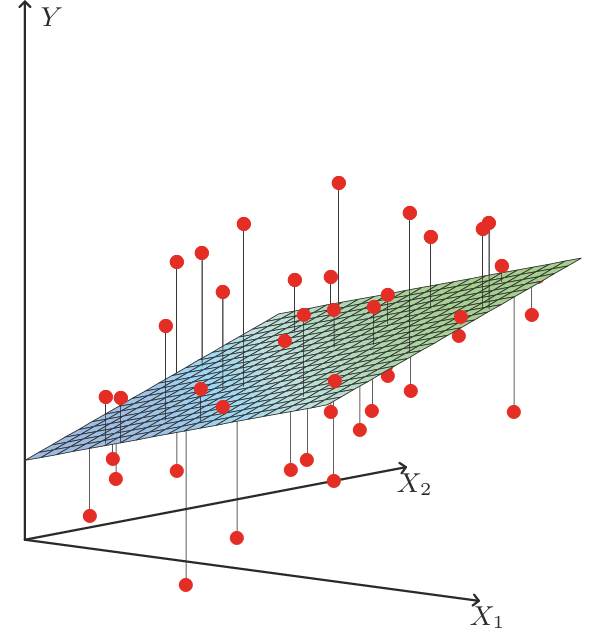

<hr style="border: 1px solid rgba(50, 0, 0, 1);">




En esta sección estudiaremos dos modelos fundamentales de aprendizaje supervisado: la regresión lineal, utilizada para variables de respuesta cuantitativas, y la regresión logística, empleada cuando la respuesta es categórica. Ambos modelos pueden ser formulados como problemas de optimización, lo que permite aplicar los conceptos vistos en el capítulo anterior. Para ambos modelos, analizaremos su formulación probabilística, las características del problema y los métodos de resolución más utilizados.

<hr>

Durante este capítulo, consideraremos $\XX=(X_1,\ldots,X_p)\in\RR^p$ un conjunto de variables predictoras y $Y\in\RR$ una variable respuesta. Además, vamos a suponer que la distribución condicional de $Y|\XX$ depende de un vector de parámetros $\bftheta\in\RR^q$.

Para un conjunto de datos $\{(\xx_i,y_i)\}_{i=1}^n$, denotamos $X\in\RR^{n\times p}$ la matriz de predictoras y $\yy\in\RR^n$ el vector de respuestas. 

En lo que sigue, vamos a trabajar sin intercepto; es decir, consideraremos la relación lineal $\bftheta^\top\XX$. Luego, si se necesitara un intercepto $\theta_0$, los resultados se adaptan de forma directa reemplazando la matriz de datos $X$ por la matriz ampliada 
$$
\widetilde{X}=\begin{pmatrix}\mathbf{1} & X\end{pmatrix}\in\RR^{n\times (p+1)}.
$$

Además, denotamos $\mathbb{P}(A)$ la probabilidad de que ocurra un suceso $A$, mientras que $\media\left[Z\right]$ representa el *valor esperado* de la variable aleatoria $Z$.


<hr>
<div style="margin-top:1em;"></div>

La tarea de obtener un estimador $\hat{\bftheta}$ de $\bftheta$ puede ser formulada a través de un problema de optimización de la forma
$$ 
\begin{array}{ll} 
\text{minimizar } & J(\bftheta),
\end{array}
\tag{1}
$$

en principio sin restricciones. Aquí, la función objetivo $J:\RR^q\to\RR$, conocida como *función de pérdida*, mide que tan bien los parámetros $\bftheta$ se ajustan a los datos observados. El punto óptimo del problema es el estimador buscado, por lo cual de ahora en adelante haremos la siguiente distinción:

<div class="alert alert-light text-dark" role="important">
<span class="badge bg-warning text-dark">Importante</span>

Denotaremos por $\bftheta^\star$ el valor verdadero del parámetro, mientras que $\hat{\bftheta}$ será el estimador obtenido; es decir, $\hat{\bftheta}$ es el punto óptimo del problema de optimización (1).

</div>

<div style="margin-top:1em;"></div>


Bajo la suposición de que los datos son i.i.d. (independientes e idénticamente distribuidos), con distribución de densidad condicional $p(y|\xx; \bftheta)$, una estrategia para formular $J(\bftheta)$ es el <mark>principio de máxima verosimilitud</mark>, que consiste en elegir $\hat{\bftheta}$ de manera tal que se maximice la *función de verosimilitud*

$$
L(\bftheta):=\prod_{i=1}^np(y_i|\xx_i; \bftheta).
\tag{1}
$$

La función $L(\bftheta)$ mide la compatibilidad de los datos con el modelo $p(y|\xx; \bftheta)$ para un valor de $\bftheta$ dado. En general, es más conveniente utilizar el logaritmo de la verosimilitud:
$$
\ell(\bftheta):=\log L(\bftheta)=\sum_{i=1}^n\log p(y_i|\xx_i; \bftheta).
\tag{2}
$$

Luego, la definición de $J(\bftheta)$ dependerá del problema específico. En general, tiene la forma
$$
J(\bftheta)=\sum_{i=1}^n\text{loss}\,(y_i,f(\xx_i;\bftheta)),
$$
donde $\text{loss}:\RR\times\RR\to\RR_0^+$ mide el error entre el valor observado de la variable respuesta y el valor estimado por el modelo $\hat{y}_i=f(\xx_i;\bftheta)$.

<div style="margin-top:2.5em;"></div>


## Regresión lineal

<div style="margin-top:-1em;"></div>

:::{.myhighlight2}

<span style="font-size:0.8em;">*Supuestos del modelo*</span>
<div style="margin-top:-0.1em;"></div>

$$
\begin{array}{c}
Y=\theta_1X_1+\cdots+\theta_p X_p+\varepsilon\\[2pt]
\varepsilon\sim \calN(0,\sigma^2)
\end{array}
$$

:::

<div style="margin-top:1em;"></div>

El conjunto de parámetros del modelo de regresión lineal es $\bftheta\in\RR^p$, mientras que $\varepsilon\in\RR$ es un término de error que captura efectos no modelados (como características omitidas o ruido aleatorio). Podemos escribir el modelo de forma abreviada como
$$
Y = \bftheta^\top \XX + \varepsilon.
$$

<figure style="text-align: center;">
  
  <figcaption> **Figura 1**. Interpretación geométrica del modelo de regresión lineal en $\RR^2$. Los puntos ajustados están determinados por las proyecciones sobre el plano $\hat{y}=\theta_1 x_1+\theta_2 x_2$ (más intercepto). </figcaption>
</figure>

<div style="margin-top:2em;"></div>


El supuesto $\varepsilon\sim \calN(0,\sigma^2)$ significa que la función de densidad de la variable aleatoria $\varepsilon$ es
$$
p(\varepsilon) = \frac{1}{\sqrt{2 \pi \sigma^2}} \exp\left(-\frac{\varepsilon^2}{2 \sigma^2}\right).
$$


### Distribución condicional

Dado $\XX=\xx$, tenemos que
$$
Y=\underbrace{\bftheta^\top\xx}_{\text{cte}}+\varepsilon.
$$

Por lo tanto, el supuesto $\varepsilon\sim\calN(0,\sigma^2)$ implica que
$$
Y|\XX=\xx\sim \calN(\bftheta^\top\xx,\sigma^2).
$$


<aside> Si $Z\sim\calN(\mu,\sigma^2)$ y $a,b\in\RR$, $aZ+b\sim\calN(a\mu+b,a^2\sigma^2)$. </aside>


Finalmente:

<div style="margin-top:-1em;"></div>

:::{.myhighlight}

La función de densidad condicional de $Y|\XX$ en el modelo de regresión lineal es
$$
p(y |\xx; \bftheta) = \frac{1}{\sqrt{2 \pi \sigma^2}} \exp\left(-\frac{(y-\bftheta^\top \xx)^2}{2 \sigma^2}\right).
$$

:::

<div style="margin-top:1em;"></div>


### Función de verosimilitud

Para un conjunto de datos $\{\xx_i, y_i\}_{i=1}^n$ i.i.d., la función de verosimilitud es

$$
L(\bftheta) = \prod_{i=1}^{n} \frac{1}{\sqrt{2 \pi \sigma^2}} \exp\left(-\frac{(y_i - \bftheta^\top\xx_i)^2}{2 \sigma^2}\right).
$$

Entonces

$$
\begin{align*}
\ell(\bftheta) &= \log L(\bftheta) \\
&= \log \prod_{i=1}^{n} \frac{1}{\sqrt{2 \pi}\sigma} \exp\left(-\frac{(y_i - \bftheta^\top \xx_i)^2}{2 \sigma^2}\right) \\
&= \sum_{i=1}^{n} \left[\log\frac{1}{\sqrt{2 \pi}\sigma} - \frac{1}{2 \sigma^2}  (y_i - \bftheta^\top \xx_i)^2\right]\\
&= n  \log \frac{1}{\sqrt{2 \pi}\sigma} - \frac{1}{2 \sigma^2} \sum_{i=1}^{n} (y_i - \bftheta^\top \xx_i)^2
\end{align*}
$$

<div style="margin-top:2em;"></div>


<div class="alert alert-light text-dark" role="important">
<span class="badge bg-warning text-dark">Importante</span>

Observar, en esta última expresión, que maximizar $\ell(\theta)$ es equivalente a minimizar

$$
J(\bftheta)=\frac{1}{2} \sum_{i=1}^{n} (y_i - \bftheta^\top \xx_i)^2=\frac{1}{2}\|X\bftheta-\yy\|_2^2,
$$

lo cual es la función de costo asociada a mínimos cuadrados.

</div>


### Optimalidad

Si bien en la Definición 2 de [C1-S1](A1_intro_optimizacion.html#mínimos-cuadrados-y-programación-lineal) ya hemos analizado el problema de mínimos cuadrados, vamos a volver a derivar la solución del problema

$$ 
\begin{array}{ll} 
\text{minimizar } & \displaystyle\frac{1}{2}\|X\bftheta-\yy\|_2^2.
\end{array}
$$

Dado que es un problema de optimización sin restricciones con función objetivo convexa, la condición de optimalidad $\nabla J(\bftheta)=\bfzero$ es suficiente y necesaria. Por lo tanto, tenemos que 
$$
\begin{align*}
\nabla J(\hat{\bftheta})&=\bfzero\\
X^\top X\hat{\bftheta}-X^\top\yy&=\bfzero\\
X^\top X\hat{\bftheta} &=X^\top\yy\\
\hat{\bftheta}&=X^{+}\yy.
\end{align*}
$$

<div style="margin-top:2em;"></div>

::: {.myhighlight}

Si $X$ es de rango completo, entonces
$$
\hat{\bftheta}=(X^\top X)^{-1}X^\top\yy
$$

:::

<div style="margin-top:2em;"></div>

El vector de valores ajustados $\hat{\yy}\in\RR^n$ está dado por
$$
\hat{\yy}:=X\hat{\bftheta}.
$$

Observar que, si $X$ es de rango completo, entonces $\hat{\yy}=X(X^\top X)^{-1}X^\top\yy$. Esto significa que $\hat{\yy}$ es la proyección de $\yy$ sobre el espacio columna de $X$.


### Algoritmo LMS

La aplicación del método de descenso por gradiente al problema de optimización en regresión lineal da lugar a lo que se denomina *algoritmo LMS (least mean squares)*. La regla de actualización es
$$
\bftheta_{t+1}:=\bftheta_t-\eta \nabla J(\bftheta_t),\qquad\eta>0.
$$

Luego, debemos sustituir el gradiente por su expresión $\nabla J(\bftheta_t) = X^\top X\bftheta_t-X^\top\yy$. Esta regla de actualización tambien se conoce como *regla de aprendizaje Widrow-Hoff*.

<div style="margin-top:2em;"></div>

::: {.highlight}
<span class="badge bg-custom">Algoritmo LMS</span>

---

Dado un *parámetro inicial* $\bftheta_0\in\RR^{p}$ y una *tasa de aprendizaje* $\eta>0$:

<div style="margin-left: 1em">

**repetir** para $t = 0,1,2,\ldots$:

> Actualizar $\bftheta_{t+1}:=\bftheta_t-\eta \left(X^\top X\bftheta_t-X^\top\yy\right)$.

**hasta** que el criterio de parada se satisfaga.

</div>

---

:::

<div style="margin-top:2em;"></div>


En el algoritmo anterior se está trabajando con todas las observaciones a la vez en cada paso de actualización, por lo que se trata de un *descenso de gradiente por lotes*. Esta estrategia asegura una actualización estable del parámetro $\bftheta$, aunque puede ser costosa si el número de observaciones es muy grande.

Por supuesto, como vimos en [C1-S5](A5_metodos_optimizacion.html#método-de-descenso-por-gradiente-estocástico), como alternativa podemos usar descenso de gradiente estocástico o mini-batch. Para ello, notar que para una observación $(\xx_i,y_i)$, la función de pérdida resulta
$$
\text{loss}\,(y_i,f(\xx_i;\bftheta))=\frac{1}{2}(y_i-\bftheta^\top\xx_i)^2,
$$
tal que
$$
\nabla_{\bftheta} \text{loss}\,(y_i,f(\xx_i;\bftheta)) = -(y_i-\bftheta^\top\xx_i)\,\xx_i.
$$

<div style="margin-top:2em;"></div>

::: {.highlight}
<span class="badge bg-custom">Algoritmo LMS estocástico</span>

---

Dado un *parámetro inicial* $\bftheta_0\in\RR^{p}$ y una *tasa de aprendizaje* $\eta>0$:

<div style="margin-left: 1em">

**repetir** para $t = 0,1,2,\dots$:

> **1°** Elegir un índice $i$ al azar de $\{1,\dots,n\}$.  
>
> **2°** Actualizar $\bftheta_{t+1}:=\bftheta_t+\eta\,(y_i-\bftheta_t^\top\xx_i)\,\xx_i$.

**hasta** que el criterio de parada se satisfaga.

</div>

---

:::

<div style="margin-top:2em;"></div>


Observar que la magnitud de la actualización del algoritmo LMS estocástico es proporcional al término de error $(y_i - \bftheta_t^\top\xx_i)$. Si elegimos un ejemplo para el cual $\bftheta_t^\top\xx_i\approx y_i$, entonces el cambio en el parámetro será mínimo. Esto puede activar prematuramente el criterio de parada basado en la magnitud del gradiente, por lo cual para para evitar detener el algoritmo demasiado pronto, suele ser recomendable basar el criterio de parada en el promedio del error sobre un conjunto de observaciones. También se puede imponer un número mínimo de iteraciones para asegurar que el algoritmo recorra suficientes ejemplos y aprenda de manera estable.


<div style="margin-top:2em;"></div>

::: {.callout-example}
<span class="badge bg-primary">Ejemplo 1</span> 
<span style="color: #0d6efd; font-family: Arial; font-weight: bold; font-size: 0.85em;">
Regresión lineal en datos *California Housing*
</span>

Utilizaremos el conjunto de datos de *California Housing* ([disponible aquí](https://scikit-learn.org/stable/modules/generated/sklearn.datasets.fetch_california_housing.html)), el cual consiste en 20640 observaciones con 8 variables predictoras que miden características de las viviendas y su entorno. La variable respuesta es el valor mediano de la vivienda en cada bloque censal, por lo que este problema es de regresión.

Ajustaremos un modelo de regresión lineal a los datos, evaluaremos el MSE en test y presentaremos los coeficientes estimados del modelo.

```{python}
#| code-summary: "Mostrar código"
#| code-fold: false
#| fig-align: "center"

import numpy as np
from sklearn.datasets import fetch_california_housing
from sklearn.linear_model import LinearRegression
from sklearn.preprocessing import StandardScaler
from sklearn.model_selection import train_test_split
from sklearn.metrics import mean_squared_error

# Datos:
X, y = fetch_california_housing(return_X_y=True)
scaler = StandardScaler()
X = scaler.fit_transform(X)

X_train, X_test, y_train, y_test = train_test_split(X, y, test_size=0.2, random_state=42)

# Modelo:
lr = LinearRegression()
lr.fit(X_train, y_train)

# Predicción y MSE:
y_pred = lr.predict(X_test)
mse_test = mean_squared_error(y_test, y_pred)

# 📋:
print(f"MSE en test: {mse_test:.3f}")
print("Coeficientes estimados (θ̂):")
for i, coef in enumerate(lr.coef_):
    print(f"θ_{i+1} = {coef:.3f}")

```

:::

<div style="margin-top:2em;"></div>


### Propiedades del estimador

Hemos visto que el algoritmo LMS permite aproximar el estimador de mínimos cuadrados $\hat{\bftheta}$ para el modelo de regresión lineal. Por supuesto, los resultados de convergencia vistos en [C1-S5](../CAPITULO_1/A5_metodos_optimizacion.html#método-de-descenso-por-gradiente) para el método de descenso por gradiente son válidos.

No obstante, $\hat{\bftheta}$ es un estimador del valor verdadero $\bftheta^\star$, por lo que resulta relevante estudiar sus propiedades estadísticas, tales como consistencia, sesgo y varianza, para entender qué tan buena es la estimación $\hat{\bftheta}$, incluso después de la convergencia del algoritmo LMS.

<div class="alert alert-light text-dark" role="important">
<span class="badge bg-warning text-dark">Importante</span>

En base a lo descrito, es fundamental distinguir dos niveles de convergencia:

- **Convergencia estadística del estimador**: se refiere al hecho de que el estimador $\hat{\bftheta}_n$ converge en probabilidad al valor verdadero $\bftheta^\star$. Simbólicamente:
$$
\text{plim}_{n\to\infty}\hat{\bftheta}_n=\bftheta^\star\qquad (\hat{\bftheta}_n\xrightarrow{p}\bftheta^\star).
$$

    Observar que escribimos $\hat{\bftheta}_n$ para explicitar la dependencia del estimador respecto al tamaño muestral $n$.

- **Convergencia computacional del algoritmo**: se refiere a que la sucesión producida por un algoritmo iterativo (por ejemplo, descenso por gradiente) converge a $\hat{\bftheta}$ (aquí no escribimos el subíndice porque $n$ es fijo). Esto es:
$$
\lim_{t\to\infty}\bftheta_t=\hat{\bftheta}\qquad(\bftheta_t\to\hat{\bftheta}).
$$
</div>

<div style="margin-top:2em;"></div>

Ahora sí estamos en condiciones de revisar algunos resultados conocidos para el modelo de regresión lineal.


- *Convergencia estadística*: para $n>p$ y bajo los supuestos clásicos de
$$
\begin{array}{cl}
\{(\xx_i,y_i)\}_{i=1}^n\text{ i.i.d.},\; \media\left[\varepsilon_i\mid\xx_i\right]=0 & \text{(Exogeneidad)} \\[2pt]
\media\left[\varepsilon_i^2\mid \xx_i\right]=\sigma^2<\infty,\;\media\left[\varepsilon_i^4\right] & \text{(Momentos)} \\
\frac{1}{n}X^\top X\xrightarrow{p}\Sigma_{X}\succ 0 & \text{(Diseño bien condicionado)}
\end{array}
$$
    se verifica
$$
\hat{\bftheta}_n\xrightarrow{p}\bftheta^\star\qquad\text{y}\qquad\sqrt{n}\, (\hat{\bftheta}_n-\bftheta^\star)\xrightarrow{d}\mathcal{N}(0,\sigma^2\Sigma_X^{-1}).
$$

<div style="margin-top:2em;"></div>

- *Convergencia computacional*: sean $\lambda_{\text{min}},\lambda_{\text{max}}>0$ autovalores de $X^\top X$. Si $0<\eta<2/\lambda_{\text{max}}$, entonces
$$
\bftheta_t\to\hat{\bftheta}\qquad\text{y}\qquad\|\bftheta_t-\hat{\bftheta}\|_2\leq\rho^t\|\bftheta_0-\hat{\bftheta}\|_2,
$$
con $\rho=\max\left\{|1-\eta\lambda_{\text{min}}|,|1-\eta\lambda_{\text{max}}|\right\}$.


<div style="margin-top:2.5em;"></div>


## Regresión logística

Consideremos ahora un problema de clasificación binaria, con variable respuesta $Y\in\{0,1\}$. 

Por ejemplo, si estamos tratando de construir un clasificador de spam para correos electrónicos, entonces una observación $\xx$ contendrá características de un correo electrónico, mientras que su etiqueta $y$ será 1 si es spam o 0 en caso contrario. 

Podríamos abordar el problema de clasificación ignorando el hecho de que $y$ toma valores discretos y usar el método de regresión lineal. Sin embargo, no tendría sentido que la predicción para un valor de $\xx$ sea un valor fuera del rango de 0 y 1. Para resolver este problema, podemos utilizar la *función logística*.

<div style="margin-top:2em;"></div>


<div class="alert alert-light text-dark" role="important">
<span class="badge bg-success text-light">Función logística</span>

Para $z\in\RR$, se define la *función logística* o *función sigmoide* $\sigma:\RR\to\RR$ mediante 
$$ 
\sigma(z) := \frac{1}{1 + e^{-z}} = \frac{e^z}{1+e^z}.
$$

```{python}
#| echo: false
#| fig-align: center
import numpy as np
import matplotlib.pyplot as plt

# Definir la función sigmoide
def sigmoid(z):
    return 1 / (1 + np.exp(-z))

# Crear valores de z para graficar
z = np.linspace(-10, 10, 500)
g_z = sigmoid(z)

# Graficar la función sigmoide
plt.figure(figsize=(6,4))
plt.plot(z, g_z, linewidth=1.5, label="$g(z) = \\frac{1}{1 + e^{-z}}$")
plt.axhline(1, color="gray", linestyle="--", linewidth=0.7)
plt.axhline(0, color="gray", linestyle="--", linewidth=0.7)
plt.axvline(0, color="gray", linestyle="--", linewidth=0.7)
plt.xlabel("$z$", fontsize=12)
plt.ylabel(r"$\sigma(z)$", fontsize=12)
plt.show()
```

<div style="margin-top:-1em;"></div>

Algunas características son:

- El conjunto imagen es $\sigma(\RR)=(0,1)$.

- $\sigma(0) = 0.5$

- $\displaystyle\lim_{z\to -\infty}\sigma(z)=0$ y $\displaystyle\lim_{z\to\infty} \sigma(z)=1$.

- $\sigma'(z)=\sigma(z)(1-\sigma(z))$.

</div>

<div style="margin-top:2em;"></div>


Ya estamos en condiciones de configurar el modelo de regresión logística. Para ello, primero definimos la función $h_{\bftheta}:\RR^p\to\RR$ como
$$
h_\bftheta(\xx) := \sigma(\bftheta^\top \xx) = \frac{1}{1 + e^{-\bftheta^\top \xx}}.
$$


<div style="margin-top:1em;"></div>

:::{.myhighlight2}

<span style="font-size:0.8em;">*Supuesto del modelo*</span>
<div style="margin-top:-0.1em;"></div>

$$
\begin{array}{c}
Y\in\{0,1\} \\[2pt]
\mathbb{P}(y=1\mid\xx;\bftheta)=h_\bftheta(\xx)
\end{array}
$$

:::

<div style="margin-top:1em;"></div>


### Distribución condicional

Bajo el modelo de regresión logística, resulta
$$
Y|\XX=\xx\sim\text{Binom}(1,h_{\bftheta}(\xx)),
$$

de manera tal que
$$
\begin{align*}
p(y \mid \xx; \bftheta)&=(h_{\bftheta}(\xx))^y(1-h_{\bftheta}(\xx))^{1-y} \\[2pt]
&=\left( \frac{e^{\bftheta^\top\xx}}{1 + e^{\bftheta^\top \xx}} \right)^y\,\left( 1-\frac{e^{\bftheta^\top\xx}}{1 + e^{\bftheta^\top \xx}} \right)^{1-y} \\[3pt]
&=\left( \frac{e^{\bftheta^\top\xx}}{1 + e^{\bftheta^\top \xx}} \right)^y\,\left( \frac{1}{1 + e^{\bftheta^\top \xx}} \right)^{1-y} \\
&=\frac{e^{\bftheta^\top\xx\, y}}{1+e^{\bftheta^\top\xx}}.
\end{align*}
$$

Finalmente:

:::{.myhighlight}

La función de probabilidad condicional de $Y|\XX$ en el modelo de regresión logística es
$$
p(y \mid \xx; \bftheta) = \frac{e^{\bftheta^\top\xx\, y}}{1+e^{\bftheta^\top\xx}}.
$$

:::

<div style="margin-top:2em;"></div>


### Función de verosimilitud

Para un conjunto de datos $\{\xx_i, y_i\}_{i=1}^n$ i.i.d., la función de verosimilitud es

$$
L(\bftheta) = \prod_{i=1}^{n} \frac{e^{\bftheta^\top\xx_i\, y_i}}{1+e^{\bftheta^\top\xx_i}}.
$$

Como antes, será más sencillo maximizar el logaritmo de la función de verosimilitud:

$$
\begin{align*}
\ell(\bftheta) &= \log L(\bftheta) \\
&=\log \prod_{i=1}^{n} \frac{e^{\bftheta^\top\xx_i\, y_i}}{1+e^{\bftheta^\top\xx_i}} \\
&= \sum_{i=1}^n \left[\bftheta^\top\xx_i\,y_i-\log(1+e^{\bftheta^\top\xx_i})\right].
\end{align*}
$$

<div class="alert alert-light text-dark" role="important">
<span class="badge bg-warning text-dark">Importante</span>

En regresión logística, maximizar $\ell(\theta)$ es equivalente a minimizar
$$
J(\bftheta)=-\sum_{i=1}^{n}\left[y_i\log(\hat{y}_i)+(1-y_i)\log(1-\hat{y}_i)\right],
\tag{3}
$$

con 
$$
\hat{y}_i:=h_{\bftheta}(\xx_i)=\frac{1}{1+e^{-\bftheta^\top\xx_i}}.
$$

La función $J(\theta)$ en (3), conocida como *entropía cruzada*, es la forma habitual de expresar la función de pérdida en problemas de clasificación binaria. Mide la disimilaridad entre las etiquetas reales $y_i$ y las probabilidades $\hat{y}_i$ predichas por el modelo. 


::: {.callout .question}

<span style="font-size: 1.3em;">📝</span><br>

Verifique que se cumple $J(\bftheta)=-\ell(\bftheta)$.

:::

</div>


### Optimalidad

Vamos a analizar el problema 
$$ 
\begin{array}{ll} 
\text{minimizar} & \sum_{i=1}^n\left[\log(1+e^{\bftheta^\top\xx_i})-\bftheta^\top\xx_i y_i\right].
\end{array}
\tag{4}
$$

La función objetivo es convexa. Por lo tanto, la condición de optimalidad $\nabla J(\bftheta)=\bfzero$ es una condición necesaria y suficiente para el punto óptimo $\hat{\bftheta}$.


::: {.callout .question}

<span style="font-size: 1.3em;">📝</span><br>

Justifique la convexidad de la función objetivo en (4) y comente sobre la existencia de solución.

:::


La forma matricial de la función objetivo es
$$
J(\bftheta)=\mathbf{1}^\top\log\left(1+e^{X\bftheta}\right)-\yy^\top X \bftheta,
$$

donde las operaciones $\log$ y $e$ se aplican elemento a elemento; esto es, $\zz=\log\left(1+e^{X\bftheta}\right)\in\RR^n$ cumple $\zz_i=\log(1+e^{\bftheta^\top\xx_i})$. Se tiene que

$$
\nabla J(\hat{\bftheta})= X^\top \hat{\yy}-X^\top\yy = X^\top(\hat{\yy}-\yy),
\tag{5}
$$

donde $\hat{\yy}\in\RR^n$ es el vector de valores ajustados dado por
$$
\hat{\yy} := (h(\bftheta^\top\xx_1),\ldots,h(\bftheta^\top\xx_n))^\top=\sigma(X\bftheta).
$$

La expresión (5) muestra que $\nabla J(\bftheta)$ depende de $\bftheta$ de forma no lineal. Por lo tanto, no es posible obtener una solución explícita de $\nabla J(\hat{\bftheta})=\bfzero$ y la única opción es recurrir a métodos iterativos para aproximar $\hat{\bftheta}$.

<div style="margin-top:2em;"></div>


### Aplicación de descenso por gradiente

<div style="margin-top:2em;"></div>

::: {.highlight}
<span class="badge bg-custom">Algoritmo de descenso por gradiente para regresión logística</span>

---

Dado un *parámetro inicial* $\bftheta_0\in\RR^{p}$ y una *tasa de aprendizaje* $\eta>0$:

<div style="margin-left: 1em">

**repetir** para $t = 0,1,2,\ldots$:

> Actualizar $\bftheta_{t+1}:=\bftheta_t-\eta\, X^\top(\hat{\yy}_t-\yy)$.

**hasta** que el criterio de parada se satisfaga.

</div>

---

:::

<div style="margin-top:2em;"></div>

Por último, obtengamos el algoritmo de descenso por gradiente estocástico. Para una observación $(\xx_i,y_i)$ se tiene
$$
J(\bftheta)=\log(1+e^{\bftheta^\top\xx_i})-\bftheta^\top\xx_iy_i,
$$

tal que
$$
\nabla J(\bftheta)=\frac{e^{\bftheta^\top\xx_i}}{1+e^{\bftheta^\top\xx_i}}\xx_i-\xx_i y_i=\xx_i (h_{\bftheta}(\xx_i)-y_i)=-\xx_i(y_i-h_{\bftheta}(\xx_i)).
$$


<div style="margin-top:2em;"></div>

::: {.highlight}
<span class="badge bg-custom">Algoritmo de descenso por gradiente estocástico para regresión logística</span>

---

Dado un *parámetro inicial* $\bftheta_0\in\RR^{p}$ y una *tasa de aprendizaje* $\eta>0$:

<div style="margin-left: 1em">

**repetir** para $t = 0,1,2,\ldots$:

> **1°** Elegir un índice $i$ al azar de $\{1,\dots,n\}$.  
>
> **2°** Actualizar $\bftheta_{t+1}:=\bftheta_t+\eta\,(y_i-h_{\bftheta_t}(\xx_i))\,\xx_i$.

**hasta** que el criterio de parada se satisfaga.

</div>

---

:::

<div style="margin-top:2em;"></div>

::: {.callout-example}
<span class="badge bg-primary">Ejemplo 1</span> 
<span style="color: #0d6efd; font-family: Arial; font-weight: bold; font-size: 0.85em;">
Regresión logística en datos de cáncer
</span>

El conjunto de datos de Breast Cancer ([disponible aquí](https://sklearner.com/scikit-learn-load_breast_cancer/)) contiene información de tumores de mama. Consta de 569 observaciones y 30 variables predictoras. La variable respuesta indica el tipo de tumor (0 para benigno y 1 para maligno), lo que convierte este problema en una tarea de clasificación binaria.

Ajustaremos un modelo de regresión lineal a los datos, evaluaremos el *accuracy* en test y presentaremos los coeficientes estimados del modelo.

```{python}
#| code-summary: "Mostrar código"
#| code-fold: false
#| fig-align: "center"

import numpy as np
from sklearn.datasets import load_breast_cancer
from sklearn.linear_model import LogisticRegression
from sklearn.preprocessing import StandardScaler
from sklearn.model_selection import train_test_split
from sklearn.metrics import accuracy_score

# Datos:
X, y = load_breast_cancer(return_X_y=True)
scaler = StandardScaler()
X = scaler.fit_transform(X)

X_train, X_test, y_train, y_test = train_test_split(X, y, test_size=0.2, random_state=42)

# Modelo:
logreg = LogisticRegression(max_iter=1000)
logreg.fit(X_train, y_train)

# Predicción y accuracy:
y_pred = logreg.predict(X_test)
acc_test = accuracy_score(y_test, y_pred)

# 📋:
print(f"Accuracy en test: {acc_test:.3f}")
print("Coeficientes estimados (θ̂):")
for i, coef in enumerate(logreg.coef_[0]):
    print(f"θ_{i+1} = {coef:.3f}")

```

:::

<div style="margin-top:2em;"></div>


### Propiedades del estimador

Para el caso de regresión logística, algunos resultados importantes son:

- *Convergencia estadística*: bajo supuestos clásicos, tales como
$$
\begin{array}{cl}
\{(\xx_i,y_i)\}_{i=1}^n \text{ i.i.d.} & (\text{Independencia e idéntica distribución}) \\[1ex]
0<\mathbb{P}(Y_i=1\mid \xx_i)<1 & \text{(No separabilidad)}\\[1ex]
\mathbb{E}[\|\xx_i\|^2]<\infty & \text{(Momentos finitos)}\\[1ex]
I(\bftheta^\star) = \media\left[h_{\bftheta}(\XX)(1-h_{\bftheta}(\XX))\,\XX\XX^\top\right] \succ 0 & \text{(Información de Fisher definida positiva)}
\end{array}
$$

    se verifica
$$
\hat{\bftheta}_n\xrightarrow{p}\bftheta^\star\qquad\text{y}\qquad\sqrt{n}\, (\hat{\bftheta}_n-\bftheta^\star)\xrightarrow{d}\mathcal{N}(0,\mathcal{I}(\bftheta^\star)^{-1}).
$$

<div style="margin-top:2em;"></div>

- *Convergencia computacional*: como $J$ es convexa y $L$-suave con 
$$
L\leq\frac{\lambda_{\text{max}(X^\top X)}}{4},
$$
el método de descenso por gradiente verifica
$$
J(\bftheta_t)\to\ J(\hat{\bftheta}).
$$


<br><hr>

Para finalizar esta sección, comparemos los factores en la actualización del método de descenso por gradiente estocástico para los modelos vistos:

$$
\begin{array}{ll}
\bftheta_{t+1}:=\bftheta_t+\eta(y_i-\bftheta^\top\xx_i)\,\xx_i & \qquad\text{(Regresión lineal)} \\
\bftheta_{t+1}:=\bftheta_t+\eta(y_i-h_{\bftheta}(\xx_i))\,\xx_i & \qquad\text{(Regresión logística)} \\
\end{array}
$$

En ambos casos, la actualización depende del error entre el valor observado y la predicción del modelo:
$$
y_i-\hat{y}_i,
$$
donde $\hat{y}_i=\bftheta^\top\xx_i$ para regresión lineal y $\hat{y}_i=\displaystyle\frac{e^{\bftheta^\top\xx_i}}{1+e^{\bftheta^\top \xx_i}}$ para regresión logística. 

Esta estructura común refleja la idea de ajustar los parámetros en función de la discrepancia entre observaciones y predicciones, lo cual generalizaremos en la próxima sección cuando tratemos los modelos lineales generalizados.


<br><br>

## Actividades {.unnumbered}


✏️ **Conceptuales**  
<hr class="linea-corta">

<!--
<details>
<summary>Mostrar</summary>
<div style="margin-top:1em;"></div>

1. Probar que la derivada de la función logística $\sigma(z)=1/(1+e^{-z})$ verifica
$$
\sigma'(z)=\sigma(z)(1-\sigma(z)).
$$


1. Sea un conjunto de datos $\{(\mathbf{x}_i, y_i)\}_{i=1}^n$. Defina las variables centradas por columna como
$$
{\tilde{x}}_{ij} = x_{ij} - \bar{x}_j, \quad {\tilde{y}}_i = y_i - \bar{y},
$$
donde $\bar{x}_j$ y $\bar{y}$ son las medias muestrales de la variable predictora $j$-ésima y de la variable respuesta, respectivamente. Muestre que, al ajustar un modelo lineal *sin intercepto* sobre los datos centrados y obtener coeficientes $\hat{\bfbeta}$, el intercepto del modelo ajustado sobre los datos originales puede recuperarse con la fórmula

$$
\hat{\beta}_0 = \bar{y} - \sum_{j=1}^p \hat{\beta}_j \bar{x}_j.
$$

</details>
-->

<div style="display:flex; align-items:center; text-align:left;">
  <a href="https://colab.research.google.com/drive/1KVwWSbXqqTb9J1gKDYTcqhoWhaIrHh4N?usp=sharing" target="_blank">
    
  </a>
  <p style="margin:0; font-size:1em;">Análisis de residuos.</p>
</div>

<div style="margin-top:0.5em;"></div>

<div style="display:flex; align-items:center; text-align:left;">
  <a href="https://colab.research.google.com/drive/1A9SZnB-vGqrFHHspF6cHBw132K8b7FtM?usp=sharing" target="_blank">
    
  </a>
  <p style="margin:0; font-size:1em;">Transformaciones en regresión.</p>
</div>


<div style="margin-top: 5em;"></div>

::: {.refs}
<span style="color: #444;"><strong>Referencias</strong></span>

Hastie, T., Tibshirani, R., & Friedman, J. (2009). The Elements of Statistical Learning: Data Mining, Inference, and Prediction (2nd ed.). Springer.

Ng, A. Apuntes del curso Stanford CS229: Machine Learning. Disponible [aquí](https://cs229.stanford.edu/notes2022fall/main_notes.pdf).


:::