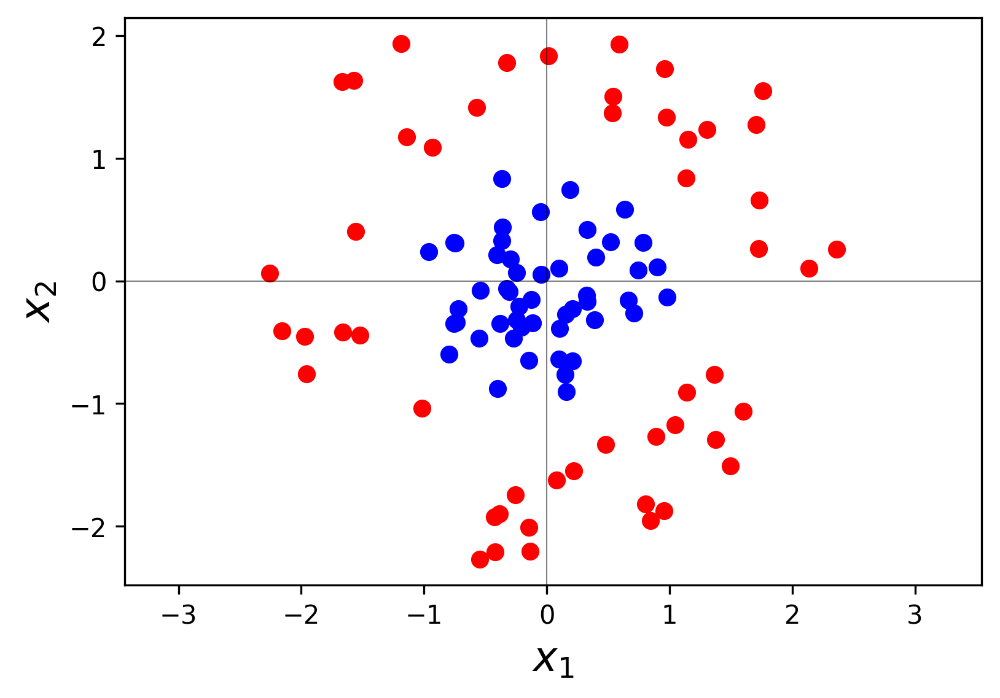
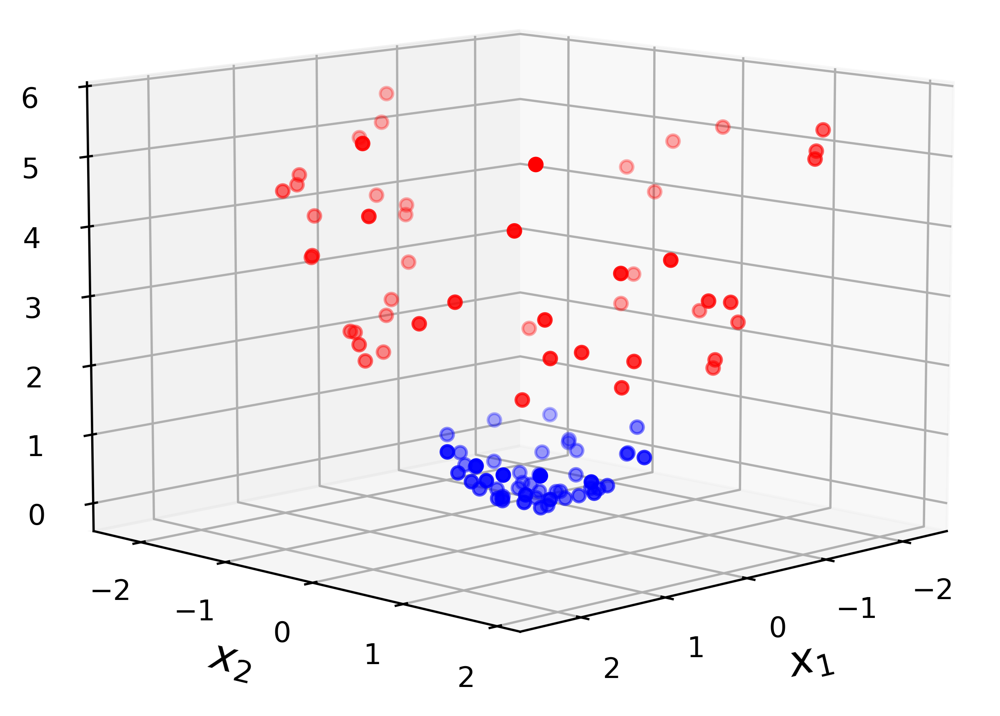
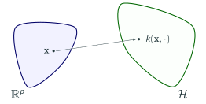
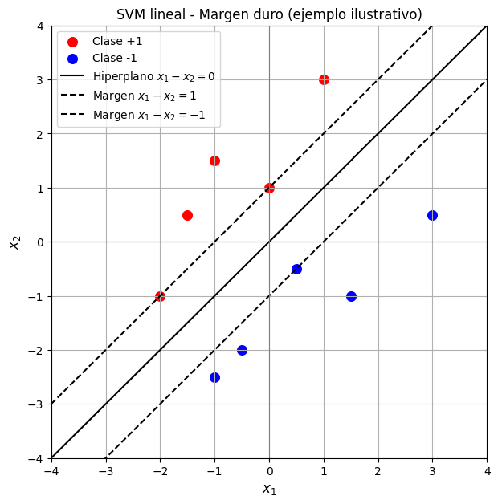
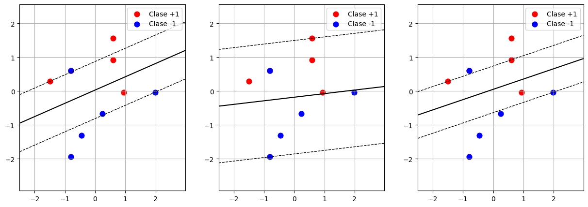

<hr style="border: 1px solid rgba(50, 0, 0, 1);">




En esta sección vamos a estudiar un algoritmo de aprendizaje supervisado ampliamente utilizado para problemas de clasificación, que ha demostrado ser especialmente efectivo en tareas donde se requiere obtener fronteras de decisión robustas y con buena capacidad de generalización. Su construcción sigue una secuencia natural de conceptos: en primer lugar, se aborda la formulación básica basada en hiperplanos separadores óptimos, cuyo objetivo es maximizar el margen de separación entre clases perfectamente separables; luego, se incorpora el uso de *variables de holgura* para tratar datos no separables; y, finalmente, se presenta la generalización mediante *núcleos reproductores*, lo que permite obtener fronteras de decisión no lineales.

Una característica distintiva de estos métodos es que su desarrollo se apoya fuertemente en la formulación dual de problemas de optimización y en las condiciones de Karush-Kuhn-Tucker (KKT), lo que proporciona una interpretación clara en términos de vectores soporte y explica su gran potencial.

<div style="margin-top:2em;"></div>
<hr>

En lo que sigue, vamos a asumir que estamos trabajando con un conjunto de datos de entrenamiento $\{(\xx_i,y_i)\}_{i=1}^n$ de un problema de clasificación binaria cuya variable respuesta, por cuestiones de simplicidad, se considera $Y\in\{-1,+1\}$.


<div style="margin-top:2.5em;"></div>


## Hiperplano separador óptimo

El caso más simple de análisis surge de suponer que las clases $\{\xx_i \mid y_i=-1\}$ y $\{\xx_i \mid y_i=+1\}$ pueden ser separados totalmente por una frontera lineal. 


::: {.definicion}
**Definición 1.** (Separabilidad lineal) Un conjunto de datos $\{(\xx_i,y_i)\}_{i=1}^n$, con $y_i\in\{-1,+1\}$, se dice que es *linealmente separable* si existen $\bfbeta\in\RR^p$ y $\beta_0\in\RR$ tales que
$$
y_i=\text{sign}(\bfbeta^\top\xx_i+\beta_0)\qquad \forall i=1,\ldots,n.
\tag{1}
$$

El hiperplano $\bfbeta^\top\xx+\beta_0=0$ se denomina *hiperplano separador* y la función $f:\RR^p\to\RR$ definida por $f(\xx)=\bfbeta^\top\xx+\beta_0$ se conoce como *función score*. 

:::

<div style="margin-top:1em;"></div>

::: {.callout .question}

<span style="font-size: 1.3em;">📝</span><br>
Pruebe que $\bfbeta$ es el vector normal al hiperplano $\bfbeta^\top\xx+\beta_0=0$ y que la distancia entre un punto $\xx_0\in\RR^p$ y dicho hiperplano es igual a $|f(\xx_0)|/\|\bfbeta\|_2$.

:::

<div style="margin-top:2em;"></div>


<figure style="text-align: center;">
  
  <figcaption> **Figura 1**. Datos linealmente separables y algunos hiperplanos separadores. </figcaption>
</figure>

<div style="margin-top:2em;"></div>

Observar que la expresión (1) es equivalente a requerir
$$
y_i(\bfbeta^\top\xx_i+\beta_0)>0\qquad\forall i=1,\ldots, n.
\tag{2}
$$


Algo intuitivo (ver Figura 1) es que si las clases son totalmente separables, existen infinitos hiperplanos separadores. Por lo tanto, resulta necesario definir un criterio que permita seleccionar un hiperplano único y óptimo.


::: {.myhighlight2}
<span style="font-size:0.8em;">*Primer principio*</span>
<div style="margin-top:0em;"></div>

Cada vector $\bfbeta\in\RR^p$ puede definir un único hiperplano separador.

:::

<div style="margin-top:1em;"></div>

Dado $\bfbeta\in\RR^p$, asociamos a él el hiperplano separador con vector normal $\bfbeta$ que *equidista* a ambas clases. Para poder caracterizar esto matemáticamente, necesitamos antes imponer una restricción de normalización, debido a que la distancia de un punto al hiperplano depende de $\|\bfbeta\|_2$.

::: {.myhighlight2}
<span style="font-size:0.8em;">*Segundo principio*</span>
<div style="margin-top:0em;"></div>

Se restringe la elección de $\bfbeta$ a aquellos vectores que cumplen $\|\bfbeta\|_2=1$.

:::

<div style="margin-top:1em;"></div>

Bajo estas condiciones, la distancia entre cualquier punto $\xx_i$ y el hiperplano $\bfbeta^\top\xx+\beta_0=0$ está dada por
$$
|f(\xx_i)|=y_i(\bfbeta^\top\xx_i+\beta_0).
$$

Así:

::: {.myhighlight}

Un hiperplano separador $\bfbeta^\top\xx+\beta_0=0$ equidista a ambas clases si existe una *distancia mínima* $M\in\RR^+$ tal que
$$
y_i(\bfbeta^\top\xx_i+\beta_0)\geq M\qquad\forall i=1,\ldots,n,
$$
con igualdad para al menos un punto de cada clase.
:::

<div style="margin-top:2em;"></div>

A la distancia mínima $M$ nos referiremos como <mark>margen</mark> del hiperplano separador. Es importante observar que los puntos para los cuales se cumple la igualdad en la restricción son los que caracterizan al hiperplano; estos se denominan <mark>vectores soporte</mark> (su definición formal se presentará más adelante).


<div style="margin-top:2em;"></div>

<figure style="text-align: center;">
  
  <figcaption> **Figura 2**. Hiperplanos separadores y sus margenes asociados. </figcaption>
</figure>

<div style="margin-top:2em;"></div>

Ya estamos en condiciones de determinar qué consideraremos como hiperplano separador óptimo.

::: {.definicion}
**Definición 2.** (Hiperplano separador óptimo) Sea $\{(\xx_i,y_i)\}_{i=1}^n$, con $y_i\in\{-1,+1\}$, un conjunto de datos linealmente separable. El *hiperplano separador óptimo* es aquel que maximiza el *margen* $M$.

:::

<div style="margin-top:2em;"></div>

En base a lo descrito, la búsqueda del hiperplano separador óptimo queda determinada por el siguiente problema de optimización:

$$
\begin{array}{ll}
\text{maximizar } & M\\
\text{sujeto a }  & y_i(\bfbeta^\top\xx_i+\beta_0)\geq M,\qquad i=1,\ldots,n,\\
                  & \|\bfbeta\|_2=1.
\end{array}
\tag{3}
$$


Por supuesto, las variables de optimización son $\bfbeta\in\RR^p$ y $\beta_0\in\RR$. Si bien esta formulación refleja directamente la intención de maximizar el margen, vamos a ajustarla para obtener una formulación clásica más conveniente.


### Formulación clásica

Hemos visto que la restricción $\|\bfbeta\|_2=1$ permite interpretar al margen $M$ como la distancia mínima de los puntos al hiperplano. Si se relaja dicha condición, dicha interpretación sigue siendo cierta si se escribe
$$
\frac{y_i(\bfbeta^\top\xx_i+\beta_0)}{\|\bfbeta\|_2}\geq M,\qquad i=1,\ldots,n.
$$

En consecuencia, el problema (3) se puede reescribir como
$$
\begin{array}{ll}
\text{maximizar } & M\\
\text{sujeto a }  & y_i(\bfbeta^\top\xx_i+\beta_0)\geq \|\bfbeta\|_2M,\qquad i=1,\ldots,n,
\end{array}
\tag{4}
$$
con una pequeña diferencia: dado un punto óptimo $\bfbeta^\star$, ahora habrán infinitos puntos óptimos $k\bfbeta^\star$ ($k\in\RR$). De todos ellos, nos interesa particularmente aquel que verifica
$$
\|\bfbeta^\star\|_2=\frac{1}{M^\star},
$$
donde $M^\star$ es el margen óptimo. Esta idea nos va a permitir reformular el problema de optimización a partir de una reformulación del segundo principio. 

::: {.myhighlight2}
<span style="font-size:0.8em;">*Segundo principio (reformulación)*</span>
<div style="margin-top:0.2em;"></div>

Se elige $\bfbeta$ de manera tal que su norma esté relacionada con el margen $M$ mediante la igualdad
$$
\|\bfbeta\|_2=1/M.
$$

:::

<div style="margin-top:1em;"></div>


Claramente, bajo estas condiciones, maximizar $M$ es equivalente a minimizar $\|\bfbeta\|_2$ y, convenientemente,  también equivalente a minimizar $\frac{1}{2}\|\bfbeta\|_2^2$. De esta manera, retomando (4), podemos redefinir el problema de optimización de interés (3) como sigue.

::: {.definicion}

**Definición 3.** (Problema de optimización del hiperplano separador óptimo) Dado un conjunto de datos  $\{(\xx_i,y_i)\}_{i=1}^n$ linealmente separables, el hiperplano separador óptimo es 
$$
(\bfbeta^\star)^\top\xx+\beta_0^\star=0,
$$
con $\bfbeta^\star\in\RR^p$ y $\beta_0^\star\in\RR$ puntos óptimos del problema
$$
\begin{array}{ll}
\text{minimizar } & \frac{1}{2}\|\bfbeta\|_2^2\\
\text{sujeto a }  & y_i(\bfbeta^\top\xx_i+\beta_0)\geq 1,\qquad i=1,\ldots,n.
\end{array}
\tag{5}
$$

:::

<div style="margin-top:2em;"></div>

::: {.myhighlight}
El problema (5) es un problema de optimización convexa cuyo conjunto factible es un poliedro.
:::

<div style="margin-top:2em;"></div>

El Corolario 1 del [C1-S4](A4_condiciones_optimalidad.html#el-caso-particular-de-restricciones-afines) nos asegura que las condiciones de Karush-Kuhn-Tucker (KKT) son suficientes y necesarias para la optimalidad. Más aún, el Teorema 6 de esa misma sección (Teorema de Slater) permite afirmar que hay dualidad fuerte.


### Aplicación de condiciones KKT y dualidad

Las condiciones KKT son
$$
\begin{array}{cl}
y_i((\bfbeta^\star)^\top\xx_i+\beta_0^\star)-1\geq 0\qquad\forall i=1,\ldots,n\qquad&\text{(Factibilidad primal)}\\[3pt]
\lambda_i^\star\geq 0\qquad\forall i=1,\ldots,n\qquad &\text{(Factibilidad dual)}\\[3pt]
\lambda_i^\star\left[y_i((\bfbeta^\star)^\top\xx_i+\beta_0^\star)-1\right]=0\qquad\forall i=1,\ldots,n\qquad&\text{(Holgura complementaria)}\\[3pt]
\bfbeta^\star=\sum_{i=1}^n\lambda_i^\star y_i\xx_i,\quad 0=\sum_{i=1}^n\lambda_i^\star y_i\qquad&\text{(Estacionariedad)}
\end{array}
$$

<div style="margin-top:2em;"></div>

::: {.highlight}
⚠️ Si bien las condiciones KKT permiten caracterizar completamente la solución óptima, no proporcionan un método directo y eficiente para calcular $\bflambda^\star$. Por ello, resulta conveniente formular el problema dual de Lagrange, cuya resolución es computacionalmente más sencilla, esto último debido a que resulta ser un problema de optimización cuadrática.
:::

<div style="margin-top:2em;"></div>


El Lagrangiano asociado al problema (5) es $\calL:\RR^{p+1}\times\RR^n\to\RR$ definido por
$$
\calL(\bfbeta,\beta_0,\bflambda)=\frac{1}{2}\|\bfbeta\|_2^2-\sum_{i=1}^n\lambda_i\left[y_i(\bfbeta^\top\xx_i+\beta_0)-1\right].
$$

Dado que el Lagrangiano es una función convexa en $(\bfbeta,\beta_0)$, la ecuación $\nabla_{(\bfbeta,\beta_0)}\calL=\bfzero$ caracteriza el ínfimo de $\calL$ para cada $\bflambda$. Así, podemos obtener
$$
\calG(\bflambda):=\inf_{\bfbeta,\beta_0}\calL(\bfbeta,\beta_0,\bflambda)
$$
a partir de las expresiones
$$
\bfbeta=\sum_{i=1}^n\lambda_i y_i \xx_i,\qquad \sum_{i=1}^n\lambda_i y_i=0.
$$

Observar que estas define explícitamente a $\bfbeta$ en términos de $\bflambda$ y, aunque $\beta_0$ no queda determinado de forma directa, sí nos provee una restricción de consistencia sobre los multiplicadores. Reemplazando, obtenemos
$$
\begin{align}
\calG(\bflambda)&=\frac{1}{2}\left\|\sum_{i=1}^n\lambda_iy_i\xx_i\right\|_2^2-\sum_{i=1}^n\lambda_iy_i\left(\sum_{j=1}^n\lambda_jy_j\xx_j\right)^\top\xx_i-\beta_0\underbrace{\sum_{i=1}^n\lambda_iy_i}_{=0}+\sum_{i=1}^n\lambda_i\\
&=\frac{1}{2}\sum_{i=1}^n\sum_{j=1}^n\lambda_i\lambda_j y_iy_j \xx_i^\top\xx_i-\sum_{i=1}^n\sum_{j=1}^n\lambda_i\lambda_j y_i y_j\xx_j^\top\xx_i+\sum_{i=1}^n\lambda_i\\
&=\sum_{i=1}^n\lambda_i-\frac{1}{2}\sum_{i=1}^n\sum_{j=1}^n\lambda_i\lambda_j y_iy_j\xx_j^\top\xx_i.
\end{align}
$$


<div class="alert alert-light text-dark" role="important">
<span class="badge bg-warning text-dark">Importante</span>

Observar, en la primera igualdad, el término 
$$
-\beta_0\sum_{i=1}^n\lambda_i y_i.
$$

Esto implica que $\calG(\bflambda)=-\infty$ si $\sum_{i=1}^n\lambda_i y_i\neq 0$. Por lo tanto, para el problema dual solo tienen sentido los $\bflambda$ que cumplen justamente la restricción
$$
\sum_{i=1}^n\lambda_i y_i=0.
$$

Al incluir esta condición como restricción en el problema dual, se descartan automáticamente del conjunto factible los $\bflambda$ que no la cumplen, eliminando así el término en cuestión tal como lo hicimos.

</div>

<div style="margin-top:2em;"></div>


Finalmente, el problema dual es
$$
\begin{array}{ll}
\text{maximizar } & \displaystyle\sum_{i=1}^n\lambda_i-\frac{1}{2}\sum_{i=1}^n\sum_{j=1}^n\lambda_i\lambda_j y_iy_j\xx_j^\top\xx_i\\
\text{sujeto a }  & \displaystyle\sum_{i=1}^n\lambda_i y_i=0,\;\bflambda\succeq\bfzero.
\end{array}
\tag{6}
$$

<div style="margin-top:2em;"></div>

<div class="alert alert-light text-dark" role="important">

<span class="badge bg-success">Hiperplano separador óptimo</span>

Para obtener el hiperplano separador óptimo de un conjunto de datos linealmente separable:

1. Se resuelve el problema dual (6) para obtener $\bflambda^\star$.

2. Se obtiene el punto óptimo $\bfbeta^\star$ mediante la condición de estacionariedad
$$
\bfbeta^\star=\sum_{\substack{i=1\\\lambda_i^\star\neq 0}}^n\lambda_i^\star y_i\xx_i.
$$

3. Se calcula el intercepto $\beta_0^\star$ mediante el promedio
$$
\beta_0^\star=\frac{1}{|\mathcal{S}|}\sum_{i\in\mathcal{S}}\left(y_i-(\bfbeta^\star)^\top\xx_i\right),
$$
donde $\mathcal{S}=\{i\mid \lambda_i^\star\neq 0\}$. Los términos se obtienen al despejar $\beta_0^\star$ de la condición de holgura complementaria para los puntos que verifican $\lambda_i^\star\neq 0$.

</div>

Luego, una vez obtenidos los puntos óptimos $\bfbeta^\star$ y $\beta_0^\star$, resultan:

<table style="margin-left:auto; margin-right:auto; border-collapse: collapse; text-align: center; background-color: #f7faf7; border: none;">
  <tr>
    <td style="padding: 16px 8px; border: none;">Hiperplano separador óptimo</td>
    <td style="padding: 16px 8px; border: none;">$(\bfbeta^\star)^\top\xx+\beta_0^\star=0$</td>
  </tr>
  <tr>
    <td style="padding: 16px 8px; border-top: 1px solid #a0c080;">Función score</td>
    <td style="padding: 16px 8px; border-top: 1px solid #a0c080;">$\hat{f}(\xx)=(\bfbeta^\star)^\top\xx+\beta_0^\star$</td>
  </tr>
  <tr>
    <td style="padding: 16px 8px; border-top: 1px solid #a0c080;">Clasificador</td>
    <td style="padding: 16px 8px; border-top: 1px solid #a0c080;">$\hat{G}(\xx)=\text{sign}(\hat{f}(\xx))$</td>
  </tr>
</table>

<div style="margin-top:2em;"></div>


#### Interpretación de KKT

Pongamos foco en la factibilidad primal y la holgura complementaria:

$$
\begin{array}{cl}
y_i((\bfbeta^\star)^\top\xx_i+\beta_0^\star)-1\geq 0\qquad\forall i=1,\ldots,n\qquad&\text{(Factibilidad primal)}\\[3pt]
\lambda_i^\star\left[y_i((\bfbeta^\star)^\top\xx_i+\beta_0^\star)-1\right]=0\qquad\forall i=1,\ldots,n\qquad&\text{(Holgura complementaria)}\\[3pt]
\end{array}
$$

Si $\lambda_i^\star>0$, entonces
$$
y_i((\bfbeta^\star)^\top\xx_i+\beta_0^\star)=1,
$$
lo cual significa que $\xx_i$ está sobre el *borde* del margen.


::: {.definicion}
**Definición 4.** (Vector soporte) Un dato $\xx_i$ se denomina *vector soporte* si el multiplicador asociado $\lambda_i$ es estrictamente positivo. 

:::

<div style="margin-top:2em;"></div>

::: {.myhighlight}

Si $\xx_i$ no es un vector soporte, entonces $\lambda_i^\star=0$.

:::

<div style="margin-top:2em;"></div>

<figure style="text-align: center;">
  
  <figcaption> **Figura 3**. Vectores soporte de un hiperplano separador óptimo. </figcaption>
</figure>

<div style="margin-top:2em;"></div>


<div style="margin-top:2em;"></div>

::: {.callout-example}
<span class="badge bg-primary">Ejemplo 1</span> 
<span style="color: #0d6efd; font-family: Arial; font-weight: bold; font-size: 0.85em;">
Datos linealmente separables
</span>

Vamos a simular un conjunto de datos linealmente separables. Luego, obtendremos el hiperplano separador óptimo e identificaremos los vectores soporte.

```{python}
#| code-summary: "Mostrar código"
#| code-fold: true
#| fig-align: "center"

import numpy as np
import matplotlib.pyplot as plt
from sklearn.svm import SVC

# Datos:
np.random.seed(100)
X_pos = 2*np.random.randn(50, 2) + [3, 5]
X_neg = 1.5*np.random.randn(50, 2) + [-2, -2]
X = np.vstack((X_pos, X_neg))
y = np.array([1]*50 + [-1]*50)

# Hiperplano separador óptimo:
clf = SVC(kernel='linear', C=1e6)
clf.fit(X, y)

# Parámetros óptimos:
w = clf.coef_[0]
b = clf.intercept_[0]

# 📈:
plt.figure(figsize=(7,5))
alpha_values = np.full(len(X), 0.2)
alpha_values[clf.support_] = 1.0
plt.scatter(X[y==1,0], X[y==1,1], c='blue', s=50, alpha=alpha_values[y==1], label='Clase +1')
plt.scatter(X[y==-1,0], X[y==-1,1], c='darkred', s=50, alpha=alpha_values[y==-1], label='Clase -1')

# Hiperplano y márgenes:
xx = np.linspace(X[:,0].min()-1, X[:,0].max()+1, 100)
yy = -(w[0]*xx + b)/w[1]
margin_up = -(w[0]*xx + b - 1)/w[1]
margin_down = -(w[0]*xx + b + 1)/w[1]
plt.plot(xx, yy, 'k-')
plt.plot(xx, margin_up, color='orange', linestyle='--', lw=0.7)
plt.plot(xx, margin_down, color='orange', linestyle='--', lw=0.7)
plt.xlabel('$x_1$', size=16)
plt.ylabel('$x_2$', size=16)
plt.xticks([])
plt.yticks([])
plt.show()

# 📋:
print(f"Hiperplano óptimo: {w[0]:.3f}*x1 + {w[1]:.3f}*x2 + {b:.3f} = 0")
print(f"Número de vectores soporte: {len(clf.support_)}")

```

:::

<div style="margin-top:2.5em;"></div>


## Variables de holgura y margen suave

En la formulación del hiperplano separador óptimo, se asume que el conjunto de datos $\{(\xx_i,y_i)\}_{i=1}^n$ es linealmente separable. Sin embargo, en la práctica lo habitual es que exista solapamiento entre las clases. Para extender el análisis del apartado anterior, la estrategia consiste en introducir *variables de holgura*, simbolizadas con $\boldsymbol{\xi}\in\RR^n$, que permitan que algunos puntos violen el margen o incluso queden mal clasificados. Este enfoque, conocido como *margen suave* (*soft-margin*, en inglés), es lo que desarrollaremos a continuación.

<figure style="text-align: center;">
  
  <figcaption> **Figura 4**. Variables de holgura. </figcaption>
</figure>


La incorporación de las variables de holgura $\bfxi$ al problema de optimización (5) conduce al siguiente problema de optimización:
$$
\begin{array}{ll}
\text{minimizar } & \frac{1}{2}\|\bfbeta\|_2^2\\
\text{sujeto a }  & y_i(\bfbeta^\top\xx_i+\beta_0)\geq 1-\xi_i,\qquad i=1,\ldots,n,\\
                  & \bfxi\succeq\bfzero,\;\sum_{i=1}^n\xi_i\leq\text{cte}.
\end{array}
\tag{7}
$$

Este nuevo problema de optimización tiene variables $\bfbeta\in\RR^p$, $\beta_0\in\RR$ y $\bfxi\in\RR^{n}$. La restricción $\sum_{i=1}^n=\xi_i\leq\text{cte}$ permite controlar el grado de tolerancia a puntos que están dentro o del lado incorrecto del margen. Este control es más natural pensarlo como una penalización en la función objetivo, derivando en la siguiente forma alternativa de (7):

$$
\begin{array}{ll}
\text{minimizar } & \frac{1}{2}\|\bfbeta\|_2^2+C\displaystyle\sum_{i=1}^n\xi_i\\
\text{sujeto a }  & y_i(\bfbeta^\top\xx_i+\beta_0)\geq 1-\xi_i,\qquad i=1,\ldots,n,\\
                  & \bfxi\succeq\bfzero.
\end{array}
\tag{8}
$$

A $C>0$ se lo conoce como <mark>*hiperparámetro de costo*</mark>.  Cuanto mayor es su valor, mayor es la penalización que el modelo impone sobre las violaciones del margen, lo que conduce a un clasificador más estricto que busca minimizar los errores de clasificación a costa de un margen posiblemente más estrecho. 

<div style="margin-top:2em;"></div>

::: {.myhighlight}
El problema (8) es un problema de optimización convexa cuyo conjunto factible es un poliedro.
:::

<div style="margin-top:2em;"></div>


Estamos en condiciones de aplicar nuevamente las condiciones de Karush-Kuhn-Tucker (KKT) y la dualidad para caracterizar la solución de este problema. De ahora en adelante, nos referiremos al método construido hasta aquí como <mark>Máquina de Vectores Soporte (SVM) lineal</mark>.


### Aplicación de condiciones KKT y dualidad

En (8) se distinguen $2n$ restricciones de desigualdad. Para aquellas asociadas a las variables de holgura, $\bfxi\succeq 0$, distinguiremos sus multiplicadores con la notación $\bfmu=(\mu_1,\ldots,\mu_n)$. Las condiciones KKT son
$$
\begin{array}{cl}
y_i((\bfbeta^\star)^\top\xx_i+\beta_0^\star)-(1-\xi_i^\star)\geq 0\qquad\forall i=1,\ldots,n\qquad&\text{(Factibilidad primal)}\\[3pt]
\lambda_i^\star\geq 0,\;\mu_i^\star\geq 0\qquad\forall i=1,\ldots,n\qquad &\text{(Factibilidad dual)}\\[3pt]
\lambda_i^\star\left[y_i((\bfbeta^\star)^\top\xx_i+\beta_0^\star)-(1-\xi_i^\star)\right]=0,\quad\mu_i^\star\xi_i^\star=0\qquad\forall i=1,\ldots,n\qquad&\text{(Holgura complementaria)}\\[3pt]
\bfbeta^\star=\sum_{i=1}^n\lambda_i^\star y_i\xx_i,\quad 0=\sum_{i=1}^n\lambda_i^\star y_i,\quad C=\lambda_i^\star+\mu_i^\star\;(\forall i)\qquad&\text{(Estacionariedad)}
\end{array}
$$

<div style="margin-top:2em;"></div>

Como antes, es conveniente formular el problema dual de Lagrange. En este caso, el Lagrangiano es $\calL:\RR^{p+1}\times\RR^n\times\RR^n\to\RR$ definido por
$$
\calL(\bfbeta,\beta_0,\bflambda,\bfmu)=\frac{1}{2}\|\bfbeta\|_2^2+C\sum_{i=1}^n\xi_i-\sum_{i=1}^n\lambda_i\left[y_i(\bfbeta^\top\xx_i+\beta_0)-(1-\xi_i)\right]-\sum_{i=1}^n\mu_i\xi_i.
$$

La función dual es
$$
\begin{align}
\calG(\bflambda)&=\frac{1}{2}\left\|\sum_{i=1}^n\lambda_iy_i\xx_i\right\|_2^2+C\sum_{i=1}^n\xi_i-\sum_{i=1}^n\lambda_iy_i\left(\sum_{j=1}^n\lambda_jy_j\xx_j\right)^\top\xx_i-\beta_0\underbrace{\sum_{i=1}^n\lambda_iy_i}_{=0}+\sum_{i=1}^n\lambda_i-\sum_{i=1}^n\underbrace{(\lambda_i+\mu_i)}_{=C}\xi_i\\
&=\frac{1}{2}\sum_{i=1}^n\sum_{j=1}^n\lambda_i\lambda_j y_iy_j \xx_i^\top\xx_i-\sum_{i=1}^n\sum_{j=1}^n\lambda_i\lambda_j y_i y_j\xx_j^\top\xx_i+\sum_{i=1}^n\lambda_i\\
&=\sum_{i=1}^n\lambda_i-\frac{1}{2}\sum_{i=1}^n\sum_{j=1}^n\lambda_i\lambda_j y_iy_j\xx_j^\top\xx_i.
\end{align}
$$


Hemos obtenido la misma función dual que para el caso sin variables de holgura. Sin embargo, el problema dual no es el mismo, puesto que hay que considerar la restricción $\bfmu\succeq \bfzero$. Resulta:
$$
\begin{array}{ll}
\text{maximizar } & \displaystyle\sum_{i=1}^n\lambda_i-\frac{1}{2}\sum_{i=1}^n\sum_{j=1}^n\lambda_i\lambda_j y_iy_j\xx_j^\top\xx_i\\
\text{sujeto a }  & \displaystyle\sum_{i=1}^n\lambda_i y_i=0,\;\bflambda\succeq\bfzero,\;\bfmu\succeq\bfzero.
\end{array}
\tag{9}
$$


Sin embargo, podemos combinar las restricciones de negatividad, en virtud de la condición de estacionariedad $C=\lambda_i+\mu_i$, y escribir en (9) simplemente $0\leq \lambda_i\leq C$ para todo $i=1,\ldots,n$. Esto deriva en la versión final del problema dual:
$$
\begin{array}{ll}
\text{maximizar } & \displaystyle\sum_{i=1}^n\lambda_i-\frac{1}{2}\sum_{i=1}^n\sum_{j=1}^n\lambda_i\lambda_j y_iy_j\xx_j^\top\xx_i\\
\text{sujeto a }  & \displaystyle\sum_{i=1}^n\lambda_i y_i=0, \\
                  & 0\leq \lambda_i\leq C,\quad i=1,\ldots,n.
\end{array}
\tag{10}
$$

<div style="margin-top:2em;"></div>


<div class="alert alert-light text-dark" role="important">

<span class="badge bg-success">SVM lineal</span>

Para obtener el hiperplano óptimo de un conjunto de datos:

1. Se resuelve el problema dual (10) para obtener $\bflambda^\star$.

2. Se obtiene el punto óptimo $\bfbeta^\star$ mediante la condición de estacionariedad
$$
\bfbeta^\star=\sum_{\substack{i=1\\\lambda_i^\star\neq 0}}^n\lambda_i^\star y_i\xx_i.
$$

3. Se calcula el intercepto $\beta_0^\star$, mediante el promedio
$$
\beta_0^\star=\frac{1}{|\mathcal{S}|}\sum_{i\in\mathcal{S}} \left(y_i-(\bfbeta^\star)^\top\xx_i\right),
$$
donde $\mathcal{S}=\{i\mid \lambda_i^\star\neq 0\land\xi_i^\star=0\}$. Los términos se obtienen al despejar $\beta_0^\star$ de la condición de holgura complementaria para los puntos que verifican $\lambda_i^\star\neq 0$ y $\xi_i^\star=0$.

</div>

Luego, una vez obtenidos los puntos óptimos $\bfbeta^\star$ y $\beta_0^\star$, resultan:

<table style="margin-left:auto; margin-right:auto; border-collapse: collapse; text-align: center; background-color: #f7faf7; border: none;">
  <tr>
    <td style="padding: 16px 8px; border: none;">Hiperplano separador óptimo</td>
    <td style="padding: 16px 8px; border: none;">$(\bfbeta^\star)^\top\xx+\beta_0^\star=0$</td>
  </tr>
  <tr>
    <td style="padding: 16px 8px; border-top: 1px solid #a0c080;">Función score</td>
    <td style="padding: 16px 8px; border-top: 1px solid #a0c080;">$\hat{f}(\xx)=(\bfbeta^\star)^\top\xx+\beta_0^\star$</td>
  </tr>
  <tr>
    <td style="padding: 16px 8px; border-top: 1px solid #a0c080;">Clasificador</td>
    <td style="padding: 16px 8px; border-top: 1px solid #a0c080;">$\hat{G}(\xx)=\text{sign}(\hat{f}(\xx))$</td>
  </tr>
</table>

<div style="margin-top:2em;"></div>


#### Interpretación de KKT

Nuevamente pongamos foco en la factibilidad primal y la holgura complementaria:

$$
\begin{array}{cl}
y_i((\bfbeta^\star)^\top\xx_i+\beta_0^\star)-(1-\xi_i)\geq 0\qquad\forall i=1,\ldots,n\qquad&\text{(Factibilidad primal)}\\[3pt]
\lambda_i^\star\left[y_i((\bfbeta^\star)^\top\xx_i+\beta_0^\star)-(1-\xi_i)\right]=0\qquad\forall i=1,\ldots,n\qquad&\text{(Holgura complementaria)}\\[3pt]
\end{array}
$$


Si $\lambda_i^\star>0$, entonces
$$
y_i((\bfbeta^\star)^\top\xx_i+\beta_0^\star)=1-\xi_i^\star.
$$

Esto da dos opciones para los vectores soporte:

- Si $\xi_i^\star=0$, $\xx_i$ está sobre el *borde* del margen. 
- Si, por el contrario, $\xi_i>0$, entonces $\xx_i$ viola el margen.

::: {.callout .question}

<span style="font-size: 1.3em;">📝</span><br>
Analice en qué caso un punto soporte queda mal clasificado.

:::

<div style="margin-top:2em;"></div>

::: {.myhighlight}

Todo vector soporte se encuentra en una de las siguientes posiciones respecto al margen: en el borde, dentro del margen o fuera del margen pero mal clasificado.

:::


<div style="margin-top:2em;"></div>

<figure style="text-align: center;">
  
  <figcaption> **Figura 5**. Vectores soporte de un hiperplano óptimo con margen suave. </figcaption>
</figure>

<div style="margin-top:2em;"></div>


Por otro lado, si $y_i((\bfbeta^\star)^\top\xx_i+\beta_0^\star)>1-\xi_i^\star$, la holgura complementaria indica que debe ocurrir $\lambda_i^\star=0$. ¡Cuidado! En principio, el hecho de tener holgura positiva no garantiza automáticamente que el punto sea vector soporte. Necesitamos hacer un análisis adicional.


::: {.myhighlight3}

¿Qué característica tienen los puntos con holgura positiva?

:::

<div style="margin-top:2em;"></div>

Si $\xi_i^\star>0$, la condición de holgura complementaria $\mu_i^\star\xi_i^\star=0$ junto a la condición de estacionariedad $C=\lambda_i^\star+\mu_i^\star$, nos permiten deducir que se verifica 
$$
\lambda_i^\star=C.
$$

Dado que asumimos $C>0$, concluimos que:

::: {.myhighlight}

Todo punto con holgura positiva es un vector soporte.

:::

<div style="margin-top:2em;"></div>

A continuación, resumamos las posibilidades para un punto $\xx_i$ con multiplicador $\lambda_i^\star$.

::: {.callout .question}
<span style="font-size: 1.3em;">📝</span><br>
<style>
  table {
    border-collapse: collapse;
    width: 100%;
    text-align: center;
  }

  th, td {
    padding: 8px;
  }

  th {
    color: black;
  }

  tr {
    border-bottom: 1px solid lightgray;
  }

  td:first-child, th:first-child {
    white-space: nowrap;
    text-align: center;
  }
</style>

<table>
  <thead>
    <tr>
      <th>Multiplicador</th>
      <th>¿Es vector soporte?</th>
      <th>¿Tiene holgura positiva?</th>
      <th>Posición respecto al margen</th>
    </tr>
  </thead>
  <tbody>
    <tr>
      <td>$\lambda_i^\star=0$</td>
      <td><input type="checkbox" name="afin1" /></td>
      <td><input type="checkbox" name="cono1" /></td>
      <td>
      <select name="miSelect1">
      <option value="" disabled selected>Seleccioná una opción...</option>
      <option value="opcion1">En el borde, bien clasificado.</option>
      <option value="opcion2">En el borde o fuera, pero bien clasificado.</option>
      <option value="opcion3">Viola el margen, mal clasificado.</option>
      <option value="opcion4">Viola el margen, bien o mal clasificado.</option>
      <option value="opcion5">Fuera, bien clasificado</option>
      <option value="opcion6">Fuera, mal clasificado</option>
      </select>
      </td>
    </tr>
    <tr>
      <td>$0<\lambda_i^\star<C$</td>
      <td><input type="checkbox" name="afin2" /></td>
      <td><input type="checkbox" name="cono2" /></td>
      <td>
      <select name="miSelect2">
      <option value="" disabled selected>Seleccioná una opción...</option>
      <option value="opcion1">En el borde, bien clasificado.</option>
      <option value="opcion2">En el borde o fuera, pero bien clasificado.</option>
      <option value="opcion3">Viola el margen, mal clasificado.</option>
      <option value="opcion4">Viola el margen, bien o mal clasificado.</option>
      <option value="opcion5">Fuera, bien clasificado</option>
      <option value="opcion6">Fuera, mal clasificado</option>
      </select>
      </td>
    </tr>
    <tr>
      <td>$\lambda_i^\star=C$</td>
      <td><input type="checkbox" name="afin2" /></td>
      <td><input type="checkbox" name="cono2" /></td>
      <td>
      <select name="miSelect3">
      <option value="" disabled selected>Seleccioná una opción...</option>
      <option value="opcion1">En el borde, bien clasificado.</option>
      <option value="opcion2">En el borde o fuera, pero bien clasificado.</option>
      <option value="opcion3">Viola el margen, mal clasificado.</option>
      <option value="opcion4">Viola el margen, bien o mal clasificado.</option>
      <option value="opcion5">Fuera, bien clasificado</option>
      <option value="opcion6">Fuera, mal clasificado</option>
      </select>
      </td>
    </tr>
  </tbody>
</table>

:::

<div style="margin-top:2em;"></div>

::: {.callout-example}
<span class="badge bg-primary">Ejemplo 2</span> 
<span style="color: #0d6efd; font-family: Arial; font-weight: bold; font-size: 0.85em;">
Datos con solapamiento
</span>

Modificaremos el ejemplo 1, generando datos de manera que las clases no sean linealmente separables, aunque la frontera de decisión lineal siga siendo una opción razonable. Luego, obtendremos el hiperplano óptimo e identificaremos los vectores soporte.

```{pyodide-python}
#| echo: false
#| fig-align: "center"
#| context: ojs
#| input: [C]

import numpy as np
import matplotlib.pyplot as plt
from sklearn.svm import SVC

# Datos (no perfectamente separables):
np.random.seed(100)
X_pos = 3.2 * np.random.randn(50, 2) + [2, 5]
X_neg = 2.8 * np.random.randn(50, 2) + [-3, -2]
X = np.vstack((X_pos, X_neg))
y = np.array([1]*50 + [-1]*50)

# Hiperplano óptimo (con holgura):
clf = SVC(kernel='linear', C=C)
clf.fit(X, y)

# Parámetros óptimos:
w = clf.coef_[0]
b = clf.intercept_[0]

# 📈:
plt.figure(figsize=(7,5))
alpha_values = np.full(len(X), 0.2)
alpha_values[clf.support_] = 1.0
plt.scatter(X[y==1,0], X[y==1,1], c='blue', s=50, alpha=alpha_values[y==1], label='Clase +1')
plt.scatter(X[y==-1,0], X[y==-1,1], c='darkred', s=50, alpha=alpha_values[y==-1], label='Clase -1')

# Hiperplano y márgenes:
xx = np.linspace(X[:,0].min()-1, X[:,0].max()+1, 100)
yy = -(w[0]*xx + b)/w[1]
margin_up = -(w[0]*xx + b - 1)/w[1]
margin_down = -(w[0]*xx + b + 1)/w[1]
plt.plot(xx, yy, 'k-')
plt.plot(xx, margin_up, color='orange', linestyle='--', lw=0.7)
plt.plot(xx, margin_down, color='orange', linestyle='--', lw=0.7)
plt.xlabel('$x_1$', size=16)
plt.ylabel('$x_2$', size=16)
plt.xticks([])
plt.yticks([])
plt.show()

# 📋:
print(f"Hiperplano óptimo: {w[0]:.3f}*x1 + {w[1]:.3f}*x2 + {b:.3f} = 0")
print(f"Número de vectores soporte: {len(clf.support_)}")
```

```{ojs}
//| echo: false
viewof C = Inputs.select(
  [0.001, 0.01, 0.1, 1, 10, 100],
  {label: "C:", value: 1}
)
```

:::

<div style="margin-top:2.5em;"></div>


## Máquinas de vectores soporte no lineal

El uso de hiperplanos separadores tiene la limitación de que determina una frontera de decisión lineal. En muchos problemas reales, esta hipótesis resulta demasiado restrictiva: los datos pueden estar distribuidos de manera tal que no exista un hiperplano capaz de separarlos correctamente, ni siquiera permitiendo un margen suave. Para graficar esto, veamos el siguiente ejemplo.

::: {.callout-example}
<span class="badge bg-primary">Ejemplo 3</span> 
<span style="color: #0d6efd; font-family: Arial; font-weight: bold; font-size: 0.85em;">
Transformación de datos de $\RR^2$ a $\RR^3$
</span>

En la siguiente figura se presenta un conjunto de datos de entrenamiento correspondiente a un problema de clasificación binaria con predictoras $X_1$ y $X_2$.

<figure style="text-align: center;">
  
</figure>

Claramente no sería conveniente intentar clasificar mediante una frontera de decisión lineal. Una estrategia más apropiada es transformar los datos a $\RR^3$, añadiendo la variable
$$
Z = X_1^2+X_2^2.
$$

<figure style="text-align: center;">
  
</figure>


En el espacio transformado $\RR^3$, los puntos de las dos clases están ahora claramente separados a lo largo de la coordenada $Z$. Por lo tanto, es apropiado aplicar allí un hiperplano separador, ya que ahora existe una frontera lineal que separa perfectamente las dos clases.

:::

<div style="margin-top:2em;"></div>

El ejemplo anterior motiva la idea de usar transformaciones no lineales para mejorar las condiciones de un problema. Formalmente, definimos una transformación como
$$
\phi:\RR^p\to\calH,
$$

donde $\calH$ es un *espacio de Hilbert*; es decir, un espacio donde tenemos un producto interno $\langle\cdot,\cdot\rangle_{\calH}$ definido, de manera tal que podemos calcular 
$$
\langle \phi(\xx_1),\phi(\xx_2)\rangle_{\calH}\qquad\forall\xx_1,\xx_2\in\RR^p.
\tag{11}
$$

Observar que en el Ejemplo 3 la transformación se hace entre dos espacios de dimensión finita, ya que allí $\calH=\RR^3$. No obstante, en general, será necesario transformar a un espacio de dimensión infinita. 

<div style="margin-top:2em;"></div>


<div class="alert alert-light text-dark" role="important">
<span class="badge bg-warning text-dark">Importante</span>

De ahora en adelante, consideraremos $\calH$ un espacio de funciones de la forma $h:\RR^p\to\RR$. Es decir, el mapeo será de la forma
$$
\xx\mapsto h
$$


Veremos que esto no representa ninguna dificultad adicional; por el contrario, permite utilizar una herramienta muy poderosa que justifica el éxito de las máquinas de vectores soporte.

</div>


### Núcleos reproductores

El cálculo de productos internos en (11) será fundamental para la generalización de SVM. Para un $\calH$ arbitrario, esto significa que necesitamos conocer explícitamente su producto interno $\langle\cdot,\cdot\rangle_{\calH}$, lo cual resulta ser una limitación práctica. Una manera de sortear esto es utilizar un *espacio de Hilbert con núcleo reproductor* (RKHS).


::: {.definicion}
**Definición 5.** (RKHS) Un espacio de Hilbert $\calH$ es un *espacio de Hilbert con núcleo reproductor* (RKHS) si admite un *núcleo reproductor* $k:\RR^p\times\RR^p\to\RR$ que verifica las siguientes propiedades:

- Para todo $\xx\in\RR^p$, $k(\xx,\cdot)\in\calH$.

- Para todo $\xx\in\RR^p$ y toda $h\in\calH$,
  $$
  h(\xx)=\langle h,k(\xx,\cdot)\rangle_{\calH}.
  $$

:::


Veamos el efecto de trabajar con RKHS para el cálculo de productos internos en (11). Las propiedades de la Definición 5 implican que

::: {.myhighlight}
$$
k(\xx_1,\xx_2)=\langle k(\xx_1,\cdot),k(\xx_2,\cdot)\rangle_{\calH}\qquad\forall \xx_1,\xx_2\in\RR^p.
$$

:::

<div style="margin-top:2em;"></div>

<figure style="text-align: center;">
  
  <figcaption> **Figura 6**. Mapeo característico $\phi:\RR^p\to\calH$ asociado a un RKHS. </figcaption>
</figure>

<div style="margin-top:2em;"></div>

Este último resultado es crucial: afirma que, dado un <mark>mapeo característico</mark>
$$
\xx\mapsto k(\xx,\cdot),
$$

lo único que necesitamos para poder calcular productos internos en $\calH$ es conocer explícitamente el núcleo reproductor $k$. Ahora bien:

::: {.myhighlight3}

¿Cómo se construye un núcleo $k$ válido?

:::

<div style="margin-top:2em;"></div>

Para responder a esta pregunta, es necesario introducir la siguiente definición.


::: {.definicion}
**Definición 6.** Una función $k:\RR^p\times\RR^p\to\RR$ se dice *definida positiva* si para todo $n\in\NN$, $\alpha_1,\ldots,\alpha_n\in\RR$ y $\xx_1,\ldots,\xx_n\in\RR^p$ resulta
$$
\sum_{i=1}^n\sum_{j=1}^n\alpha_i\alpha_jk(\xx_i,\xx_j)\geq 0.
\tag{12}
$$

Por otra parte, $k$ es *simétrica* si
$$
k(\xx_1,\xx_2)=k(\xx_2,\xx_1)\qquad\forall\xx_1,\xx_2\in\RR^p.
$$

:::

<div style="margin-top:2em;"></div>


Dado $\xx_1,\ldots,\xx_n\in\RR^p$, la matriz $K\in\RR^{n\times n}$ definida por
$$
K_{ij}=k(\xx_i,\xx_j)
$$
se conoce como <mark>matriz de Gram</mark>. La expresión (12) es equivalente a $K\succeq 0$.


<div class="alert alert-light text-dark" role="important">
<span class="badge bg-warning text-dark">Importante</span>

Algunos de los núcleos más habituales en aplicaciones de SVM son:

- *Núcleo lineal*: corresponde a SVM lineal; es decir, no hay transformación de los datos.
$$
k(\xx_1,\xx_2)=\xx_1^\top\xx_2.
$$

- *Núcleo polinómico*:
$$
k(\xx_1,\xx_2)=(\gamma\,\xx_1^\top\xx_2+b)^d.
$$

- *Núcleo gaussiano (RBF)*:
$$
k(\xx_1,\xx_2)=\exp\left\{-\gamma\,\|\xx_1-\xx_2\|_2^2\right\}.
$$

- *Núcleo sigmoide*:
$$
k(\xx_1,\xx_2)=\tanh(\gamma\,\xx_1^\top\xx_2+b).
$$

</div>

<div style="margin-top:2em;"></div>


### Formulación del problema

La idea básica es aplicar la metodología de hiperplano separador con margen suave en el <mark>espacio de características</mark> $\calH$. Esto significa que la función dual es
$$
\calG(\lambda)=\sum_{i=1}^n\lambda_i-\frac{1}{2}\sum_{i=1}^n\sum_{j=1}^n\lambda_i\lambda_j y_i y_j \underbrace{\langle k(\xx_i,\cdot), k(\xx_j,\cdot)\rangle_{\calH}}_{k(\xx_i,\xx_j)}.
$$

El problema dual correspondiente es
$$
\begin{array}{ll}
\text{maximizar } & \displaystyle\sum_{i=1}^n\lambda_i-\frac{1}{2}\displaystyle\sum_{i=1}^n\sum_{j=1}^n\lambda_i\lambda_j y_i y_j k(\xx_i,\xx_j)\\
\text{sujeto a }  & \displaystyle\sum_{i=1}^n\lambda_i y_i=0,\;\bflambda\succeq 0. 
\end{array}
\tag{13}
$$

<div style="margin-top:2em;"></div>


<div class="alert alert-light text-dark" role="important">

<span class="badge bg-success">SVM no lineal</span>

Para obtener el hiperplano óptimo de un conjunto de datos en un RKHS:

1. Se resuelve el problema dual (13) para obtener $\bflambda^\star$.

2. Se obtiene el punto óptimo $\bfbeta^\star$ mediante la condición de estacionariedad
$$
\bfbeta^\star=\sum_{\substack{i=1\\\lambda_i^\star\neq 0}}^n\lambda_i^\star y_ik(\xx_i,\cdot).
$$

3. Se calcula el intercepto $\beta_0^\star$ mediante el promedio
$$
\beta_0^\star=\frac{1}{|\mathcal{S}|}\sum_{i\in\mathcal{S}}\left(y_i-\langle \bfbeta^\star, k(\xx_i,\cdot)\rangle_{\calH}\right)=\frac{1}{|\mathcal{S}|}\sum_{i\in\mathcal{S}}\left(y_i-\sum_{\substack{j=1\\\lambda_j^\star\neq 0}}^n\lambda_j^\star y_j k(\xx_i,\xx_j)\right),
$$
donde $\mathcal{S}=\{i\mid \lambda_i^\star\neq 0\land\xi_i^\star=0\}$. Como antes, esto resulta de despejar $\beta_0^\star$ de la condición de holgura complementaria para los puntos que verifican $\lambda_i^\star\neq 0$ y $\xi_i^\star=0$.

</div>

<div style="margin-top:2em;"></div>

Una vez obtenidos los puntos óptimos $\bfbeta^\star$ y $\beta_0^\star$, resultan:

<table style="margin-left:auto; margin-right:auto; border-collapse: collapse; text-align: center; background-color: #f7faf7;">
  <tr style="border-bottom: 1px solid #cccccc;">
    <td style="padding: 16px 8px;">Función score</td>
    <td style="padding: 16px 8px;">$\hat{f}(\xx)=\sum_{\substack{i=1\\\lambda_i^\star\neq 0}}^n\lambda_i^\star y_ik(\xx_i,\xx)+\beta_0^\star$</td>
  </tr>
  <tr>
    <td style="padding: 16px 8px;">Clasificador</td>
    <td style="padding: 16px 8px;">$\hat{G}(\xx)=\text{sign}(\hat{f}(\xx))$</td>
  </tr>
</table>

<div style="margin-top:3em;"></div>


::: {.callout-example}
<span class="badge bg-primary">Ejemplo 4</span> 
<span style="color: #0d6efd; font-family: Arial; font-weight: bold; font-size: 0.85em;">
Datos con diferentes patrones
</span>

Mostraremos diferentes estructuras de datos de clasificación binaria y veremos cómo se adaptan los diferentes núcleos. Además, veremos el efecto del valor de $C$. Es importante remarcar que, en estos ejemplos, los distintos hiperparámetros de los modelos se utilizan con sus valores por defecto. Sin embargo, el rendimiento de un modelo puede mejorarse significativamente seleccionando cuidadosamente los hiperparámetros mediante algún proceso de validación.


```{pyodide-python}
#| echo: false
#| fig-align: "center"
#| context: ojs
#| input: [C_1, kernel_1, gamma_1, d_1, r_1]

import numpy as np
import matplotlib.pyplot as plt
from sklearn.svm import SVC
from sklearn.model_selection import train_test_split
from sklearn.metrics import accuracy_score

# === Datos ===
np.random.seed(42)
r_pos = 2 + 0.3 * np.random.randn(50)
theta_pos = 2 * np.pi * np.random.rand(50)
X_pos = np.c_[r_pos * np.cos(theta_pos), r_pos * np.sin(theta_pos)]

r_neg = 0.8 + 0.3 * np.random.randn(50)
theta_neg = 2 * np.pi * np.random.rand(50)
X_neg = np.c_[r_neg * np.cos(theta_neg), r_neg * np.sin(theta_neg)]

X = np.vstack((X_pos, X_neg))
y = np.array([1]*50 + [-1]*50)

# Train-test split:
X_train, X_test, y_train, y_test = train_test_split(X, y, test_size=0.3, random_state=42, stratify=y)

# Entrenamiento:
clf = SVC(kernel=kernel_1, C=C_1, gamma=gamma_1, degree=d_1, coef0=r_1)
clf.fit(X_train, y_train)

# Predicción:
y_pred_train = clf.predict(X_train)
y_pred_test = clf.predict(X_test)
acc_train = accuracy_score(y_train, y_pred_train)
acc_test = accuracy_score(y_test, y_pred_test)

# 📈:
xx, yy = np.meshgrid(np.linspace(-3, 3, 300), np.linspace(-3, 3, 300))
Z = clf.decision_function(np.c_[xx.ravel(), yy.ravel()]).reshape(xx.shape)

fig, axes = plt.subplots(2, 2, figsize=(11, 10))
plt.subplots_adjust(wspace=0.2, hspace=0.25)

# Train-Test:
axes[0,0].scatter(X_train[y_train==1,0], X_train[y_train==1,1], c='blue', s=50, label='Clase +1')
axes[0,0].scatter(X_train[y_train==-1,0], X_train[y_train==-1,1], c='darkred', s=50, label='Clase -1')
axes[0,0].set_title("Train", fontsize=18)
axes[0,0].set_xticks([]); axes[0,0].set_yticks([])

axes[0,1].scatter(X_test[y_test==1,0], X_test[y_test==1,1], c='blue', s=50, label='Clase +1')
axes[0,1].scatter(X_test[y_test==-1,0], X_test[y_test==-1,1], c='darkred', s=50, label='Clase -1')
axes[0,1].set_title("Test", fontsize=18)
axes[0,1].set_xticks([]); axes[0,1].set_yticks([])


# Train-Test SVM:
axes[1,0].contourf(xx, yy, Z > 0, alpha=0.1, colors=["darkred", "blue"])
axes[1,0].contour(xx, yy, Z, levels=[0], colors="k", linewidths=1)
axes[1,0].contour(xx, yy, Z, levels=[-1, 1], colors="orange", linestyles="--", linewidths=0.8)
axes[1,0].scatter(X_train[y_train==1,0], X_train[y_train==1,1], c='blue', s=50)
axes[1,0].scatter(X_train[y_train==-1,0], X_train[y_train==-1,1], c='darkred', s=50)
axes[1,0].set_title(f"Accuracy = {acc_train:.2f} - SV = {len(clf.support_)}", fontsize=18)
axes[1,0].set_xticks([]); axes[1,0].set_yticks([])

# Train-Test SVM:
axes[1,1].contourf(xx, yy, Z > 0, alpha=0.1, colors=["darkred", "blue"])
axes[1,1].contour(xx, yy, Z, levels=[0], colors="k", linewidths=1)
axes[1,1].contour(xx, yy, Z, levels=[-1, 1], colors="orange", linestyles="--", linewidths=0.8)
axes[1,1].scatter(X_test[y_test==1,0], X_test[y_test==1,1], c='blue', s=50)
axes[1,1].scatter(X_test[y_test==-1,0], X_test[y_test==-1,1], c='darkred', s=50)
axes[1,1].set_title(f"Accuracy = {acc_test:.2f}", fontsize=18)
axes[1,1].set_xticks([]); axes[1,1].set_yticks([])

plt.show()

```

```{ojs}
//| echo: false
viewof C_1 = Inputs.select(
  [0.01, 0.1, 1, 10, 100],
  {label: "C:", value: 1}
)

viewof kernel_1 = Inputs.select(
  ["linear", "poly", "rbf", "sigmoid"],
  {label: "Kernel:", value: "linear"}
)

viewof gamma_1 = Inputs.select(
  ["scale", "auto", 0.001, 0.01, 0.1, 1, 10],
  {label: "γ:", value: "scale"}
)

viewof d_1 = Inputs.select(
  [2, 3, 4, 5],
  {label: "d:", value: 3}
)

viewof r_1 = Inputs.select(
  [0, 0.5, 1, 2, 5],
  {label: "r:", value: 0}
)

```

<div style="margin-top:2em;"></div>

```{pyodide-python}
#| echo: false
#| fig-align: "center"
#| context: ojs
#| input: [C_2, kernel_2, gamma_2, d_2, r_2]

import numpy as np
import matplotlib.pyplot as plt
from sklearn.datasets import make_moons
from sklearn.svm import SVC
from sklearn.model_selection import train_test_split
from sklearn.metrics import accuracy_score

# === Datos en forma de medias lunas ===
X, y = make_moons(n_samples=200, noise=0.15, random_state=42)
y = np.where(y==1, 1, -1)  # etiquetas ±1

# === Train/Test ===
X_train, X_test, y_train, y_test = train_test_split(X, y, test_size=0.3, random_state=42, stratify=y)

# === Entrenamiento ===
clf = SVC(kernel=kernel_2, C=C_2, gamma=gamma_2, degree=d_2, coef0=r_2)
clf.fit(X_train, y_train)

# === Predicciones ===
y_pred_train = clf.predict(X_train)
y_pred_test = clf.predict(X_test)
acc_train = accuracy_score(y_train, y_pred_train)
acc_test = accuracy_score(y_test, y_pred_test)

# === Malla para frontera ===
xx, yy = np.meshgrid(np.linspace(-2, 3, 300), np.linspace(-1.5, 2, 300))
Z = clf.decision_function(np.c_[xx.ravel(), yy.ravel()]).reshape(xx.shape)

# === Figura 2x2 ===
fig, axes = plt.subplots(2, 2, figsize=(11, 10))
plt.subplots_adjust(wspace=0.2, hspace=0.25)

# --- (1,1) TRAIN SOLO DATOS ---
axes[0,0].scatter(X_train[y_train==1,0], X_train[y_train==1,1], c='blue', s=50, label='Clase +1')
axes[0,0].scatter(X_train[y_train==-1,0], X_train[y_train==-1,1], c='darkred', s=50, label='Clase -1')
axes[0,0].set_title("Train", fontsize=18)
axes[0,0].set_xticks([]); axes[0,0].set_yticks([])


# --- (1,2) TEST SOLO DATOS ---
axes[0,1].scatter(X_test[y_test==1,0], X_test[y_test==1,1], c='blue', s=50, label='Clase +1')
axes[0,1].scatter(X_test[y_test==-1,0], X_test[y_test==-1,1], c='darkred', s=50, label='Clase -1')
axes[0,1].set_title("Test", fontsize=18)
axes[0,1].set_xticks([]); axes[0,1].set_yticks([])


# --- (2,1) TRAIN CON SVM ---
axes[1,0].contourf(xx, yy, Z > 0, alpha=0.1, colors=["darkred", "blue"])
axes[1,0].contour(xx, yy, Z, levels=[0], colors="k", linewidths=1)
axes[1,0].contour(xx, yy, Z, levels=[-1, 1], colors="orange", linestyles="--", linewidths=0.8)
axes[1,0].scatter(X_train[y_train==1,0], X_train[y_train==1,1], c='blue', s=50)
axes[1,0].scatter(X_train[y_train==-1,0], X_train[y_train==-1,1], c='darkred', s=50)
axes[1,0].set_title(f"Accuracy = {acc_train:.2f} - SV = {len(clf.support_)}", fontsize=18)
axes[1,0].set_xticks([]); axes[1,0].set_yticks([])

# --- (2,2) TEST CON SVM ---
axes[1,1].contourf(xx, yy, Z > 0, alpha=0.1, colors=["darkred", "blue"])
axes[1,1].contour(xx, yy, Z, levels=[0], colors="k", linewidths=1)
axes[1,1].contour(xx, yy, Z, levels=[-1, 1], colors="orange", linestyles="--", linewidths=0.8)
axes[1,1].scatter(X_test[y_test==1,0], X_test[y_test==1,1], c='blue', s=50)
axes[1,1].scatter(X_test[y_test==-1,0], X_test[y_test==-1,1], c='darkred', s=50)
axes[1,1].set_title(f"Accuracy = {acc_test:.2f}", fontsize=18)
axes[1,1].set_xticks([]); axes[1,1].set_yticks([])

plt.show()

```

```{ojs}
//| echo: false
viewof C_2 = Inputs.select(
  [0.01, 0.1, 1, 10, 100],
  {label: "C:", value: 1}
)

viewof kernel_2 = Inputs.select(
  ["linear", "poly", "rbf", "sigmoid"],
  {label: "Kernel:", value: "linear"}
)

viewof gamma_2 = Inputs.select(
  ["scale", "auto", 0.001, 0.01, 0.1, 1, 10],
  {label: "γ:", value: "scale"}
)

viewof d_2 = Inputs.select(
  [2, 3, 4, 5],
  {label: "d:", value: 3}
)

viewof r_2 = Inputs.select(
  [0, 0.5, 1, 2, 5],
  {label: "r:", value: 0}
)
``` 

<div style="margin-top:2em;"></div>

```{pyodide-python}
#| echo: false
#| fig-align: "center"
#| context: ojs
#| input: [C_3, kernel_3, gamma_3, d_3, r_3]

import numpy as np
import matplotlib.pyplot as plt
from sklearn.svm import SVC
from sklearn.datasets import make_classification
from sklearn.model_selection import train_test_split
from sklearn.metrics import accuracy_score

# === Datos tipo “sigmoid” más curvados ===
np.random.seed(42)
# Datos base
X = np.random.randn(200, 2)

# Primer grupo (150 puntos) desplazado +2
X[:100, :] += 2

# Segundo grupo (50 puntos) desplazado -2
X[101:150, :] -= 2

# Etiquetas
y = np.array([1]*150 + [-1]*50)

# === Train/Test ===
X_train, X_test, y_train, y_test = train_test_split(X, y, test_size=0.3, random_state=42, stratify=y)

# === Entrenamiento SVM ===
clf = SVC(kernel=kernel_3, C=C_3, gamma=gamma_3, degree=d_3, coef0=r_3)
clf.fit(X_train, y_train)

# === Predicciones ===
y_pred_train = clf.predict(X_train)
y_pred_test = clf.predict(X_test)
acc_train = accuracy_score(y_train, y_pred_train)
acc_test = accuracy_score(y_test, y_pred_test)

# === Malla para frontera ===
xx, yy = np.meshgrid(np.linspace(-3.5, 3.5, 300), np.linspace(-3.5, 3.5, 300))
Z = clf.decision_function(np.c_[xx.ravel(), yy.ravel()]).reshape(xx.shape)

# === Figura 2x2 ===
fig, axes = plt.subplots(2, 2, figsize=(11, 10))
plt.subplots_adjust(wspace=0.2, hspace=0.25)

# --- (1,1) TRAIN SOLO DATOS ---
axes[0,0].scatter(X_train[y_train==1,0], X_train[y_train==1,1], c='blue', s=50, label='Clase +1')
axes[0,0].scatter(X_train[y_train==-1,0], X_train[y_train==-1,1], c='darkred', s=50, label='Clase -1')
axes[0,0].set_title("Train", fontsize=18)
axes[0,0].set_xticks([]); axes[0,0].set_yticks([])


# --- (1,2) TEST SOLO DATOS ---
axes[0,1].scatter(X_test[y_test==1,0], X_test[y_test==1,1], c='blue', s=50, label='Clase +1')
axes[0,1].scatter(X_test[y_test==-1,0], X_test[y_test==-1,1], c='darkred', s=50, label='Clase -1')
axes[0,1].set_title("Test", fontsize=18)
axes[0,1].set_xticks([]); axes[0,1].set_yticks([])


# --- (2,1) TRAIN CON SVM ---
axes[1,0].contourf(xx, yy, Z > 0, alpha=0.1, colors=["darkred", "blue"])
axes[1,0].contour(xx, yy, Z, levels=[0], colors="k", linewidths=1)
axes[1,0].contour(xx, yy, Z, levels=[-1, 1], colors="orange", linestyles="--", linewidths=0.8)
axes[1,0].scatter(X_train[y_train==1,0], X_train[y_train==1,1], c='blue', s=50)
axes[1,0].scatter(X_train[y_train==-1,0], X_train[y_train==-1,1], c='darkred', s=50)
axes[1,0].set_title(f"Accuracy = {acc_train:.2f} - SV = {len(clf.support_)}", fontsize=18)
axes[1,0].set_xticks([]); axes[1,0].set_yticks([])

# --- (2,2) TEST CON SVM ---
axes[1,1].contourf(xx, yy, Z > 0, alpha=0.1, colors=["darkred", "blue"])
axes[1,1].contour(xx, yy, Z, levels=[0], colors="k", linewidths=1)
axes[1,1].contour(xx, yy, Z, levels=[-1, 1], colors="orange", linestyles="--", linewidths=0.8)
axes[1,1].scatter(X_test[y_test==1,0], X_test[y_test==1,1], c='blue', s=50)
axes[1,1].scatter(X_test[y_test==-1,0], X_test[y_test==-1,1], c='darkred', s=50)
axes[1,1].set_title(f"Accuracy = {acc_test:.2f}", fontsize=18)
axes[1,1].set_xticks([]); axes[1,1].set_yticks([])

plt.show()

```

```{ojs}
//| echo: false
viewof C_3 = Inputs.select(
  [0.01, 0.1, 1, 10, 100],
  {label: "C:", value: 1}
)

viewof kernel_3 = Inputs.select(
  ["linear", "poly", "rbf", "sigmoid"],
  {label: "Kernel:", value: "linear"}
)

viewof gamma_3 = Inputs.select(
  ["scale", "auto", 0.001, 0.01, 0.1, 1, 10],
  {label: "γ:", value: "scale"}
)

viewof d_3 = Inputs.select(
  [2, 3, 4, 5],
  {label: "d:", value: 3}
)

viewof r_3 = Inputs.select(
  [0, 0.5, 1, 2, 5],
  {label: "r:", value: 0}
)

```

:::


<br><br>

## Actividades {.unnumbered}


✏️ **Conceptuales**  
<hr class="linea-corta">

<details>
<summary>Mostrar</summary>
<div style="margin-top:1em;"></div>

1. Supongamos que usamos un clasificador SVM lineal para un problema de clasificación binaria con el conjunto de puntos que se muestra en la Figura. Los puntos positivos (muestras rojas) y negativos (muestras azules) están distribuidos según las coordenadas indicadas. La línea sólida representa el hiperplano separador y las líneas punteadas los márgenes del clasificador.

    <figure style="text-align: center;">
      
    </figure>

    a. Liste los vectores soporte.

    b. Seleccione dos observaciones y calcule sus distancias al hiperplano $x_1 - x_2 = 0$.

    c. Si se elimina la observación $(0, 1)$, ¿cambiaría la frontera de decisión? ¿Qué sucede si en cambio se elimina la muestra $(-1, -2.5)$?

    d. Si se agrega una nueva observación $(2, 0.5)$ con target positivo, ¿cambiaría la frontera de decisión? En caso afirmativo, ¿qué método usaría en este caso?

    e. En el método SVM de \textit{margen suave}, $C$ es un hiperparámetro. ¿Qué ocurriría al usar un valor de $C$ muy grande? ¿Y qué pasaría si $C$ es muy pequeño?

<div style="margin-top:1em;"></div>

2. A continuación se presentan los resultados de aplicar un SVM lineal con margen suave a un mismo conjunto de datos, variando el valor del hiperparámetro $C$.

    <figure style="text-align: center;">
      
    </figure>

    a. Ordene las figuras según los valores de $C$ utilizados para obtener cada solución (de manera creciente), justificando brevemente su elección.

    b. Identifique en cada caso cuáles son los vectores soporte.

    c. Para los vectores soporte encontrados, analice los valores de $\lambda_i$, $\mu_i$ y $\xi_i$, indicando qué representan y qué relación existe entre ellos según las condiciones KKT.

<div style="margin-top:1em;"></div>

3. Considere el siguiente conjunto de datos de la forma $(x_i,y_i)$:
$$
D = \{(-1, 1), (0, -1), (1, -1)\}
$$

    a. Analice graficamente el problema.

    b. ¿Son linealmente separables? En base a su respuesta plantee el SVM  que considere apropiado y encuentre el hiperplano de separación óptimo. 


4. Considere el siguiente conjunto de datos de la forma $(x_i,y_i)$:
$$
D = \{ (-1, 1),(0, -1),(1, 1) \}.
$$

    a. Analice graficamente el problema

    b. ¿Son linealmente separables? En base a su respuesta plantee el SVM  que considere apropiado y encuentre el hiperplano de separación óptimo. 


</details>


<div style="margin-top:2em;"></div>


💻 **Prácticas**  
<hr class="linea-corta">

<div style="text-align:left;">
  <a href="https://colab.research.google.com/drive/1Q2Bq4eA7sHCZp-kDIi0kQ257kU3nErwx?usp=drive_link" target="_blank">
    
  </a>
</div>


<div style="margin-top: 5em;"></div>

::: {.refs}
<span style="color: #444;"><strong>Referencias</strong></span>

Hastie, T., Tibshirani, R., & Friedman, J. (2009). *The Elements of Statistical Learning: Data Mining, Inference, and Prediction* (2nd ed.). Capítulo 4, Sección 5 y Capítulo 12. Springer.

Steinwart, I., & Christmann, A. (2008). *Support Vector Machines*. Springer.

:::