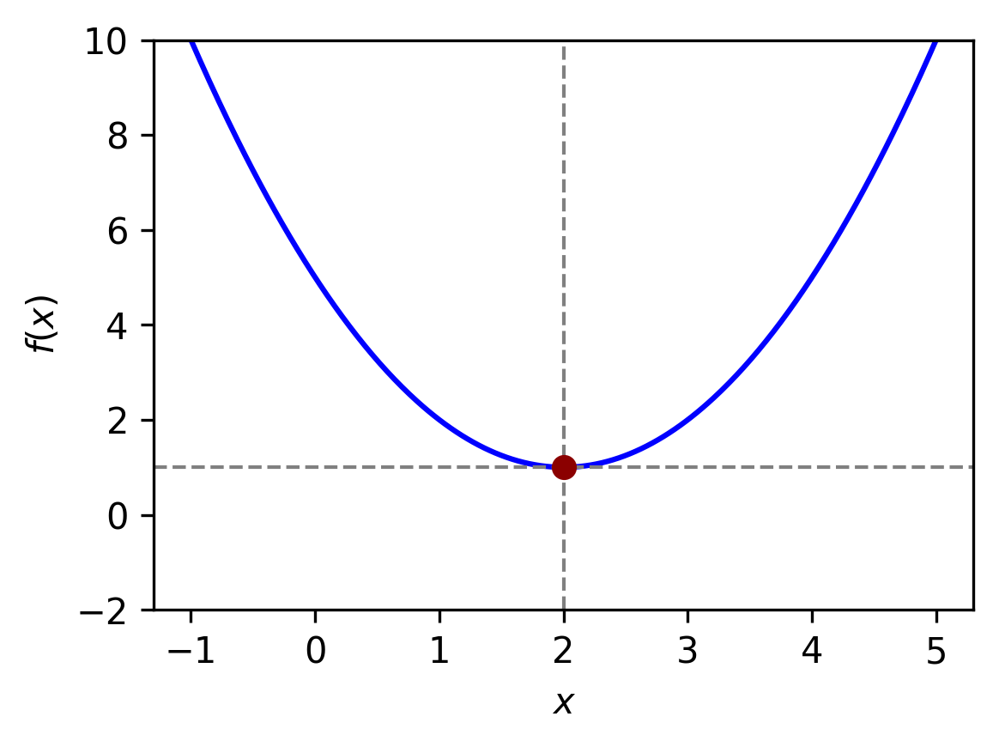
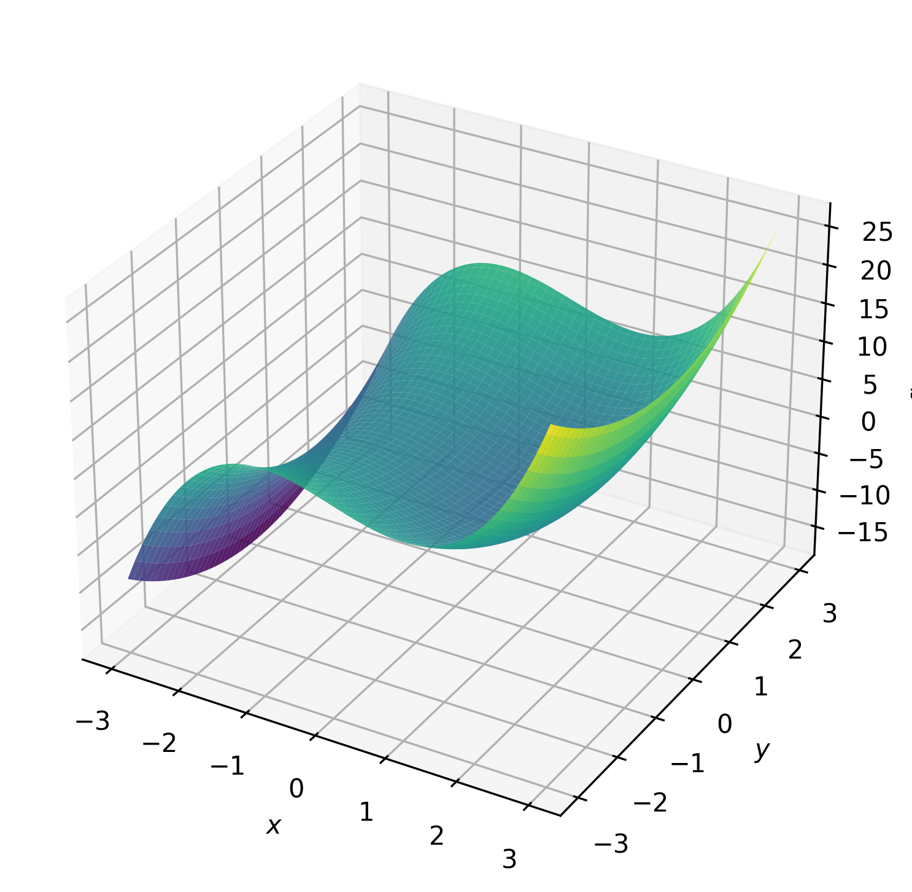
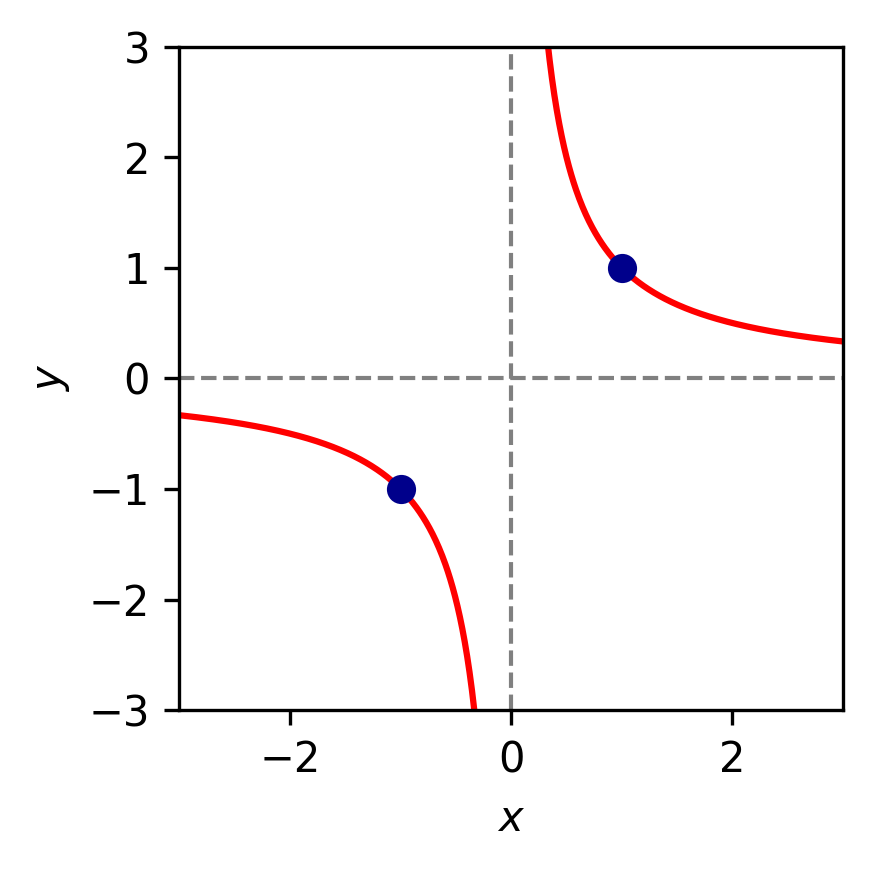
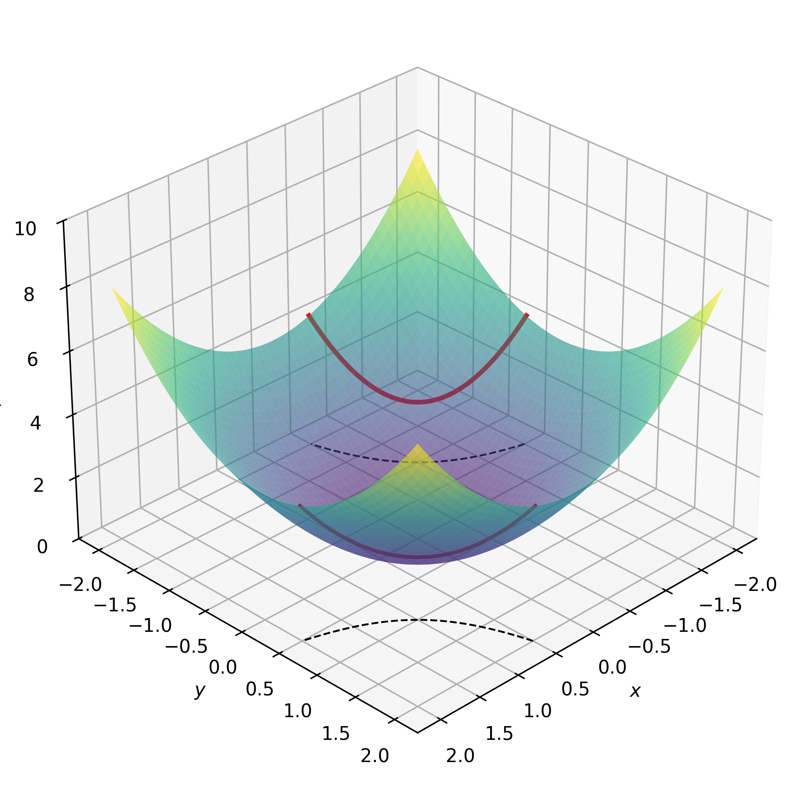
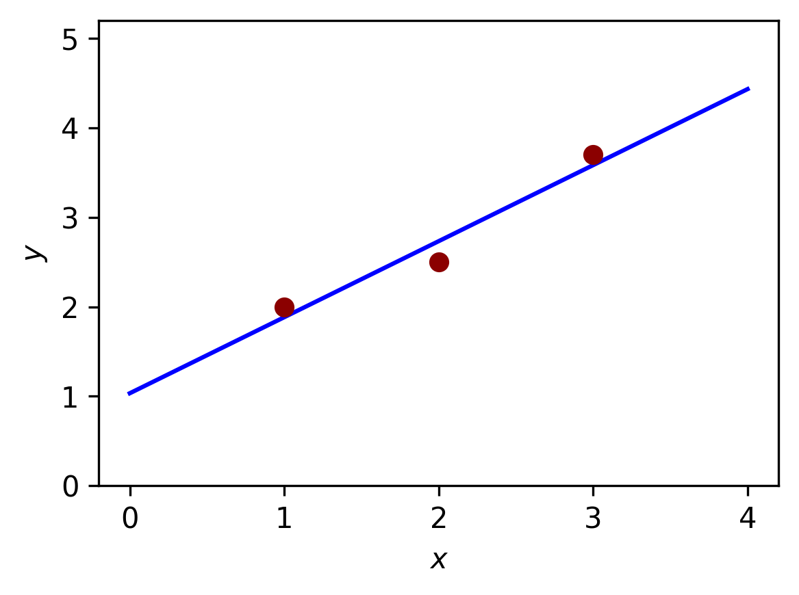
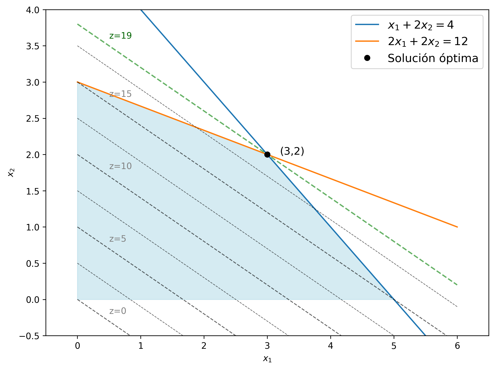

<hr style="border: 1px solid rgba(50, 0, 0, 1);">




<div class="d-flex gap-2">

<a href="../material/apunte_c1s1.pdf" target="_blank" class="btn btn-outline-primary">
<i class="fa-solid fa-file-lines me-2"></i>Versión PDF
</a>

</div>

<div style="margin-top:20px"></div>


La optimización es una herramienta fundamental en matemática aplicada, ciencia de datos y otras disciplinas. En términos generales, el objetivo de un problema de optimización es encontrar el valor de una *variable* (o conjunto de variables) que *minimice* o *maximice* una determinada función, posiblemente bajo ciertas *restricciones*.

<div style="margin-top:2.5em;"></div>


## Optimización matemática


::: {.definicion}
**Definición 1.** (Problema de optimización) Un *problema de optimización matemática* tiene la forma
$$
\begin{array}{ll}
\text{minimizar } & f(\xx)\\
\text{sujeto a } & \xx\in\Omega.
\end{array}
\tag{1}
$$

donde:

- $f:\RR^p\to\RR$ es la *función objetivo*.

- $\xx=(x_1,\ldots, x_p)$ son las *variables de optimización*.

- $\Omega\subset\RR^p$ es el *conjunto factible* o *conjunto de restricciones*.

<div style="margin-top:2em;"></div>

El *valor óptimo* del problema es
$$
p^\star:=\inf\{f(\xx) \mid \xx\in\text{dom}\,f\;\land\;\xx\in\Omega\}.
$$

Si $\text{dom}\,f\cap\Omega=\emptyset$ (es decir, no hay $\xx\in\RR^p$ *factible*), se dice que el problema es *infactible* y se asume $p^\star=\infty$. Por su parte, si el conjunto $\{f(\xx) \mid \xx\in\text{dom}\,f\;\land\;\xx\in\Omega\}$ no tiene cota inferior, se considera $p^\star=-\infty$.

En el caso que $p^\star$ existe y es finito, un vector $\xx^\star\in\Omega$ se denomina *punto óptimo* si $f(\xx^\star)=p^\star$.

:::

<span style="display:block; height:0.25em;"></span>

::: {.myhighlight}
Un problema de optimización tiene solución si existe al menos un punto óptimo $x^\star$. En tal caso, es válido escribir
$$
p^\star=\min\{f(x) \mid \xx\in \text{dom}\,f\;\land\xx\in\Omega\},
$$
$$
\xx^\star\in\argmin\{f(x) \mid \xx\in \text{dom}\,f\;\land\xx\in\Omega\}.
$$

:::

<div style="margin-top:2em;"></div>


En general, se asume que la función objetivo $f$ es continua. Además, a menudo se suele imponer la condición de que también sea diferenciable, ya que facilita el análisis teórico y permite el diseño de métodos de optimización.

Por otra parte, son de especial interés los problemas con *restricciones funcionales*, que son aquellos en los cuales el conjunto factible es de la forma

$$
\Omega=\left\{\xx\in\RR^p\left|\;\begin{array}{ll}
\; g_i(\xx)\leq 0,& i=1,\ldots,r\\
\; h_j(\xx)=0, & j=1,\ldots,m
\end{array}\right.\right\}.
\tag{2}
$$

Es decir, $\Omega$ queda definido a partir de un conjunto de *funciones de restricción*, tanto de desigualdad, $g_i:\RR^p\to\RR$, como de igualdad, $h_j:\RR^p\to\RR$. En función de las características de estas funciones, el conjunto factible puede adquirir ciertas propiedades geométricas fundamentales.

<div class="alert alert-light text-dark" role="important">
<span class="badge bg-warning text-dark">Importante</span>

Un problema de optimización cuyo conjunto factible es de la forma (2) tiene una *restricción implícita*, a saber:
$$
\xx\in\mathcal{D}:=\text{dom}\,f\cap\bigcap_{i=1}^r\text{dom}\,g_i\cap\bigcap_{j=1}^m\text{dom}\,h_j.
$$

Algunas consideraciones importantes son:

- $\mathcal{D}$ es el *dominio* del problema.

- Las restricciones funcionales $g_i(\xx)\leq 0$ y $h_i(\xx)=0$ son *restricciones explícitas*.

- Un problema es *sin restricciones* si no tiene restricciones explícitas. Es decir, su dominio es $\mathcal{D}:=\text{dom}\,f$.

</div>


Las preguntas que surgen de un problema de optimización son:

<div style="margin-top:1.5em;"></div>

:::{.myhighlight4}
¿Existe una solución? 

En caso afirmativo: ¿Es única? ¿Podemos calcularla?
:::

<div style="margin-top:2em;"></div>


::: {.callout-example}
<span class="badge bg-primary">Ejemplo 1</span> 

Veamos algunos ejemplos sencillos de problemas de optimización sin restricciones con funciones objetivo de una variable. Es decir, de la forma
$$
\text{minimizar } f(x).
$$

- $f:\RR^+\to\RR:f(x)=\displaystyle\frac{1}{x}$. El valor óptimo es $p^\star=0$, pero no existe un punto óptimo. En consecuencia, el problema no tiene solución.

- $f:\RR^+\to\RR: f(x)=-\log x$. En este caso, $p^\star=-\infty$, ya que el problema no está acotado inferiormente.

- $f:\RR^+\to\RR: f(x)=x\log x$. El valor óptimo es $p^\star=-e^{-1}$ y ocurre en el único punto óptimo $x^\star=e^{-1}$.

- $f:\RR\to\RR: f(x)=\sin x$. El valor óptimo es $p^\star=-1$ y ocurre en infinitos puntos óptimos, los cuales son de la forma $x^\star=\pi+2k\pi$, con $k\in\ZZ$.

- $f:\RR\to\RR: f(x)=x^3-3x$. Aquí $p^\star=-\infty$, aunque exista un mínimo local en $x=1$.

:::


<div style="margin-top:-0.5em;"></div>
::: {.callout .question}
<span style="font-size: 1.3em;">📝</span><br>
Analice el problema de optimización sin restricciones

$$
\text{minimizar } f(x)
$$

para cada una de las siguientes funciones:

::: {.columns}

::: {.column}
- $f: \mathbb{R}^+ \to \mathbb{R},\quad f(x) = x^3$  

- $f: \mathbb{R} \to \mathbb{R},\quad f(x) = x e^x$
:::

::: {.column}
- $f: \mathbb{R} \to \mathbb{R},\quad f(x) = |x^2-1|$  

- $f: (-1,1) \to \mathbb{R},\quad f(x) = \displaystyle\frac{1}{1-x^2}$
:::

:::

:::


<div style="margin-top:2em;"></div>


Generalmente, consideramos familias o clases de problemas de optimización, caracterizadas por formas particulares de la función objetivo y de las funciones de restricción. Algunos ejemplos importantes son:

- **Programa lineal**: Un problema de optimización es un *programa lineal* si tanto la función objetivo $f$ como las funciones de restricción $g_i$ y $h_j$ son funciones lineales; esto es, son funciones $\varphi:\RR^p\to\RR$ que satisfacen la igualdad
$$
\varphi(\alpha\xx+\beta\yy)=\alpha\,\varphi(\xx)+\beta\,\varphi(\yy),
$$
para todo $\xx,\yy\in\RR^p$ y para todo $\alpha,\beta\in\RR$.


- **Optimización convexa**: Un problema de *optimización convexa* es aquel en el que tanto la función objetivo como las funciones de restricción son funciones convexas; esto es, son funciones $\varphi:\RR^p\to\RR$ que satisfacen la desigualdad
$$
\varphi(\alpha \xx+\beta \yy)\leq \alpha\,\varphi(\xx)+\beta\,\varphi(\yy),
$$
para todo $\xx,\yy\in\RR^p$ y para todo $\alpha,\beta\in[0,1]$ con $\alpha+\beta=1$.

<div style="margin-top:1em;"></div>

Comparando los dos ejemplos anteriores, vemos que la convexidad es más general que la linealidad: la desigualdad reemplaza la igualdad más restrictiva, y además la desigualdad debe cumplirse solo para ciertos valores de $\alpha$ y $\beta$. Por lo tanto, cualquier programa lineal es un problema de optimización convexa. 

El estudio de los problemas de optimización convexa lo realizaremos en [C1-S2](A2_optimizacion_convexa.html). Respecto a programación lineal, veremos un ejemplo básico en esta misma sección más adelante, y otros ejemplos de aplicación se presentarán en [C1-S3](A3_resolucion_computacional.html) cuando exploremos un par de librerías de Python útiles para resolver problemas de optimización.


Por lo pronto, veamos a continuación algunos ejemplos básicos de ejercicios de optimización, que seguramente les resultarán familiares de cursos previos.


::: {.callout-example}
<span class="badge bg-primary">Ejemplo 2</span> 

$$
\begin{array}{ll}
\text{minimizar } & x^2-4x+5.
\end{array}
$$

<div style="float: right; width: 30%; margin-left: 1em; margin-bottom: 1em;">
  
</div>


En este problema no se imponen restricciones sobre el valor de $x$, más allá de pedirle que pertenezca al dominio de la función. Por lo tanto, es un *problema sin restricciones*. 

La función objetivo es $f(x)=x^2-4x+5$. Al ser una función cuadrática con coeficiente cuadrático positivo, sabemos que el punto óptimo ocurre en su vértice. Es decir,
$$
x^\star=-\frac{-4}{2\cdot 1}=2.
$$

Luego, el valor óptimo es $p^\star=f(2)=2^2-4\cdot 2+5=1$.

:::

<span style="display:block; height:0.25em;"></span>


::: {.callout-example}
<span class="badge bg-primary">Ejemplo 3</span> 

$$
\begin{array}{ll}
\text{minimizar } & x^3-3x+y^2.
\end{array}
$$


<div style="float: right; width: 30%; margin-left: 1em; margin-bottom: 1em;">
  
</div>


En este problema de optimización, la función objetivo es $f(x,y)=x^3-3x+y^2$. Dado que no hay restricciones, podemos obtener en primer lugar los *puntos críticos* que anulan el vector gradiente. Así, a partir de 
$$
\nabla f(x,y)=(3x^2-3,2y)=(0,0)
$$
obtenemos los candidatos $(-1,0)$ y $(1,0)$. Para determinar la condición de estos puntos, tenemos como herramienta el *criterio del Hessiano*, el cual inspecciona la matriz de derivadas de segundo orden
$$
H(x,y)=\begin{pmatrix}6x&0\\0&2\end{pmatrix}.
$$

Al aplicar dicho criterio, resulta que en $(1,0)$ hay un mínimo local, mientras que $(-1,0)$ se descarta por ser punto silla. No obstante, esto no quiere decir que hallamos encontrado el punto óptimo, ya que nuestro problema de optimización requiere que el valor óptimo sea global.

Es importante remarcar lo siguiente:

::: {.myhighlight}
Ser mínimo local es una condición necesaria, pero no suficiente, para ser mínimo global.
:::

<div style="margin-top:1.5em;"></div>

De hecho, para este problema no hay un punto óptimo, puesto que la función no está acotada inferiormente, tal como se puede apreciar en su gráfica. Analíticamente, es suficiente ver que, para $y=0$, ocurre que $\displaystyle\lim_{x\to-\infty}(x^3-3x)=-\infty$.

:::

<span style="display:block; height:0.25em;"></span>


::: {.callout-example}
<span class="badge bg-primary">Ejemplo 4</span> 

$$
\begin{array}{ll}
\text{minimizar } & x^2+y^2\\
\text{sujeto a } & xy=1.
\end{array}
$$


<div style="float: right; width: 25%; margin-left: 1em; margin-bottom: 1em;">
  
</div>

<div style="float: right; width: 25%; margin-left: 1em; margin-bottom: 1em;">
  
</div>


En este caso, tenemos una restricción funcional de igualdad definida por $h(x,y)=xy-1$. Este problema se puede resolver aplicando el método de *multiplicadores de Lagrange*, el cual consiste en analizar la igualdad
$$
\begin{align*}
\nabla f(x,y)-\lambda\nabla h(x,y)&=(0,0)\\
(2x-\lambda y,2y-\lambda x)&=(0,0).
\end{align*}
$$

Al resolver el sistema de ecuaciones, se obtienen los puntos críticos $(1,1)$ y $(-1,-1)$, ambos con $\lambda=2$. Además,
$$
f(1,1)=f(-1,-1)=2.
$$

Este es el valor óptimo de la función objetivo en el conjunto factible. La justificación resulta de interpretar geométricamente el problema como *el punto de la hipérbola $xy=1$ más cercano al origen*. En consecuencia, tanto $(1,1)$ como $(-1,-1)$ son puntos óptimos. 
 
:::

<span style="display:block; height:0.25em;"></span>


Los ejemplos anteriores buscan conectar la idea de los problemas de optimización con los ejercicios clásicos de Cálculo, en los que se busca el valor mínimo (o máximo) de una función. Sin embargo, estudiar optimización no se limita a resolver este tipo de ejercicios, sino que implica aprender a formular problemas, comprender sus componentes fundamentales y desarrollar herramientas teóricas y computacionales para abordarlos, incluso cuando no tienen solución analítica o presentan múltiples soluciones.


La optimización matemática es una herramienta poderosa para tomar la mejor decisión posible al elegir un vector $\xx$ dentro de un conjunto de opciones, bajo ciertas restricciones que representan requisitos firmes, y buscando minimizar un costo o maximizar una utilidad. Algunas aplicaciones son:

- **Optimización de portafolios financieros**: Se busca la mejor manera de invertir un determinado capital entre distintos activos. La variable $x_i$ representa la inversión en el $i$-ésimo activo, y las restricciones pueden representar un límite en el presupuesto, el requisito de que las inversiones sean no negativas y/o un valor mínimo aceptable de rendimiento esperado. La función objetivo podría ser una medida del riesgo total de la cartera.

- **Ajuste de modelos a datos (*data fitting*)**: La tarea es encontrar un modelo, dentro de una familia de modelos potenciales, que se ajuste mejor a un conjunto de datos observados. Aquí, las variables son los parámetros del modelo, y las restricciones pueden representar información previa o límites requeridos en los parámetros. La función objetivo puede ser una medida de error de predicción entre los datos observados y los valores predichos por el modelo.

- **Optimización en logística**: Se busca determinar la mejor forma de mover productos a través de una cadena de suministro o rutas de distribución. Las variables representan las cantidades transportadas entre diferentes puntos, y las restricciones pueden incluir la capacidad de los vehículos, los horarios de entrega y la demanda de los clientes. La función objetivo suele minimizar costos totales, tiempos de transporte o ambas cosas a la vez.


Estas aplicaciones son solo una pequeña muestra de la enorme variedad de problemas prácticos que pueden plantearse como problemas de optimización, presentes en áreas como ingeniería, control automático, diseño, finanzas, logística, redes, entre otras.

<div style="margin-top:2.5em;"></div>


## Mínimos cuadrados y programación lineal

Vamos a introducir dos subclases muy conocidas y ampliamente utilizadas de optimización convexa: los problemas de mínimos cuadrados y la programación lineal.


::: {.definicion}
**Definición 2.** (Problema de mínimos cuadrados) Un *problema de mínimos cuadrados* es de la forma
$$
\begin{array}{ll}
\text{minimizar } & \|A\xx-\bb\|_2^2,
\end{array}
\tag{3}
$$
donde $A\in\RR^{k\times p}$ ($k\geq p$), $\aa_i^{\top}$ son las filas de $A$ y $\bb\in\RR^k$. La variable de optimización es $\xx\in\RR^p$.

:::


<details>
<summary>Mostrar detalles</summary>

::: {.panel-tabset}

### <span style="font-size: 1.25em;">&#x2460;</span>

- Es un problema de optimización sin restricciones y su función objetivo es una suma de cuadrados de términos de la forma $\aa_i^{\top}\xx-b_i$.

- Se puede reducir a resolver un conjunto de ecuaciones lineales:
$$
(A^{\top}A)\xx = A^{\top}\bb.
$$
En consecuencia, si $A$ es de rango completo (esto es, $\text{rango}\,A=p$), el problema <mark>tiene solución analítica</mark>:
$$
\xx^\star=(A^{\top}A)^{-1}A^{\top}\bb.
$$
En caso de que $\text{rango}\,A<p$, la matriz $A^\top A$ no es invertible. No obstante, el problema de mínimos cuadrados tiene solución, pero no es única. La solución de mínima norma está dada $\xx^\star=A^+\bb$, donde $A^+$ es la *pseudoinversa de Moore-Penrose* de $A$.

### <span style="font-size: 1.25em;">&#x2461;</span>

- Existen algoritmos para resolver el problema con alta precisión, con un tiempo aproximadamente proporcional a $n^2k$, con constante conocida.

- Para aumentar su flexibilidad en las aplicaciones, se utilizan varias técnicas estándar. Por ejemplo, en los *mínimos cuadrados ponderados* se minimiza
$$
\sum_{i=1}^k w_i(\aa_i^{\top}\xx-b_i)^2,
$$
donde $w_i$ son pesos positivos. Otra técnica es la *regularización*, que consiste en agregar términos adicionales a la función objetivo para controlar ciertas propiedades de la solución. El caso más simple es
$$
\sum_{i=1}^{k}(\aa_{i}^{\top}\xx - b_{i})^{2} + \lambda \sum_{i=1}^{n}x_{i}^{2}.
$$
En el Capítulo 2 exploraremos con mayor detalle los métodos de regularización más clásicos.

:::
</details>

<div style="margin-top:2em;"></div>


::: {.callout-example}
<span class="badge bg-primary">Ejemplo 5</span> 

<div style="float: right; width: 30%; margin-left: 1em; margin-bottom: 1em;">
  
</div>

Dados los puntos $(1,2)$, $(2,2.5)$ y $(3,3.7)$, consideremos el problema de hallar la recta $y = mx + b$ que mejor los aproxime en el sentido de mínimos cuadrados. Esto define en el problema
$$
\begin{array}{ll}
\text{minimizar } & \sum_{i=1}^3 (m x_i + b - y_i)^2.
\end{array}
$$

Cuidado: las variables de optimización son los parámetros $m\in\RR$ y $b\in\RR$, mientras que $(x_i,y_i)$ son los datos conocidos. La función objetivo es la *suma de los cuadrados de los errores* (RSS). Matricialmente resulta en
$$
\begin{array}{ll}
\text{minimizar } & \left\|A\begin{pmatrix}m\\b\end{pmatrix}-\yy\right\|_2^2,
\end{array}
$$
con
$$
A = \begin{pmatrix}
1 & 1\\
2 & 1\\
3 & 1
\end{pmatrix},\qquad
\yy=\begin{pmatrix}
2\\
2.5\\
3.7
\end{pmatrix}.
$$

La solución analítica es
$$
\begin{pmatrix}
m^{\star}\\
b^{\star}
\end{pmatrix}=\left[\begin{pmatrix}
1 & 1\\
2 & 1\\
3 & 1
\end{pmatrix}^{\top}\begin{pmatrix}
1 & 1\\
2 & 1\\
3 & 1
\end{pmatrix}\right]^{-1}\begin{pmatrix}
1 & 1\\
2 & 1\\
3 & 1
\end{pmatrix}^{\top}
\begin{pmatrix}
2\\
2.5\\
3.7
\end{pmatrix}
= \begin{pmatrix}
17/20 \\
31/30
\end{pmatrix}.
$$

Por lo tanto, la recta ajustada es 
$$
\hat{y} = \frac{17}{20}x+\frac{31}{30}.
$$

Esto permite obtener el vector de valores ajustados
$$
\hat{\yy}=\begin{pmatrix}
\frac{17}{20}\cdot 1+\frac{31}{30}\\
\frac{17}{20}\cdot 2+\frac{31}{30}\\
\frac{17}{20}\cdot 3+\frac{31}{30}
\end{pmatrix}
=
\begin{pmatrix}
113/60\\
51/30\\
43/12
\end{pmatrix}
\approx
\begin{pmatrix}
1.88\\
2.73\\
3.58
\end{pmatrix}.
$$


Por último, calculamos el valor de la función objetivo, que interpretamos como el error del ajuste obtenido:

$$
\text{RSS}=\|\hat{\yy}-\yy\|_2^2\approx (1.88-2)^2+(2.73-2.5)^2+3.58-3.7)^2=0.0817.
$$

<br>

En Python, podemos resolver problemas de mínimos cuadrados con la función [`numpy.linalg.lstsq`](https://numpy.org/doc/stable/reference/generated/numpy.linalg.lstsq.html).

```{python}
#| code-summary: "Mostrar código"
#| code-fold: false
#| fig-align: "center"

import numpy as np

# Datos:
x_data = np.array([1, 2, 3])
y_data = np.array([2, 2.5, 3.7])

# Matriz A:
A = np.vstack([np.ones_like(x_data), x_data]).T

# Resolución:
coeffs, residuals, *_ = np.linalg.lstsq(A, y_data, rcond=None)
b, m = coeffs  # Ordenamos como y = mx + b


# 📋:
print(f"Recta ajustada: y = {m:.4f}x + {b:.4f}")
print(f"RSS: {residuals}")
```

:::


::: {.callout .question}
<span style="font-size: 1.3em;">📝</span><br>

Ajuste por mínimos cuadrados una parábola $y = ax^2 + bx + c$ a los puntos $(0, 2)$, $(1, 1)$, $(2, 3)$ y $(3, 8)$. Resuelva a mano y luego corrobore su resultado utilizando `np.linalg.lstsq`.

```{pyodide-python}
# Verifique la solución aquí.
``` 

:::

<div style="margin-top:2em;"></div>


::: {.definicion}
**Definición 3.** (Programación lineal) Un *problema de programación lineal* es de la forma
$$
\begin{array}{lll}
\text{minimizar } & \cc^{\top}\xx & \\
\text{sujeto a } & \aa_i^{\top}\xx\leq b_i, & i=1,\ldots,m.
\end{array}
\tag{2}
$$
donde $\cc,\aa_1,\ldots,\aa_m\in\RR^p$ y $b_1,\ldots,b_m\in\RR$. La variable de optimización es $\xx\in\RR^p$.

:::


<details>
<summary>Mostrar detalles</summary>

::: {.panel-tabset}

### <span style="font-size: 1.25em;">&#x2460;</span>

- No existe una fórmula analítica simple para la solución, pero hay una variedad de métodos muy efectivos para resolver el problema, como el método simplex de Datnzig y los métodos de punto interior.

- En la práctica, la complejidad es del orden de $p^2m$ (asumiendo $m\geq p$), pero con una constante que está menos caracterizada que en el caso de mínimos cuadrados.

### <span style="font-size: 1.25em;">&#x2461;</span>

En muchos casos, el problema de optimización original no tiene una forma estándar de programa lineal, pero puede transformarse en un programa lineal equivalente. Por ejemplo, el *problema de aproximación de Chebyshev*:
$$
\begin{array}{ll}
\text{minimizar } & \max_{i=1,\ldots,k} |\aa_{i}^{\top}\xx- b_{i}|,
\end{array}
$$ 
con variable $\xx\in\RR^p$, puede ser resuelto a través del programa lineal
$$
\begin{array}{lll}
\text{minimizar } & t &\\
\text{sujeto a } & \aa_i^{\top}\xx-t\leq b_i, & i=1,\ldots,k,\\
      & -\aa_i^{\top}\xx-t\leq -b_i, & i=1,\ldots,k,
\end{array}
$$ 
con variables $\xx\in\RR^p$ y $t\in\RR$.

:::
</details>

<div style="margin-top:2em;"></div>


::: {.callout-example}
<span class="badge bg-primary">Ejemplo 6</span> 

Una fábrica produce dos productos, en cantidades que definimos como $x_1$ y $x_2$, los cuales generan ganancias de 3 y 5 unidades monetarias, respectivamente. Producir una unidad de cualquiera de los productos requiere 1 hora de tiempo de producción. Además, la producción de una unidad del primer producto consume 1 unidad de materia prima, mientras que para producir una unidad del segundo producto se necesitan 3 unidades de materia prima. Queremos maximizar la ganancia, teniendo en cuenta que se dispone de 5 horas de producción y 9 unidades de materia prima.

La formulación del problema es

$$
\begin{array}{ll}
\text{maximizar } & 3x_1+5x_2\\
\text{sujeto a }  & x_1+x_2\leq 5,\\
                  & x_1+3x_2\leq 9,\\
                  & x_1\geq 0,\; x_2\geq 0. 
\end{array}
$$

Una forma de obtener la solución gráficamente es analizando las curvas de nivel de la función objetivo $f(x_1,x_2)=3x_1+5x_2$, las cuales tienen la particularidad de ser rectas paralelas. La idea es controlar el valor del nivel $z$, con $z=3x_1+5x_2$, e ir aumentándolo progresivamente sin salirse de la región factible, hasta alcanzar el último punto de contacto. Ese último punto de contacto es el punto óptimo, que como puede verse gráficamente es uno de los vértices definidos por el polígono factible.

<figure style="text-align: center;">
  
</figure>

La ganancia máxima es 19 y ocurre cuando $x_1=3$ y $x_2=2$. 

La relación geométrica en este ejemplo no es casual: en programación lineal, el óptimo (si existe) se alcanza siempre en alguno de los vértices de la región factible. Este hecho constituye la base del método del simplex y de otros algoritmos clásicos.

<br>

En Python, se pueden resolver problemas de este tipo utilizando [`scipy.optimize.linprog`](https://docs.scipy.org/doc/scipy/reference/generated/scipy.optimize.linprog.html).


```{python}
#| code-summary: "Mostrar código"
#| code-fold: false
#| fig-align: "center"

from scipy.optimize import linprog

# Coeficientes de la función objetivo (negativos porque linprog minimiza):
c = [-3, -5]

# Coeficientes de las restricciones (Ax <= b):
A = [
    [1, 1],    # x1 + x2 <= 5
    [1, 3]     # x1 + 3x2 <= 9
]
b = [5, 9]

# Restricciones de no negatividad:
bounds = [(0, None), (0, None)]  # x1 >= 0, x2 >= 0

# Resolución:
res = linprog(c, A_ub=A, b_ub=b, bounds=bounds, method='highs')

# 📋:
print("Éxito:", res.success)
print("x1 =", res.x[0])
print("x2 =", res.x[1])
print("Ganancia máxima =", -res.fun)
```

:::

<!-- 
::: {.callout .question}
<span style="font-size: 1.3em;">📝</span><br>

Formule el siguiente problema y resuélvalo geométricamente. Luego, verifique su resultado utilizando `scipy.optimize.linprog.`.

Una nutricionista debe diseñar una dieta usando dos alimentos, A y B. El alimento A cuesta $2 por unidad y contiene 3g de proteína y 1g de carbohidratos por unidad. El alimento B cuesta $3 por unidad y contiene 2g de proteína y 2g de carbohidratos por unidad. La dieta debe contener al menos 60g de proteína y 30g de carbohidratos. ¿Cuántas unidades de cada alimento debe incluir para minimizar el costo?

```{pyodide-python}
# Grafique aquí.
``` 

```{pyodide-python}
# Verifique la solución aquí.
``` 

:::
-->


<br><br>

## Actividades {.unnumbered}


✏️ **Conceptuales**  
<hr class="linea-corta">

<details>
<summary>Mostrar</summary>
<div style="margin-top:1em;"></div>

1. Dé ejemplos de problemas que haya resuelto en cursos anteriores que involucren maximizar o minimizar alguna cantidad. Para cada ejemplo, identifique sus elementos: función objetivo, variables de optimización, conjunto de restricciones.


1. Muestre que efectivamente el problema de mínimos cuadrados se reduce a $(A^{\top} A)\xx=A^{\top}\bb$.


1. Reescriba el problema de mínimos cuadrados ponderados como un problema de mínimos cuadrados estándar.


1. Justifique cómo se reescribe el problema de aproximación de Chebyshev como un programa lineal.

</details>


<div style="margin-top:2em;"></div>


💻 **Prácticas**  
<hr class="linea-corta">

<div style="text-align:left;">
  <a href="https://colab.research.google.com/drive/1gSAmoTQHiCQ-TlYiYbE4xdYdGrlyC86F?usp=drive_link" target="_blank">
    
  </a>
</div>


<!-- 
1. Encuentre la recta que pasa por el origen que mejor ajusta, en el sentido de mínimos cuadrados, a los puntos $(1, 2)$, $(2, 3)$ y $(3, 6)$.


1. Dado el vector $\bb=(4,2,5)$ y los vectores $\vv_1=(1,0,1)$, $\vv_2=(0,1,1)$, encuentre la combinación lineal $\alpha_1\vv_1+\alpha_2\vv_2$ que mejor aproxime a $\bb$, utilizando mínimos cuadrados.


1. Una carpintería produce mesas y sillas. Cada mesa requiere 3 horas de trabajo y 2 metros de madera, generando una ganancia de $40. Cada silla requiere 1 hora de trabajo y 1 metro de madera, generando una ganancia de $15. La carpintería dispone de 18 horas de trabajo y 12 metros de madera por día. ¿Cuántas mesas y sillas debe producir para maximizar la ganancia?


1. Una empresa tiene 2 fábricas (F1 y F2) que producen 100 y 150 unidades respectivamente. Debe abastecer a 3 almacenes (A1, A2, A3) con demandas de 80, 90 y 80 unidades respectivamente. Los costos de transporte por unidad son:

   |     | A1  | A2  | A3  |
   |-----|-----|-----|-----|
   | F1  | $4  | $6  | $8  |
   | F2  | $5  | $3  | $7  |

   Determine el plan de transporte de costo mínimo.
-->


<div style="margin-top: 5em;"></div>

::: {.refs}
<span style="color: #444;"><strong>Referencias</strong></span>

Boyd, S., & Vandenberghe, L. (2004). *Convex Optimization*. Capítulo 1. Cambridge University Press.

Farina, G. Apuntes del curso MIT 6.7220: *Nonlinear Optimization*. Lección 1(2025). Disponible en la [página del curso](https://www.mit.edu/~gfarina/notes/).

:::