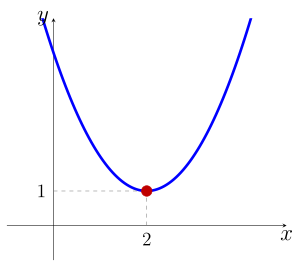
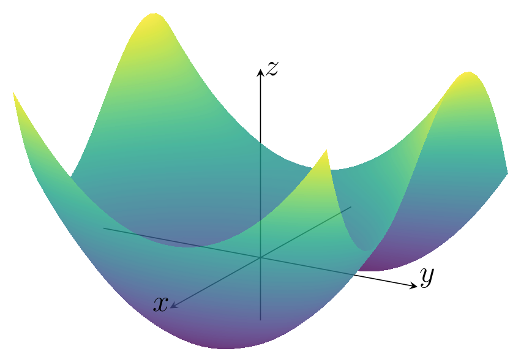
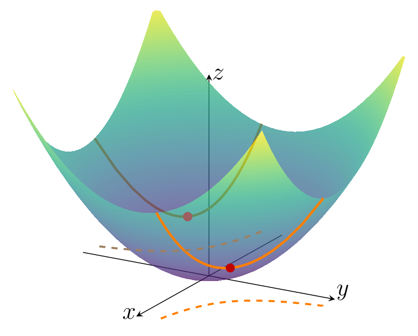
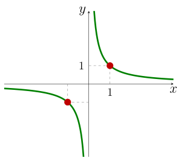



<a href="../material/apunte_c1s1.pdf" target="_blank" class="btn btn-outline-primary">
<i class="fa-solid fa-file-lines me-2"></i>Versión PDF
</a>

La optimización es una herramienta fundamental en matemática aplicada, ciencia de datos y otras disciplinas. En términos generales, el objetivo de un problema de optimización es encontrar el valor de una variable (o conjunto de variables) que *minimice* o *maximice* una determinada función, posiblemente bajo ciertas *restricciones*.

## I │ Optimización matemática

::: {.definicion}
**Definición 1.1.1.** (Problema de optimización) Un *problema de optimización matemática* tiene la forma
$$
\begin{array}{ll}
\text{minimizar } & f(\xx)\\
\text{sujeto a } & \xx\in\Omega.
\end{array}
\tag{1.1.1}
$$

donde:

- $f:\RR^p\to\RR$ es la *función objetivo*.

- $\xx=(x_1,\ldots, x_p)$ son las *variables de optimización*.

- $\Omega\subset\RR^p$ es el *conjunto factible* o *conjunto de restricciones*.

El *valor óptimo* del problema (1.1.1) es
$$
p^\star:=\inf\{f(\xx) \mid \xx\in\dom f\;\land\;\xx\in\Omega\}.
$$

Si $\dom f\cap\Omega=\emptyset$ (es decir, no hay $\xx\in\RR^p$ *factible*), se dice que el problema es *infactible* y se asume $p^\star=\infty$. Por su parte, si el conjunto $\{f(\xx) \mid \xx\in\dom f\;\land\;\xx\in\Omega\}$ no tiene cota inferior, se considera $p^\star=-\infty$.

En el caso que $p^\star$ existe y es finito, un vector $\xx^\star\in\Omega$ se denomina *punto óptimo* del problema (1.1.1) si verifica $f(\xx^\star)=p^\star$.

:::

Las preguntas que surgen al tratar con un problema de optimización son:

:::{.myhighlight4}
¿Existe una solución? 

En caso afirmativo: ¿Es única? ¿Podemos calcularla?
:::

En primer lugar, diremos que:

::: {.myhighlight}
Un problema de optimización tiene solución si existe al menos un punto óptimo $\xx^\star$. En tal caso, es válido escribir:
$$
p^\star=\min\{f(x) \mid \xx\in \dom f\;\land\xx\in\Omega\},
$$
$$
\xx^\star\in\arg\min\{f(x) \mid \xx\in \dom f\;\land\xx\in\Omega\}.
$$

:::

La tarea de verificar que un problema tiene solución, determinar si es única y encontrarla puede ser compleja. Estas cuestiones dependen de las características del problema y motivan el desarrollo de resultados teóricos, como los teoremas de existencia y las condiciones de optimalidad, que estudiaremos en las siguientes secciones. En general, estos resultados requieren imponer ciertas hipótesis sobre la función objetivo. En este sentido, a lo largo del texto asumiremos que $f$ es continua y, cuando sea necesario, también diferenciable.

Por otra parte, son de especial interés los problemas con *restricciones funcionales*, que son aquellos en los cuales el conjunto factible es de la forma

$$
\Omega=\left\{\xx\in\RR^p\left|\;\begin{array}{ll}
\; g_i(\xx)\leq 0,& i=1,\ldots,r\\
\; h_j(\xx)=0, & j=1,\ldots,m
\end{array}\right.\right\}.
\tag{1.1.2}
$$

Es decir, $\Omega$ queda definido a partir de un conjunto de *funciones de restricción*, tanto de desigualdad, $g_i:\RR^p\to\RR$, como de igualdad, $h_j:\RR^p\to\RR$. Las propiedades de estas funciones determinan la estructura geométrica del conjunto factible, la cual desempeña un papel fundamental en el análisis y la resolución de los problemas de optimización.

Importante

Un problema de optimización cuyo conjunto factible es de la forma (2) tiene una *restricción implícita*, a saber:
$$
\xx\in\mathcal{D}:=\dom f\cap\bigcap_{i=1}^r\dom g_i\cap\bigcap_{j=1}^m\dom h_j.
$$

Algunas consideraciones importantes son:

- $\mathcal{D}$ es el *dominio* del problema.

- Las restricciones funcionales $g_i(\xx)\leq 0$ y $h_i(\xx)=0$ son *restricciones explícitas*.

- Un problema *sin restricciones* es aquel que no tiene restricciones explícitas. Es decir, su dominio es $\mathcal{D}:=\dom f$.

Comenzaremos con algunos ejemplos elementales, muchos de ellos conocidos del cálculo diferencial. Aunque pueden resolverse mediante herramientas básicas, ilustran los conceptos fundamentales de la optimización. Posteriormente, mostraremos brevemente algunas aplicaciones representativas para destacar el amplio alcance de la optimización en distintas áreas del conocimiento.

::: {.callout-example}
Ejemplo 1.1.2

Problemas de optimización de una variable sin restricciones

Veamos algunos ejemplos sencillos de problemas de optimización sin restricciones con funciones objetivo de una variable. Es decir, de la forma
$$
\text{minimizar } f(x).
$$

- $f:\RR^+\to\RR \mid f(x)=1/x$. El valor óptimo es $p^\star=0$, pero no existe un punto óptimo. En consecuencia, el problema no tiene solución.

- $f:\RR^+\to\RR \mid f(x)=-\log x$. En este caso, $p^\star=-\infty$, ya que el problema no está acotado inferiormente.

- $f:\RR^+\to\RR \mid f(x)=x\log x$. El valor óptimo es $p^\star=-e^{-1}$ y ocurre en el único punto óptimo $x^\star=e^{-1}$.

- $f:\RR\to\RR \mid f(x)=\sin x$. El valor óptimo es $p^\star=-1$ y ocurre en infinitos puntos óptimos, los cuales son de la forma $x^\star=\pi+2k\pi$, con $k\in\ZZ$.

- $f:\RR\to\RR \mid f(x)=x^3-3x$. Aquí $p^\star=-\infty$, aunque exista un mínimo local en $x=1$.

:::

::: {.callout .question}
📝 
Analice el problema de optimización sin restricciones

$$
\text{minimizar } f(x)
$$

para cada una de las siguientes funciones:

::: {.columns}

::: {.column}
- $f: \mathbb{R}^+ \to \mathbb{R} \mid f(x) = x^3$  

- $f: \mathbb{R} \to \mathbb{R} \mid f(x) = x e^x$
:::

::: {.column}
- $f: \mathbb{R} \to \mathbb{R} \mid f(x) = |x^2-1|$  

- $f: (-1,1) \to \mathbb{R} \mid f(x) = \displaystyle\frac{1}{1-x^2}$
:::

:::

:::

Generalmente, consideramos familias o clases de problemas de optimización, caracterizadas por formas particulares de la función objetivo y de las funciones de restricción. Algunos ejemplos importantes son:

- **Programa lineal**: Un problema de optimización es un *programa lineal* si tanto la función objetivo $f$ como las funciones de restricción $g_i$ y $h_j$ son funciones lineales; esto es, son funciones $\varphi:\RR^p\to\RR$ que satisfacen la igualdad
$$
\varphi(\alpha\xx+\beta\yy)=\alpha\,\varphi(\xx)+\beta\,\varphi(\yy),
$$
para todo $\xx,\yy\in\RR^p$ y para todo $\alpha,\beta\in\RR$.

- **Optimización convexa**: Un problema de *optimización convexa* es aquel en el que tanto la función objetivo como las funciones de restricción son funciones convexas; esto es, son funciones $\varphi:\RR^p\to\RR$ que satisfacen la desigualdad
$$
\varphi(\alpha \xx+\beta \yy)\leq \alpha\,\varphi(\xx)+\beta\,\varphi(\yy),
$$
para todo $\xx,\yy\in\RR^p$ y para todo $\alpha,\beta\in[0,1]$ tales que $\alpha+\beta=1$.

Comparando los dos ejemplos anteriores, vemos que la convexidad es más general que la linealidad: la desigualdad reemplaza la igualdad más restrictiva, y además la desigualdad debe cumplirse solo para ciertos valores de $\alpha$ y $\beta$. Por lo tanto, cualquier programa lineal es un problema de optimización convexa. 

Estudiaremos los problemas de optimización convexa en [C1-S2](A2_optimizacion_convexa.html). Respecto a los programas lineales, los presentaremos como caso particular de los denominados *programas cónicos*, que serán objeto de estudio en [C1-S3](A3_resolucion_computacional.html).

Por lo pronto, veamos a continuación algunos ejemplos básicos de ejercicios de optimización, que seguramente les resultarán familiares de cursos previos.

::: {.callout-example}
Ejemplo 1.1.3 

$$
\begin{array}{ll}
\text{minimizar } & x^2-4x+5.
\end{array}
$$

  

En este problema no se imponen restricciones sobre el valor de $x$, más allá de pedirle que pertenezca al dominio de la función. La función objetivo es una función cuadrática con coeficiente cuadrático positivo y, por lo tanto, el punto óptimo ocurre en su vértice. Es decir,
$$
x^\star=-\frac{-4}{2\cdot 1}=2.
$$

Luego, el valor óptimo es 
$$
p^\star=f(2)=2^2-4\cdot 2+5=1.
$$

:::

::: {.callout-example}
Ejemplo 1.1.4 

$$
\begin{array}{ll}
\text{minimizar } & x^3-3x+y^2.
\end{array}
$$

  

En este problema de optimización, al no haber restricciones, podemos obtener en primer lugar los *puntos críticos* que anulan el vector gradiente. Así, a partir de la ecuación vectorial 
$$
\nabla f(x,y)=(3x^2-3,2y)=(0,0)
$$
obtenemos los candidatos $(-1,0)$ y $(1,0)$. 

Para determinar la condición de estos puntos,  una herramienta es el *criterio del Hessiano*, el cual inspecciona la matriz de derivadas de segundo orden
$$
H(x,y)=\begin{pmatrix}6x&0\\0&2\end{pmatrix}.
$$

Al aplicar dicho criterio, resulta que en $(1,0)$ hay un mínimo local, mientras que $(-1,0)$ se descarta por ser punto silla. No obstante, esto no quiere decir que hallamos encontrado el punto óptimo, ya que nuestro problema de optimización requiere que el valor óptimo sea global. En efecto, recordemos que:

::: {.myhighlight}
Ser mínimo local es una condición necesaria, pero no suficiente, para ser mínimo global.
:::

De hecho, para este problema no hay un punto óptimo, puesto que la función no está acotada inferiormente, tal como se puede apreciar en su gráfica. Analíticamente, es suficiente ver que, para $y=0$, ocurre que $\displaystyle\lim_{x\to-\infty}(x^3-3x)=-\infty$.

:::

::: {.callout-example}
Ejemplo 1.1.5 

$$
\begin{array}{ll}
\text{minimizar } & x^2+y^2\\
\text{sujeto a } & xy=1.
\end{array}
$$

  

En este caso, tenemos una restricción funcional de igualdad definida por $h(x,y)=xy-1$. Este problema se puede resolver aplicando el método de *multiplicadores de Lagrange*, el cual consiste en obtener los puntos críticos de la función $f+\lambda h$, con $\lambda\in\RR$. Al resolver el sistema de ecuaciones formado por
$$
\nabla f(x,y)-\lambda\nabla h(x,y)=(2x-\lambda y,2y-\lambda x)=(0,0)
$$

y la restricción, se obtienen los puntos críticos $(1,1)$ y $(-1,-1)$, ambos con $\lambda=2$. Además,
$$
f(1,1)=f(-1,-1)=2.
$$

  

Este es el valor óptimo de la función objetivo en el conjunto factible. La justificación resulta de interpretar geométricamente el problema como *el punto de la hipérbola $xy=1$ más cercano al origen*. 

En consecuencia, los puntos óptimos son
$$
\xx_1^\star=(1,1),\qquad \xx_2^\star=(-1,-1). 
$$
 
:::

Los ejemplos anteriores buscan conectar la idea de los problemas de optimización con los ejercicios clásicos de Cálculo, en los que se busca el valor mínimo (o máximo) de una función. Sin embargo, estudiar optimización no se limita a resolver este tipo de ejercicios, sino que implica aprender a formular problemas, comprender sus componentes fundamentales y desarrollar herramientas teóricas y computacionales para abordarlos, incluso cuando no tienen solución analítica o presentan múltiples soluciones.

La optimización matemática es una herramienta poderosa para tomar la mejor decisión posible al elegir un vector $\xx$ dentro de un conjunto de opciones, bajo ciertas restricciones que representan requisitos firmes, y buscando minimizar un costo o maximizar una utilidad. Algunas aplicaciones son:

- **Optimización de portafolios financieros**: Se busca la mejor manera de invertir un determinado capital entre distintos activos. La variable $x_i$ representa la inversión en el $i$-ésimo activo, y las restricciones pueden representar un límite en el presupuesto, el requisito de que las inversiones sean no negativas y/o un valor mínimo aceptable de rendimiento esperado. La función objetivo podría ser una medida del riesgo total de la cartera.

- **Ajuste de modelos a datos**: La tarea es encontrar un modelo, dentro de una familia de modelos potenciales, que se ajuste mejor a un conjunto de datos observados. Aquí, las variables son los parámetros del modelo, y las restricciones pueden representar información previa o límites requeridos en los parámetros. La función objetivo puede ser una medida de error de predicción entre los datos observados y los valores predichos por el modelo.

- **Optimización en logística**: Se busca determinar la mejor forma de mover productos a través de una cadena de suministro o rutas de distribución. Las variables representan las cantidades transportadas entre diferentes puntos, y las restricciones pueden incluir la capacidad de los vehículos, los horarios de entrega y la demanda de los clientes. La función objetivo suele minimizar costos totales, tiempos de transporte o ambas cosas a la vez.

Las aplicaciones mencionadas son solo una pequeña muestra de la enorme variedad de problemas prácticos que pueden plantearse como problemas de optimización, presentes en áreas como ingeniería, control automático, diseño, finanzas, logística, redes, entre otras.

::: {.refs}
<strong>Referencias</strong>

Boyd, S., & Vandenberghe, L. (2004). *Convex Optimization*. Cambridge University Press.

Farina, G. (2024--2025) *MIT 6.7220: Nonlinear Optimization*. Course material and lecture notes. Massachusetts Institute of Tech
nology. 🔗 [ir al sitio web](https://www.mit.edu/~gfarina/notes/).

:::