<hr style="border: 1px solid rgba(50, 0, 0, 1);">




<div class="d-flex gap-2">

<a href="../material/apunte_c1s2.pdf" target="_blank" class="btn btn-outline-primary">
<i class="fa-solid fa-file-lines me-2"></i>Versión PDF
</a>

<a href="../material/tp_c1s2.pdf" target="_blank" class="btn btn-outline-success">
<i class="fa-solid fa-clipboard-list me-2"></i>Guía de actividades
</a>

</div>

<div style="margin-top:20px"></div>


EEn esta sección nos enfocaremos en los conceptos fundamentales que sustentan la optimización convexa, una rama central en la teoría y práctica de la optimización. A partir de las ideas presentadas en el [C1-S1](A1_intro_optimizacion.html), donde destacamos el rol de la convexidad, ahora desarrollaremos con mayor profundidad las nociones teóricas que permiten formular y analizar este tipo de problemas.

Antes, veamos el siguiente gráfico, donde se ilustra las ventajas de trabajar con problemas convexos. Allí, se puede visualizar el comportamiento de las iteraciones de un método de optimización que busca aproximarse al punto óptimo (en este caso, el mínimo global). ¿Qué se observa?

```{pyodide-python}
#| echo: false
#| fig-align: "center"
#| fig-cap: "Descenso por gradiente en un problema convexo y en un problema no convexo."
#| context: ojs
#| input: [x0, paso]

import numpy as np
import matplotlib.pyplot as plt

# Funciones
f_conv = lambda x: x**2
grad_conv = lambda x: 2*x

f_noconv = lambda x: np.sin(2*x) + 0.3*x
grad_noconv = lambda x: 2*np.cos(2*x) + 0.3

# Parámetros
alpha = 0.1  # paso fijo
alpha2 = 0.5
steps = paso

# Inicialización
x_conv = x0
x_noconv = x0
path_conv = [x_conv]
path_noconv = [x_noconv]

# Iteraciones de "descenso"
for _ in range(steps):
    x_conv = x_conv - alpha * grad_conv(x_conv)
    x_noconv = x_noconv - alpha * grad_noconv(x_noconv)
    path_conv.append(x_conv)
    path_noconv.append(x_noconv)

# Dominio para graficar
x_vals = np.linspace(-2, 3, 400)
y_conv = f_conv(x_vals)
y_noconv = f_noconv(x_vals)

plt.figure(figsize=(10, 4))

# === Gráfico Convexo ===
plt.subplot(1, 2, 1)
plt.plot(x_vals, y_conv)
plt.plot(path_conv, [f_conv(x) for x in path_conv], 'ro-')
plt.title("Problema convexo", fontsize=14)
plt.xlabel("$x$", fontsize=12)
plt.ylabel("$f(x)$", fontsize=12)
plt.grid(True)
#plt.legend()

# === Gráfico No Convexo ===
plt.subplot(1, 2, 2)
plt.plot(x_vals, y_noconv)
plt.plot(path_noconv, [f_noconv(x) for x in path_noconv], 'ro-')
plt.title("Problema no convexo", fontsize=14)
plt.xlabel("$x$", fontsize=12)
plt.ylabel("$f(x)$", fontsize=12)
plt.grid(True)

plt.tight_layout()
plt.show()
```

```{ojs}
//| echo: false
viewof x0 = Inputs.range([-2, 3], {
  step: 0.1,
  label: "Punto inicial:",
  value: 1
})

viewof paso = Inputs.range([0, 20], {
  step: 1,
  label: "Número de iteraciones:",
  value: 0
})
```

<p style="text-align:center; font-size:0.9em; color:#6c757d;">
<b>Figura 1.2.1:</b> Comportamiento de un método iterativo en un problema de optimización.
</p>

<div style="border-top:1px solid #b7cdf5;
            background-color: #fafbff;
            padding:0.1em 0;
            margin-top:2em;">

📄 **Notación**

En $\RR^p$ consideraremos el producto interno usual
$$
\langle \xx,\yy\rangle_2:=\xx^\top\yy=\sum_{i=1}^px_iy_i,
$$
y escribiremos $\langle \xx,\yy\rangle_2$ o $\xx^\top \yy$, según conveniencia. La norma $\ell_2$ correspondiente es 
$$
\|\xx\|_2:=(\xx^\top\xx)^{1/2}.
$$

Denotaremos además $B(\xx,r):=\{\yy\mid\|\yy-\xx\|_2< r\}$ la bola abierta de centro $\xx$ y radio $r$.

Asimismo, recordemos que una matriz $A$ se dice *semidefinida positiva* ($A\succeq 0$), si verifica $\xx^\top A\xx\geq 0$ para todo $\xx\in\RR^p$, mientras que se dice *definida positiva* ($A\succ 0$) si la desigualdad es estricta. De manera análoga, se definen las matrices semidefinidas negativas ($A \preceq 0$) y definidas negativas ($A \prec 0$).

Al conjunto de matrices simétricas lo denotaremos $\bfS^p$, mientras que con $\bfS_+^p$ y $\bfS_{++}^p$ nos referiremos al conjunto de matrices simétricas semidefinidas positivas y simétricas definidas positivas, respectivamente.

Por último, así como escribimos $A\xx=\bb$ para referirnos a un conjunto de igualdades de la forma $\bfa_i^\top\xx=b_i$, vamos a denotar $A\xx\preceq\bb$ al conjunto de desigualdades $\bfa_i^\top\xx\leq b_i$.

</div>

<div style="margin-top:2.5em;"></div>


## I <span style="color:#CCCCCC;">│</span> Geometría de conjuntos

Una gran parte del éxito de los métodos de optimización convexa radica en una idea geométrica simple pero poderosa: la convexidad del conjunto factible $\Omega$. Un conjunto es convexo es aquel en el cual, si tomamos dos puntos cualesquiera, el segmento que los une queda completamente contenido dentro del conjunto. Esta propiedad, que a primera vista parece modesta, contribuye a garantizar que los métodos iterativos puedan avanzar progresivamente dentro del conjunto factible sin salir de él; es decir, facilita la construcción de puntos factibles.


### Conceptos básicos

Introduciremos tres tipos fundamentales de conjuntos que aparecen en optimización: conjuntos afines, conjuntos convexos y conos. Antes, es necesario recordar la forma parámetrica de *rectas* y *segmentos de recta*. 

Sean $\xx_{1} \neq \xx_{2}$ dos puntos en $\RR^{p}$. La recta que pasa por $\xx_1$ y $\xx_2$ puede describirse paramétricamente (con parámetro real $\theta$) mediante la siguiente ecuación:
$$
\yy = \theta \xx_{1} + (1 - \theta) \xx_{2},\qquad \theta\in\RR.
\tag{1.2.1}
$$

La expresión (1.2.1) se conoce como *combinación afín* de $\xx_1$ y $\xx_2$. En cambio, si restringimos el valor del parámetro a $0\leq \theta\leq 1$, obtenemos una *combinación convexa*, que describe el segmento de recta (cerrado) entre ambos puntos, con $\xx_2$ como punto inicial. Ambos conceptos pueden generalizarse a un número finito de puntos, como veremos más adelante.

<figure style="text-align: center;">
  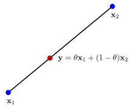
  <figcaption>**Figura 1.2.2:** Combinación convexa entre dos puntos $\xx_1$ y $\xx_2$.</figcaption>
</figure>

<div style="margin-top:2em;"></div>

Una expresión alternativa a (1.2.1) para la ecuación del segmento de recta es
$$
\yy=\xx_2+\theta(\xx_1-\xx_2),\qquad\theta\in[0,1],
$$

la cual expresa $\yy$ en términos del punto inicial $\xx_2$ y la dirección $\xx_1-\xx_2$. Además, podemos interpretar a $\theta$ como la fracción del camino desde $\xx_2$ hasta $\xx_1$ donde se encuentra $\yy$.

<div style="margin-top:2em;"></div>

En base a las ideas geométricas introducidas, estamos en condiciones de presentar las definiciones fundamentales de conjuntos afines, conjuntos convexos, conos y otros conceptos relacionados.

<div style="margin-top:2em;"></div>


::: {.definicion}
**Definición 1.2.1** (Conjunto afín). Un conjunto $C \subset \RR^{p}$ es *afín* si la recta que pasa por cualquier par de puntos distintos en $C$ está contenida en $C$. Es decir, si se verifica
$$
\theta \xx_1+(1-\theta)\xx_2\in C\qquad\forall \xx_1,\xx_2\in C,\; \forall\theta\in\RR.
$$
:::


<details>
<summary><span style="color:#0056b3;">ℹ Ver más información</span></summary>

::: {.panel-tabset}

### <span style="font-size: 1.25em;">&#x2460;</span>

Dado $\{\xx_1,\ldots,\xx_k\}\subset\RR^p$, se denomina *combinación afín* de éstos a todo punto de la forma
$$
\theta_1\xx_1+\cdots+\theta_k\xx_k,\qquad \sum_{i=1}^k\theta_i=1.
$$
	
Es fácil ver que un conjunto afín $C$ contiene todas las combinaciones afines de sus puntos (✏1).

### <span style="font-size: 1.25em;">&#x2461;</span>

Dado un conjunto afín $C$ y un punto $\xx_0\in C$, el conjunto
$$
V:= C-\xx_0=\{\xx-\xx_0 \mid \xx\in C\}
$$

es un subespacio vectorial que no depende de la elección de $\xx_0$ (✏2). Definimos la *dimensión* de $C$ como $\dim C:=\dim V$.

### <span style="font-size: 1.25em;">✍️</span>

::: {.callout .question}
<span style="font-size: 1.3em;">✍️</span><br>
¿Cuáles son los subconjuntos afines de $\RR^2$ y $\RR^3$? Grafique algunos ejemplos y, para cada uno de ellos, represente el subespacio $V$ asociado y determine la dimensión del conjunto afín.

:::

:::
</details>

<div style="margin-top:2em;"></div>

::: {.callout-example}
<span class="badge bg-primary">Ejemplo 1.2.2</span> 
<span style="color: #0d6efd; font-family: Arial; font-weight: bold; font-size: 0.85em;">
  Conjunto solución de un sistema de ecuaciones lineales
</span>

Sea $A\xx=\bb$, con $A\in\RR^{m\times p}$ y $\bb\in\RR^m$. El conjunto solución es
$$
S := \{\xx \mid A\xx=\bb\}.
$$

Para todo $\xx_1,\xx_2\in S$ y cualquier $\theta\in\RR$, se verifica
$$
A(\theta\xx_1+(1-\theta)\xx_2)=\theta A\xx_1+(1-\theta)A\xx_2=\theta\bb+(1-\theta)\bb=\bb.
$$
	
Por lo tanto, $\theta\xx_1+(1-\theta)\xx_2\in S$, lo cual implica que $S$ es un conjunto afín.

:::

<div style="margin-top:2em;"></div>


::: {.definicion}
**Definición 1.2.3** (Conjunto convexo). Un conjunto $C \subset \RR^p$ es *convexo* si el segmento de recta entre cualquier par de puntos distintos en $C$ está contenido en $C$. Es decir, si se verifica
$$
\theta \xx_1+(1-\theta)\xx_2\in C\qquad\forall \xx_1,\xx_2\in C,\; \forall\theta\in[0,1].
$$
:::

<details>
<summary><span style="color:#0056b3;">ℹ Ver más información</span></summary>

::: {.panel-tabset}

### <span style="font-size: 1.25em;">&#x2460;</span>

Llamamos *combinación convexa* a un punto de la forma 
$$
\theta_{1} \xx_{1} + \cdots + \theta_{k} \xx_{k},\qquad \sum_{i=1}^k\theta_i = 1,\; \theta_{i} \geq 0.
$$

Como en el caso de los conjuntos afines, se puede demostrar que un conjunto es convexo si y solo si contiene todas las combinaciones convexas de sus puntos (✏1). 

Por otro lado, observar que, a diferencia de una combinación afín, una combinación convexa requiere la no negatividad de los coeficientes $\theta_i$, lo cual significa que puede ser interpretada como un *promedio ponderado* de los puntos $\xx_i$. 

### <span style="font-size: 1.25em;">✍️</span>

::: {.callout .question}
<span style="font-size: 1.3em;">✍️</span><br>
<div style="margin-top:-0.1em;"></div>
Todo conjunto afín es convexo. ¿Por qué?

:::
:::
</details>


<figure style="text-align: center;">
  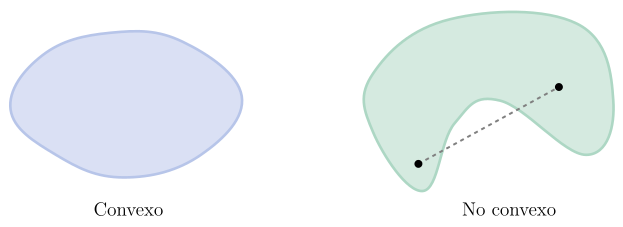
  <figcaption>**Figura 1.2.3:** Ejemplo de un conjunto convexo y otro no convexo. En este último, el segmento que une dos puntos del conjunto puede no estar contenido en él.</figcaption>
</figure>

<div style="margin-top:2em;"></div>


::: {.callout-example}
<span class="badge bg-primary">Ejemplo 1.2.4</span> 
<span style="color: #0d6efd; font-family: Arial; font-weight: bold; font-size: 0.85em;">
  Combinación convexa en un problema de decisión
</span>

Una empresa diseñó internamente tres posibles estrategias para la oferta de un nuevo producto. Para cada estrategia, realizó un análisis que le permitió estimar el nivel de satisfacción promedio del usuario (de 0 a 10) y el costo de implementación mensual (en miles de dólares), obteniendo:

- Estrategia A (satisfacción y costo altos): $(8.5,25)$.
- Estrategia B (satisfacción y costo medios): $(6.75,17.5)$.
- Estrategia C (satisfacción y costo bajos): $(4,12)$.

::: {.columns}

::: {.column width="55%"}
En lugar de implementar una única estrategia, la empresa decidió realizar una inversión de manera porcentual, destinando el 60% del presupuesto a la estrategia A, el 25% a la B y el 15% restante a la C. El costo y la satisfacción esperada están determinados por la siguiente combinación convexa:
$$
\frac{3}{5}\cdot (8.5,25)+\frac{1}{4}\cdot (6.75,17.5)+\frac{3}{20}\cdot (4,12).
$$

El resultado obtenido es $(7.39,21.18)$.

:::

::: {.column width="5%"}
:::

::: {.column width="40%"}
<figure style="text-align: center;">
  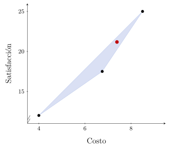
</figure>
:::
:::
:::

<div style="margin-top:2em;"></div>


::: {.definicion}
**Definición 1.2.5** (Cono). Un conjunto $C\subset\RR^p$ se denomina *cono* si verifica
$$
\theta\xx\in C\qquad\forall \xx\in C,\; \forall \theta\geq 0.
$$
:::


<details>
<summary><span style="color:#0056b3;">ℹ Ver más información</span></summary>

::: {.panel-tabset}

### <span style="font-size: 1.25em;">&#x2460;</span>

Llamamos *combinación cónica* a un punto de la forma
$$
\theta_1\xx_1+\cdots+\theta_k\xx_j,\qquad \theta_i\geq 0.
$$

A diferencia de los conjuntos afines y convexos, la propiedad de ser cono por sí sola no garantiza estabilidad bajo combinaciones con varios términos. En particular, un cono solo es cerrado por multiplicación por escalares no negativos, pero no necesariamente por suma. Por ello, para asegurar la estabilidad bajo combinaciones cónicas es necesario considerar la noción de cono convexo.

:::
</details>

<div style="margin-top:1em;"></div>

Los conos convexos se definen mediante dos condiciones: ser un cono y ser un conjunto convexo. Sin embargo, ambas condiciones pueden reunirse en una única propiedad, tal como lo indica la siguiente actividad:

::: {.callout .question}
<span style="font-size: 1.3em;">✍️</span><br> 
Muestre que $C$ es un cono convexo si y solo si

$$
\theta_1\xx_1+\theta_2\xx_2\in C\qquad\forall \xx_1,\xx_2\in C,\;\forall \theta_1, \theta_2\geq 0.
$$

:::

<figure style="text-align: center;">
  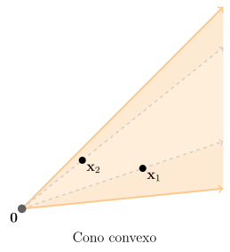
  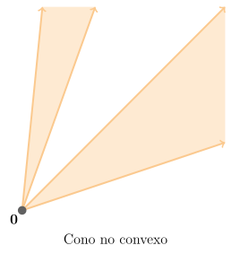
  <figcaption>**Figura 1.2.4:** Ejemplo de un cono convexo y otro no convexo. En el caso de cono convexo, toda combinación lineal entre pares de puntos queda contenida en el cono..</figcaption>
</figure>

<div style="margin-top:2em;"></div>

Luego, esta caracterización permite probar fácilmente que un conjunto $C$ es un cono convexo si y solo si contiene todas las combinaciones cónicas de sus puntos (✏1).


<div style="margin-top:2em;"></div>


::: {.callout-example}
<span class="badge bg-primary">Ejemplo 1.2.6</span> 
<span style="color: #0d6efd; font-family: Arial; font-weight: bold; font-size: 0.85em;">
  De un cono no convexo a un cono convexo
</span>

::: {.columns}

::: {.column width="65%"}
En $\RR^3$, el conjunto
$$
C=\{(x,y,z)\in\RR^3 \mid z=\sqrt{x^2+y^2}\}
$$
es un cono, pero no es convexo. En la figura se muestran un par de puntos que pertenecen a $C$, mientras que el segmento entre ellos no. La condición de la Definición 1.2.5 de cono es inmediata:
$$
z=\sqrt{x^2+y^2}\Rightarrow\theta z=\sqrt{(\theta x)^2+(\theta y)^2}\qquad\forall\theta\geq 0.
$$

:::

::: {.column width="5%"}
:::

::: {.column width="30%"}
<figure style="text-align: center;">
  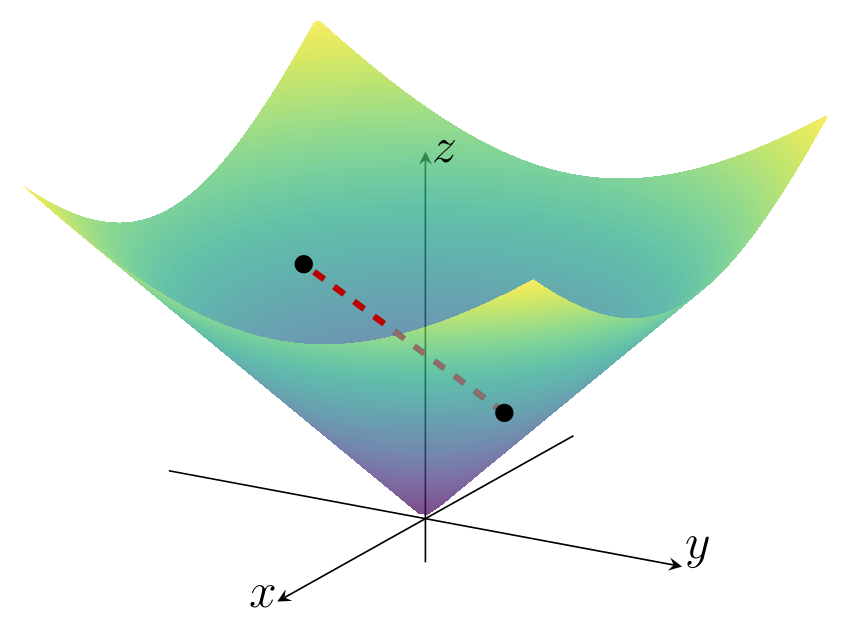
</figure>
:::
:::

Ahora bien, si agregamos los segmentos entre pares de puntos, obtenemos el conjunto
$$
\tilde C=\{(x,y,z)\in\RR^3 \mid z\geq\sqrt{x^2+y^2}\},
$$

el cual sí es un cono convexo.

:::


::: {.callout-example}
<span class="badge bg-primary">Ejemplo 1.2.7</span> 
<span style="color: #0d6efd; font-family: Arial; font-weight: bold; font-size: 0.85em;">
  Cono de segundo orden
</span>

El cono convexo $\tilde{C}$ del ejemplo anterior puede ser escrito en términos de la norma euclídea en $\RR^2$ como
$$
\tilde{C}=\left\{(\xx,t)\in\RR^3 \mid \|\xx\|_2\leq t\right\}.
$$

Vamos a generalizar este concepto a cualquier espacio euclídeo $\RR^p$: se define el *cono de segundo orden* como
$$
\calQ^{p+1}:=\left\{(\xx,t)\in\RR^{p+1} \mid \|\xx\|_2\leq t\right\}.
\tag{1.2.2}
$$

La condición en (1.2.2) puede ser escrita matricialmente como
$$
\begin{pmatrix}
\xx & t
\end{pmatrix}
\begin{pmatrix}
I & 0 \\
0 & -1 \\
\end{pmatrix}
\begin{pmatrix}
\xx \\
t
\end{pmatrix}
\leq 
0,
$$

razón por la cual $\calQ^{p+1}$ también se conoce como *cono cuadrático*. También es frecuente encontrar las denominaciones *cono de Lorentz* y *cono de helado*.

<figure style="text-align: center;">
  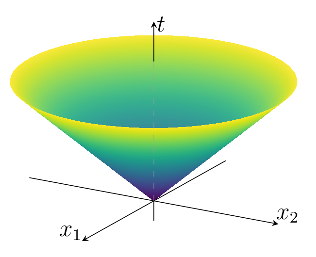
  <figcaption>**Figura 1.2.5:** Cono de segundo orden $\calQ^3$ asociado a la norma euclídea en $\RR^2$.</figcaption>
</figure>

:::


<div style="margin-top:2em" class="alert alert-light text-dark" role="important">
<span class="badge bg-success text-light">Envolventes</span>

A cada una de las clases de conjuntos introducidas anteriormente puede asociarse una envolvente, entendida como el menor conjunto de esa clase que contiene a un conjunto dado.

Sea $C\subset\RR^p$. Se definen:

- La *envolvente afín* es el conjunto de todas las combinaciones afínes de puntos en $C$. Denotamos
$$
\aff C := \left\{\theta_{1} \xx_{1} + \cdots + \theta_{k} \xx_{k}\,\left|\,\xx_{i} \in C,\;\sum_{i=1}^k\theta_{i} = 1\right.\right\}.
$$

- La *envolvente convexa* es el conjunto de todas las combinaciones convexas de puntos en $C$. Denotamos
$$
\conv C := \left\{\theta_{1} \xx_{1} + \cdots + \theta_{k} \xx_{k}\,\left|\, \xx_{i} \in C,\; \theta_{i} \geq 0,\;\sum_{i=1}^k\theta_{i} = 1\right.\right\}.
$$

  Como su nombre lo indica, la envolvente convexa es siempre un conjunto convexo (✏4). Más aún, $\conv C$ es el conjunto convexo más pequeño que contiene a $C$; esto es, si $E$ es cualquier conjunto convexo que contiene a $C$, entonces $\conv C \subset E$. 

- La *envolvente cónica* es el conjunto de todas las combinaciones cónicas de puntos en $C$. Denotamos
$$
\cone C := \left\{\theta_{1} \xx_{1} + \cdots + \theta_{k} \xx_{k}\mid \xx_{i} \in C,\; \theta_{i} \geq 0\right\}.
$$

  La envolvente cónica es siempre un conjunto convexo (✏4). Más aún, $\cone C$ es el cono convexo más pequeño que contiene a $C$.

<div style="margin-top:1em;"></div>

<figure style="text-align: center;">
  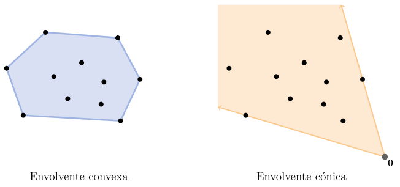
  <figcaption>**Figura 1.2.6:** Envolvente convexa y envolvente cónica de un mismo conjunto finito de puntos.</figcaption>
</figure>
</div>

<div style="margin-top:1em;"></div>

Del concepto de envolvente afín se desprenden dos nociones que, si bien no son muy comunes, serán útiles más adelante:

- La *dimensión afín* de $C$ es la dimensión de su envolvente afín $\aff C$.

- El *interior relativo* de $C$ respecto a $\aff C$ se define como
    $$
    \relinterior C:=\left\{\xx\in C\,\left|\exists r>0: B(\xx,r)\cap \aff C\subset C\right.\right\}.
    $$

<div style="margin-top:2em;"></div>

::: {.callout-example}
<span class="badge bg-primary">Ejemplo 1.2.8</span> 
<span style="color: #0d6efd; font-family: Arial; font-weight: bold; font-size: 0.85em;">
  Interior relativo de un cuadrado en $\RR^3$
</span>

::: {.columns}

::: {.column width="65%"}

Sea $C=[-1,1]\times[-1,1]\times\{1\}\subset\RR^3$. La envolvente afín de $C$ es un plano:
$$
\aff C=\{(x,y,z)\in\RR^3 \mid z=1\}.
$$

Como consecuencia, a pesar de que $C$ tiene interior vacío, su interior relativo es
$$
\relinterior C=(-1,1)\times(-1,1)\times\{1\}.
$$

:::

::: {.column width="5%"}
:::

::: {.column width="30%"}

<div style="margin-top:-1em;"></div>

<figure style="text-align: center;">
  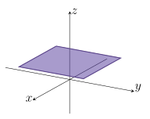
</figure>

:::
:::
:::

<div style="margin-top:1em;"></div>


### Operaciones que preservan convexidad

En esta sección describiremos algunas operaciones que preservan la convexidad de conjuntos y que nos permiten construir conjuntos convexos a partir de otros. Estas operaciones, junto con los ejemplos simples descritos anteriormente, forman un cálculo de conjuntos convexos que es útil para analizar convexidad. 


- **Intersección**. La intersección de cualquier número de conjuntos convexos es convexo.

- **Funciones afines**. Si $S\subset \RR^{p}$ es convexo y $f: \mathbf{R}^{p} \to \mathbf{R}^{m}$ es una función afín, entonces, la imagen de $S$ bajo $f$, $f(S) := \{f(\xx) \mid \xx \in S\}$, es convexa. De manera similar, si $f: \RR^{k} \to \RR^{p}$ es una función afín, la imagen inversa de $S$ bajo $f$, $f^{-1}(S) := \{\xx \mid f(\xx) \in S\}$, es convexa.

<aside>$f:\RR^p\to\RR^m$ es *afín* si es de la forma $f(\xx)=A\xx+\bb$, con $A\in\RR^{m\times p}$ y $\bb\in\RR^m$.</aside>

- **Suma**. Si $S_1$ y $S_2$ son conjuntos convexos de $\RR^p$, entonces 
$$
S_{1} + S_{2} := \{\xx_1 + \xx_2 \mid \xx_1 \in S_{1}, \xx_2 \in S_{2}\}
$$
es un conjunto convexo. 

<div style="margin-top:-1em;"></div>

::: {.callout .question}

<span style="font-size: 1.3em;">✍️</span><br>
Verifique que las operaciones indicadas preservan la convexidad.

:::

<div style="margin-top:1em;"></div>

::: {.callout-example}
<span class="badge bg-primary">Ejemplo 1.2.9</span> 
<span style="color: #0d6efd; font-family: Arial; font-weight: bold; font-size: 0.85em;">
Elipsoide
</span>

Sea $\xx_0\in\RR^2$ y $P\in\bfS_{++}^2$. El *elipsoide* definido como
$$
E:=\{\xx\in\RR^2\mid (\xx-\xx_0)^\top P^{-1}(\xx-\xx_0)\leq 1\}
$$
es la imagen del disco unitario $\bar{B}(\bfzero,1):=\{\xx\in\RR^2\mid\|\xx\|_2\leq 1\}$ bajo la transformación afín $f:\RR^2\to\RR^2$ definida por
$$
f(\xx)=P^{1/2}\xx+\xx_0.
$$

En efecto, se verifica
$$
(f(\xx)-\xx_0)^\top P^{-1}(f(\xx)-\xx_0)=(P^{1/2}\xx)^\top P^{-1}(P^{1/2}\xx)=\|\xx\|_2^2\leq 1.
$$

En consecuencia, dado que $\bar{B}(\bfzero,1)$ es un conjunto convexo (la verificación es sencilla), podemos afirmar que $E$ también es un conjunto convexo.

:::

<div style="margin-top:-2em;"></div>

::: {.callout .question}

<span style="font-size: 1.3em;">✍️</span><br>

::: {.columns}

::: {.column width="60%"}
En la figura se muestra la imagen del disco unitario $\bar{B}(\bfzero,1)$ bajo la transformación afín
$$
f(\xx)=\begin{pmatrix}
2&1\\
1&2
\end{pmatrix}\xx+\begin{pmatrix}3\\2\end{pmatrix}.
$$

Obtenga la expresión cuadrática que define el elipsoide $E=f(\bar{B}(\bfzero,1))$.
:::

::: {.column width="5%"}
:::

::: {.column width="35%"}

<figure style="text-align: center;">
  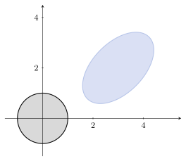
</figure>
:::
:::
:::

<div style="margin-top:1em;"></div>


### Conjuntos convexos notables

Vamos a describir algunos conjuntos convexos importantes. Pero primero veamos algunos ejemplos sencillos y analicemos si, además de ser convexos, son conjuntos afines y/o conos. 


::: {.callout .question}
<span style="font-size: 1.3em;">✍️</span><br>
<style>
  table {
    border-collapse: collapse;
    width: 100%;
    text-align: center;
  }

  th, td {
    padding: 8px;
  }

  th {
    color: black;
  }

  tr {
    border-bottom: 1px solid lightgray;
  }

  td:first-child, th:first-child {
    white-space: nowrap;
    text-align: center;
  }
</style>

<table>
  <thead>
    <tr>
      <th>Conjunto</th>
      <th>¿Es afín?</th>
      <th>¿Es cono?</th>
    </tr>
  </thead>
  <tbody>
    <tr>
      <td>$\emptyset$</td>
      <td><input type="checkbox" name="afin1" /></td>
      <td><input type="checkbox" name="cono1" /></td>
    </tr>
    <tr>
      <td>$\RR^p$</td>
      <td><input type="checkbox" name="afin2" /></td>
      <td><input type="checkbox" name="cono2" /></td>
    </tr>
    <tr>
      <td>$\{\bfzero\}$</td>
      <td><input type="checkbox" name="afin3" /></td>
      <td><input type="checkbox" name="cono3" /></td>
    </tr>
    <tr>
      <td>Conjunto unitario $\{\xx_0\}$ con $\xx_0\neq\mathbf{0}$</td>
      <td><input type="checkbox" name="afin4" /></td>
      <td><input type="checkbox" name="cono4" /></td>
    </tr>
    <tr>
      <td>Segmento de recta</td>
      <td><input type="checkbox" name="afin5" /></td>
      <td><input type="checkbox" name="cono5" /></td>
    </tr>
    <tr>
      <td>Recta $\{\theta\vv\mid\vv\neq\bfzero,\;\theta\in\RR\}$</td>
      <td><input type="checkbox" name="afin6" /></td>
      <td><input type="checkbox" name="cono6" /></td>
    </tr>
    <tr>
      <td>Recta $\{\xx_0+\theta\vv\mid\vv\neq\bfzero,\;\xx_0\neq\bfzero,\;\theta\in\RR\}$</td>
      <td><input type="checkbox" name="afin7" /></td>
      <td><input type="checkbox" name="cono7" /></td>
    </tr>
    <tr>
      <td>Rayo $\{\theta\vv\mid\vv\neq\bfzero,\;\theta\in\RR_0^+\}$</td>
      <td><input type="checkbox" name="afin9" /></td>
      <td><input type="checkbox" name="cono9" /></td>
    </tr>
    <tr>
      <td>Rayo $\{\xx_0+\theta\vv\mid\xx_0,\vv\neq\bfzero,\;\xx_0\neq\bfzero,\;\theta\in\RR_0^+\}$</td>
      <td><input type="checkbox" name="afin10" /></td>
      <td><input type="checkbox" name="cono10" /></td>
    </tr>
    <tr>
      <td>Subespacio</td>
      <td><input type="checkbox" name="afin11" /></td>
      <td><input type="checkbox" name="cono11" /></td>
    </tr>
  </tbody>
</table>

:::

<div style="margin-top:1.5em;"></div>


<div class="alert alert-light text-dark" role="important">
<span class="badge bg-success text-light">Hiperplanos y semiespacios</span>

Un *hiperplano* en $\RR^p$ es un conjunto de la forma
$$
\{\xx \mid \bfa^\top \xx=b\},\qquad \bfa\in\RR^p,\;\bfa\neq\bfzero,\;b\in\RR.
$$

<figure style="text-align: center;">
  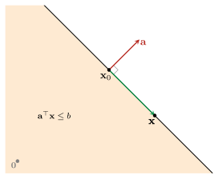
  <figcaption>**Figura 1.2.7:** Hiperplano con vector normal $\bfa$.</figcaption>
</figure>

<div style="margin-top:1em;"></div>

Algunas características son:

- El vector $\bfa$ es *normal* al hiperplano. Dado un punto $\xx_0$ del hiperplano, se verifica $\bfa^\top (\xx-\xx_0)=0$ para cualquier otro punto $\xx$ del hiperplano.

- El escalar $b$ determina el desplazamiento del hiperplano respecto del origen. De hecho, probaremos más adelante que la distancia del hiperplano al origen es $b/\|\bfa\|_2$.

- Un hiperplano divide a $\RR^p$ en dos *semiespacios*. Un semiespacio cerrado es un conjunto de la forma
  $$
  \{\xx \mid \bfa^\top \xx\leq b\},\qquad \bfa\in\RR^p,\;\bfa\neq\bfzero,\;b\in\RR.
  $$


<div style="margin-top:2em;"></div>

::: {.callout .question}
<span style="font-size: 1.3em;">✍️</span><br>
<div style="margin-top:-0.1em;"></div>

- ¿Qué es un hiperplano en $\RR^2$ y $\RR^3$? Proponga ejemplos.
- Un hiperplano es un conjunto afín. ¿Por qué?

:::
</div>


<div class="alert alert-light text-dark" role="important">
<span class="badge bg-success text-light">Bolas</span>

Una *bola cerrada* en $\RR^p$ es un conjunto de la forma
$$
\bar{B}(\xx_0,r):=\{\xx \mid \|\xx-\xx_0\|_2\leq r\}.
$$

Observar que, si la desigualdad es estricta, se obtiene la bola abierta $B(\xx_0,r)$.

::: {.callout .question}
<span style="font-size: 1.3em;">✍️</span><br>
Verifique que toda bola en $\RR^p$, abierta o cerrada, es un conjunto convexo.
:::

</div>


<div class="alert alert-light text-dark" role="important">
<span class="badge bg-success text-light">Poliedros</span>

Un *poliedro* en $\RR^p$ es el conjunto solución de un número finito de igualdades y desigualdades lineales. Es decir, es de la forma
$$
\mathcal{P}:=\{\xx \mid A\xx\preceq\bb,\; C\xx=\dd\},\qquad A\in\RR^{r\times p},\;C\in\RR^{m\times p},\; \bb\in\RR^r,\;\dd\in\RR^m.
$$


Las igualdades y desigualdades son de la forma $\bfa_i^\top\xx\leq b_i$ y $\cc_j^\top\xx=d_j$, respectivamente. La razón por la cual un poliedro es un conjunto convexo es la siguiente:

:::{.myhighlight}
Un poliedro es la intersección de un número finito de semiespacios e hiperplanos.
:::

<div style="margin-top:2em;"></div>

<figure style="text-align: center;">
  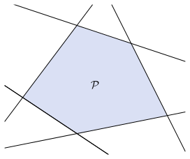
  <figcaption>**Figura 1.2.8:** Un poliedro generado por la intersección de 5 semiespacios.</figcaption>
</figure>

</div>


<div style="margin-top:2em;"></div>


::: {.callout-example}
<span class="badge bg-primary">Ejemplo 1.2.10</span> 
<span style="color: #0d6efd; font-family: Arial; font-weight: bold; font-size: 0.85em;">
  Símplex
</span>

El *$p$-símplex estándar* en $\RR^{p}$ es el conjunto
$$
\Delta^{p-1}:=\left\{\xx\in\RR^p \left|\;\sum_{i=1}^p x_i=1,\; x_i\geq 0\, (\forall i=1,\ldots,p)\right.\right\}.
$$

Es un poliedro, ya que puede expresarse como la intersección del hiperplano definido por 
$\sum_{i=1}^p x_i=1$ y los $p$ semiespacios definidos por $x_i\geq 0$, con $i=1,\ldots,p$.

<figure style="text-align: center;">
  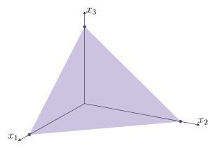
  <figcaption>**Figura 1.2.9:** $\Delta^2$ es el triángulo en $\RR^3$ de vértices $(1,0,0)$, $(0,1,0)$ y $(0,0,1)$.</figcaption>
</figure>

:::

<div style="margin-top:1.5em;"></div>


### Conos normales

En muchos problemas de optimización, especialmente aquellos en los que las soluciones están restringidas a un conjunto convexo, es esencial entender cómo se comportan las direcciones &laquo;externas&raquo; al conjunto en torno a un punto dado. El cono normal es una herramienta geométrica fundamental para describir esas direcciones. Nos permitirá luego expresar condiciones que caracterizan soluciones óptimas a partir de información local del conjunto factible.

<div style="margin-top:1em;"></div>


::: {.definicion}
**Definición 1.2.11** (Cono normal). Sean $\Omega\subset\RR^p$ un conjunto convexo y $\xx_0\in\Omega$. El *cono normal de $\Omega$ en $\xx_0$* se define como
$$
N_{\Omega}(\xx_0) := \{\dd\in\RR^p \mid \langle\dd,\xx-\xx_0\rangle_2\leq 0,\;\forall\xx\in\Omega\}.
$$
:::

<div style="margin-top:1em;"></div>


Si bien la expresión $\langle \dd,\xx-\xx_0 \rangle_2$ puede escribirse como $\dd^\top(\xx-\xx_0)$, la notación con producto interno permite una rápida interpretación de este concepto. Si usamos la relación $\langle\uu,\vv\rangle_2 =\|\uu\|_2\|\vv\|_2\cos \alpha$, donde $\alpha$ es el ángulo entre $\uu$ y $\vv$, podemos decir que $\dd\in N_{\Omega}(\xx_0)$ si
$$
\|\dd\|_2\|\xx-\xx_0\|_2\cos \alpha \leq 0,
$$
con $\alpha$ el ángulo entre los vectores $\dd$ y $\xx-\xx_0$. Esto es cierto si $\frac{\pi}{2}\leq \alpha\leq\pi$ (ver Figura 1.2.10).

<div style="margin-top:1.5em;"></div>

<figure style="text-align: center;">
  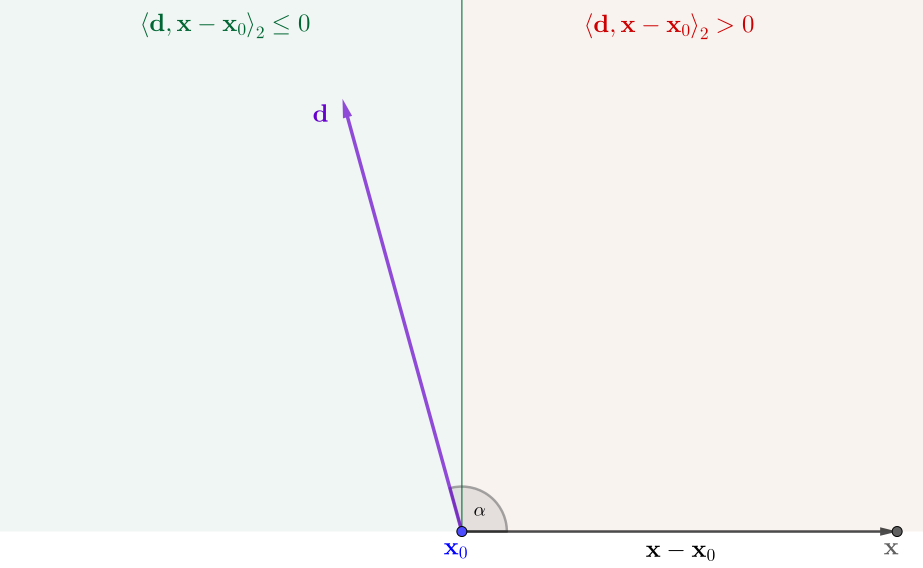
  <figcaption> **Figura 1.2.10:** Interpretación geométrica de las direcciones $\dd$ y $\xx-\xx_0$. </figcaption>
</figure>

<div style="margin-top:2em;"></div>

En base a lo descrito, podemos afirmar que:

:::{.myhighlight}
El cono normal consta de aquellas direcciones que forman un ángulo obtuso o recto con todas las direcciones $\xx-\xx_0$, junto con la dirección nula $\dd=\bfzero$.
:::

<div style="margin-top:2em;"></div>

Para entender esta definición, vamos a ver algunos ejemplos.

<div style="margin-top:1em;"></div>

::: {.callout-example}

<span class="badge bg-primary">Ejemplo 1.2.12</span>
<span style="color: #0d6efd; font-family: Arial; font-weight: bold; font-size: 0.85em;">
  Cono normal en un punto interior
</span>

Si $\xx_0$ es un punto interior de $\Omega$, el cono normal contiene únicamente el vector cero:  
$$
N_{\Omega}(\xx_0) = \{\mathbf{0}\}.
$$

Esto se debe a que $\xx-\xx_0$ puede ser cualquier dirección y, en consecuencia, no es posible que $\dd\neq\bfzero$ forme un ángulo obtuso o recto con todas las direcciones $\xx-\xx_0$. En efecto, si $\dd\neq\mathbf{0}$, podemos tomar un $\delta>0$ lo suficientemente pequeño para que $\xx=\xx_0+\delta\dd\in\Omega$, tal que
$$
\langle \dd,\xx-\xx_0\rangle_2=\langle\dd,\delta\dd\rangle_2=\delta\|\dd\|_2^2\geq 0.
$$

:::


::: {.callout-example}

<span class="badge bg-primary">Ejemplo 1.2.13</span>
<span style="color: #0d6efd; font-family: Arial; font-weight: bold; font-size: 0.85em;">
  Cono normal en un punto de un hiperplano
</span>

::: {.columns}

::: {.column width="65%"}
Sea $\bfa\in\RR^p$, $\bfa\neq\mathbf{0}$, y $b\in\RR$. Consideramos
$$
\Omega:=\{\xx\in\RR^p \mid \bfa^\top\xx=b\}.
$$

El cono normal en un punto $\xx_0\in\Omega$ es la recta con dirección $\bfa$. Esto es,
$$
N_{\Omega}(\xx_0)=\{\lambda\bfa \mid \lambda\in\RR\}.
$$

:::

::: {.column width="5%"}
:::

::: {.column width="30%"}
<div style="margin-top:-1em;"></div>

<figure style="text-align: center;">
  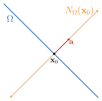
</figure>
:::
:::
:::


::: {.callout-example}

<span class="badge bg-primary">Ejemplo 1.2.14</span>
<span style="color: #0d6efd; font-family: Arial; font-weight: bold; font-size: 0.85em;">
  Cono normal en un punto de un semiespacio
</span>

::: {.columns}

::: {.column width="65%"}
Sean $\bfa\in\RR^p$, $\bfa\neq\mathbf{0}$, y $b\in\RR$. Consideramos
$$
\Omega:=\{\xx\in\RR^p \mid \bfa^\top\xx\leq b\}.
$$

- Si $\xx_0$ está en el interior de $\Omega$, el cono normal es $N_{\Omega}(\xx_0)=\{\mathbf{0}\}$. 

- Si $\xx_0$ está en la frontera de $\Omega$, resulta
$$
N_{\Omega}(\xx_0)=\{\lambda\bfa \mid \lambda\in\RR_0^+\}.
$$

:::

::: {.column width="5%"}
:::

::: {.column width="30%"}

<div style="margin-top:-1em;"></div>

<figure style="text-align: center;">
  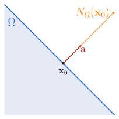
</figure>
:::
:::

<div style="margin-top:-1em;"></div>

La diferencia con el ejemplo anterior radica en que ahora el cono normal es una semirrecta.

:::


::: {.callout-example}

<span class="badge bg-primary">Ejemplo 1.2.15</span>
<span style="color: #0d6efd; font-family: Arial; font-weight: bold; font-size: 0.85em;">
  Cono normal en un punto de la intersección de dos semiespacios
</span>

::: {.columns}

::: {.column width="65%"}
Sean $\bfa_1,\bfa_2\in\RR^p$ no nulos, y $b_1,b_2\in\RR$. Consideramos 
$$
\Omega:=\{\xx\in\RR^p \mid \bfa_1^\top\xx\leq b_1\quad\text{y}\quad\bfa_2^\top\xx\leq b_2\}.
$$

- Si $\xx_0$ está en el interior de $\Omega$ o en la frontera de solo uno de los semiespacios, el cono normal resulta del ejemplo anterior.

- Si $\xx_0$ está en la intersección de ambas fronteras, el cono normal es la envolvente cónica de las direcciones $\bfa_1$ y $\bfa_2$. Esto es
$$
N_{\Omega}(\xx_0)=\{\lambda_1\bfa_1+\lambda_2\bfa_2 \mid \lambda_1,\lambda_2\in\RR_0^+\}.
$$
:::

::: {.column width="5%"}
:::

::: {.column width="30%"}

<figure style="text-align: center;">
  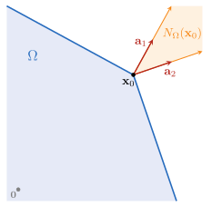
</figure>
:::
:::


Probaremos este resultado, generalizado a $r$ semiespacios, en [C1-S4](A4_condiciones_optimalidad.html#condiciones-de-karush-kuhn-tucker-kkt).

:::

<div style="margin-top:1.5em;"></div>


## II <span style="color:#CCCCCC;">│</span> Funciones convexas

::: {.definicion}
**Definición 1.2.16** (Función convexa). Una función $f:\RR^p\rightarrow\RR$ es *convexa* si $\dom f$ es un conjunto convexo y si verifica
$$
f(\theta \xx_1 + (1 - \theta)\xx_2) \leq \theta f(\xx_1) + (1 - \theta)f(\xx_2)\qquad\forall\xx_1,\xx_2\in\dom f,\; \forall\theta\in[0,1].
\tag{1.2.3}
$$

Si la desigualdad es estricta para $\xx_1\neq \xx_2$ y $0<\theta<1$, se dice que $f$ es *estrictamente convexa*. Además, se dice que $f$ es *cóncava* (o *estrictamente cóncava*) si $-f$ es convexa (o estrictamente convexa).
:::


<details>
<summary><span style="color:#0056b3;">ℹ Ver más información</span></summary>

::: {.panel-tabset}

### <span style="font-size: 1.25em;">&#x2460;</span>

Una función afín verifica la igualdad en la definición, por lo que todas las funciones afines (y, por lo tanto, también las lineales) son tanto convexas como cóncavas. Recíprocamente, una función que es tanto convexa como cóncava es siempre una función afín.

### <span style="font-size: 1.25em;">&#x2461;</span>

Una función es convexa si y solo si, para todo $\xx\in\dom f$ y $\vv\in\RR^p$, la restricción $g(t)=f(\xx+t\vv)$ es convexa en su dominio $\{t \mid \xx+t\vv\in\dom f\}$.

### <span style="font-size: 1.25em;">&#x2462;</span>

La desigualdad (1.2.3) se puede extender a combinaciones convexas. Es decir, si $f$ es convexa, se cumple
$$
f\Big(\sum_{i=1}^k\theta_i\xx_i\Big)\leq\sum_{i=1}^k\theta_i f(\xx_i),\qquad\sum_{i=1}^k\theta_i=1,\;\theta_i\geq 0.
$$

Esta es la versión discreta de la *desigualdad de Jensen* (✏16).

:::
</details>

<figure style="text-align: center;">
  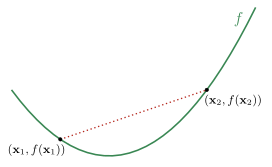
  <figcaption>**Figura 1.2.11:** Grafo de una función convexa. La desigualdad (1.2.3) significa que el segmento de recta entre los puntos $(\xx_1, f(\xx_1))$ y $(\xx_2, f(\xx_2))$ se encuentra por encima de la gráfica de $f$. </figcaption>
</figure>

<div style="margin-top:2em;"></div>


::: {.callout-example}

<span class="badge bg-primary">Ejemplo 1.2.17</span>
<span style="color: #0d6efd; font-family: Arial; font-weight: bold; font-size: 0.85em;">
  Función cuadrática de una variable
</span>

Vamos a probar la convexidad de la función $f(x)=x^2$. Para $\theta\in[0,1]$ resulta
$$
\begin{align}
f(\theta x_1+(1-\theta)x_2)&=(\theta x_1+(1-\theta)x_2)^2\\[1 pt]
&=\theta^2x_1^2+2\theta(1-\theta)x_1x_2+(1-\theta)^2x_2^2.
\end{align}
$$

Entonces
$$
\begin{align}
f(\theta x_1+(1-\theta)x_2)-\left[\theta f(x_1)+(1-\theta) f(x_2)\right]&=(\theta^2-\theta)x_1^2+2\theta(1-\theta)x_1x_2+(\theta^2-\theta)x_2^2\\
&=-\theta(1-\theta)(x_1^2-2x_1x_2+x_2^2)\\
&=-\theta(1-\theta)(x_1-x_2)^2\\
&\leq 0,
\end{align}
$$

lo cual concluye la prueba.

:::

<div style="margin-top:2em;"></div>


La relación entre conjuntos convexos y funciones convexas es a través del epígrafo: el *epígrafo* de una función $f:\RR^p\to\RR$ se define como
$$
\epi f := \{(\xx, t) \mid \xx \in \dom f, f(\xx) \leq t\}.
$$

<figure style="text-align: center;">
  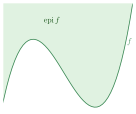
  <figcaption>**Figura 1.2.12:** Epígrafo de una función $f$.</figcaption>
</figure>


Es fácil probar (✏12) que:

:::{.myhighlight}
Una función es convexa si y solo si su epígrafo es un conjunto convexo.
:::

<div style="margin-top:2em;"></div>

De manera análoga, una función es cóncava si y solo si su *hipógrafo* es un conjunto convexo, el cual se define como
$$
\hypo f := \{(\xx, t) \mid t \leq f(\xx)\},
$$
es un conjunto convexo.

<div style="margin-top:1.5em;"></div>


### Condiciones de convexidad

Probar que una función es convexa utilizando la Definición 1.2.16 puede ser tedioso. Afortunadamente, existen criterios basados en sus derivadas. Estos permiten caracterizar la convexidad en términos del comportamiento local de la función, ya sea a través del gradiente (primera derivada) o de la matriz Hessiana (segunda derivada). Primero, recordemos que:

- El *vector gradiente* $\nabla f:\RR^p\to\RR^p$ se define como
$$
\nabla f(\xx):=\left(\frac{\partial f}{\partial x_1}(\xx),\ldots,\frac{\partial f}{\partial x_p}(\xx_0\right).
$$

- La *matriz Hessiana* $\nabla^2 f:\RR^p\to\RR^{p\times p}$ se define como
$$
\nabla^2 f(\xx):=\begin{pmatrix}
\displaystyle \frac{\partial^2 f}{\partial x_1^2}(\xx) & \displaystyle \frac{\partial^2 f}{\partial x_1 \partial x_2}(\xx) & \ldots & \displaystyle \frac{\partial^2 f}{\partial x_1 \partial x_p}(\xx) \\
\displaystyle \frac{\partial^2 f}{\partial x_2 \partial x_1}(\xx) & \displaystyle \frac{\partial^2 f}{\partial x_2^2}(\xx) & \ldots & \displaystyle \frac{\partial^2 f}{\partial x_2 \partial x_p}(\xx) \\
\vdots & \vdots & \ddots & \vdots \\
\displaystyle \frac{\partial^2 f}{\partial x_p \partial x_1}(\xx) & \displaystyle \frac{\partial^2 f}{\partial x_p \partial x_2}(\xx) & \ldots & \displaystyle \frac{\partial^2 f}{\partial x_p^2}(\xx)
\end{pmatrix}.
$$

<div style="margin-top:1.5em;"></div>


<div class="alert alert-light text-dark" role="important">
<span class="badge bg-warning text-dark">Importante</span>

Diremos que $f:\RR^p\to\RR$ es *diferenciable* si su gradiente $\nabla f$ existe en todo su dominio, y que es *dos veces diferenciable* si además su Hessiana $\nabla^2 f$ existe en todo su dominio. En ambos casos, asumimos que dicho dominio es un conjunto abierto.

</div>


Cuando una función $f:\RR^p\to\RR$ es dos veces diferenciable, la expansión de Taylor nos permite escribir, para $\dd\in\RR^p$, la aproximación

$$
f(\xx+\dd)\approx f(\xx)+\nabla f(\xx)^\top\dd+\frac{1}{2}\dd^\top \nabla^2 f(\xx)\,\dd.
$$

Esta expansión muestra cómo el valor de la función en un punto cercano puede aproximarse mediante el gradiente y la Hessiana, lo que proporciona la base para analizar propiedades locales de la función. A continuación presentaremos, en primer lugar, un lema con propiedades de funciones convexas de una variable, y luego los teoremas que establecen las condiciones de convexidad de primer y segundo orden, basadas en el gradiente y en la matriz Hessiana, respectivamente.

<div style="margin-top:1em;"></div>


::: {.teorema}
**Lema 1.2.18** (Convexidad en una variable). Sea $\varphi:[a,b]\to\RR$ una función convexa. Se verifican las siguientes propiedades:

1. Para $a\leq t_1<t_2<t_3\leq b$, se cumple
    $$
    \frac{\varphi(t_2)-\varphi(t_1)}{t_2-t_1}
    \leq
    \frac{\varphi(t_3)-\varphi(t_1)}{t_3-t_1}
    \leq
    \frac{\varphi(t_3)-\varphi(t_2)}{t_3-t_2}.
    $$
    Es decir, las pendientes de las rectas secantes son no decrecientes.

2. El límite
    $$
    \varphi'_+(t_0)=\lim_{h\to 0^+}\frac{\varphi(t_0+h)-\varphi(t_0)}{h}
    $$
    existe (posiblemente $-\infty$) en todo $t_0$. Además,
    $$
    \varphi(t)\ \ge\ \varphi(t_0)+(t-t_0)\,\varphi'_+(t_0)\qquad \forall t\ge t_0.
    $$

3. Si $\varphi$ es diferenciable en $t_0$, entonces
    $$
    \varphi(t)\ \ge\ \varphi(t_0)+(t-t_0)\,\varphi'(t_0)\qquad \forall t\ge t_0.
    $$

4. Si $\varphi$ es dos veces diferenciable en $(a,b)$, entonces
    $$
    \varphi''(t)\geq 0\qquad\forall t\in(a,b).
    $$

:::


<details>
<summary><span style="color:#0056b3;">ℹ Ver más información</span></summary>

::: {.panel-tabset}

### <span style="border: 1px solid #ddd; padding: 2px 6px; border-radius: 4px;">*Demostración de 1*</span>

Fijemos $a\leq t_1<t_2<t_3\leq b$. Como $\varphi$ es convexa, utilizaremos (1.2.3) para $t_1$ y $t_3$ con
$$
\theta=\frac{t_3-t_2}{t_3-t_1}\in[0,1].
$$

Dado que 
$$
\frac{t_3-t_2}{t_3-t_1}t_1+\frac{t_2-t_1}{t_3-t_1}t_3=\frac{t_2(t_3-t_1)}{t_3-t_1}=t_2,
$$

resulta
$$
\varphi(t_2)\le \frac{t_3-t_2}{t_3-t_1}\,\varphi(t_1)+\frac{t_2-t_1}{t_3-t_1}\,\varphi(t_3).
$$

Reordenando:
$$
\begin{align}
\varphi(t_2)-\varphi(t_1)&\leq\frac{t_1-t_2}{t_3-t_1}\varphi(t_1)+\frac{t_2-t_1}{t_3-t_1}\,\varphi(t_3)\\
\varphi(t_2)-\varphi(t_1) &\leq \frac{t_2-t_1}{t_3-t_1}(\varphi(t_3)-\varphi(t_1)) \\
\frac{\varphi(t_2)-\varphi(t_1)}{t_2-t_1} &\leq \frac{\varphi(t_3)-\varphi(t_1)}{t_3-t_1}.
\end{align}
$$

De manera simétrica se obtiene la otra desigualdad. 
<div style="margin-top:-1em;"></div>
<div style="text-align: right;">$\blacksquare$</div>


### <span style="border: 1px solid #ddd; padding: 2px 6px; border-radius: 4px;">*Demostración de 2 y 3*</span>

Dado que $\varphi_+'(t_0)$ es un límite de pendientes de rectas secantes y que, de 1, dichas pendientes son monótononas, podemos afirmar que dicho límite o bien existe o bien es $-\infty$. De hecho, podemos escribir
$$
\frac{\varphi(t)-\varphi(t_0)}{t-t_0}\ \ge\ \varphi'_+(t_0)\qquad\forall t>t_0,
$$

lo cual es equivalente a
$$
\varphi(t)\ge \varphi(t_0)+(t-t_0)\varphi'_+(t_0)\qquad\forall t\geq t_0.
$$

En caso de ser $\varphi$ diferenciable en $t_0$, $\varphi'(t_0)=\varphi_+'(t_0)$, de manera que la desigualdad anterior resulta en

$$
\varphi(t)\ge \varphi(t_0)+(t-t_0)\varphi'(t_0)\qquad\forall t\geq t_0.
$$

<div style="margin-top:-1em;"></div>
<div style="text-align: right;">$\blacksquare$</div>


### <span style="border: 1px solid #ddd; padding: 2px 6px; border-radius: 4px;">*Demostración de 4*</span>

Sea $\varphi$ es dos veces diferenciable en $(a,b)$. Para $t_0$ fijo, consideremos la función $g:\RR\to\RR$ definida por
$$
g(h):=\frac{\varphi(t_0-h)-2\varphi(t_0)+\varphi(t_0+h)}{h^2}.
$$

La convexidad de $\varphi$ implica $g(h)\ge 0$ para todo $h>0$. En efecto, la no negatividad del numerador resulta de aplicar la desigualdad de Jensen a $\xx_1=t_0-h$, $\xx_2=t_0$ y $\xx_3=t_0+h$ con $\theta_1=\theta_2=\theta_3=1/3$:
$$
\begin{align}
\varphi(t_0)&\leq\frac{1}{3}\left(\varphi(t_0-h)+\varphi(t_0)+\varphi(t_0+h)\right)\\
0&\leq \varphi(t_0-h)+\varphi(t_0)+\varphi(t_0+h)-3\varphi(t_0) \\[2 pt]
0&\leq \varphi(t_0-h)-2\varphi(t_0)+\varphi(t_0+h).
\end{align}
$$

Utilizando el desarrollo de Taylor de $\varphi$ alrededor de $t_0$, es fácil ver que
	$g(h)\to \varphi''(t_0)$ cuando $h\to 0$. Luego, debe ser $\varphi''(t_0)\ge 0$.

<div style="margin-top:-1em;"></div>
<div style="text-align: right;">$\blacksquare$</div>

:::
</details>


<div style="margin-top:2em;"></div>

::: {.teorema}
**Teorema 1.2.19** (Condición de primer orden para convexidad).
Sea $f:\RR^p\to\RR$ una función diferenciable. $f$ es convexa si y solo si $\dom f$ es convexo y 
$$
f(\xx_2)\geq f(\xx_1)+\langle\nabla f(\xx_1),\xx_2-\xx_1\rangle_2\qquad\forall\xx_1,\xx_2\in\dom f.
\tag{1.2.4}
$$
:::


<details>
<summary><span style="color:#0056b3;">ℹ Ver más información</span></summary>

::: {.panel-tabset}

### <span style="font-size: 1.25em;">&#x2460;</span>

La convexidad estricta también puede caracterizarse por una condición de primer orden: $f$ es estrictamente convexa si y solo si $\dom f$ es convexo y
$$
f(\xx_2) > f(\xx_1) + \langle \nabla f(\xx_1), \xx_2 - \xx_1 \rangle_2\qquad\forall\xx_1,\xx_2\in\dom f,\;\xx_1\neq\xx_2.
$$

### <span style="font-size: 1.25em;">&#x2461;</span>

Para funciones cóncavas, tenemos la caracterización correspondiente: $f$ es cóncava si y solo si $\dom f$ es convexo y
$$
f(\xx_2) \leq f(\xx_1) + \langle \nabla f(\xx_1), \xx_2 - \xx_1 \rangle_2\qquad\forall\xx_1,\xx_2\in\dom f.
$$

### <span style="border: 1px solid #ddd; padding: 2px 6px; border-radius: 4px;">*Demostración*</span>

($\Rightarrow$) Supongamos que $f$ es convexa, fijemos $\xx_1,\xx_2 \in \dom f$ y definamos $\varphi:\RR\to\RR$ como
$$
\varphi(t) := f(\xx_1 + t(\xx_2-\xx_1)), \qquad t\in[0,1].
$$

Para $t_1,t_2\in[0,1]$ y $\theta\in[0,1]$, tenemos que
$$
\varphi(\theta t_1+(1-\theta)t_2) 
= f\big(\xx_1 + (\theta t_1+(1-\theta)t_2)(\xx_2-\xx_1)\big).
\tag{1.2.5}
$$

En el lado derecho, notemos que
$$
\xx_1 + (\theta t_1+(1-\theta)t_2)(\xx_2-\xx_1) 
= \theta\big(\underbrace{\xx_1+t_1(\xx_2-\xx_1)}_{\yy_1}\big) + (1-\theta)\big(\underbrace{\xx_1+t_2(\xx_2-\xx_1)}_{\yy_2}\big).
$$

Denotando $\yy_i=\xx_1+t_i(\xx_2-\xx_1)$, tal que $f(\yy_i)=\varphi(t_i)$, vamos a reescribir (1.2.5) para poder utilizar la convexidad de $f$:
$$
\begin{align}
\varphi(\theta t_1+(1-\theta)t_2) &= f\big(\theta \yy_1+(1-\theta)\yy_2\big) \\
&\leq \theta f(\yy_1)+(1-\theta)f(\yy_2)\\[2 pt]
&= \theta \varphi(t_1)+(1-\theta)\varphi(t_2).
\end{align}
$$

Esto prueba que $\varphi$ es convexa en $[0,1]$. Además, la diferenciabilidad de $f$ implica que $\varphi$ es diferenciable y
$$
\varphi'(t)=\langle\nabla f(\xx_1+t(\xx_2-\xx_1)), \xx_2-\xx_1\rangle_2.
$$

Podemos aplicar el Lema 1.2.18 con $t=1$ y $t_0=0$; resulta
$$
\begin{align}
\varphi(1)&\geq\varphi(0)+\varphi'(0) \\
f(\xx_2)&\geq f(\xx_1) + \langle\nabla f(\xx_1), \xx_2-\xx_1\rangle_2.
\end{align}
$$

<div style="margin-top:1em;"></div>

($\Leftarrow$) Supongamos que es cierta la desigualdad (1.2.4) del enunciado y probemos que $f$ es convexa. Sean $\xx_1,\xx_2\in\dom f$ y $\theta\in[0,1]$, definamos
$$
\xx_\theta := \theta\xx_1+(1-\theta)\xx_2.
$$
	
Podemos escribir
$$
f(\xx_i)\geq f(\xx_\theta)+\langle\nabla f(\xx_\theta),\,\xx_i-\xx_\theta\rangle_2,\qquad i=1,2.
$$

Por lo tanto,
$$
\begin{align}
\theta f(\xx_1)+(1-\theta) f(\xx_2)&\geq 
		\theta\Big(f(\xx_\theta)+\langle\nabla f(\xx_\theta),\,\xx_1-\xx_\theta\rangle_2\Big)
		+(1-\theta)\Big(f(\xx_\theta)+\langle\nabla f(\xx_\theta),\,\xx_2-\xx_\theta\rangle_2\Big) \\
		&= f(\xx_\theta)+\langle\nabla f(\xx_\theta),\theta(\xx_1-\xx_\theta)+(1-\theta) (\xx_2-\xx_\theta)\rangle_2\\[2pt]
		&=f(\xx_\theta)+\langle\nabla f(\xx_\theta),\underbrace{\theta\xx_1+(1-\theta)\xx_2}_{\xx_\theta}-\xx_\theta\rangle_2\\[-10pt]
		&=f(\xx_\theta).
\end{align}
$$

Al reemplazar $\xx_\theta$ por su expresión, obtenemos finalmente la desigualdad (1.2.3) y concluimos que $f$ es convexa.

<div style="margin-top:-1em;"></div>
<div style="text-align: right;">$\blacksquare$</div>


:::
</details>

<div style="margin-top:1em;"></div>

La función afín de $\xx_2$, definida por $f(\xx_1) + \langle \nabla f(\xx_1), \xx_2 - \xx_1 \rangle_2$, es la aproximación lineal de $f$ cerca de $\xx_1$. En consecuencia, la desigualdad del teorema implica que la aproximación lineal de $f$ en $\xx_1$ es un *subestimador global* de $f$.

<figure style="text-align: center;">
  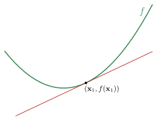
  <figcaption>**Figura 1.2.13:** Grafo de una función convexa $f$ y su aproximación lineal en $\xx_1$.</figcaption>
</figure>


<div style="margin-top:2em;"></div>

Una consecuencia importante del Teorema 1.2.19 es la siguiente: si $f$ es convexa y para algún $\xx_0\in\dom f$ se verifica $\nabla f(\xx_0) =\bfzero$, entonces $f(\xx) \geq f(\xx_0)$ para todo $\xx \in \dom f$. De inmediato podemos afirmar que:

:::{.myhighlight}
Si $f$ es una función convexa, cuyo $\dom f$ es un conjunto abierto, entonces:

<div style="text-align:center;">
$\xx^\star$ es minímo global de $f$ si y solo si $\nabla f(\xx^\star)=\bfzero$.
</div>

:::

<div style="margin-top:2em;"></div>


::: {.teorema}
**Teorema 1.2.20** (Condición de segundo orden para convexidad). 
Sea $f:\RR^p\to\RR$ una función dos veces diferenciable. $f$ es convexa si y solo si $\dom f$ es convexo y 
$$
\nabla^2 f(\xx)\succeq 0\qquad\forall\xx\in\dom f.
$$

:::

<details>
<summary><span style="color:#0056b3;">ℹ Ver más información</span></summary>

::: {.panel-tabset}

### <span style="font-size: 1.25em;">&#x2460;</span>

Para funciones de una variable, la condición se reduce a $f''(x)\geq 0$, lo cual implica que la derivada $f'(x)$ es no decreciente.

### <span style="font-size: 1.25em;">&#x2461;</span>

La convexidad estricta también puede caracterizarse por una condición de segundo orden, pero de manera parcial: si $\dom f$ es convexo y $\nabla^2 f\succ 0$ para todo $\xx\in\dom f$, entonces $f$ es estrictamente convexa. El recíproco no es cierto: por ejemplo, $f(x)=x^4$ es estrictamente convexa pero $f''(0)=0$.

### <span style="font-size: 1.25em;">&#x2462;</span>

Para funciones cóncavas, tenemos la caracterización correspondiente: $f$ es cóncava si y solo si $\dom f$ es convexo y $\nabla^2 f(\xx)\preceq 0$ para todo $\xx\in\dom f$.


### <span style="border: 1px solid #ddd; padding: 2px 6px; border-radius: 4px;">*Demostración*</span>

($\Rightarrow$) Para $\xx$ y $\dd$ arbitrarios, definimos $\psi:\RR\to\RR$ como
$$
\psi(t):=f(\xx+t\dd),
$$

con $\dom\psi=\{t\in\RR \mid \xx+t\dd\in\dom f\}$. Como $f$ es convexa y dos veces diferenciable, podemos afirmar que $\psi$ también lo es. Por lo tanto, el Lema 1.2.18 nos asegura que $\psi''(t)\geq 0$ para todo $t\in\dom\psi$. Derivando, obtenemos
$$
\psi'(t)=\nabla f(\xx+t\dd)^\top\dd,\qquad \psi''(t)=\dd^\top\nabla^2f(\xx+t\dd)\,\dd.
$$

En particular, para $t=0$, resulta $\dd^\top\nabla^2f(\xx)\,\dd\geq 0$. Como $\dd$ es arbitrario, esto implica $\nabla^2f(\xx)\succeq 0$ para todo $\xx\in\dom f$.

($\Leftarrow$) Sean $\xx_1,\xx_2\in\dom f$, consideremos $\xx=\xx_1$ y $\dd=\xx_2-\xx_1$. La fórmula de Taylor con resto integral para $\psi$ es
$$
\psi(t)=\psi(t_0)+\psi'(t_0)(t-t_0)+\int_{t_0}^t\psi''(t)(t-u)\,du.
$$

Aplicada a $t_0=0$ y $t=1$, resulta en
$$
f(\xx_2)=f(\xx_1)+\nabla f(\xx)^\top(\xx_2-\xx_1)+\int_0^1 (1-u)\, (\xx_2-\xx_1)^\top \nabla^2 f(\xx_1+t(\xx_2-\xx_1)) (\xx_2-\xx_1)\,du.
$$

Como, por hipótesis, la Hessiana $\nabla^2f$ es semidefinida positiva, el integrando es no negativo. En consecuencia,
$$
f(\xx_2)\geq f(\xx_1)+\nabla f(\xx_1)^\top(\xx_2-\xx_1),
$$
	
lo cual es la condición de primer orden del Teorema 1.2.19. Luego, concluimos que $f$ es convexa.

<div style="margin-top:-1em;"></div>
<div style="text-align: right;">$\blacksquare$</div>

:::
</details>


::: {.callout .question}
<span style="font-size: 1.3em;">✍️</span><br>
Analice la convexidad de las siguientes funciones:

- $f:\RR\to\RR: f(x)=e^{ax}$, con $a\in\RR$.

- $f:\RR^+\to\RR: f(x)=x^a$, con $a\in\RR$.

- $f:\RR^+\to\RR: f(x)=|x|^p$, con $p\geq 1$.

- $f:\RR^+\to\RR: f(x)=\log x$.

- $f:\RR^+\to\RR: f(x)=x\log x$.

:::

<div style="margin-top:2em;"></div>


::: {.callout-example}

<span class="badge bg-primary">Ejemplo 1.2.21</span> 
<span style="color: #0d6efd; font-family: Arial; font-weight: bold; font-size: 0.85em;">
  Función cuadrática de varias variables
</span>

Consideremos la función cuadrática $f:\RR^p\to\RR$ definida por

$$
f(\xx)=\frac{1}{2}\xx^\top A\xx+\bb^\top\xx+c,
$$

donde $A\in\bfS^p$, $\bb\in\RR^p$ y $c\in\RR$. Dado que $\nabla^2 f(\xx)=A$ para todo $\xx$, podemos afirmar que $f$ es convexa si y sólo si $A\succeq 0$. 

::: {.columns}

::: {.column width="65%"}
Así, por ejemplo, la función $f:\RR^2\to\RR$ definida por

$$
f(x,y)=\frac{1}{2}\begin{pmatrix}x&y\end{pmatrix}\begin{pmatrix}2&1\\1&3\end{pmatrix}\begin{pmatrix}x\\ y\end{pmatrix}=\frac{1}{2}(2x^2+2xy+3y^2)
$$

es convexa, ya que $A\succeq 0$. En efecto, para todo $\xx=(x,y)\in\RR^2$ se verifica
$$
\xx^\top A\xx=2x^2+2xy+3y^2=x^2+(x+y)^2+2y^2\geq 0.
$$
:::

::: {.column width="5%"}
:::

::: {.column width="30%"}

<figure style="text-align: center;">
  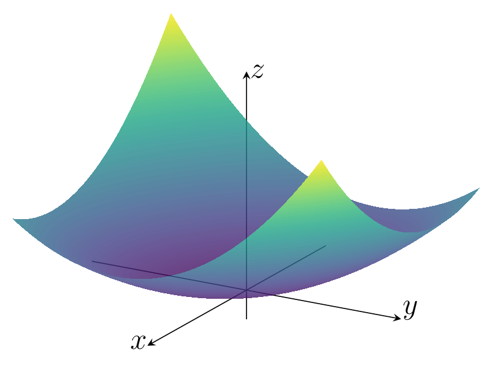
</figure>
:::
:::
:::


::: {.callout-example}

<span class="badge bg-primary">Ejemplo 1.2.22</span>
<span style="color: #0d6efd; font-family: Arial; font-weight: bold; font-size: 0.85em;">
Norma en $\RR^p$
</span>

Toda norma $\|\cdot\|$ en $\RR^p$ es una función convexa. En efecto, si $f(\xx)=\|\xx\|$, la desigualdad (1.2.3) de la definición de función convexa es inmediata de la desigualdad triangular:
$$
f(\theta\xx_1+(1-\theta)\xx_2)=\|\theta\xx_1+(1-\theta)\xx_2\|\leq\theta\|\xx_1\|+(1-\theta)\|\xx_2\|.
$$

A modo de ejemplo, veamos que efectivamente se cumplen las condiciones de convexidad para el caso particular de la norma euclídea $f(\xx)=\|\xx\|_2=(\xx^\top\xx)^{1/2}$. Resultan
$$
\nabla f(\xx)=\frac{\xx}{\|\xx\|_2}\qquad\mbox{y}\qquad\nabla^2 f(\xx)=\frac{I_p}{\|\xx\|_2}-\frac{\xx\xx^\top}{\|\xx\|_2^3}.
$$

- *Condición de primer orden*: Dados $\xx_1,\xx_2\in\dom f$, partimos de la desigualdad de Cauchy Schwarz $\langle \xx_1,\xx_2\rangle_2\leq \|\xx_1\|_2\|\xx_2\|_2$ para obtener
    $$
    \begin{align}
    \|\xx_2\|_2&\geq \frac{\langle\xx_1,\xx_2\rangle_2}{\|\xx_1\|_2} \\
			&=\|\xx_1\|_2+\frac{\langle\xx_1,\xx_2\rangle_2}{\|\xx_1\|_2}-\|\xx_1\|_2 \\
			&=\|\xx_1\|_2+\frac{\langle\xx_1,\xx_2\rangle_2-\langle\xx_1,\xx_1\rangle_2}{\|\xx_1\|_2}	\\
			&=\|\xx_1\|_2+\langle\frac{\xx_1}{\|\xx_1\|_2},\xx_2-\xx_1\rangle_2,
    \end{align}
    $$
    lo cual es justamente la condición de primer orden dada por la desigualdad (1.2.4).

- *Condición de segundo orden*: para todo $\xx\in\RR^p$ y $\vv\in\RR^p$ se tiene
    $$
    \begin{align}
    \vv^\top \nabla^2 f(\xx)\,\vv&=\vv^T\left(\frac{I_p}{\|\xx\|_2}-\frac{\xx\xx^\top}{\|\xx\|_2^3}\right)\vv\\
    &= \frac{\|\vv\|_2^2}{\|\xx\|_2}-\frac{(\vv^\top\xx)^2}{\|\xx\|_2^3}\\[4pt]
    &\geq \underbrace{\frac{\|\vv\|_2^2}{\|\xx\|_2}-\frac{\|\xx\|_2^2\|\vv\|_2^2}{\|\xx\|_2^3}}_{=0}
    \end{align}
    $$
    Por lo tanto, $\nabla^2 f(\xx)\succeq 0$, tal como esperábamos.
:::

<div style="margin-top:2em;"></div>


### Operaciones que preservan convexidad

A continuación presentamos algunas operaciones que preservan la convexidad o concavidad de funciones y que, por lo tanto, permiten construir nuevas funciones convexas y cóncavas. Las pruebas se proponen en las actividades conceptuales (✏17).

- **Sumas ponderadas no negativas**. Si $f$ es una función convexa y $\alpha \geq 0$, entonces la función $\alpha f$ es convexa. Si $f_1$ y $f_2$ son ambas funciones convexas, entonces $f_1 + f_2$ también lo es. Combinando estas dos propiedades, se deduce que el conjunto de funciones convexas es en sí mismo un cono convexo: una suma ponderada no negativa de funciones convexas,
$$
f = w_1 f_1 + \cdots + w_m f_m,\qquad w_i\geq 0,
$$
es convexa. De manera similar, una suma ponderada no negativa conserva la concavidad. 

- **Composición con una aplicación afín**. Sean $f:\RR^p\to\RR$, $A\in\RR^{p\times m}$ y $\bb\in\RR^p$. La función $g:\RR^m\to\RR$ definida por
$$
g(\xx)=f(A\xx+\bb),
$$
con $\dom g = \{\xx \mid A\xx + \bb \in\dom f\}$, conserva la convexidad o concavidad de $f$.

- **Máximo puntual**. Si $f_1$ y $f_2$ son funciones convexas, entonces su *máximo puntual*, definido por
$$
f(\xx) = \max\{f_1(\xx), f_2(\xx)\},
$$
con $\dom f = \dom f_1 \cap \dom f_2$, también es convexa. Este resultado se puede extender a un conjunto $\{f_1,\ldots,f_m\}$ de funciones convexas. De manera similar, el mínimo puntual de un conjunto de funciones cóncavas es una función concava.

- **Supremo puntual**. La propiedad del máximo puntual se extiende al *supremo puntual* sobre un conjunto infinito de funciones convexas. Si para $i\in\mathcal{A}$, donde $\mathcal{A}$ es un conjunto de índices, se tiene que $f_i(\xx)$ es convexa, entonces la función $f$ definida por
$$
f(\xx) = \sup_{i \in \mathcal{A}} f_i(\xx),
$$
con $\dom f = \{\xx \mid \xx \in \dom f_i\,(\forall i \in \mathcal{A}),\; \sup_{i \in \mathcal{A}} f_i(\xx) < \infty\}$, también es convexa. De manera similar, el ínfimo puntual de un conjunto de funciones cóncavas es una función cóncava. 

<div style="margin-top:2em;"></div>


::: {.callout-example}

<span class="badge bg-primary">Ejemplo 1.2.23</span>
<span style="color: #0d6efd; font-family: Arial; font-weight: bold; font-size: 0.85em;">
Suma de las mayores componentes de un vector
</span>

Para $\xx\in\RR^p$, se denota con $x_{[i]}$ su $i$-ésima componente de mayor valor. Es decir, podemos escribir
$$
x_{[1]}\geq x_{[2]}\geq\ldots\geq x_{[p]}.
$$

Para $r\leq n$, se define $f:\RR^p\to\RR$ como
$$
f(\xx)=\sum_{i=1}^rx_{[i]}.
$$

Esta función puede ser reescrita como
$$
f(\xx)=\max\left\{x_{i_1}+\cdots+x_{i_n} \mid 1\leq i_1 \leq \ldots\leq i_r\leq n \right\};
$$

esto es, el máximo de todas las posibles sumas de $r$ diferentes componentes de $\xx$. Dado que tales sumas son funciones lineales (y, por lo tanto, convexas), concluimos que $f$ es convexa.

:::


::: {.callout .question}

<span style="font-size: 1.3em;">✍️</span><br>
Verifique que las siguientes funciones son convexas:

- $f(\xx)=\alpha\,\|A\xx-\bb\|_2^2+\beta\,\|C\xx-\dd\|_1,\qquad \alpha,\beta\geq 0.$

- $f(\xx)=\displaystyle\sum_{i=1}^m w_i\,\bigl|\bfa_i^\top \xx+b_i\bigr|,\qquad w_i\geq 0.$

- $f(\xx)=\log\left(\displaystyle\sum_{i=1}^m \exp\big(\bfa_i^\top \xx + b_i\big)\right).$

:::

<div style="margin-top:2.5em;"></div>


## III <span style="color:#CCCCCC;">│</span> Problemas de optimización convexa

::: {.definicion}
**Definición 1.2.24** (Problema de optimización convexa). Un *problema de optimización convexa* es de la forma
$$ 
\begin{array}{ll} 
\text{minimizar } & f(\xx)\\ 
\text{sujeto a } & \xx\in\left\{\xx\in\RR^p\left|\;\begin{array}{ll}
g_i(\xx)\leq 0,& i=1,\ldots,r\\
\bfa_j^\top \xx-b_j=0, & j=1,\ldots,m
\end{array}\right.\right\},
\end{array}
\tag{1.2.6}
$$ 

donde la función objetivo $f$ y las funciones de restricción de desigualdad $g_1, \dots, g_r$ son convexas. 
:::

<div style="margin-top:2em;"></div>


:::{.myhighlight}
El conjunto factible $\Omega$ de un problema de optimización convexa es convexo.
:::

::: {.callout .question}

<span style="font-size: 1.3em;">✍️</span><br>
Justifique la afirmación anterior.

:::

<div style="margin-top:2em;"></div>


También nos referiremos a
$$ 
\begin{array}{ll} 
\text{maximizar } & f(\xx)\\ 
\text{sujeto a } & \xx\in\left\{\xx\in\RR^p\left|\;\begin{array}{ll}
g_i(\xx)\leq 0,& i=1,\ldots,r\\
\bfa_j^\top \xx-b_i=0, & j=1,\ldots,m
\end{array}\right.\right\}
\end{array}
\tag{1.2.7}
$$ 
como un problema de optimización convexa, cuando la función objetivo sea cóncava y las funciones de restricción de desigualdad $g_i$ sean convexas. De hecho, claramente el problema de maximización cóncava se resuelve minimizando la función convexa $-f$, razón por la cual todos los resultados y conclusiones que describiremos para el problema de minimización (1.2.6) se extienden al caso de maximización (1.2.7).

<div style="margin-top:2em;"></div>

::: {.callout-example}

<span class="badge bg-primary">Ejemplo 1.2.25</span>
<span style="color: #0d6efd; font-family: Arial; font-weight: bold; font-size: 0.85em;">
  Minimización de norma con restricción lineal
</span>

El problema
$$
\begin{array}{ll}
\text{minimizar } & \|\xx\|_2^2\\
\text{sujeto a }  & \bfone^\top\xx\geq 1
\end{array}
$$

es de optimización convexa. La función objetivo es una función convexa, como hemos visto en el Ejemplo 1.2.22, y la única función de restricción de desigualdad es 
$$
g(\xx)=-\bfone^\top\xx=-(x_1+\cdots+x_n),
$$
la cual es una función lineal y, por lo tanto, convexa.

:::

<div style="margin-top:2em;"></div>


Los problemas de optimización convexa tienen una propiedad fundamental que los caracteriza y que explica su gran importancia, la cual enunciaremos a continuación para concluir esta sección. Más adelante estudiaremos cómo la convexidad potencia las condiciones de optimalidad en un punto factible, facilitando su análisis y aplicación.


::: {.teorema}
**Teorema 1.2.26** (Optimalidad global de un mínimo local en problemas convexos). Si $\xx\in\Omega$ es un mínimo local de la función objetivo de un problema de optimización convexa, entonces $\xx$ es un punto óptimo (es decir, un mínimo global).

:::

<details>
<summary><span style="color:#0056b3;">ℹ Ver más información</span></summary>

::: {.panel-tabset}

### <span style="border: 1px solid #ddd; padding: 2px 6px; border-radius: 4px;">*Demostración*</span>

Sea $\xx\in\Omega$ un mínimo local de la función objetivo de un problema de optimización convexa. Entonces, para algún $R>0$, se tiene que
$$
f(\xx)=\inf\{f(\zz) \mid \zz\in\Omega,\; \|\zz-\xx\|_2\leq R\}.
\tag{1.2.8}
$$

Supongamos que $\xx$ no es punto óptimo, lo cual significa que existe $\yy\in\Omega$ tal que $f(\yy)<f(\xx)$. En consecuencia, $\|\yy-\xx\|_2>R$.  Elegimos
$$
\zz=(1-\theta)\xx+\theta y,\qquad \theta=\frac{R}{2\|\yy-\xx\|_2}.
$$

Por convexidad de $\Omega$, debe ser $\zz\in\Omega$. Además, se verifica
$$
\|\zz-\xx\|_2=\|\theta(\yy-\xx)\|_2=\frac{R}{2}<R.
$$

Es suficiente mostrar que $f(\zz)<f(\xx)$ para contradecir (1.2.8) y concluir la prueba. Por convexidad de $f$, resulta
$$
f(\zz)\leq (1-\theta)f(\xx)+\theta f(\yy)<(1-\theta)f(\xx)+\theta f(\xx)=f(\xx). 
$$

<div style="margin-top:-1em;"></div>
<div style="text-align: right;">$\blacksquare$</div>

:::
</details>

<div style="margin-top:1em;"></div>

Vamos a concluir esta sección haciendo un breve análisis sobre la existencia y unicidad de la solución. En primer lugar, la convexidad estricta garantiza que, si existe solución óptima, es \textit{única}. En efecto, si hubiesen dos puntos óptimos distintos $\xx_1^\star$ y $\xx_2^\star$, el absurdo es inmediato: 
$$
f(\theta\xx_1^\star+(1-\theta)\xx_2^\star)<\theta f(\xx_1^\star)+(1-\theta) f(\xx_2^\star)=p^\star,\qquad\forall\theta\in(0,1).
$$

No obstante, la existencia de una solución óptima requiere hipótesis adicionales, que dependen de la estructura particular del problema. Por ejemplo, en problemas sin restricciones, ciertas condiciones de crecimiento de la función objetivo pueden garantizarla. Por otra parte, en problemas con restricciones, si el conjunto factible es cerrado y acotado y la función objetivo es continua, el teorema de Weierstrass garantiza que existe una solución óptima.


<br><br>

::: {.refs}
<span style="color: #444;"><strong>Referencias</strong></span>

Boyd, S., & Vandenberghe, L. (2004). *Convex Optimization*. Cambridge University Press.

Farina, G. (2024--2025) *MIT 6.7220: Nonlinear Optimization*. Course material and lecture notes. Massachusetts Institute of Technology. 🔗 [ir al sitio web](https://www.mit.edu/~gfarina/notes/).

:::