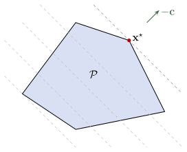



  

    
  <a href="../material/apunte_c1s3.pdf" target="_blank" class="btn btn-outline-primary">
    <i class="fa-solid fa-file-lines me-2"></i>Versión PDF
  </a>

  <a href="../material/tp_c1s3.pdf" target="_blank" class="btn btn-outline-success">
    <i class="fa-solid fa-clipboard-list me-2"></i>Guía de actividades
  </a>

  

  
    <i class="fa-solid fa-clock-rotate-left me-1"></i>
    Última actualización: 27/08/2026
  

Dentro de la amplia clase de problemas de optimización convexa, existe una subclase de especial importancia: los programas cónicos, cuya definición presentamos a continuación.

::: {.definicion}
**Definición 1.3.1** (Programa cónico). Un *programa cónico* es de la forma
$$ 
\begin{array}{ll} 
\text{minimizar } & \cc^\top\xx\\ 
\text{sujeto a }  & A\xx=\bb,\\
                  & h-G(\xx)\in K,
\end{array} 
\tag{1.3.1} 
$$ 

donde $\cc\in\RR^p$, $A\in\RR^{m\times p}$, $\bb\in\RR^m$, $G:\RR^p\to Y$, $h\in Y$, con $Y$ un espacio euclídeo y $K\subset Y$  un cono convexo cerrado. La variable de optimización es $\xx\in\RR^p$.

:::

<aside>Un *espacio euclídeo* es un espacio vectorial real de dimensión finita provisto de un producto interno. Ejemplos: $\RR^p$ con el producto interno usual; $\bfS^p$ con el producto interno de Frobenius $\langle A,B\rangle_F:=\operatorname{tr}(A^\top B)$.</aside>

En la Definición 1.3.1, las restricciones de desigualdad se expresan de manera generalizada mediante la condición $G(\xx)-h\in K$. Esto no modifica la noción de problema de optimización convexa dada en la Definición 1.2.24, sino que extiende la forma de expresar las desigualdades a partir de conos convexos, permitiendo trabajar con elementos de diferente naturaleza. La convexidad del conjunto restricción $\Omega$ sigue garantizada, ya que el conjunto $\left\{\xx\in\RR^p \mid G(\xx)-h\in K\right\}$ es la imagen inversa del conjunto convexo $K$ bajo una aplicación afín.

Por ejemplo, una forma clásica de las restricciones de desigualdad se obtiene al considerar $Y=\RR^r$, $h=\bfzero$, $K=\RR_+^r$ y la aplicación lineal de la forma
$$
G(\xx)=\begin{pmatrix}
	g_1(\xx) \\ \vdots \\ g_r(\xx)
\end{pmatrix}.
$$

Diferentes elecciones de $Y$, $K$ y $G$ dan lugar a subconjuntos particulares de programas cónicos de especial interés. Estudiaremos en esta sección cuatro de los más importantes: los *programas lineales* (LPs), los *programas cuadráticos convexos* (QPs convexos), los *programas semidefinidos* (SDPs) y los *programas cónicos de segundo orden* (SOCPs). En particular, el SOCP será definido en la guía de actividades (✏2) Asimismo, veremos que entre estas clases de problemas existe la siguiente relación:

::: {.myhighlight}
$$\text{LPs}\subset\text{QPs convexos}\subset\text{SOCPs}\subset\text{SDPs}\subset\text{Programas cónicos}$$

:::

En estos problemas de interés, tiene especial relevancia el siguiente concepto.

Cono propio

Un cono convexo cerrado $K\subset Y$ se denomina *cono propio* si satisface lo siguiente:

- $K$ es *sólido*; esto es, tiene interior no vacío.

- $K$ es *puntiagudo*; esto es, no contiene rectas. Matemáticamente:
    $$\xx\in K \land -\xx\in K \Rightarrow \xx=\bfzero.$$

Un cono propio $K\subset Y$ induce un orden parcial sobre $Y$ definido por
$$
x\preceq_K y \iff y-x\in K
\tag{1.3.2}
$$

::: {.callout .question}
✍️ 
Justifique por qué (1.3.2) define un orden parcial sobre $Y$.
:::

Veamos un par de ejemplos que serán fundamentales para definir los problemas de interés. En ambos casos, es fácil verificar que $K$ efectivamente es un cono convexo, sólido y puntiagudo.

- Si $K=\RR_+^p$. El orden parcial inducido es la comparación elemento a elemento determinada por el orden usual en $\RR$:
    $$
    \xx\preceq_K\yy\iff \forall i: x_i\leq y_i,
    $$

- $K=\bfS_+^p$. El orden parcial inducido es
    $$
    A\preceq_K B \iff B-A\in\bfS_+^p.
    $$

    En particular, tomando $A=0$, se recupera la noción de matriz semidefinida positiva.

En ambos ejemplos, el subíndice puede ser omitido para escribir simplemente $\xx\preceq\yy$ o $A\preceq B$, según corresponda. 

Observar que, para un programa cónico con $K$ un cono propio, la restricción $G(\xx)-h\in K$ en (1.3.1) puede ser reescrita como $G(\xx) \preceq_K h$.

## I │ Programa lineal

:::{.myhighlight2}
$Y=\RR^r\qquad K=\RR_{+}^r\qquad G(\xx)=G\xx,\,\text{con } G\in\RR^{r\times p}$
:::

Esta elección conduce a problemas de optimización donde tanto la función objetivo como cada una de las restricciones son funciones afines. 

LP

$$ 
\begin{array}{ll} 
\text{minimizar } & \cc^\top\xx\\ 
\text{sujeto a }  & A\xx=\bb,\\
                  & G\xx\preceq \hh,
\end{array}
$$ 

donde $\cc\in\RR^p$, $G\in\RR^{r\times p}$, $\hh\in\RR^r$, $A\in\RR^{m\times p}$ y $\bb\in\RR^m$.

Observar que:

- El conjunto factible de un LP es un poliedro $\calP$. 

- Los conjuntos de nivel de la función objetivo son hiperplanos ortogonales a la dirección $\cc$. 

- Al avanzar en dirección de $-\cc$, se disminuye la función objetivo. En efecto, para $t>0$ ocurre que $\cc^\top(\xx-t\cc)=\cc^\top\xx-t\|\cc\|_2^2<\cc^\top\xx$.

En consecuencia, el punto óptimo $\xx^{\star}$ es aquel punto de $\calP$ lo más alejado posible en la dirección de $-\cc$. Si el hiperplano de nivel óptimo no es paralelo a ninguna cara de $\calP$, entonces el punto de contacto corresponde a un único vértice del poliedro. En cambio, si dicho hiperplano es paralelo a una cara, todos los puntos de esa cara son óptimos.

<figure style="text-align: center;">
  
  <figcaption>**Figura 1.3.1:** Interpretación geométrica de un LP.</figcaption>
</figure>

Si bien un LP puede presentarse bajo distintas formas equivalentes, resulta conveniente utilizar una representación común, denominada \textit{forma estándar}. Esta representación permite unificar su estudio y facilita el desarrollo y la aplicación de algoritmos para su resolución. 

Importante

Cabe destacar que, al pasar de una formulación a otra en un problema de optimización, la variable de optimización puede cambiar, en caso que la transformación requiera la introducción de nuevas variables. Por simplicidad, se utilizará nuevamente $\xx$ para denotar la variable de optimización en la nueva formulación.

::: {.myhighlight}
La forma estándar de un LP es

$$ 
\begin{array}{ll} 
\text{minimizar } & \cc^\top\xx\\ 
\text{sujeto a }  & \xx\geq \bfzero,\\
                  & A\xx=\bb.
\end{array}
$$ 

:::

::: {.callout .question}
✍️ 
Investigue el procedimiento para reescribir un LP en forma estándar.

:::

::: {.callout-example}

Ejemplo 1.3.2

  La dieta

Una dieta saludable contiene $m$ nutrientes diferentes en cantidades al menos iguales a $b_1, \ldots, b_m$. Podemos componer tal dieta eligiendo cantidades no negativas $x_1, \ldots, x_n$ de $n$ alimentos diferentes. Una unidad de cantidad del alimento $j$ contiene una cantidad $a_{ij}$ del nutriente $i$ y tiene un costo de $c_j$. Queremos determinar la dieta más barata que satisfaga los requisitos nutricionales. Esto conduce al siguiente LP:
$$ 
\begin{array}{ll} 
\text{minimizar } & \cc^\top\xx\\ 
\text{sujeto a }  & \xx\succeq \bfzero,\\
                  & A\xx\succeq \bb.
\end{array}
$$ 

Otras variantes de este problema también se pueden formular como LPs. Por ejemplo, podemos insistir en una cantidad exacta de un nutriente en la dieta (lo que da una restricción de igualdad lineal), o podemos imponer un límite superior en la cantidad de un nutriente, además del límite inferior como se indicó anteriormente.
:::

::: {.callout-example}

Ejemplo 1.3.3

El centro de Chebyshev

Consideremos el problema de encontrar la bola euclídea más grande que se encuentra contenida en un poliedro descrito por desigualdades lineales:
$$
\calP = \{\xx \in \RR^p \mid \bfa_i^\top\xx \leq b_i,\quad i = 1, \ldots, m\}.
$$

El centro de la bola óptima se llama *centro de Chebyshev* del poliedro. Para poder formular el problema, debemos representar la bola mediante
$$
B(\xx,r) = \{\xx + \uu \mid \|\uu\|_2 \leq r\}.
$$

Las variables en el problema son el centro $\xx\in\RR^p$ y el radio $r\in\RR$. El objetivo, por lo tanto, es maximizar $r$ sujeto a la restricción $B(\xx,r)\subset\calP$.

Para definir las restricciones, vamos a usar el hecho que
$$
\sup\{\bfa_i^\top\uu \mid \|\uu\|_2\leq r\}=r\|\bfa_i\|_2\qquad\text{¿Porqué?}
$$

Así, el requisito de que $B(\xx,r)$ pertenezca a cada subespacio $\bfa_i^\top \xx\leq b_i$ puede escribirse como
$$
\bfa_i^\top(\xx+\uu)=\bfa_i^\top\xx+r\|\bfa_i\|_2\leq b_i,
$$
lo cual es una desigualdad lineal. En conclusión, el LP resultante es

$$ 
\begin{array}{ll} 
\text{maximizar } & r\\ 
\text{sujeto a }  & \bfa_i^\top\xx+r\|\bfa_i\|_2\leq b_i,\quad i=1,\cdots, m.
\end{array}
$$ 

:::

## II │ Programa cuadrático

Cuando la función objetivo es cuadrática y las restricciones son afines, el problema de optimización se llama *programa cuadrático* (QP). Aunque, en general, la matriz que define el término cuadrático puede ser indefinida, nos interesan particularmente los *QPs convexos*, que definimos a continuación, ya que estos pueden reformularse como un programa cónico equivalente (✏2).

QP convexo

$$ 
\begin{array}{ll} 
\text{minimizar } & \frac{1}{2}\xx^\top P \xx+\qq^\top\xx\\ 
\text{sujeto a }  & G\xx\preceq \hh,\\
                  & A\xx=\bb,
\end{array}
$$ 

donde $P\in\mathbf{S}_{+}^p$, $\qq\in\RR^p$, $G\in\RR^{r\times p}$, $\hh\in\RR^r$, $A\in\RR^{m\times p}$ y $\bb\in\RR^m$.

::: {.myhighlight}
La *forma estándar* de un QP es

$$ 
\begin{array}{ll} 
\text{minimizar } & \cc^\top\xx+\frac{1}{2}\xx^\top Q\xx\\ 
\text{sujeto a }  & A\xx=\bb,\\
                  & \xx\geq \bfzero.
\end{array}
$$ 

:::

::: {.callout .question}
✍️ 
Investigue el procedimiento para reescribir un QP en forma estándar.

:::

::: {.callout-example}

Ejemplo 1.3.4

Distancia entre poliedros

La distancia euclídea entre los poliedros $\calP_1 = \{\xx \mid A_1 \xx \preceq \bb_1\}$ y $\calP_2 = \{\xx \mid A_2 \xx \preceq \bb_2\}$ en $\RR^p$ se define como
$$
\dist(\calP_1, \calP_2) := \inf \{ \|\xx_1 - \xx_2\|_2 \mid \xx_1 \in \calP_1, \xx_2 \in \calP_2 \}.
$$

Para hallarla, podemos resolver el QP con variable $\xx=(\xx_1,\xx_2)$ definido como
$$ 
\begin{array}{ll} 
\text{minimizar } & \|\xx_1-\xx_2\|_2^2\\ 
\text{sujeto a }  & A_1\xx_1\preceq \bb_1,\\
                  & A_2\xx_2\preceq \bb_2.
\end{array}
$$ 

El único caso en que este problema no tiene solución es si uno de los poliedros está vacío. Por otro lado, el valor óptimo es cero si y solo si los poliedros se intersecan, en cuyo caso $\xx_1=\xx_2$.
:::

::: {.callout-example}

Ejemplo 1.3.5

Mínimos cuadrados

Un problema de *mínimos cuadrados* es de la forma
$$ 
\begin{array}{ll} 
\text{minimizar } & \|A\xx-\bb\|_2^2,
\end{array}
$$ 

con $A\in\RR^{k\times p}$, $k\geq p$, y $\bb\in\RR^k$. Se puede reducir al conjunto de ecuaciones lineales 
$$
(A^\top A)\xx=A^\top \bb,
$$
de manera que:

- Si $A$ es de rango completo, entonces $A^\top A$ es invertible y el problema tiene solución analítica
  $$
  \xx^\star=(A^\top A)^{-1}A^\top\bb.
  $$

- Si $A$ no es de rango completo, entonces $A^\top A$ no es invertible y el problema no tiene solución única. La solución de mínima norma está dada por $\xx^\star=A^+\bb$, donde $A^+$ es la *pseudoinversa de Moore-Penrose* de $A$.

Para aumentar su flexibilidad en las aplicaciones, se utilizan varias técnicas estándar. Por ejemplo, un problema de *mínimos cuadrados ponderados* es de la forma
$$ 
\begin{array}{ll} 
\text{minimizar } & \|W^{1/2}(A\xx-\bb)\|_2^2,
\end{array}
$$ 
donde $W=\diag(w_1,\ldots,w_k)\in\RR^{k\times k}$, con $w_i>0$, es una matriz de pesos que asocia a cada ecuación una importancia relativa. Por supuesto, $W=I$ recupera el problema de mínimos cuadrados clásico.

:::

::: {.callout-example}

Ejemplo 1.3.6

Máquina de vectores soporte (SVM)

Dado un conjunto de datos etiquetados, el objetivo de una *máquina de vectores de soporte* (SVM) es encontrar un hiperplano que separe las dos clases con el mayor margen posible. Cuando los datos no son perfectamente separables, se introducen variables de holgura que permiten ciertas violaciones de las restricciones de clasificación, penalizándolas en la función objetivo.  Esto conduce al siguiente QP con variable de optimización es $(\bfbeta,\beta_0,\bfxi)\in\RR^{p+1+n}$:
$$
\begin{array}{ll}
\text{minimizar } & \displaystyle\frac{1}{2}\|\bfbeta\|_2^2+C\displaystyle\sum_{i=1}^n\xi_i\\[3pt]
\text{sujeto a }  & y_i(\bfbeta^\top\xx_i+\beta_0)\geq 1-\xi_i,\qquad i=1,\ldots,n,\\
                  & \bfxi\succeq\bfzero.
\end{array}
$$

Aunque este problema puede resolverse directamente mediante un *solver* de programación cuadrática, en la práctica suelen utilizarse métodos especializados que aprovechan la estructura particular del problema y permiten resolverlo de forma más eficiente. Veremos este método con más detalle en [C2-S5](B5_svm.html).
:::

## III │ Programa semidefinido

:::{.myhighlight2}
$Y=\bfS^r\qquad K=\bfS_{+}^r\qquad G(\xx)=\displaystyle\sum_{i=1}^p x_iF_i,\,\text{con } F_i\in\bfS^r$
:::

Esta elección conduce a problemas de optimización donde la función objetivo es afín y la restricción impone que una función matricial afín pertenezca al cono de matrices semidefinidas positivas.

SDP

$$ 
\begin{array}{ll} 
\text{minimizar } & \cc^\top\xx\\ 
\text{sujeto a }  & x_1 F_1+\ldots+x_n F_n\preceq H,\\
                  & A\xx=\bb,
\end{array}
$$ 

donde $\cc\in\RR^p$, $F_i\in \bfS^p$, $H\in\bfS^p$, $A\in\RR^{m\times p}$ y $\bb\in\RR^m$.

::: {.myhighlight}
La forma estándar de un SDP es

$$ 
	\begin{array}{ll} 
		\text{minimizar } & \operatorname{tr}(CX)\\ 
		\text{sujeto a }  & X\succeq 0,\\
		& \operatorname{tr}(A_iX)=b_i,\qquad i=1,\ldots, m.
	\end{array}
	$$ 

:::

::: {.callout-example}

Ejemplo 1.3.7

Relajación semidefinida del problema *Max-Cut*

Dado un grafo no dirigido $G=(V,E)$, el problema *Max-Cut* consiste en particionar el conjunto de vértices en dos grupos de modo de maximizar el número de aristas que cruzan la partición. Si asociamos variables $s_i \in \{-1,1\}$ a cada vértice, el problema puede escribirse como:
$$
\max \sum_{(i,j)\in E} \frac{1 - s_i s_j}{2}.
$$

Este problema es combinatorio y NP-*hard*. Una relajación convexa se obtiene reemplazando los escalares $s_i$ por vectores unitarios $v_i \in \mathbb{R}^n$ con $\|v_i\|_2=1$, y definiendo la matriz $X$ mediante $X_{ij}=v_i^\top v_j$. Esto conduce al siguiente programa semidefinido:

$$
\begin{array}{ll}
\text{maximizar} & \displaystyle \frac{1}{4}\sum_{i=1}^n \sum_{j=1}^n L_{ij} X_{ij} \\
\text{sujeto a} & X \succeq 0, \\
& X_{ii} = 1, \quad i=1,\ldots,n,
\end{array}
$$

donde $L$ es la matriz asociada al grafo. Dicho SDP está en forma estándar, ya que la función objetivo es lineal en $X$ y la restricción principal impone que $X$ pertenezca al cono de matrices semidefinidas positivas.
:::

::: {.callout-example}

Ejemplo 1.3.8

Matriz de correlación más cercana

En aplicaciones de estadística, finanzas y aprendizaje automático, es frecuente estimar una matriz de correlación a partir de datos experimentales. Debido al ruido o a errores numéricos, la matriz obtenida puede dejar de ser una matriz de correlación válida, ya que podría no ser semidefinida positiva. En este caso, se busca la matriz de correlación válida más cercana a la matriz observada. El SDP asociado es
$$ 
\begin{array}{ll} 
\text{minimizar } & \|X-C\|_F^2\\ 
\text{sujeto a }  & X\succeq 0,\\
                  & \diag X=\bfone,
\end{array}
$$ 

donde $C$ es la matriz observada y $X$ es la matriz de correlación buscada. Esta formulación no corresponde a un SDP en forma estándar, ya que la función objetivo es cuadrática. No obstante, puede reformularse de manera equivalente como un SDP estándar, pero tal procedimiento queda fuera del alcance de este curso.
:::

  

::: {.refs}
<strong>Referencias</strong>

Boyd, S., & Vandenberghe, L. (2004). *Convex Optimization*. Cambridge University Press.

<!--
Diamond, S., & Boyd, S. (s.f.). CVXPY: A Python-embedded modeling language for convex optimization. CVXPY. https://www.cvxpy.org

SciPy Developers. (s.f.). SciPy optimize tutorial. SciPy. https://docs.scipy.org/doc/scipy/tutorial/optimize.html
-->

Tibshirani, R. (2018) *CMU Machine Learning 10-725: Convex Optimization*.  Course material and lecture notes. Carnegie Mellon University. 🔗 [ir al sitio web](https://www.stat.cmu.edu/~ryantibs/convexopt-F18/).

::: 