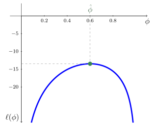



  

    
  <a href="../material/apunte_c2s1.pdf" target="_blank" class="btn btn-outline-primary">
    <i class="fa-solid fa-file-lines me-2"></i>Versión PDF
  </a>

  <a href="../material/tp_c2s1.pdf" target="_blank" class="btn btn-outline-success">
    <i class="fa-solid fa-clipboard-list me-2"></i>Guía de actividades
  </a>

  

  
    <i class="fa-solid fa-clock-rotate-left me-1"></i>
    Última actualización: 21/09/2026
  

En esta sección introducimos el *principio de máxima verosimilitud* (MLE, *maximum likelihood estimation*), uno de los métodos de estimación de parámetros más utilizados en estadística y aprendizaje automático. En modelos probabilísticos, la máxima verosimilitud propone elegir los parámetros que hacen más probable la observación de los datos, de modo que un problema de estimación estadística se transforma naturalmente en un problema de optimización.

📄 **Notación**

Durante esta sección consideramos una muestra i.i.d. $\{y_1, \ldots, y_n\}$ de una variable aleatoria $Y\in\RR$ cuya distribución depende de un vector de parámetros $\bftheta \in \RR^q$. Denotamos con
$p(y \mid \bftheta)$ la función de densidad (o masa de probabilidad) de $Y$.

## I │  Maximización de la verosimilitud

::: {.definicion}
**Definición 2.1.1** (Función de verosimilitud). Sea $\{y_1,\ldots,y_n\}$ una muestra i.i.d. de una variable aleatoria $Y\in\RR$, y sea $p(\cdot\mid\bftheta)$ un modelo probabilístico parametrizado por $\bftheta\in\RR^q$. Se denomina *función de verosimilitud* a $L:\RR^q\to\RR$ definida por
$$
L(\bftheta) := \prod_{i=1}^{n} p(y_i \mid \bftheta).
\tag{2.1.1}
$$

:::

La función de verosimilitud (2.1.1) es simplemente la densidad conjunta de los datos como función del parámetro $\bftheta$. Por otra parte, la función de verosimilitud no es una función de densidad: en general, no es cierto que $L(\bftheta)$ integre 1 con respecto a $\bftheta$. 

La intuición es directa: 

:::{.myhighlight}
$L(\bftheta)$ mide cuán *verosímiles* son los datos observados bajo el valor $\bftheta$ del parámetro.

:::

A la hora de elegir un parámetro $\bftheta\in\RR^q$ para nuestro modelo probabilístico $p(\cdot\mid\bftheta)$, el principio de máxima verosimilitud sugiere elegir aquel que maximiza $L(\bftheta)$. Por supuesto, esto conduce al siguiente problema de optimización, formulado a partir de la muestra $\{y_1,\ldots,y_n\}$, cuya variable de optimización es justamente $\bftheta$:
$$
\begin{array}{ll} 
	\text{maximizar } & L(\bftheta) \\
	\text{sujeto a} & \bftheta\in\Theta,
\end{array}
\tag{2.1.2}
$$

donde $\Theta\subseteq\RR^q$ es el conjunto de valores admisibles para el parámetro $\bftheta$.

::: {.definicion}
**Definición 2.1.2** (Estimador de máxima verosimilitud). Sea $\{y_1,\ldots,y_n\}$ una muestra i.i.d. de una variable aleatoria $Y\in\RR$, y sea $p(\cdot\mid\bftheta)$ un modelo parametrizado por $\bftheta\in\RR^q$. Al punto óptimo del problema (2.1.2), denotado por $\hat{\bftheta}_{\text{MLE}}$, se lo denomina \textit{estimador de máxima verosimilitud}. Esto es:
$$
\hat{\bftheta}_{\text{MLE}}:=\arg\max_{\bftheta\in\Theta}\;L(\bftheta).
$$

Cuando no haya ambigüedad, escribiremos simplemente $\hat{\bftheta}$.
:::

Función de log-verosimilitud

En la práctica, trabajar con el producto $\prod_{i=1}^n p(y_i \mid \theta)$ es numéricamente inconveniente: para muestras grandes los valores son extremadamente pequeños y propensos a desbordamiento numérico. Dado que el logaritmo es una función estrictamente creciente, maximizar $L(\bftheta)$ es equivalente a maximizar la función $\ell:\RR^q\to\RR$ definida como
$$
\ell(\bftheta) := \log L(\bftheta) = \sum_{i=1}^{n} \log p(y_i \mid \bftheta).
\tag{2.1.3}
$$

Esta transformación convierte el producto en una suma, lo que simplifica tanto el análisis matemático como la implementación computacional.

Cabe destacar que, en el contexto de la optimización, es habitual presentar el problema en forma de minimización. Esto se logra simplemente cambiando el signo de la función objetivo (2.1.3). Así, $\hat{\bftheta}_{\text{MLE}}$ es punto óptimo del problema
$$
\begin{array}{ll}
	\text{minimizar } & -\ell(\bftheta)\\
	\text{sujeto a }  & \bftheta\in\Theta.
\end{array}
$$

### Condiciones de optimalidad

Supongamos que $\ell$ es diferenciable para $\bftheta\in\Theta\subset\RR^q$, con $\Theta$ un conjunto abierto. Entonces el estimador $\hat{\bftheta}$ verifica la condición de optimalidad de primer orden
$$
\nabla\ell(\hat{\bftheta}) = \bfzero.
\tag{2.1.4}
$$

La *ecuación de verosimilitud* (2.1.4), en general, no admite solución analítica cerrada y debe resolverse mediante métodos numéricos tales como descenso por gradiente y método de Newton. 

::: {.callout-example}

Ejemplo 2.1.3 

MLE para la distribución de Bernoulli

Sea $\{y_1, \ldots, y_n\}$ una muestra i.i.d. de
$Y \sim \text{Bernoulli}(\phi)$, con $0<\phi<1$. La función de masa de
probabilidad es
$$
p(y \mid \phi) = \phi^y(1-\phi)^{1-y}, \qquad y \in \{0,1\}.
$$

Entonces
$$
L(\phi)=\prod_{i=1}^n \phi^{y_i}(1-\phi)^{1-y_i}=\phi^{n \bar{y}}(1-\phi)^{n(1-\bar{y})},
$$
donde $\bar{y}:=\left(\sum_{i=1}^n y_i\right)/n$ es la media muestral. La función de log-verosimilitud resulta
$$
\ell(\phi) = n\bar{y} \log \phi +n(1-\bar{y})\log (1-\phi),
\tag{2.1.5}
$$

Derivando (2.1.5) respecto de $\phi$ e igualando a cero, obtenemos finalmente la ecuación de verosimilitud:
$$
\begin{align*}
\frac{n\bar{y}}{\hat{\phi}}-\frac{n(1-\bar{y})}{1-\hat{\phi}}&=0 \\[3 pt]
(1-\hat{\phi})\bar{y}-\hat{\phi}(1-\bar{y}) &=0 \\
\hat{\phi}&=\bar{y}.
\end{align*}
$$

Luego, el MLE para el parámetro $\phi$ de la distribución de Bernoulli es la media muestral.

<figure style="text-align: center;">
  
  <figcaption>**Figura 2.1.1:** Función de verosimilitud para la distribución de Bernoulli con $n=20$ y $\sum_{i=1}^n y_i=12$. El MLE resulta $\hat{\phi}=0{.}6$.</figcaption>
</figure>

:::

### Propiedades del MLE

Dado que $\hat{\bftheta}$ es un estimador del valor verdadero del parámetro, al cual denotaremos $\bftheta_\star$, resulta relevante estudiar sus propiedades estadísticas, tales como consistencia, sesgo y varianza. 

Importante

Es fundamental distinguir dos niveles de convergencia:

- **Convergencia estadística del estimador**. Se refiere al hecho de que $\hat{\bftheta}_n$ converge en probabilidad al valor verdadero $\bftheta^\star$. Simbólicamente:
$$
\plim_{n\to\infty}\hat{\bftheta}_n=\bftheta_\star\qquad (\hat{\bftheta}_n\overset{p}{\longrightarrow}\bftheta_\star).
$$

    Observar que escribimos $\hat{\bftheta}_n$ para explicitar la dependencia del estimador respecto al tamaño muestral $n$.

- **Convergencia computacional del algoritmo**. Se refiere a que la sucesión producida por un algoritmo iterativo (por ejemplo, descenso por gradiente) converge a $\hat{\bftheta}$ (aquí no escribimos el subíndice porque $n$ es fijo). Esto es:
$$
\lim_{t\to\infty}\bftheta_t=\hat{\bftheta}\qquad(\bftheta_t\to\hat{\bftheta}).
$$

El estimador de máxima verosimilitud goza de propiedades asintóticas notables que lo convierten en el método de referencia para estimación paramétrica.

- **Consistencia**. Bajo condiciones de regularidad, $\hat{\bftheta}_n\overset{p}{\longrightarrow}\bftheta_\star$.

- **Invarianza**. Si $\hat{\bftheta}$ es el MLE de $\bftheta$ y $g$ es una función biyectiva, entonces $g(\hat{\bftheta})$ es el MLE de $g(\bftheta)$.

- **Normalidad asintótica**. Bajo condiciones de regularidad,
  $$
  \sqrt{n}\,(\hat{\bftheta}-\bftheta_\star)\overset{d}{\longrightarrow}\calN\left(\bfzero,\;\mathcal{I}(\bftheta_\star)^{-1}\right),
  $$
   
  donde $\mathcal{I}(\bftheta) := -\mathbb{E}\left[\nabla^2_{\bftheta} \log p(Y \mid \bftheta)\right]$
  es la *información de Fisher* de una observación. Esto permite construir intervalos de confianza y tests de hipótesis de forma sistemática a partir del MLE.

- **Eficiencia**. Bajo condiciones de regularidad, el MLE es asintóticamente eficiente: entre todos los estimadores que cumplen ciertas condiciones de regularidad, el MLE tiene la menor varianza, al menos para muestras grandes. En efecto, la varianza asintótica de $\hat{\bftheta}_n$ es
	$$
	\frac{1}{n}\mathcal I(\bftheta_{\star})^{-1},
	$$

	que se conoce como *cota de Cramér-Rao*, la cual es una cota inferior para la varianza de cualquier estimador insesgado. En este sentido, el MLE hace un uso asintóticamente eficiente de la información contenida en los datos.

En problemas suficientemente complejos, estas propiedades pueden dejar de cumplirse y el MLE puede dejar de ser un buen estimador. Las \textit{condiciones de regularidad} a las que se hacen referencia son, esencialmente, condiciones de suavidad sobre $p(y\mid \bftheta)$ que garantizan un comportamiento adecuado del modelo y de la función de verosimilitud. Salvo que se indique lo contrario, supondremos implícitamente que estas condiciones se cumplen.

::: {.callout-example}

Ejemplo 2.1.4 

Eficiencia del MLE para la distribución de Bernoulli

Sea $\{y_1,\ldots,y_n\}$ una muestra i.i.d. de $Y\sim\text{Bernoulli}(\varphi)$, con $0<\phi<1$. Del Ejemplo 2.1.3, tenemos que
$$
\log p(y\mid \phi)=y\log \phi+(1-y)\log(1-\phi).
$$
	
Resulta
$$
\frac{d^2 \log p(y\mid \phi)}{d\phi^2}=-\frac{y}{\phi^2}-\frac{1-y}{(1-\phi)^2},
$$

de manera que
$$
I(\phi)=\media\left[\frac{Y}{\phi^2}+\frac{1-Y}{(1-\phi)^2}\right]=\frac{\phi}{\phi^2}+\frac{1-\phi}{(1-\phi)^2}=\frac{1}{\phi(1-\phi)}.
$$
	
Por lo tanto, la cota de Cramér-Rao establece que, para cualquier estimador insesgado $\tilde{\phi}$ de $\phi$, se verifica
$$
\operatorname{Var}(\tilde{\phi})\geq \frac{\phi(1-\phi)}{n}
$$
	
En particular, el MLE de $\phi$ alcanza esta cota para cualquier tamaño muestral $n$, ya que
$$
\var(\hat{p})=\var\left(\frac{1}{n}\sum_{i=1}^n Y_i\right)=\frac{1}{n^2}\sum_{i=1}^n\var(Y_i)=\frac{\phi(1-\phi)}{n},
$$
	
donde hemos usado el hecho que $\{Y_1,\ldots,Y_n\}$ son i.i.d. con $\var(Y_i)=\phi(1-\phi)$.

:::

  

::: {.refs}
<strong>Referencias</strong>

Wasserman, L. (2004). *All of Statistics: A Concise Course in Statistical Inference*. Springer Texts in Statistics. New York: Springer.

:::