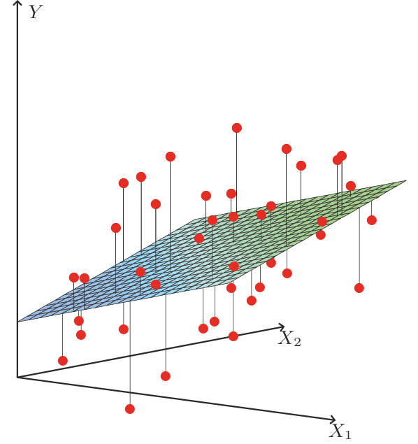
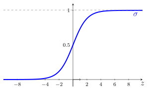

<hr style="border: 1px solid rgba(50, 0, 0, 1);">




<div class="d-flex align-items-center justify-content-between">

  <div class="d-flex gap-2">
    
  <a href="../material/apunte_c2s2.pdf" target="_blank" class="btn btn-outline-primary">
    <i class="fa-solid fa-file-lines me-2"></i>Versión PDF
  </a>

  <a href="../material/tp_c2s2.pdf" target="_blank" class="btn btn-outline-success">
    <i class="fa-solid fa-clipboard-list me-2"></i>Guía de actividades
  </a>

  </div>

  <span class="text-muted small">
    <i class="fa-solid fa-clock-rotate-left me-1"></i>
    Última actualización: 22/09/2026
  </span>

</div>

<div style="margin-top:20px"></div>


En esta sección estudiaremos dos modelos fundamentales de aprendizaje supervisado: la regresión lineal, utilizada para una variable de respuesta continua, y la regresión logística, empleada cuando la respuesta es categórica. Ambos modelos pueden ser formulados como problemas de optimización, lo que permite aplicar los conceptos vistos en el capítulo anterior. Para ambos modelos, analizaremos su formulación probabilística, las características del problema y los métodos de resolución más utilizados.


<div style="border-top:1px solid #b7cdf5;
            background-color: #fafbff;
            padding:0.1em 0;
            margin-top:1em;">

📄 **Notación**

De ahora en adelante, consideraremos $\XX=(X_1,\ldots,X_p)\in\RR^p$ un conjunto de variables predictoras y $Y\in\RR$ una variable respuesta. Además, vamos a suponer que la distribución condicional de $Y|\XX$ depende de un vector de parámetros $\bftheta\in\RR^q$.

Para un conjunto de datos $\{(\xx_i,y_i)\}_{i=1}^n$, denotamos  $\yy\in\RR^n$ el vector de respuestas, $X\in\RR^{n\times p}$ la matriz de predictoras y $\tilde{X}:=\begin{pmatrix}\bfone & X\end{pmatrix}\in\RR^{n\times (p+1)}$ la matriz ampliada, la cual permite extender resultados formulados para relaciones lineales de la forma $\bftheta^\top\XX$ al caso con intercepto $\theta_0+\bftheta^\top\XX$.

</div>

<div style="margin-top:1.5em;"></div>

En modelos probabilisticos, la tarea de obtener un estimador $\hat{\bftheta}$ puede ser formulada a través de un problema de optimización de la forma
$$
\begin{array}{ll}
	\text{minimizar } & J(\bftheta),
\end{array}
$$
en principio sin restricciones. Aquí, la función objetivo $J:\RR^q\to\RR$, conocida como \textit{función de costo}, mide que tan bien se ajusta $\bftheta$ a los datos observados. De acuerdo con lo visto en [C2-S1](../CAPITULO_2/B1_maxima_verosimilitud.html), bajo la suposición que los datos son i.i.d. (independientes e idénticamente distribuidos) con distribución condicional $p(y\mid\xx;\bftheta)$, una estrategia para formular $J$ es el principio de máxima verosimilitud (MLE); es decir, $J$ se deriva de la función de verosimilitud
$$
L(\bftheta):=\prod_{i=1}^n p(y_i\mid\xx_i;\bftheta).
$$
Si bien $J$ depende del problema específico, en general es de la forma
$$
J(\bftheta)=\sum_{i=1}^n\loss(y_i,f(\xx_i,\bftheta)),
$$
donde $\loss:\RR\times\RR\to\RR_0^+$ mide, para cada observación, el error entre el valor observado de la variable respuesta y el valor estimado por el modelo.


<div style="margin-top:2.5em;"></div>


## I <span style="color:#CCCCCC;">│</span>  Regresión lineal

<div style="margin-top:-1em;"></div>

::: {.myhighlight2 style="color: rgb(204, 0, 0);"}

<span style="font-size:0.8em;">*Supuestos del modelo*</span>
<div style="margin-top:-0.1em;"></div>

$$
\begin{array}{c}
Y=\theta_1X_1+\cdots+\theta_p X_p+\varepsilon\\[2pt]
\varepsilon\sim \calN(0,\sigma^2)
\end{array}
$$

:::

<div style="margin-top:1em;"></div>

El conjunto de parámetros del modelo de regresión lineal es $\bftheta\in\RR^p$, mientras que $\varepsilon\in\RR$ es un término de error que captura efectos no modelados (como características omitidas o ruido aleatorio). Podemos escribir el modelo de forma abreviada como
$$
Y = \bftheta^\top \XX + \varepsilon.
$$

El supuesto $\varepsilon\sim \calN(0,\sigma^2)$ significa que la función de densidad de la variable aleatoria $\varepsilon$ es
$$
p(\varepsilon) = \frac{1}{\sqrt{2 \pi \sigma^2}} \exp\left(-\frac{\varepsilon^2}{2 \sigma^2}\right).
$$


### Distribución condicional

Dado $\XX=\xx$, tenemos que $Y=\underbrace{\bftheta^\top\xx}_{\text{cte}}+\varepsilon$. Por lo tanto, el supuesto $\varepsilon\sim\calN(0,\sigma^2)$ implica que
$$
Y|\XX=\xx\sim \calN(\bftheta^\top\xx,\sigma^2).
$$


<aside> 
Si $Z\sim\calN(\mu,\sigma^2)$ y $a,b\in\RR$, $aZ+b\sim\calN(a\mu+b,a^2\sigma^2)$. 
</aside>


En consecuencia:

<div style="margin-top:-1em;"></div>

:::{.myhighlight}

La función de densidad condicional de $Y|\XX$ en el modelo de regresión lineal es
$$
p(y \mid \xx; \bftheta) = \frac{1}{\sqrt{2 \pi \sigma^2}} \exp\left(-\frac{(y-\bftheta^\top \xx)^2}{2 \sigma^2}\right).
$$

:::

<div style="margin-top:1.5em;"></div>


### Función de verosimilitud

Para un conjunto de datos $\{\xx_i, y_i\}_{i=1}^n$ i.i.d., la función de log-verosimilitud es
$$
\ell(\bftheta) = \log \prod_{i=1}^{n} \frac{1}{\sqrt{2 \pi}\sigma} \exp\left(-\frac{(y_i - \bftheta^\top \xx_i)^2}{2 \sigma^2}\right) = n  \log \frac{1}{\sqrt{2 \pi}\sigma} - \frac{1}{2 \sigma^2} \sum_{i=1}^{n} (y_i - \bftheta^\top \xx_i)^2.
$$

<div style="margin-top:2em;"></div>


<div class="alert alert-light text-dark" role="important">
<span class="badge bg-warning text-dark">Importante</span>

Observar que maximizar $\ell(\bftheta)$ es equivalente a minimizar la función de costo asociada a mínimos cuadrados, dada por

$$
J(\bftheta)=\frac{1}{2} \sum_{i=1}^{n} (y_i - \bftheta^\top \xx_i)^2=\frac{1}{2}\|X\bftheta-\yy\|_2^2,
$$

lo cual es la función de costo asociada a mínimos cuadrados.

</div>

<div style="margin-top:1.5em;"></div>

<figure style="text-align: center;">
  
  <figcaption> **Figura 2.2.1**. Interpretación geométrica del modelo de regresión lineal en $\RR^2$. El objetivo es hallar la función lineal de $X$ que minimice la suma de los residuos al cuadrado respecto de $Y$. (*Figura 3.1 de (Hastie, Tibshirani y Friedman 2009)*). </figcaption>
</figure>


### Optimalidad

El problema de optimización de interés,
$$ 
\begin{array}{ll} 
	\text{minimizar } & \displaystyle\frac{1}{2}\|X\bftheta-\yy\|_2^2,
\end{array}
$$

es convexo y no tiene restricciones. Por lo tanto, en virtud del Teorema 1.4.1, la condición de optimalidad $\nabla J(\bftheta)=\bfzero$ es suficiente y necesaria. Resolvemos:
$$
\begin{align*}
X^\top X\hat{\bftheta}-X^\top\yy&=\bfzero\\
X^\top X\hat{\bftheta} &=X^\top\yy.
\end{align*}
$$

La solución está caracterizada por $\hat{\bftheta}=X^{+}\yy$, donde $X^{+}$ es la *pseudoinversa de Moore--Penrose* de $X$. En particular:

::: {.myhighlight}

Si $X$ es de rango completo, entonces $X^\top X$ es invertible y
$$
\hat{\bftheta}=(X^\top X)^{-1}X^\top\yy
$$

:::

<div style="margin-top:2em;"></div>

El vector de valores ajustados $\hat{\yy}\in\RR^n$ está dado por
$$
\hat{\yy}:=X\hat{\bftheta}.
$$

Observar que, si $X$ es de rango completo, entonces $\hat{\yy}=X(X^\top X)^{-1}X^\top\yy$. Esto significa que $\hat{\yy}$ es la proyección de $\yy$ sobre el espacio columna de $X$.


### Resolución por descenso por gradiente

La aplicación del método de descenso por gradiente al problema de optimización en regresión lineal da lugar a lo que se denomina \textit{algoritmo LMS (least mean squares)}. Resulta de sustituir $\nabla J(\bftheta_t) = X^\top X\bftheta_t-X^\top\yy$ en la regla de actualización 
$$
\bftheta_{t+1}:=\bftheta_t-\eta \nabla J(\bftheta_t),\qquad\eta>0.
$$

Esta regla de actualización tambien se conoce como *regla de aprendizaje Widrow-Hoff*.

<div style="margin-top:2em;"></div>

<div class="alert alert-light text-dark" role="important">
⚙ <span class="badge bg-custom">Algoritmo LMS</span>

---

Dado un *parámetro inicial* $\bftheta_0\in\RR^{p}$ y una *tasa de aprendizaje* $\eta>0$:

<div style="margin-left: 1em">

**repetir** para $t = 0,1,2,\ldots$:

> Actualizar $\bftheta_{t+1}:=\bftheta_t-\eta \left(X^\top X\bftheta_t-X^\top\yy\right)$.

**hasta** que el criterio de parada se satisfaga.

</div>

---

</div>

<div style="margin-top:2em;"></div>


El algoritmo anterior trabaja con todas las observaciones a la vez en cada paso de actualización, por lo que se trata de un *descenso de gradiente por lotes*. Esta estrategia asegura una actualización estable del parámetro $\bftheta$, aunque puede ser costosa si el número de observaciones es muy grande. Como alternativas, podemos utilizar descenso de gradiente estocástico o *mini-batch*. Observar que, para una observación $(\xx_i,y_i)$, la función de costo resulta
$$
\loss(y_i,f(\xx_i;\bftheta))=\frac{1}{2}(y_i-\bftheta^\top\xx_i)^2,
$$
tal que
$$
\nabla_{\bftheta} \loss(y_i,f(\xx_i;\bftheta)) = -(y_i-\bftheta^\top\xx_i)\,\xx_i.
$$

<div style="margin-top:2em;"></div>

<div class="alert alert-light text-dark" role="important">
⚙ <span class="badge bg-custom">Algoritmo LMS estocástico</span>

---

Dado un *parámetro inicial* $\bftheta_0\in\RR^{p}$ y una *tasa de aprendizaje* $\eta>0$:

<div style="margin-left: 1em">

**repetir** para $t = 0,1,2,\dots$:

> **1°** Elegir un índice $i$ al azar de $\{1,\dots,n\}$.  
>
> **2°** Actualizar $\bftheta_{t+1}:=\bftheta_t+\eta\,(y_i-\bftheta_t^\top\xx_i)\,\xx_i$.

**hasta** que el criterio de parada se satisfaga.

</div>

---

</div>

<div style="margin-top:2em;"></div>


Observar que la magnitud de la actualización del algoritmo LMS estocástico es proporcional al término de error $(y_i - \bftheta_t^\top\xx_i)$. Si elegimos un ejemplo para el cual $\bftheta_t^\top\xx_i\approx y_i$, entonces el cambio en el parámetro será mínimo. Esto puede activar prematuramente el criterio de parada basado en la magnitud del gradiente, por lo cual para para evitar detener el algoritmo demasiado pronto, suele ser recomendable basar el criterio de parada en el promedio del error sobre un conjunto de observaciones. También se puede imponer un número mínimo de iteraciones para asegurar que el algoritmo recorra suficientes ejemplos y aprenda de manera estable.

<div style="margin-top:1.5em;"></div>

::: {.callout .question}

<span style="font-size: 1.3em;">✍️</span><br>

Suponga que $X^\top X$ es invertible. Analice qué sucede al aplicar el método de Newton para resolver el problema de regresión lineal.

:::


<div style="margin-top:2em;"></div>

::: {.callout-example}
<span class="badge bg-primary">Ejemplo 2.2.1</span> 
<span style="color: #0d6efd; font-family: Arial; font-weight: bold; font-size: 0.85em;">
Regresión lineal en datos *California Housing*
</span>

Utilizaremos el conjunto de datos [disponible aquí](https://scikit-learn.org/stable/modules/generated/sklearn.datasets.fetch_california_housing.html), el cual consiste en 20640 observaciones con 8 variables predictoras que miden características de las viviendas y su entorno. La variable respuesta es la mediana del valor de una vivienda en cada bloque censal, por lo que efectivamente se trata de un problema de regresión. Ajustaremos un modelo de regresión lineal a los datos, evaluaremos el MSE en test y presentaremos los coeficientes estimados del modelo.

::: {.callout-warning appearance="simple"}
En este ejemplo utilizamos la implementación `LinearRegression` de `scikit-learn`, la cual obtiene los coeficientes mediante métodos numéricos basados en álgebra lineal, en lugar de aplicar explícitamente el algoritmo de descenso por gradiente. La implementación del algoritmo LMS se realizará en las actividades prácticas.
:::

```{python}
#| code-summary: "Mostrar código"
#| code-fold: false
#| code-line-numbers: true
#| fig-align: "center"

import numpy as np
from sklearn.datasets import fetch_california_housing
from sklearn.linear_model import LinearRegression
from sklearn.preprocessing import StandardScaler
from sklearn.model_selection import train_test_split
from sklearn.metrics import mean_squared_error

# Datos:
X, y = fetch_california_housing(return_X_y=True)
scaler = StandardScaler()
X = scaler.fit_transform(X)

X_train, X_test, y_train, y_test = train_test_split(X, y, test_size=0.2, random_state=42)

# Modelo:
lr = LinearRegression()
lr.fit(X_train, y_train)

# Predicción y MSE:
y_pred = lr.predict(X_test)
mse_test = mean_squared_error(y_test, y_pred)

```

```{python}
#| echo: false
#| fig-align: "center"

# 📋:
print(f"MSE en test: {mse_test:.3f}")
print("Coeficientes estimados:")
for i, coef in enumerate(lr.coef_):
    print(f"θ_{i+1} = {coef:.3f}")

```

:::


### Propiedades del estimador

Hemos visto que el algoritmo LMS permite aproximar el estimador de mínimos cuadrados $\hat{\bftheta}$ para el modelo de regresión lineal. Por supuesto, los resultados de convergencia para el método de descenso por gradiente son válidos. No obstante, recordemos que también es importante considerar las propiedades estadísticas del MLE $\hat{\bftheta}$.

Algunos resultados conocidos para el modelo de regresión lineal son:


- **Convergencia estadística**: Para $n>p$ y bajo los supuestos clásicos de
    $$
    \begin{array}{cl}
    \{(\xx_i,y_i)\}_{i=1}^n\text{ i.i.d.},\; \media\left[\varepsilon_i\mid\xx_i\right]=0 & \text{(Exogeneidad)} \\[2pt]
    \media\left[\varepsilon_i^2\mid \xx_i\right]=\sigma^2<\infty,\;\media\left[\varepsilon_i^4\right] & \text{(Momentos)} \\
    \frac{1}{n}X^\top X\overset{p}{\longrightarrow}\Sigma_{X}\succ 0 & \text{(Diseño bien condicionado)}
    \end{array}
    $$
    se verifica
    $$
    \hat{\bftheta}_n\overset{p}{\longrightarrow}\bftheta_\star\qquad\text{y}\qquad\sqrt{n}\, (\hat{\bftheta}_n-\bftheta_\star)\overset{d}{\longrightarrow}\calN(0,\sigma^2\Sigma_X^{-1}).
    $$

<div style="margin-top:2em;"></div>

- **Convergencia computacional**. Sean $\lambda_{\text{min}},\lambda_{\text{max}}>0$ autovalores de $X^\top X$, y sea $\rho=\max\left\{|1-\eta\lambda_{\text{min}}|,|1-\eta\lambda_{\text{max}}|\right\}$. Si $0<\eta<2/\lambda_{\text{max}}$, entonces
    $$
    \bftheta_t\to\hat{\bftheta}\qquad\text{y}\qquad\|\bftheta_t-\hat{\bftheta}\|_2\leq\rho^t\|\bftheta_0-\hat{\bftheta}\|_2,
    $$
    con $\rho=\max\left\{|1-\eta\lambda_{\text{min}}|,|1-\eta\lambda_{\text{max}}|\right\}$.


<div style="margin-top:2.5em;"></div>


## II <span style="color:#CCCCCC;">│</span>  Regresión logística

Consideremos ahora un problema de clasificación binaria, con $Y\in\{0,1\}$. Por ejemplo, si estamos tratando de construir un clasificador de spam para correos electrónicos, una observación $\xx$ contendrá características de un correo electrónico, y su etiqueta $y$ será 1 si es spam o 0 en caso contrario. Podríamos aplicar regresión lineal ignorando que $Y$ es discreta, pero sus predicciones no estarían restringidas al intervalo $[0,1]$. Para evitar esto, utilizaremos la *función logística*.

<div style="margin-top:2em;"></div>


<div class="alert alert-light text-dark" role="important">
<span class="badge bg-success text-light">Función logística</span>

Para $z\in\RR$, se define la *función logística* o *función sigmoide* $\sigma:\RR\to\RR$ mediante 
$$ 
\sigma(z) := \frac{1}{1 + e^{-z}} = \frac{e^z}{1+e^z}.
$$

<figure style="text-align: center;">
  
</figure>

<div style="margin-top:-1em;"></div>

Algunas características son:

- $\sigma(\RR)=(0,1)$ y $\sigma(0) = 0.5$.

- $\displaystyle\lim_{z\to -\infty}\sigma(z)=0$ y $\displaystyle\lim_{z\to\infty} \sigma(z)=1$.

- $\sigma'(z)=\sigma(z)(1-\sigma(z))$.

- Su inversa es la función $\logit:(0,1)\to\RR$ definida por
	$$
	\logit(p):=\log\frac{p}{1-p}.
	$$

</div>

<div style="margin-top:2em;"></div>


Ya estamos en condiciones de configurar el modelo de regresión logística. Para ello, primero definimos la función $h_{\bftheta}:\RR^p\to\RR$ como
$$
h_{\bftheta}(\xx) := \sigma(\bftheta^\top \xx) = \frac{1}{1 + e^{-\bftheta^\top \xx}}.
$$


<div style="margin-top:1em;"></div>

::: {.myhighlight2 style="color: rgb(204, 0, 0);"}

<span style="font-size:0.8em;">*Supuestos del modelo*</span>
<div style="margin-top:-0.1em;"></div>

$$
\begin{array}{c}
Y\in\{0,1\} \\[2pt]
\prob{P}(y=1\mid\xx;\bftheta)=h_{\bftheta}(\xx)
\end{array}
$$

:::

<div style="margin-top:1em;"></div>


### Distribución condicional

Bajo el modelo de regresión logística, resulta
$$
Y|\XX=\xx\sim\text{Binom}(1,h_{\bftheta}(\xx)),
$$

de manera tal que
$$
\begin{align*}
	p(y \mid \xx; \bftheta)&=(h_{\bftheta}(\xx))^y(1-h_{\bftheta}(\xx))^{1-y} \\[2pt]
	&=\exp\left\{y\log h_{\bftheta}(\xx)+(1-y)\log(1-h_{\bftheta}(\xx))\right\} \\[3pt]
	&=\exp\left\{y\log\left(\frac{h_{\bftheta}(\xx)}{1-h_{\bftheta}(\xx)}\right)+\log(1-h_{\bftheta}(\xx))\right\} \\[4pt]
	&=\exp\left\{y\,\logit(h_{\bftheta}(\xx))+\log(1-h_{\bftheta}(\xx))\right\}.
\end{align*}
$$

<div style="margin-top:2em;"></div>

Para simplificar la escritura, definamos el *parámetro natural* $\eta\in\RR$ como
$$
\eta(\xx;\bftheta):=\logit(h_{\bftheta}(\xx))=\bftheta^\top\xx.
$$

<div style="margin-top:1em;"></div>

y la función $A:\RR\to\RR$ mediante $A(\eta)=\log(1+e^{\eta})$. Resulta:


:::{.myhighlight}

La función de probabilidad condicional de $Y|\XX$ en el modelo de regresión logística es
$$
p(y \mid \eta)=\exp\left\{\eta y-A(\eta)\right\},\qquad \eta=\bftheta^\top\xx.
\tag{2.2.1}
$$

:::

<div style="margin-top:2em;"></div>

Es importante observar que
$$
	\begin{array}{c}
		A'(\eta)=\displaystyle\frac{e^\eta}{1+e^\eta}=\sigma(\eta)=h_{\bftheta}(\xx)=\media\left[Y\mid\XX=\xx\right],\\[7pt]
		A''(\eta)=\sigma'(\eta)=\sigma(\eta)(1-\sigma(\eta))=h_{\bftheta}(\xx)(1-h_{\bftheta}(\xx))=\var\left[Y\mid\XX=\xx\right].
	\end{array}
  \tag{2.2.2}
$$

<div style="margin-top:2em;"></div>

<div class="alert alert-light text-dark" role="important">

ℹ La forma (2.2.1) no es casual: corresponde a un caso particular de la representación de las denominadas *familias exponenciales*, que estudiaremos en [C2-S3](../CAPITULO_2/B3_GLM.html) y que constituyen el marco teórico general de los modelos lineales generalizados.

</div>

<div style="margin-top:1.5em;"></div>


### Función de verosimilitud

Para un conjunto de datos $\{\xx_i, y_i\}_{i=1}^n$ i.i.d., la función de log-verosimilitud es
$$
\ell(\bftheta)=\sum_{i=1}^{n} \left[\eta_i y_i-A(\eta_i)\right]=\sum_{i=1}^n\left[\bftheta^\top\xx_i y-\log\left(1+e^{\bftheta^\top\xx_i}\right)\right].
$$

<div style="margin-top:2em;"></div>


<div class="alert alert-light text-dark" role="important">
<span class="badge bg-warning text-dark">Importante</span>

En regresión logística, maximizar $\ell(\bftheta)$ es equivalente a minimizar
$$
J(\bftheta)=-\sum_{i=1}^{n}\left[y_i\log(\hat{y}_i)+(1-y_i)\log(1-\hat{y}_i)\right],
\tag{2.2.3}
$$

con 
$$
\hat{y}_i:=h_{\bftheta}(\xx_i)=\frac{1}{1+e^{-\bftheta^\top\xx_i}},\qquad i=1,\ldots,n.
$$

La función $J$ en (2.2.3), conocida como *entropía cruzada*, es la forma habitual de expresar la función de pérdida en problemas de clasificación binaria. Mide la disimilaridad entre las etiquetas reales $y_i$ y las probabilidades $\hat{y}_i$ predichas por el modelo. 

</div>

::: {.callout .question}

<span style="font-size: 1.3em;">✍️</span><br>

Verifique que se cumple $J(\bftheta)=-\ell(\bftheta)$.

:::

<div style="margin-top:2em;"></div>


### Optimalidad

El problema de optimización resultante es
$$ 
\begin{array}{ll} 
\text{minimizar} & \displaystyle\sum_{i=1}^n\left[\log(1+e^{\bftheta^\top\xx_i})-\bftheta^\top\xx_i y_i\right].
\end{array}
\tag{2.2.4}
$$

::: {.callout .question}

<span style="font-size: 1.3em;">✍️</span><br>

Justifique que la función objetivo $J$ en (2.2.4) es convexa.

:::


La condición de optimalidad $\nabla J(\hat{\bftheta})=\bfzero$ es suficiente y necesaria, pero $\nabla J(\bftheta)$ depende de $\bftheta$ de forma no lineal. En efecto,
$$
\begin{align}
	\nonumber\nabla J(\bftheta)&=\sum_{i=1}^n\left[\frac{e^{\bftheta^\top\xx_i}}{1+e^{\bftheta^\top\xx_i}}\xx_i-\xx_i y_i\right]\\
	\nonumber &=\sum_{i=1}^n-\xx_i\left[y_i-h_{\bftheta}(\xx_i)\right]\\
	&=-X^\top(\yy-\hat{\yy}),
  \tag{2.2.5}
\end{align}
$$

donde $\hat{\yy}=\left(h_{\bftheta}(\xx_1),\ldots,h_{\bftheta}(\xx_n)\right)\in\RR^n$ es el vector de probabilidades predichas mediante $\bftheta$. 

En consecuencia, no es posible obtener una solución explícita de $\nabla J(\hat{\bftheta})=\bfzero$ y la única opción es recurrir a métodos iterativos para aproximar $\hat{\bftheta}$.

<div style="margin-top:1.5em;"></div>


### Resolución por descenso por gradiente

De los resultados anteriores, resultan de manera natural los algoritmos iterativos para aproximar el MLE $\hat{\bftheta}$ del parámetro poblacional $\bftheta_\star$, basados en métodos de gradiente.

<div style="margin-top:2em;"></div>

<div class="alert alert-light text-dark" role="important">
⚙ <span class="badge bg-custom">Algoritmo de descenso por gradiente para regresión logística</span>

---

Dado un *parámetro inicial* $\bftheta_0\in\RR^{p}$ y una *tasa de aprendizaje* $\eta>0$:

<div style="margin-left: 1em">

**repetir** para $t = 0,1,2,\ldots$:

> Actualizar $\bftheta_{t+1}:=\bftheta_t-\eta\, X^\top(\hat{\yy}_t-\yy)$.

**hasta** que el criterio de parada se satisfaga.

</div>

---

</div>

<div style="margin-top:2em;"></div>


<div class="alert alert-light text-dark" role="important">
⚙ <span class="badge bg-custom">Algoritmo de descenso por gradiente estocástico para regresión logística</span>

---

Dado un *parámetro inicial* $\bftheta_0\in\RR^{p}$ y una *tasa de aprendizaje* $\eta>0$:

<div style="margin-left: 1em">

**repetir** para $t = 0,1,2,\ldots$:

> **1°** Elegir un índice $i$ al azar de $\{1,\dots,n\}$.  
>
> **2°** Actualizar $\bftheta_{t+1}:=\bftheta_t+\eta\,(y_i-h_{\bftheta_t}(\xx_i))\,\xx_i$.

**hasta** que el criterio de parada se satisfaga.

</div>

---

</div>

<div style="margin-top:2em;"></div>


### Resolución por método de Newton

Recordemos que el método de Newton actualiza los parámetros mediante
$$ 
\bftheta_{t+1}:=\bftheta_t-\left[\nabla^2 J(\bftheta_t)\right]^{-1}\nabla J(\bftheta_t).
$$

Para obtener los elementos de esta ecuación, tendremos en cuenta (2.2.2) y el cálculo del vector gradiente en (2.2.5). Podemos escribir
$$
\nabla J(\bftheta)=\sum_{i=1}^n-\xx_i\left[y_i-A'(\eta_i)\right].
$$

Por lo tanto,
$$
\nabla^2 J(\bftheta)=\sum_{i=1}^n-\xx_i A''(\eta_i)\,\frac{\partial \eta_i}{\partial\bftheta} =\sum_{i=1}^n A''(\eta_i)\xx_i\xx_i^\top =X^\top W X,
$$

donde
$$
W:=\diag(w_1,\ldots,w_n),\qquad w_i:=A''(\eta_i)=h_{\bftheta}(\xx_i)(1-h_{\bftheta}(\xx_i)).
$$

<div style="margin-top:2em;"></div>


<div class="alert alert-light text-dark" role="important">
⚙ <span class="badge bg-custom">Algoritmo de Newton para regresión logística</span>

---

Dado un *parámetro inicial* $\bftheta_0\in\RR^{p}$:

<div style="margin-left: 1em">

**repetir** para $t = 0,1,2,\ldots$:

> **1°** Actualizar $\bftheta_{t+1}:=\bftheta_t+(X^\top W_t X)^{-1} X^\top (\yy-\hat{\yy}_t)$.

**hasta** que el criterio de parada se satisfaga.

</div>

---

</div>

<div style="margin-top:2em;"></div>


::: {.callout-example}
<span class="badge bg-primary">Ejemplo 2.2.2</span> 
<span style="color: #0d6efd; font-family: Arial; font-weight: bold; font-size: 0.85em;">
Regresión logística en datos de cáncer
</span>

Utilizaremos el conjunto de datos *Breast Cancer* [disponible aquí](https://sklearner.com/scikit-learn-load_breast_cancer/), el cual contiene información de tumores de mama y consta de 569 observaciones y 30 variables predictoras. La variable respuesta indica el tipo de tumor (0 para benigno y 1 para maligno), lo que convierte este problema en una tarea de clasificación binaria. Ajustaremos un modelo de regresión logística a los datos, evaluaremos la precisión en test y presentaremos los coeficientes estimados del modelo.

::: {.callout-warning appearance="simple"}
En este ejemplo utilizamos la implementación `LogisticRegression` de `scikit-learn`, la cual emplea por defecto el algoritmo LBFGS, un método cuasi-Newton ampliamente utilizado en problemas de optimización convexa. La implementación de los algoritmos de descenso por gradiente y Newton se realizará en las actividades prácticas.
:::

```{python}
#| code-summary: "Mostrar código"
#| code-fold: false
#| code-line-numbers: true
#| fig-align: "center"

import numpy as np
from sklearn.datasets import load_breast_cancer
from sklearn.linear_model import LogisticRegression
from sklearn.preprocessing import StandardScaler
from sklearn.model_selection import train_test_split
from sklearn.metrics import accuracy_score

# Datos:
X, y = load_breast_cancer(return_X_y=True)
scaler = StandardScaler()
X = scaler.fit_transform(X)

X_train, X_test, y_train, y_test = train_test_split(X, y, test_size=0.2, random_state=42)

# Modelo:
logreg = LogisticRegression(max_iter=1000)
logreg.fit(X_train, y_train)

# Predicción y accuracy:
y_pred = logreg.predict(X_test)
acc_test = accuracy_score(y_test, y_pred)

```

```{python}
#| echo: false
#| fig-align: "center"

# 📋:
print(f"Accuracy en test: {acc_test:.3f}")
print("Coeficientes estimados (θ̂):")
for i, coef in enumerate(logreg.coef_[0]):
    print(f"θ_{i+1} = {coef:.3f}")

```

:::

<div style="margin-top:2em;"></div>


### Propiedades del estimador

Para el caso de regresión logística, algunos resultados importantes son:

- **Convergencia estadística**. Bajo supuestos clásicos, tales como
    $$
    \begin{array}{cl}
    \{(\xx_i,y_i)\}_{i=1}^n \text{ i.i.d.} & (\text{Independencia e idéntica distribución}) \\[1ex]
    0<\prob(Y_i=1\mid \xx_i)<1 & \text{(No separabilidad)}\\[1ex]
    \media\left[\|\xx_i\|^2\right]<\infty & \text{(Momentos finitos)}\\[1ex]
    \mathcal{I}(\bftheta_\star) := \media\left[h_{\bftheta}(\XX)(1-h_{\bftheta}(\XX))\,\XX\XX^\top\right] \succ 0 & \text{(Información de Fisher definida positiva)}
    \end{array}
    $$

    se verifica
    $$
    \hat{\bftheta}_n\overset{p}{\longrightarrow}\bftheta_\star\qquad\text{y}\qquad\sqrt{n}\, (\hat{\bftheta}_n-\bftheta_\star)\overset{d}{\longrightarrow}\calN(0,\mathcal{I}(\bftheta_\star)^{-1}).
    $$

<div style="margin-top:2em;"></div>

- **Convergencia computacional**. Como $J$ es convexa y $L$-suave con 
    $$
    L\leq\frac{\lambda_{\text{max}(X^\top X)}}{4n},
    $$
    el método de descenso por gradiente con paso fijo $0<\eta<1/L$ converge al minimizador $\hat{\bftheta}$.


<br><br>

::: {.refs}
<span style="color: #444;"><strong>Referencias</strong></span>

Hastie, T., Tibshirani, R., & Friedman, J. (2009). *The Elements of Statistical Learning: Data Mining, Inference, and Prediction*. 2nd ed. Springer Series in Statistics. New York: Springer.

Ng, A. (2022). *Stanford CS229: Machine Learning*. Lecture notes. Standford University. 🔗 [ir al sitio web](https://cs229.stanford.edu/notes2022fall/main_notes.pdf).

:::