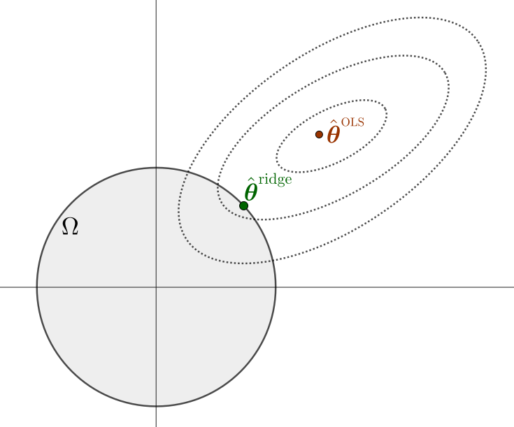
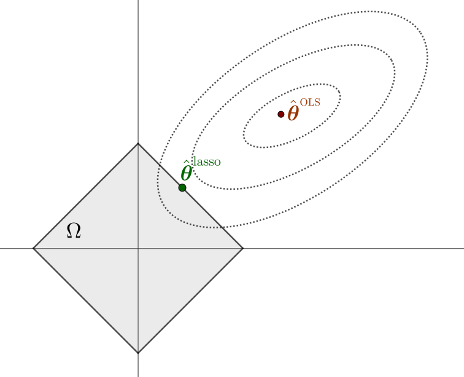

<hr style="border: 1px solid rgba(50, 0, 0, 1);">




<div class="d-flex gap-2">

<a href="../material/apunte_c2s4.pdf" target="_blank" class="btn btn-outline-primary">
<i class="fa-solid fa-file-lines me-2"></i>Versión PDF
</a>

<a href="../material/tp_c2s4.pdf" target="_blank" class="btn btn-outline-success">
<i class="fa-solid fa-clipboard-list me-2"></i>Guía de actividades
</a>

</div>

<div style="margin-top:20px"></div>


Una estrategia clásica para simplificar modelos y mejorar su interpretabilidad es la selección de variables, que consiste en identificar un subconjunto de predictores relevantes y descartar el resto. A pesar de que este enfoque puede conducir a modelos más simples, el hecho de ser un procedimiento discreto (en el que una determinada variable o bien es retenida o bien es eliminada) suele traducirse en alta varianza, ya que una pequeña perturbación en los datos podría conducir a un modelo totalmente diferente.

Por tal motivo, una alternativa más estable y continua son los *métodos de regularización*, que ajustan los parámetros del modelo mediante penalizaciones, con el propósito de reducir la complejidad del modelo final, mejorar la precisión de las predicciones y controlar el sobreajuste. Estos métodos no seleccionan variables de manera abrupta, sino que introducen una penalización que tiende a reducir (o incluso anular) la influencia de las variables menos relevantes.

En las secciones previas hemos visto que, en general, para un problema de aprendizaje supervisado con datos $\{(\xx_i,y_i)\}_{i=1}^n$, donde se pretende modelar una función $f(\xx;\bftheta)$ que dependa del parámetro $\bftheta$, el desempeño del modelo se evalúa mediante una función de pérdida de la forma
$$
J(\bftheta)=\sum_{i=1}^n\text{loss}\,(y_i,f(\xx_i;\bftheta)),
$$

donde $\text{loss}:\RR\times\RR\to\RR_0^+$ mide el error entre las predicciones y las observaciones reales. Por ejemplo, en regresión suele utilizarse la suma de errores al cuadrado (RSS) o el error cuadrático medio (MSE). 

La idea general de los métodos de regularización es modificar la función objetivo, incorporando un término de penalización que depende de los parámetros del modelo. Esto deriva en el problema
$$
\begin{array}{ll}
\text{minimizar} & J(\bftheta) + \lambda \cdot \text{Penalizacion}(\bftheta), 
\end{array}
\tag{2.4.1}
$$

donde $\lambda> 0$ es un *hiperparámetro de complejidad* que controla la intensidad de la regularización (a mayor $\lambda$, mayor intensidad), y $\text{Penalizacion}(\bftheta)$ es una función que restringe la complejidad del modelo. El problema (2.4.1) puede reescribirse con restricciones como
$$
\begin{array}{ll}
\text{minimizar} & J(\bftheta) \\
\text{sujeto a} & \text{Penalizacion}(\bftheta) \leq t,
\end{array}
\tag{2.4.2}
$$

donde $t>0$ es un *hiperparámetro de umbral* ligado al valor de $\lambda$.

Dependiendo de la forma del término de penalización, se obtienen diferentes métodos de regularización. En este apunte nos centraremos en las dos variantes principales, *Ridge regression* y *Lasso*, aplicadas al problema de regresión lineal, analizando su formulación matemática y sus características principales. Ambos métodos serán estudiados tanto en su formulación penalizada (2.4.1) como en su versión restringida (2.4.2). Además, para un conjunto de datos de entrenamiento $\{(\xx_i,y_i)\}_{i=1}^n$, la función de pérdida está determinada por
$$
J(\bftheta):=\frac{1}{2}\text{MSE}=\frac{1}{2n}\|\yy-X\bftheta\|_2^2=\frac{1}{2n}\sum_{i=1}^n(y_i-\bftheta^\top\xx_i)^2,
$$ 

donde MSE son las siglas de *mean squared error* (error cuadrático medio). 


<div style="border-top:1px solid #b7cdf5;
            background-color: #fafbff;
            padding:0.1em 0;
            margin-top:1.5em;">

✏️ **Notación**

Denotaremos $\hat{\bftheta}^{\text{OLS}}$ al estimador de <mark>mínimos cuadrados ordinarios (OLS)</mark>, solución del problema de regresión lineal sin regularización:
$$
\begin{array}{ll}
\text{minimizar} & \displaystyle\frac{1}{2n}\|\yy-X\bftheta\|_2^2.
\end{array}
$$

</div>

<div style="margin-top:2.5em;"></div>


## I <span style="color:#CCCCCC;">│</span> Regresión Ridge

::: {.definicion}
**Definición 2.4.1.** (Problema Ridge) El *problema de regresión Ridge* es
$$
\begin{array}{ll}
\text{minimizar} & \displaystyle\frac{1}{2n}\|\yy-X\bftheta\|_2^2+\lambda\|\bftheta\|_2^2,
\tag{2.4.3}
\end{array}
$$
con $\bftheta\in\RR^p$ las variables de optimización y $\lambda>0$ el hiperparámetro. El punto óptimo, denotado por $\hat{\bftheta}^{\text{ridge}}$, es el *estimador Ridge* de los coeficientes de la regresión.

:::

<div style="margin-top:2em;"></div>


<div class="alert alert-light text-dark" role="important">
<span class="badge bg-warning text-dark">Importante</span>

Vamos a ver que la expresión alternativa de (2.4.3) como problema de optimización con restricciones, a saber

$$
\begin{array}{ll}
\text{minimizar} & \displaystyle\frac{1}{2n}\|\yy-X\bftheta\|_2^2 \\
\text{sujeto a} & \|\bftheta\|_2^2\leq t,
\tag{2.4.4}
\end{array},
$$

impone un valor de $t$ adecuado para que efectivamente sea $\lambda>0$. En primer lugar, la equivalencia entre (2.4.3) y (2.4.4) se deriva directamente del hecho que (2.4.4) es un problema de optimización convexa que verifica la condición de Slater. En efecto, por dualidad fuerte, las condiciones KKT son suficientes y necesarias para la optimalidad (ver [C1-S4](../CAPITULO_1/A4_condiciones_optimalidad.html#relación-entre-dualidad-y-kkt)). En consecuencia, el punto óptimo $\hat{\bftheta}$ de (2.4.4) debe ser un minimizador de
$$
\calL(\bftheta,\lambda^\star)=\frac{1}{2n}\|\yy-X\bftheta\|_2^2+\lambda^\star(\|\bftheta\|_2^2-t),
$$

donde $\calL$ es el Lagrangiano y $\lambda^\star$ es un punto óptimo del problema dual de Lagrange. Observar que está ultima expresión coincide, salvo una constante aditiva, con la función objetivo de (2.4.3), tomando $\lambda=\lambda^\star$. Es decir, que (2.4.3) y (2.4.4) son equivalentes o, lo que es lo mismo, que $\hat{\bftheta}=\hat{\bftheta}^{\text{ridge}}$. 

No obstante, en la formulación penalizada (2.4.3) el parámetro $\lambda>0$ es fijado arbitrariamente. En consecuencia, para que ambos problemas sean efectivamente equivalentes, el valor de $t$ en (2.4.4) debe ser adecuado de modo que se satisfaga $\lambda^\star=\lambda$. Esto deriva en la siguiente pregunta:

<div style="margin-top:1em;"></div>

::: {.myhighlight3}

¿Qué valor $t$ corresponde a un $\lambda>0$?

:::

<div style="margin-top:1em;"></div>

La respuesta radica en la condición KKT de holgura complementaria asociada a la formulación con restricciones (2.4.4): si $\lambda=\lambda^\star$, entonces debe cumplirse
$$
\lambda(\|\hat{\bftheta}^{\text{ridge}}\|_2^2-t)=0.
$$

En consecuencia:

<div style="margin-top:2em;"></div>

::: {.myhighlight}

Si $\lambda>0$, entonces $t=\|\hat{\bftheta}^{\text{ridge}}\|_2^2$.

:::

<div style="margin-top:2em;"></div>


Debe quedar claro que la solución del problema (2.4.4) para un valor arbitrario de $t$ no necesariamente activa la restricción de desigualdad. En caso de no hacerlo, la holgura complementaria impone $\lambda=0$ y no hay penalización.

</div>

<figure style="text-align: center;">
  
  <figcaption> **Figura 2.4.1**. Interpretación geométrica del problema Ridge, de acuerdo a su formulación con restricciones (2.4.4). Bajo la suposición $\lambda>0$, el punto óptimo ocurre en la frontera del conjunto factible $\Omega:=\{\bftheta\in\RR^p \mid \|\bftheta\|_2^2\leq t\}$. </figcaption>
</figure>

<div style="margin-top:2em;"></div>


### Características del problema Ridge

Desarrollamos la función objetivo del problema Ridge (2.4.3):
$$
J(\bftheta)=\frac{1}{2n}\|\yy-X\bftheta\|_2^2+\lambda\|\bftheta\|_2^2=\frac{1}{2n}\bftheta^\top X^\top X\bftheta+\lambda\bftheta^\top\bftheta-\frac{1}{n}\bftheta^\top X^\top\yy+\frac{1}{2n}\yy^\top\yy.
$$

<div style="margin-top:1em;"></div>

Se tiene que
$$
\nabla J(\bftheta)=\frac{1}{n}X^\top X\bftheta+2\lambda\bftheta-\frac{1}{n}X^\top \yy=\left(\frac{1}{n}X^\top X+2\lambda I\right)\bftheta-\frac{1}{n}X^\top\yy,
\tag{2.4.5}
$$
$$
\nabla^2J(\bftheta)=\frac{1}{n}X^\top X+2\lambda I\succ 0.
$$


::: {.callout .question}
<span style="font-size: 1.3em;">📝</span><br>

Verifique que $\frac{1}{n}X^\top X+2\lambda I$ es simétrica definida positiva. 

:::

<div style="margin-top:2em;"></div>

La función objetivo $J$ es estrictamente convexa. Por lo tanto, de haber solución, es única. Además, la existencia de la solución es cierta, en virtud del hecho de que el conjunto factible en (2.4.4) es cerrado y acotado. Estamos en condiciones de hacer la siguiente afirmación:

::: {.myhighlight}

El problema Ridge tiene solución única.

:::

<div style="margin-top:2em;"></div>

<div class="alert alert-light text-dark" role="important">
<span class="badge bg-warning text-dark">Importante</span>

La existencia también puede justificarse directamente a partir de la formulación sin restricciones (2.4.3). La función objetivo $J$ crece indefinidamente en cualquier dirección a partir de cualquier punto $\bftheta$; esto es,
$$
\lim_{t\to\infty}f(\bftheta+t\dd)=\infty\qquad\forall\bftheta\in\RR^p,\;\forall\dd\in\RR^p,\,\dd\neq\bfzero.
$$

En efecto,
$$
\lim_{t\to\infty}f(\bftheta+t\dd)\geq\lim_{t\to\infty}\lambda\|\bftheta+t\dd\|_2^2=\lambda\lim_{t\to\infty}\left(t^2\|\dd\|_2^2+2t\,\bftheta^\top\dd+\|\bftheta\|_2^2\right)=\infty.
$$


Este comportamiento de $f$ permite afirmar que no tiene direcciones de decrecimiento, también llamadas *direcciones de recesión*. Resultados teóricos (ver, por ejemplo, Teorema 27.1 de (Rockafellar, 1970)) aseguran que, en tales condiciones, un problema de optimización tiene al menos una solución.

</div>

<div style="margin-top:2em;"></div>


### Solución del problema Ridge

Para caracterizar la solución del problema Ridge, utilizaremos la condición de optimalidad $\nabla f(\hat{\bftheta}^{\text{ridge}})=\bfzero$. De (2.4.5) resulta 
$$
\left(\frac{1}{n}X^\top X+2\lambda I\right)\hat{\bftheta}^{\text{ridge}}-\frac{1}{n}X^\top \yy=\bfzero
$$

Dado que $\frac{1}{n}X^\top X+2\lambda I\succ 0$, es invertible. En consecuencia:

::: {.myhighlight}

La fórmula cerrada para el estimador Ridge es
$$
\hat{\bftheta}^{\text{ridge}}=\frac{1}{n}\left(\frac{1}{n}X^\top X+2\lambda I\right)^{-1}X^\top \yy.
$$
:::

<div style="margin-top:2em;"></div>

Por supuesto, en problemas donde la aplicación directa de esta fórmula resulta costosa, es más adecuado emplear métodos de optimización para aproximar la solución de manera eficiente. 

<div style="margin-top:2em;"></div>

::: {.callout-example}
<span class="badge bg-primary">Ejemplo 2.4.2</span> 
<span style="color: #0d6efd; font-family: Arial; font-weight: bold; font-size: 0.85em;">
Regresión Ridge en datos de diabetes
</span>

Utilizaremos el conjunto de datos de diabetes de `sklearn.datasets` [disponible aquí](https://scikit-learn.org/stable/modules/generated/sklearn.datasets.load_diabetes.html), el cual consiste en 442 observaciones de 10 variables predictoras.

Veremos el efecto que causa el valor del parámetro $\lambda$ en el valor de los coeficientes estimados para el modelo. Además, elegiremos $\lambda$ por validación cruzada y presentaremos los coeficientes resultantes del modelo ajustado.

```{python}
#| code-summary: "Mostrar código"
#| code-fold: false
#| code-line-numbers: true
#| fig-align: "center"

import numpy as np
import matplotlib.pyplot as plt
from sklearn.datasets import load_diabetes
from sklearn.linear_model import Ridge, RidgeCV
from sklearn.model_selection import cross_val_score
from sklearn.preprocessing import StandardScaler

# Datos:
X, y = load_diabetes(return_X_y=True)
scaler = StandardScaler()
X = scaler.fit_transform(X)  

# Parámetro lambda:
lambdas = np.logspace(-3, 7, 200) 

# Entrenamiento de Ridge:
coefs = []
for a in lambdas:
    ridge = Ridge(alpha=a, fit_intercept=True)
    ridge.fit(X, y)
    coefs.append(ridge.coef_)

coefs = np.array(coefs)

# MSE:
mse_means = []
for a in lambdas:
    ridge = Ridge(alpha=a)
    mse_scores = -cross_val_score(ridge, X, y,
                                  scoring="neg_mean_squared_error",
                                  cv=10)
    mse_means.append(mse_scores.mean())

# Mejor lambda por CV:
Ridge_cv = RidgeCV(alphas=lambdas, cv=10, scoring="neg_mean_squared_error")
Ridge_cv.fit(X, y)
best_lambda = Ridge_cv.alpha_

idx_best = np.where(lambdas == best_lambda)[0][0]
mse_best = mse_means[idx_best]
```

```{python}
#| echo: false
#| fig-align: "center"
# 📈:
plt.figure(figsize=(8, 6))

# Trace plot:
plt.subplot(2, 1, 1)
plt.plot(np.log10(lambdas), coefs, alpha=0.7)
plt.axvline(np.log10(best_lambda), color="k", ls="--", label=fr"$\lambda$ óptimo = {best_lambda:.2f}")
plt.xlabel(r"$\log_{10}(\lambda)$", fontsize=13)
plt.ylabel("Coeficientes", fontsize=13)
plt.title("Trace plot (Ridge)", fontsize=15)
plt.legend(fontsize=12, loc='upper right')

# MSE vs lambda:
plt.subplot(2, 1, 2)
plt.scatter(np.log10(lambdas), mse_means, s=20, alpha=0.5)
plt.axvline(np.log10(best_lambda), color="k", ls="--", label=fr"$\lambda$ óptimo = {best_lambda:.2f}")
plt.xlabel(r"$\log_{10}(\lambda)$", fontsize=13)
plt.ylabel("MSE", fontsize=13)
plt.title(r"MSE vs $\lambda$ (Ridge)", fontsize=15)
plt.legend(fontsize=12, loc='upper left')
plt.tight_layout()
plt.show()


# 📋 (lambda óptimo):
Ridge_best = Ridge(alpha=best_lambda)
Ridge_best.fit(X, y)

print(f"Coeficientes de Ridge con lambda óptimo (MSE = {mse_best:.2f}):")
for i, coef in enumerate(Ridge_best.coef_):
    print(f"θ_{i+1} = {coef:.2f}")

```

:::

<div style="margin-top:2.5em;"></div>


## II <span style="color:#CCCCCC;">│</span> Lasso

::: {.definicion}
**Definición 2.4.3.** (Problema Lasso) El *problema de regresión Lasso* es
$$
\begin{array}{ll}
\text{minimizar} & \frac{1}{2n}\|\yy-X\bftheta\|_2^2+\lambda\|\bftheta\|_1,
\end{array}
\tag{2.4.6}
$$
con $\bftheta\in\RR^p$ las variables de optimización y $\lambda>0$ el hiperparámetro. El punto óptimo, denotado por $\hat{\bftheta}^{\text{lasso}}$, es el *estimador Lasso* de los coeficientes de la regresión.

:::

<div style="margin-top:1em;"></div>

De manera similar al análisis para el problema Ridge, el problema Lasso admite la siguiente formulación con restricciones:
$$
\begin{array}{ll}
\text{minimizar} & \frac{1}{2n}\|\yy-X\bftheta\|_2^2 \\
\text{sujeto a} & \|\bftheta\|_1\leq t.
\end{array}
\tag{2.4.7}
$$

Análogamente a Ridge:

::: {.myhighlight}

Si $\lambda>0$, entonces $t=\|\hat{\bftheta}^{\text{lasso}}\|_1$.

:::

<div style="margin-top:2em;"></div>

<figure style="text-align: center;">
  
  <figcaption> **Figura 2.4.2**. Interpretación geométrica del problema Lasso, de acuerdo a su formulación con restricciones (2.4.7). Bajo la suposición $\lambda>0$, el punto óptimo ocurre en la frontera del conjunto factible $\Omega:=\{\bftheta\in\RR^p \mid \|\bftheta\|_1\leq t\}$. </figcaption>
</figure>

<div style="margin-top:2em;"></div>


### Características del problema Lasso

Una de las principales diferencias entre el problema Lasso y el problema Ridge queda determinado por la siguiente afirmación:

::: {.myhighlight}

El problema Lasso o bien tiene solución única o bien tiene infinitas soluciones.

:::

<div style="margin-top:1em;"></div>


::: {.callout .question}
<span style="font-size: 1.3em;">📝</span><br>
Justifique la existencia de solución del problema Lasso.

:::


<div style="margin-top:2em;"></div>

Las dos posibilidades mencionadas se derivan de la matriz Hessiana de la función objetivo de la formulación con restricciones (2.4.7):
$$
\nabla^2 J(\bftheta)=\frac{1}{n}X^\top X.
$$

- Si $\text{rango}\,X=p$, entonces $\frac{1}{n}X^\top X\succ 0$ (¿por qué?). Luego, la función objetivo es estrictamente convexa y concluimos que el problema tiene solución única.

- Si $\text{rango}\,X<p$, la solución puede no ser única. En caso de no ser única, habrán infinitas soluciones. Para justificar esto último, supongamos $\hat{\bftheta}^{\text{lasso},1}$ y $\hat{\bftheta}^{\text{lasso},2}$ diferentes estimadores Lasso; entonces
$$
t\hat{\bftheta}^{\text{lasso},1}+(1-t)\hat{\bftheta}^{\text{lasso},2},\qquad t\in(0,1),
$$
también es una solución, por convexidad del conjunto solución de un problema de optimización convexa.


Otras características importantes del problema Lasso se enuncian en el siguiente lema. 


::: {.teorema}
**Lema 2.4.4.** Sean $X\in\RR^{n\times p}$, $\yy\in\RR^n$ y $\lambda>0$. El valor *fiteado* $X\hat{\bftheta}^{\text{lasso}}$ y la norma $\|\hat{\bftheta}^{\text{lasso}}\|_1$ son independientes de la elección del estimador Lasso.

:::

<details>
<summary>Mostrar detalles</summary>

::: {.panel-tabset}

### <span style="border: 1px solid #ddd; padding: 2px 6px; border-radius: 4px;">*Demostración*</span>

\(i\) Sean $\hat{\bftheta}^{\text{lasso},1}$ y $\hat{\bftheta}^{\text{lasso},2}$ soluciones del problema Lasso tales que $X \hat{\bftheta}^{\text{lasso},1} \neq X \hat{\bftheta}^{\text{lasso},2}$. Para $0<t<1$, denotemos 
$$
\hat{\bftheta}^{\text{lasso},t}:=t\hat{\bftheta}^{\text{lasso},1}+(1-t)\hat{\bftheta}^{\text{lasso},2}.
$$

La convexidad estricta de $h(\xx)=\|\yy-\xx\|_2^2$ y la suposición $X\hat{\bftheta}^{\text{lasso},1}\neq X\hat{\bftheta}^{\text{lasso},1}$ permiten escrbir
$$
\|\yy-X\hat{\bftheta}^{\text{lasso},t}\|_2^2<t\|\yy-X\hat{\bftheta}^{\text{lasso},1}\|_2^2+(1-t)\|\yy-X\hat{\bftheta}^{\text{lasso},2}\|_2^2.
$$

Además, la norma 1 es convexa, tal que 
$$
\|\hat{\bftheta}^{\text{lasso},t}\|_1\leq\|\hat{\bftheta}^{\text{lasso},1}\|_1+(1-t)\|\hat{\bftheta}^{\text{lasso},2}\|_1.
$$

Combinando las desigualdades anteriores, se deduce
$$
\frac{1}{2n}\|\yy-X\hat{\bftheta}^{\text{lasso},t}\|_2^2+\lambda\|\hat{\bftheta}^{\text{lasso},t}\|_1<t J(\hat{\bftheta}^{\text{lasso},1})+(1-t)J(\hat{\bftheta}^{\text{lasso},2}) =p^\star,
$$
donde $p^\star$ es el valor óptimo del problema Lasso. El resultado contradice el hecho de que $p^\star$ es el valor óptimo y, en consecuencia, debe ser
$$
X \hat{\bftheta}^{\text{lasso},1} = X \hat{\bftheta}^{\text{lasso},2}.
$$

\(ii\) De la prueba anterior, está claro que
$$
\frac{1}{2n}\|\yy-X\hat{\bftheta}^{\text{lasso},1}\|_2^2=\frac{1}{2n}\|\yy-X\hat{\bftheta}^{\text{lasso},2}\|_2^2.
$$

Pero ambos minimizan la función objetivo en (2.4.7). Como $\lambda>0$, debe ser
$$
\|\hat{\bftheta}^{\text{lasso},1}\|_1=\|\hat{\bftheta}^{\text{lasso},2}\|_1.
$$

<div style="margin-top:-1em;"></div>
<div style="text-align: right;">$\blacksquare$</div>


:::
</details>

<div style="margin-top:2em;"></div>


### Solución del problema Lasso

A diferencia del problema Ridge, la función objetivo del problema Lasso no es una función diferenciable, debido a la presencia del término
$$
\|\bftheta\|_1:=\sum_{i=1}^p|\theta_1|+\ldots+|\theta_p|.
$$

Por tal motivo, para el análisis de las condiciones KKT es necesario primero hacer un breve repaso del concepto de subdiferencial. Luego, las condiciones KKT también pueden ser formuladas en términos de subdiferenciales, con el propósito de caracterizar la solución del problema Lasso.


<div class="alert alert-light text-dark" role="important">
<span class="badge bg-warning text-dark">Importante</span>

El *subdiferencial* de una función convexa $f:\RR^p\to\RR$ en un punto $\xx_0\in\text{dom}\,f$ es el conjunto
$$
\partial f(\xx_0):=\{\bfgamma\in\RR^p \mid f(\xx)\geq f(\xx_0)+\bfgamma^\top(\xx-\xx_0)\quad\forall\xx\in\text{dom}\,f\}.
$$

<div style="margin-top:2em;"></div>

Un par de características importantes son:

- El subdiferencial $\partial f(\xx_0)$ es siempre un conjunto convexo no vacío.

- Si $f$ es diferenciable en $\xx_0$, entonces $\partial f(\xx_0)=\{\nabla f(\xx_0)\}$.

- La condición de optimalidad para problemas de optimización *sin restricciones* está dada por el siguiente resultado. La prueba es sencilla y queda como ejercicio.

::: {.teorema}
**Teorema 2.4.5.** (Condición suficiente y necesaria de optimalidad de primer orden para problemas convexos sin restricciones mediante subdiferenciales) Sea $f:\RR^p \to \RR$ una función convexa. Entonces $\xx^\star\in\text{dom}\,f$ es un minimizador de $f$ si y solo si
$$
\bfzero \in \partial f(\xx^\star).
$$

:::

</div>

<div style="margin-top:2em;"></div>

::: {.callout-example}
<span class="badge bg-primary">Ejemplo 2.4.6</span> 
<span style="color: #0d6efd; font-family: Arial; font-weight: bold; font-size: 0.85em;">
Subdiferencial de la norma 1
</span>

Como ya sabemos, la norma 1 es la función $\|\cdot\|_1:\RR^p\to\RR$ definida por
$$
\|\xx\|_1:=\sum_{i=1}^p|x_i|.
$$

Esta función es diferenciable en todos los puntos $\xx$ tales que $x_i\neq 0$ para todo $i=1,\ldots,p$. En tales puntos su subdiferencial está determinado por el vector gradiente; esto es,
$$
\nabla \|\xx\|_1=(\text{sign}(x_1),\ldots,\text{sign}(x_p))\qquad \forall\xx\neq\bfzero.
$$

Sin embargo, si la $i$-ésima coordenada es 0, el subdiferencial tomará en esa componente el valor $[-1,1]$. Por lo tanto, $\partial \|\xx\|_1$ está formado por todos los vectores $\bfgamma$ que verifican
$$
\gamma_i=\begin{cases}
{\text{sign}(x_i)} & \mbox{si }x_i\neq 0,\\
[-1,1] & \mbox{si }x_i=0.
\end{cases}
$$

<figure style="text-align: center;">
  
  <figcaption> **Figura 2.4.3**. Subdiferencial de la función $f(x,y)=|x| + |y|$ en $(1,0)$.</figcaption>
</figure>

:::


<div style="margin-top:2em;"></div>


La condición de optimalidad para el problema Lasso es
$$
\bfzero\in \frac{1}{n}X^\top(X\hat{\bftheta}^{\text{lasso}}-\yy)+\lambda\,\partial \|\hat{\bftheta}^{\text{lasso}}\|_1.
$$

De manera equivalente, podemos afirmar que existe $\bfgamma\in\partial\|\hat{\bftheta}^{\text{lasso}}\|_1$ tal que
$$
\begin{align*}
\frac{1}{n}X^\top(X\hat{\bftheta}^{\text{lasso}}-\yy)+\lambda\bfgamma&=\bfzero \\
\frac{1}{n}X^\top(\yy-X\hat{\bftheta}^{\text{lasso}})&=\lambda\bfgamma.
\end{align*}
\tag{2.4.8}
$$

Del Ejemplo 2.4.6, el vector $\bfgamma$ debe verificar lo siguiente:
$$
\gamma_i=\begin{cases}
{\text{sign}(\hat{\theta}_i^{\text{lasso}})} & \mbox{si }\hat{\theta}_i^{\text{lasso}}\neq 0,\\
[-1,1] & \mbox{si }\hat{\theta}_i^{\text{lasso}}=0.
\end{cases}
\tag{2.4.9}
$$

En la expresión (2.4.8), la componente $i$-ésima del vector del lado izquierdo mide la relación entre cada variable predictora $X_i$ y el residuo $\bfr:=\yy-X\hat{\bftheta}^{\text{lasso}}$. En efecto, cuando $X_i$ e $\yy$ están estandarizados, esta cantidad es proporcional a la correlación de Pearson:
$$
\text{cor}(X_i,\bfr):=\frac{\text{cov}(X_i,\bfr)}{\sqrt{\text{var}(X_i)\text{var}(\bfr)}}=\frac{\frac{1}{n}X_i^\top\bfr}{\sqrt{\frac{1}{n}\|\bfr\|_2^2}}\propto X_i^\top\bfr.
$$

<div style="margin-top:2em;"></div>


Ahora bien, de (2.4.8) y (2.4.9) podemos afirmar que:

::: {.myhighlight}

$\left|X_i^\top(\yy-X\hat{\bftheta}^{\text{lasso}})\right|\leq n\lambda\qquad\forall i=1,\ldots,p$.

Además, una condición suficiente para la igualdad es $\hat{\theta}_i^{\text{lasso}}\neq 0$.

:::

<div style="margin-top:2em;"></div>


Así, las variables que son incluidas en el modelo tienen correlación absoluta máxima con el residuo. Esto muestra que el valor de $\lambda$ determina la exigencia del modelo para incluir una variable: valores grandes de $\lambda$ indican que únicamente variables con correlación fuerte con el residuo son consideradas para el modelo, mientras que valores pequeños de $\lambda$ relajan el criterio de inclusión de variables. Esta idea motiva la siguiente definición.

<div style="margin-top:1em;"></div>


::: {.definicion}
**Definición 2.4.7.** (Conjunto de equicorrelación) Sea $\hat{\bftheta}^{\text{lasso}}$ una solución del problema Lasso. Se define el *conjunto de equicorrelación* $\calE$ como
$$
\calE:=\left\{i\in\{1,\ldots,p\} \mid \left|X_i^\top \left(\yy-X\hat{\bftheta}^{\text{lasso}}\right)\right|=n\lambda\right\}.
$$

:::


::: {.callout .question}

<span style="font-size: 1.3em;">📝</span><br>
Justifique que el conjunto de equicorrelación es el mismo para cualquier solución del problema Lasso.

:::

<div style="margin-top:2em;"></div>


Vamos a separar el vector $\hat{\bftheta}^{\text{lasso}}$ en dos subvectores, discriminando de acuerdo a si el índice está o no en $\calE$. Para ello, denotamos
$$
\hat{\bftheta}_{\calE}^{\text{lasso}}=(\hat{\theta}_{i}^{\text{lasso}})_{i\in\calE},\qquad \hat{\bftheta}_{-\calE}^{\text{lasso}}=(\hat{\theta}_{i}^{\text{lasso}})_{i\notin\calE}.
$$

<div style="margin-top:2em;"></div>

Claramente, $\hat{\bftheta}_{-\calE}^{\text{lasso}}$ es un vector nulo. Por su parte, $\hat{\bftheta}_{\calE}$ puede o no tener componentes nulas, ya que $\calE$ puede contener índices de variables que no sean incluidas en el modelo. En efecto, para algún índice $i_0$ puede ocurrir que $\hat{\theta}_{i_0}^{\text{lasso}}=0$ y $\gamma_{i_0}=\pm 1$, tal que $i_0\in\calE$. En otras palabras:

::: {.myhighlight}

El conjunto $\calE$ incluye todos los índices candidatos a tener coeficientes no nulos. A las variables con coeficiente no nulo las llamaremos *variables activas*.

:::

<div style="margin-top:2em;"></div>

Ahora bien, llegados a este punto, cabe preguntarse:


::: {.myhighlight3}

¿Hay una expresión analítica para $\hat{\bftheta}^{\text{lasso}}$?

:::

<div style="margin-top:1em;"></div>


En general, la respuesta es no. Si bien es posible obtener una caracterización analítica de $\hat{\bftheta}^{\text{lasso}}$, esta depende del conjunto de equicorrelación $\calE$ y de un vector de signos asociado (ver Lema 2 de (Tibshirani 2013)). Salvo en algunos casos particulares, ambos elementos se obtienen a partir de una solución del problema Lasso y, por lo tanto, no se conocen de antemano. En consecuencia, dicha caracterización no proporciona un método efectivo para obtener el estimador. Por este motivo, en la práctica se recurre a algoritmos iterativos eficientes. Uno de los más populares y efectivos es el *descenso por coordenadas*, que describiremos a continuación.


### Resolución por descenso por coordenadas

Si denotamos $Q=\frac{1}{n}X^\top X\in\RR^{p\times p}$ y $\vv=\frac{1}{n}X^\top\yy\in\RR^{p}$, la formulación (2.4.6) del problema Lasso es equivalente a
$$
\begin{array}{ll}
\text{minimizar } & \displaystyle\frac{1}{2}\bftheta^\top Q\bftheta-\bftheta^\top\vv+\lambda\|\bftheta\|_1.
\end{array}
\tag{2.4.10}
$$


::: {.callout .question}

<span style="font-size: 1.3em;">📝</span><br>
Justifique la expresión (2.4.10).

:::

<div style="margin-top:2em;"></div>

La función objetivo en (2.4.10) puede escribirse como
$$
f(\bftheta)=\frac{1}{2}\sum_{i=1}^p\sum_{j=1}^p \theta_i Q_{ij}\theta_j-\sum_{i=1}^p v_i\theta_i+\lambda\sum_{i=1}^p|\theta_i|.
\tag{2.4.11}
$$

Nos planteamos lo siguiente:

::: {.myhighlight3}

¿Qué obtenemos al minimizar respecto a un solo parámetro $\theta_k$, con los demás fijos?

:::

<div style="margin-top:2em;"></div>


Sea $k\in\{1,\ldots,p\}$. Al dejar fijas todas las variables de optimización excepto $\theta_k$, estamos formulando un problema de optimización univariada, cuya función objetivo es
$$
\tilde{f}(\theta_k)=\frac{1}{2}Q_{kk}\theta_k^2+\theta_k\sum_{\substack{i=1 \\ i \neq k}}^pQ_{ik}\theta_i-v_k\theta_k+\lambda|\theta_k|+\text{constante}.
\tag{2.4.12}
$$

::: {.callout .question}

<span style="font-size: 1.3em;">📝</span><br>
Justifique la expresión (2.4.12), partiendo de (2.4.11) y marcando como constante los términos que no dependen de $k$.

:::

<div style="margin-top:2em;"></div>


Por lo tanto, resulta
$$
\frac{\tilde{f}(\theta_k)}{Q_{kk}}=\frac{1}{2}\theta_k^2-\frac{v_k-\sum_{\substack{i=1 \\ i \neq k}}^pQ_{ik}\theta_i}{Q_{kk}}\theta_k+\frac{\lambda}{Q_{kk}}|\theta_k|+\text{constante}.
$$

<div style="margin-top:2em;"></div>

Finalmente, el problema de optimización univariada resultante es
$$
\begin{array}{ll}
\text{minimizar } & \displaystyle\frac{1}{2}\theta_k^2-s\theta_k+\tau|\theta_k|,
\end{array}
\tag{2.4.13}
$$
con
$$
s=\frac{v_k-\sum_{\substack{i=1 \\ i \neq k}}^pQ_{ik}\theta_i}{Q_{kk}},\qquad \tau=\frac{\lambda}{Q_{kk}}.
$$


El estudio de (2.4.13) conduce a la denominada <mark>función de *soft-thresholding*</mark>, que presentamos a continuación. 


<div class="alert alert-light text-dark" role="important">
<span class="badge bg-success text-light">Función de *soft-thresholding*</span>

Un problema equivalente a (2.4.13) es el siguiente:
$$
\begin{array}{ll}
\text{minimizar } & \displaystyle\frac{1}{2}(\theta-s)^2+\tau|\theta|.
\end{array}
$$

Aquí, $s\in\RR$ y $\tau> 0$. La función objetivo $f$ es convexa pero no diferenciable. Su subdiferencial es
$$
\partial f(\theta)=\left\{
  \begin{array}{cl}
  \{\theta-s+\tau\,\text{sign}\,\theta\} & \mbox{si }\theta\neq 0\\
  [-s-\tau,-s+\tau] & \mbox{si }\theta = 0.
  \end{array}
  \right.
$$

Sabemos que $\theta^\star$ es punto óptimo si y solo si $0\in\partial f(\theta^\star)$. Del análisis de esta condición resulta
$$
\theta^\star=\left\{\begin{array}{cl}
s-\tau & \mbox{si }s>\tau,\\
0 & \mbox{si }|s|\leq\tau,\\
s+\tau & \mbox{si }s<-\tau.
\end{array}
\right.
$$


<details>
<summary>Mostrar detalles</summary>

::: {.panel-tabset}

### <span style="border: 1px solid #ddd; padding: 2px 6px; border-radius: 4px;">*Caso $\theta^\star>0$*</span>

Se tiene $\text{sign}\,\theta^\star=1$. Entonces la condición resulta en
$$
\begin{align}
\theta^\star-s+\tau &= 0 \\
\theta^\star &=s-\tau.
\end{align}
$$

Esto es válido siempre que $s-\tau>0$.


### <span style="border: 1px solid #ddd; padding: 2px 6px; border-radius: 4px;">*Caso $\theta^\star<0$*</span>

Aquí $\text{sign}\,\theta^\star=-1$, tal que
$$
\begin{align}
\theta^\star-s-\tau & = 0 \\
\theta^\star &= s+\tau.
\end{align}
$$

Esto es válido siempre que $s+\tau <0$.


### <span style="border: 1px solid #ddd; padding: 2px 6px; border-radius: 4px;">*Caso $\theta^\star=0$*</span>

Esto ocurre si y solo si
$$
\begin{align}
-s-\tau<&0<-s+\tau \\
-\tau <&s<\tau \\
&|s|<\tau.
\end{align}
$$

:::
</details>


Una expresión alternativa es
$$
\theta^\star=\text{sign}(s)\cdot\max\{|s|-\tau,0\}.
$$


::: {.definicion}
**Definición 2.4.8.** (Función *soft-thresholding*) Sea $\tau>0$. La función *soft-thresholding* $\text{soft}_{\tau}:\RR\to\RR$ se define por 
$$
\text{soft}_{\tau}(s):=\text{sign}(s)\cdot\max\{|s|-\tau,0\}.
$$

:::

Veamos la gráfica:

```{pyodide-python}
#| echo: false
#| fig-align: "center"
#| context: ojs
#| input: [tau]

import numpy as np
import matplotlib.pyplot as plt

def soft_threshold(s, tau):
    return np.sign(s) * np.maximum(np.abs(s) - tau, 0)

# Rango de s
s_vals = np.linspace(-4,4, 500)

# Calcular la función soft-thresholding
soft_vals = soft_threshold(s_vals, tau)

# Graficar
plt.figure(figsize=(6,4))
plt.axhline(0, color='black', linewidth=1)
plt.axvline(0, color='black', linewidth=1)
plt.plot(s_vals, soft_vals, label=r'$\mathcal{S}_\tau(s)$', color='blue', linewidth=2.5)
plt.axvline(tau, color='darkorange', linestyle='--', linewidth=0.5)
plt.axvline(-tau, color='darkorange', linestyle='--', linewidth=0.5)


# Cambiar etiquetas del eje x
xticks = [-tau-1,-tau, 0, tau, tau+1]
xtick_labels = [r'$-\tau -1$',r'$-\tau$', r'$0$', r'$\tau$',r'$\tau +1$']
plt.xticks(xticks, xtick_labels)
plt.xlim(-4,4)
plt.ylim(-4,4)

plt.xlabel(r'$s$')
plt.ylabel(r'$\text{soft}_\tau(s)$')
plt.tight_layout()
plt.show()
```

```{ojs}
//| echo: false
viewof tau = Inputs.range([0.1, 2.5], {
  step: 0.1,
  label: "𝜏:",
  value: 1
})
```

</div>

<div style="margin-top:2em;"></div>


Volvamos al problema de interés (2.4.13). Recordemos que el propósito era analizar la solución del problema Lasso cuando fijamos todos los parámetros excepto uno. De acuerdo a lo visto, para minimizar $\theta_k$ para algún $k=1,\ldots,p$, manteniendo el resto fijo, resulta
$$
\theta_k^\star=\text{soft}_{\tau}\left(\frac{v_k-\sum_{\substack{i=1 \\ i \neq k}}^pQ_{ik}\theta_i}{Q_{kk}}\right),\qquad \tau=\frac{\lambda}{Q_{kk}}.
$$

Ya estamos en condiciones de definir el algoritmo iterativo de descenso por coordenadas para resolver un problema Lasso.

<div style="margin-top:2em;"></div>


::: {.highlight}
<span class="badge bg-custom">Algoritmo de descenso por coordenadas</span>

---

Dado un *párametro inicial* $\bftheta^{(0)}\in\RR^p$ (en general, $\bftheta^{(0)}=\bfzero$) y un *hiperparámetro de penalización* $\lambda>0$:

<div style="margin-left: 1em">

**repetir** para $t = 1,2,\dots$:

> **1°** Inicializar $\bftheta^{(t)}=\bftheta^{(t-1)}$.
>
> **2°** Para $k=1,\ldots,p$:
>
> $\qquad$ ● Calcular $s_k=\left(v_k-\sum_{\substack{i=1 \\ i \neq k}}^pQ_{ik}\theta_i^{(t)}\right)/Q_{kk}$.
>
> $\qquad$ ● Actualizar $\theta_k^{(t)}=\text{soft}_{\tau}(s_k)$ con $\tau=\lambda/Q_{kk}$.

**hasta** que el criterio de parada se satisfaga.

</div>

---

:::

<div style="margin-top:2em;"></div>


Observar que, en cada iteración $t$, el vector $\bftheta^{(t)}$ se va actualizando coordenada por coordenada, utilizando los valores más recientes dentro de la misma iteración. Otra alternativa es actualizar todas las coordenadas en bloque a partir del mismo vector $\bftheta^{(t-1)}$, aunque este último enfoque suele presentar una convergencia más lenta en este algoritmo.

<div style="margin-top:2em;"></div>


::: {.callout-example}
<span class="badge bg-primary">Ejemplo 2.4.8</span> 
<span style="color: #0d6efd; font-family: Arial; font-weight: bold; font-size: 0.85em;">
Regresión Lasso en datos de diabetes
</span>

Al igual que en el Ejemplo 2.4.2 para el caso de Ridge, implementaremos Lasso sobre el conjunto de datos de diabetes. Esta vez, podemos esperar que algunos coeficientes se anulen, lo que reflejará la selección de variables realizada por el modelo.

```{python}
#| code-summary: "Mostrar código"
#| code-fold: false
#| code-line-numbers: true
#| fig-align: "center"

import numpy as np
import matplotlib.pyplot as plt
from sklearn.datasets import load_diabetes
from sklearn.linear_model import Lasso, LassoCV
from sklearn.model_selection import cross_val_score
from sklearn.preprocessing import StandardScaler

# Datos:
X, y = load_diabetes(return_X_y=True)
scaler = StandardScaler()
X = scaler.fit_transform(X)  

# Parámetro lambda:
lambdas = np.logspace(-3, 7, 200) 

# Entrenamiento de Lasso:
coefs = []
for a in lambdas:
    lasso = Lasso(alpha=a, fit_intercept=True, max_iter=5000)
    lasso.fit(X, y)
    coefs.append(lasso.coef_)

coefs = np.array(coefs)

# MSE:
mse_means = []
for a in lambdas:
    lasso = Lasso(alpha=a, max_iter=5000)
    mse_scores = -cross_val_score(lasso, X, y,
                                  scoring="neg_mean_squared_error",
                                  cv=10)
    mse_means.append(mse_scores.mean())

# Mejor lambda por CV:
Lasso_cv = LassoCV(alphas=lambdas, cv=10, max_iter=5000)
Lasso_cv.fit(X, y)
best_lambda = Lasso_cv.alpha_

idx_best = np.where(lambdas == best_lambda)[0][0]
mse_best = mse_means[idx_best]
```

```{python}
#| echo: false
#| fig-align: "center"

# 📈:
plt.figure(figsize=(8, 6))

# Trace plot:
plt.subplot(2, 1, 1)
plt.plot(np.log10(lambdas), coefs)
plt.axvline(np.log10(best_lambda), color="k", ls="--", label=fr"$\lambda$ óptimo = {best_lambda:.2f}")
plt.xlabel(r"$\log_{10}(\lambda)$", fontsize=13)
plt.ylabel("Coeficientes", fontsize=13)
plt.title("Trace plot (Lasso)", fontsize=15)
plt.legend(fontsize=12, loc='upper right')

# MSE vs lambda:
plt.subplot(2, 1, 2)
plt.scatter(np.log10(lambdas), mse_means, s=20, alpha=0.5)
plt.axvline(np.log10(best_lambda), color="k", ls="--", label=fr"$\lambda$ óptimo = {best_lambda:.2f}")
plt.xlabel(r"$\log_{10}(\lambda)$", fontsize=13)
plt.ylabel("MSE", fontsize=13)
plt.title(r"MSE vs $\lambda$ (Lasso)", fontsize=15)
plt.legend(fontsize=12, loc='upper left')
plt.tight_layout()
plt.show()

# 📋 (lambda óptimo):
Lasso_best = Lasso(alpha=best_lambda, max_iter=5000)
Lasso_best.fit(X, y)

print(f"Coeficientes de Lasso con lambda óptimo (MSE = {mse_best:.2f}):")
for i, coef in enumerate(Lasso_best.coef_):
    print(f"θ_{i+1} = {coef:.2f}")

```

:::

<div style="margin-top:2.5em;"></div>


## III <span style="color:#CCCCCC;">│</span>  Elastic Net, convergencia y comparaciones

Hasta este punto hemos estudiado los métodos de regularización Ridge y Lasso. El método *Elastic Net* combina ambas penalizaciones en una única formulación, permitiendo equilibrar ambos enfoques. En esta sección presentaremos su formulación, veremos algunjs ejemplos comparativos y discutiremos algunos aspectos relacionados con la convergencia de los algoritmos de optimización.

::: {.definicion}
**Definición 2.4.9.** (Problema Elastic Net) El *problema de regresión Elastic Net* es
$$
\begin{array}{ll}
\text{minimizar} & \frac{1}{2n}\|\yy-X\bftheta\|_2^2+\lambda_1\|\bftheta\|_1+\lambda_2\|\bftheta\|_2^2.
\tag{17}
\end{array}
$$

con $\bftheta\in\RR^p$ las variables de optimización y $\lambda_1,\lambda_2>0$ hiperparámetros. El punto óptimo, denotado por $\hat{\bftheta}^{\text{EN}}$, es el *estimador Elastic Net* de los coeficientes de la regresión.

:::

<div style="margin-top:2em;"></div>


### Resultados de convergencia

Asumiendo que $\bftheta^\star$ es el vector de coeficientes verdadero que genera los datos, repasaremos cómo se comportan los estimadores penalizados Ridge, Lasso y elastic net.

<div style="margin-top:2em;"></div>

- *Problema Ridge*: bajo las condiciones $\frac{1}{n}X^\top X\to\Sigma$ y $\lambda=\lambda(n)\to 0$, el estimador Ridge es consistente y sus predicciones tienden a las verdaderas.

    <small>📖 Hoerl, A. E., & Kennard, R. W. (1970). Ridge regression: Biased estimation for nonorthogonal problems. Technometrics, 12(1), 55–67. </small>
    
    Por otra parte, definiendo
    $$
    S_{\lambda}:=X(X^\top X+n\lambda I)^{-1}X^\top,
    $$
    se puede descomponer el *riesgo* de la siguiente forma:
    $$
    \frac{1}{n}\media\|X(\hat{\bftheta}^{\text{ridge}}-\bftheta^\star)\|_2^2=\frac{1}{n}\|(S_{\lambda}-I)X\bftheta^\star\|_2^2+\frac{\sigma^2}{n}\text{tr}\,(S_{\lambda}^2),
    $$
    lo cual exhibe que existe un $\lambda_2^\star$ que minimiza el riesgo. Esto implica que, en señales densas y de alta colinealidad, Ridge puede predecir mejor que los otros métodos.

    <small>📖 Hastie, T., Tibshirani, R., & Friedman, J. (2009). *The elements of statistical learning* (2nd ed.). Springer. </small>

<div style="margin-top:2em;"></div>

- *Problema Lasso*: existen resultados de tasas no-asintóticas que proveen cotas para la estimación del error de predicción
$$
\frac{1}{n}\|X(\hat{\bftheta}^{\text{lasso}}-\bftheta^\star)\|_2^2
$$
y para $\|\hat{\bftheta}^{\text{lasso}}-\bftheta\|_1$ y $\|\hat{\bftheta}^{\text{lasso}}-\bftheta\|_2$, bajo condiciones razonables conocidas como *compatibilidad* y *RE* (*restricted eigenvalue*) que controlan el comportamiento de los datos, evitando que haya confusiones entre variables relevantes e irrelevantes. 

    <small>📖 Bühlmann, P., & van de Geer, S. (2011). *Statistics for high-dimensional data: Methods, theory and applications*. Springer. </small>

    Además, bajo condiciones más estrictas, Lasso puede identificar exactamente qué variables son relevantes, es decir, recuperar el soporte de los coeficientes verdaderos.

    <small> 📖 Zhao, P., & Yu, B. (2006). On model selection consistency of Lasso. Journal of Machine Learning Research, 7, 2541–2563. </small>

<div style="margin-top:2em;"></div>

- *Elastic Net*: puede reescribirse como un problema Lasso sobre la matriz aumentada
    $$
    \begin{pmatrix}
    X \\
    \sqrt{n\lambda_2} I_p
    \end{pmatrix},
    $$

   lo cual permite extender los resultados de convergencia de Lasso. 

    <small>📖 Zou, H., & Hastie, T. (2005). Regularization and variable selection via the elastic net. Journal of the Royal Statistical Society: Series B (Statistical Methodology), 67(2), 301–320. </small>


<div style="margin-top:2em;"></div>


### Ejemplos comparativos

::: {.callout-example}
<span class="badge bg-primary">Ejemplo 2.4.10</span> 
<span style="color: #0d6efd; font-family: Arial; font-weight: bold; font-size: 0.85em;">
Señal densa y alta correlación
</span>

Simularemos un escenario donde todas las variables predictoras contribuyen al modelo, con vector de coeficientes verdadero $\bftheta^\star\in\RR^p$ dado por
$$
\theta_j^\star=\frac{c}{\sqrt{p}}\qquad\forall j=1,\ldots,p,\qquad c\in\RR^+.
$$

La matriz de datos $X$ tiene correlación alta ($\rho=0.9$, por defecto) entre todas sus columnas. 

Se espera un mejor rendimiento de Ridge en comparación con Lasso, ya que Ridge reparte la señal entre todas las variables altamente correlacionadas, mientras que Lasso tiende a sobre-encoger muchos coeficientes útiles. Elastic Net queda intermedio, combinando ambas estrategias.

```{pyodide-python}
#| echo: false
#| fig-align: "center"
#| context: ojs
#| input: [n1, p1, rho1, c1]

import numpy as np
import matplotlib.pyplot as plt
from sklearn.linear_model import RidgeCV, LassoCV, ElasticNetCV
from sklearn.metrics import mean_squared_error
from sklearn.model_selection import train_test_split
from sklearn.preprocessing import StandardScaler

# ⚙️ Hiperparámetros de simulación: 
n, p = n1, p1  
rho = rho
sigma = 1.0       
c = c1           

# Modelo:
theta_star = (c / np.sqrt(p)) * np.ones(p) 

# Generación de datos:
Sigma = rho * np.ones((p, p)) + (1 - rho) * np.eye(p)
X_raw = np.random.multivariate_normal(np.zeros(p), Sigma, size=n)
scaler = StandardScaler()
X = scaler.fit_transform(X_raw)  
y = X @ theta_star + sigma * np.random.randn(n)      

X_train, X_test, y_train, y_test = train_test_split(X, y, test_size=0.3, random_state=42)

# Ajuste con validación cruzada:
ridge = RidgeCV(alphas=np.logspace(-3, 3, 50), cv=5).fit(X_train, y_train)
lasso = LassoCV(alphas=np.logspace(-3, 1, 50), cv=5, max_iter=5000).fit(X_train, y_train)
elastic = ElasticNetCV(l1_ratio=[0.2, 0.5, 0.8], alphas=np.logspace(-3, 1, 30), cv=5, max_iter=5000).fit(X_train, y_train)

# Predicciones en test:
y_pred_ridge = ridge.predict(X_test)
y_pred_lasso = lasso.predict(X_test)
y_pred_en = elastic.predict(X_test)

# MSE en test:
mse_ridge = mean_squared_error(y_test, y_pred_ridge)
mse_lasso = mean_squared_error(y_test, y_pred_lasso)
mse_en = mean_squared_error(y_test, y_pred_en)

# 📋:
print("MSE en test:")
print(f" Ridge:      {mse_ridge:.4f}")
print(f" Lasso:      {mse_lasso:.4f}")
print(f" ElasticNet: {mse_en:.4f}")

# 📈:
plt.figure(figsize=(10, 6))
plt.plot(theta_star, 'k--', label=r"$\theta^\ast$")
plt.plot(ridge.coef_, 'b', label="Ridge", alpha=0.7)
plt.plot(lasso.coef_, 'r', label="Lasso", alpha=0.7)
plt.plot(elastic.coef_, 'g', label="Elastic Net", alpha=0.7)
plt.legend(fontsize=14, loc='upper right')
plt.title("Señal densa y alta correlación", fontsize=16)
plt.xlabel("Coeficientes", fontsize=14)
plt.show()
```

```{ojs}
//| echo: false

viewof n1 = Inputs.range([50, 500], {
  step: 50,
  label: "N° obs. (n):",
  value: 200
})

viewof p1 = Inputs.range([10, 100], {
  step: 5,
  label: "N° pred. (p):",
  value: 50
})

viewof rho1 = Inputs.range([0.5, 1], {
  step: 0.1,
  label: "Correlación (ρ):",
  value: 0.9
})

viewof c1 = Inputs.range([0.5, 10], {
  step: 0.5,
  label: "Escala (c):",
  value: 3.0
})
```

:::


::: {.callout-example}
<span class="badge bg-primary">Ejemplo 2.4.11</span> 
<span style="color: #0d6efd; font-family: Arial; font-weight: bold; font-size: 0.85em;">
Señal esparsa y casi ortogonal
</span>

Simularemos un escenario donde solo unas pocas variables predictoras contribuyen al modelo; a las $s$ *variables activas* ($s\ll p$) les asignamos el mismo valor $c\in\RR^+$. Además, la matriz de datos $X$ es casi ortogonal, es decir,
$$
X^\top X\approx n I_p.
$$

Se espera un mejor rendimiento de Lasso en comparación con Ridge, ya que Lasso identifica correctamente el soporte de las pocas variables activas y pone a cero los coeficientes irrelevantes. Elastic Net queda intermedio, comportándose de manera similar a Lasso si el término de penalización $\lambda_2$ resulta pequeño.

```{pyodide-python}
#| echo: false
#| fig-align: "center"
#| context: ojs
#| input: [n2, p2, s, c2]

import numpy as np
import matplotlib.pyplot as plt
from sklearn.linear_model import RidgeCV, LassoCV, ElasticNetCV
from sklearn.metrics import mean_squared_error
from sklearn.model_selection import train_test_split
from sklearn.preprocessing import StandardScaler

# ⚙️ Hiperparámetros de simulación: 
n, p = n2, p2
s = s      
sigma = 1.0
c = c2

# Modelo:
theta_star = np.zeros(p)
active_idx = np.random.choice(p, s, replace=False)
theta_star[active_idx] = c

# Generación de datos: 
X_raw = np.random.randn(n, p)
scaler = StandardScaler()
X = scaler.fit_transform(X_raw)
y = X @ theta_star + sigma * np.random.randn(n)

X_train, X_test, y_train, y_test = train_test_split(X, y, test_size=0.3, random_state=42)

# Ajuste con validación cruzada:
ridge = RidgeCV(alphas=np.logspace(-3, 3, 50), cv=5).fit(X_train, y_train)
lasso = LassoCV(alphas=np.logspace(-3, 1, 50), cv=5, max_iter=5000).fit(X_train, y_train)
elastic = ElasticNetCV(l1_ratio=[0.2, 0.5, 0.8], alphas=np.logspace(-3, 1, 30), cv=5, max_iter=5000).fit(X_train, y_train)

# Predicciones en test:
y_pred_ridge = ridge.predict(X_test)
y_pred_lasso = lasso.predict(X_test)
y_pred_en = elastic.predict(X_test)

# MSE en test:
mse_ridge = mean_squared_error(y_test, y_pred_ridge)
mse_lasso = mean_squared_error(y_test, y_pred_lasso)
mse_en = mean_squared_error(y_test, y_pred_en)

# 📋:
print("MSE en test:")
print(f" Ridge:      {mse_ridge:.4f}")
print(f" Lasso:      {mse_lasso:.4f}")
print(f" ElasticNet: {mse_en:.4f}")

# 📈:
plt.figure(figsize=(10, 6))
plt.plot(theta_star, 'k--', label=r"$\theta^\ast$")
plt.plot(ridge.coef_, 'b', label="Ridge", alpha=0.7)
plt.plot(lasso.coef_, 'r', label="Lasso", alpha=0.7)
plt.plot(elastic.coef_, 'g', label="Elastic Net", alpha=0.7)
plt.legend(fontsize=14, loc='upper right')
plt.title("Señal muy esparsa y casi ortogonal", fontsize=16)
plt.xlabel("Coeficientes", fontsize=14)
plt.show()
```

```{ojs}
//| echo: false

viewof n2 = Inputs.range([50, 500], {
  step: 50,
  label: "N° obs. (n):",
  value: 200
})

viewof p2 = Inputs.range([10, 100], {
  step: 5,
  label: "N° pred. (p):",
  value: 50
})

viewof s = Inputs.range([1, 50], {
  step: 2,
  label: "Correlación (ρ):",
  value: 5
})

viewof c2 = Inputs.range([0.5, 10], {
  step: 0.5,
  label: "Escala (c):",
  value: 1.0
})
```

:::


::: {.callout-example}
<span class="badge bg-primary">Ejemplo 2.4.12</span> 
<span style="color: #0d6efd; font-family: Arial; font-weight: bold; font-size: 0.85em;">
Esparsidad por grupos
</span>

Simularemos un escenario donde las variables predictoras se organizan en grupos, de los cuales solo unos pocos están activos. Además, dentro de cada grupo activo, hay alta correlación ($\rho=0.9$, por defecto) y todos los coeficientes son no nulos.

Se espera un mejor rendimiento de Elastic Net en comparación con Lasso y Ridge, ya que Elastic Net selecciona grupos completos de variables altamente correlacionadas, mientras que Lasso tiende a elegir solo un representante por grupo y Ridge no realiza selección de variables.

```{pyodide-python}
#| echo: false
#| fig-align: "center"
#| context: ojs
#| input: [n3, p3, n_g, a_g, rho3, c3]

import numpy as np
import matplotlib.pyplot as plt
from sklearn.linear_model import RidgeCV, LassoCV, ElasticNetCV
from sklearn.metrics import mean_squared_error
from sklearn.model_selection import train_test_split
from sklearn.preprocessing import StandardScaler

# ⚙️ Hiperparámetros de simulación:
n, p = 300, 100
num_groups = n_g
group_size = p // num_groups
active_groups = np.random.choice(num_groups, size=a_g, replace=False)

sigma = 1.0
c = c3
rho = 0.95 

# Generación de datos:
Sigma = np.eye(p) * (1 - rho)
for g in range(num_groups):
    idx = slice(g*group_size, (g+1)*group_size)
    Sigma[idx, idx] += rho

theta_star = np.zeros(p)
for g in active_groups:
    idx = slice(g*group_size, (g+1)*group_size)
    theta_star[idx] = c / np.sqrt(group_size)  

X_raw = np.random.multivariate_normal(np.zeros(p), Sigma, size=n)
scaler = StandardScaler()
X = scaler.fit_transform(X_raw)
y = X @ theta_star + sigma * np.random.randn(n)

X_train, X_test, y_train, y_test = train_test_split(X, y, test_size=0.3, random_state=42)

# Ajuste con validación cruzada:
ridge = RidgeCV(alphas=np.logspace(-3, 3, 50), cv=5).fit(X_train, y_train)
lasso = LassoCV(alphas=np.logspace(-3, 1, 50), cv=5, max_iter=5000).fit(X_train, y_train)
elastic = ElasticNetCV(l1_ratio=[0.2, 0.5, 0.8], alphas=np.logspace(-3, 1, 30), cv=5, max_iter=5000).fit(X_train, y_train)

# Predicciones en test:
y_pred_ridge = ridge.predict(X_test)
y_pred_lasso = lasso.predict(X_test)
y_pred_en = elastic.predict(X_test)

# MSE en test:
mse_ridge = mean_squared_error(y_test, y_pred_ridge)
mse_lasso = mean_squared_error(y_test, y_pred_lasso)
mse_en = mean_squared_error(y_test, y_pred_en)

# 📋:
print("MSE en test:")
print(f" Ridge:      {mse_ridge:.4f}")
print(f" Lasso:      {mse_lasso:.4f}")
print(f" ElasticNet: {mse_en:.4f}")

# 📈:
plt.figure(figsize=(10, 6))
plt.plot(theta_star, 'k--', label=r"$\theta^\ast$")
plt.plot(ridge.coef_, 'b', label="Ridge", alpha=0.7)
plt.plot(lasso.coef_, 'r', label="Lasso", alpha=0.7)
plt.plot(elastic.coef_, 'g', label="Elastic Net", alpha=0.7)
plt.legend(fontsize=14, loc='upper right')
plt.title("Señal con esparsidad por grupos", fontsize=16)
plt.xlabel("Coeficientes", fontsize=14)
plt.show()
```

```{ojs}
//| echo: false

viewof n3 = Inputs.range([50, 500], {
  step: 50,
  label: "N° obs. (n):",
  value: 300
})

viewof p3 = Inputs.range([10, 200], {
  step: 5,
  label: "N° pred. (p):",
  value: 100
})

viewof n_g = Inputs.range([1, 20], {
  step: 1,
  label: "N° grupos:",
  value: 8
})

viewof a_g = Inputs.range([1, 10], {
  step: 1,
  label: "N° grupos activos:",
  value: 3
})

viewof rho3 = Inputs.range([0.5, 1], {
  step: 0.1,
  label: "Correlación (ρ):",
  value: 0.90
})

viewof c3 = Inputs.range([0.5, 10], {
  step: 0.5,
  label: "Escala (c):",
  value: 3.0
})
```

:::

<div style="margin-top:2.5em;"></div>


## IV <span style="color:#CCCCCC;">│</span>  Sobre GLM penalizados

En la sección anterior ([C2-S3](https://isaiasibanez.github.io/OML2/CAPITULO_2/B3_glm.html#optimalidad)) hemos estudiado la aplicación del principio de máxima verosimilitud para el ajuste de parámetros de un modelo lineal generalizado (GLM). En la expresión (2.3.4) habíamos definido el problema de optimización asociado, que puede ser escrito también como
$$
\begin{array}{ll}
\text{minimizar } & \displaystyle\frac{1}{n}\sum_{i=1}^n\left[A(\bftheta^\top\xx_i)-\bftheta^\top\xx_i\, T(y_i)\right].
\end{array}
$$

El vector gradiente de la función objetivo es
$$
\nabla J(\bftheta)=\frac{1}{n}X^\top(\bfmu-T(\yy)),
$$
donde $\bfmu\in\RR^n$ está determinado por $\mu_i:=A'(\bftheta^\top\xx_i)=\media\left[T(Y)\mid \XX=\xx_i\right]$. 

Por supuesto, la inclusión de un término de regularización sobre el vector de parámetros $\bftheta$ da lugar a las versiones penalizadas de GLM: Ridge, Lasso y Elastic Net. Cada caso conserva una estructura convexa y, en consecuencia, las condiciones KKT son suficientes y necesarias. Como sabemos, para el caso de problemas de optimización sin restricciones, dichas condiciones se reducen a la condición de estacionariedad. Por ejemplo, para Elastic Net resulta
$$
\frac{1}{n}X^\top(\bfmu-T(\yy))+\lambda_1\partial\|\bftheta\|_1+2\lambda_2\bftheta=\bfzero.
$$

Los estimadores penalizados Ridge, Lasso y Elastic Net se comportan de manera análoga a los casos lineales: Ridge reduce varianza en señales densas y correlacionadas, Lasso permite recuperación de soporte bajo ciertas condiciones de curvatura, y Elastic Net combina la selección de Lasso con mayor estabilidad frente a colinealidad. Las tasas no-asintóticas y garantías de consistencia se expresan de forma similar, adaptando al contexto de la familia exponencial.

Respecto a los algoritmos iterativos que se utilizan para aproximar $\hat{\bftheta}$, los más comunes son:

- *IRLS*: para GLKM con penalización Ridge, el algoritmo IRLS se mantiene esencialmente sin modificaciones respecto al caso no penalizado. En cada iteración se resuelve un problema de mínimos cuadrados ponderados (WLS), incorporando la penalización $\ell_2$ al cálculo.

- *Descenso por coordenadas cíclico*: para Lasso y Elastic Net, se actualiza cada componente secuencialmente aplicando el operador de *soft-thresholding*. La convergencia global está garantizada por la convexidad de la función objetivo y la actualización cíclica. Este es el enfoque utilizado, por ejemplo, en [`sklearn.linear_model`](https://scikit-learn.org/stable/modules/linear_model.html).


<br><br>

::: {.refs}
<span style="color: #444;"><strong>Referencias</strong></span>

Hastie, T., Tibshirani, R., & Friedman, J. (2009). *The Elements of Statistical Learning: Data Mining, Inference, and Prediction*. 2nd ed. Springer Series in Statistics. New York: Springer.

Rockafellar, R. T. (1970). *Convex analysis*. Princeton Landmarks in Mathmenatics. Princeton University Press.

Rothman, A. J. (2024). *STAT 5701: Lasso-penalized Least Squares*. University of Minnesota.

Tibshirani, R. (2013). *The lasso problem and uniqueness*. Electron. J. Statist. 7 1456-1490. 🔗 [ir al sitio web](https://projecteuclid.org/journals/electronic-journal-of-statistics/volume-7/issue-none/The-Lasso-problem-and-uniqueness/10.1214/13-EJS815.full).

:::