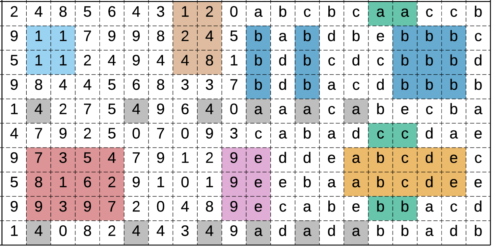
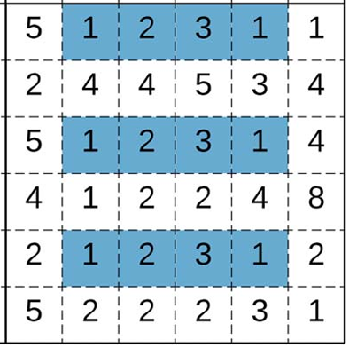
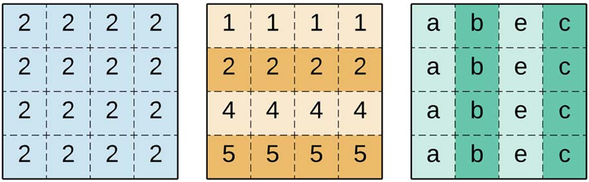
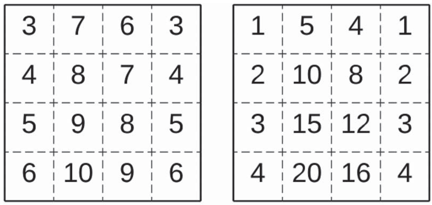
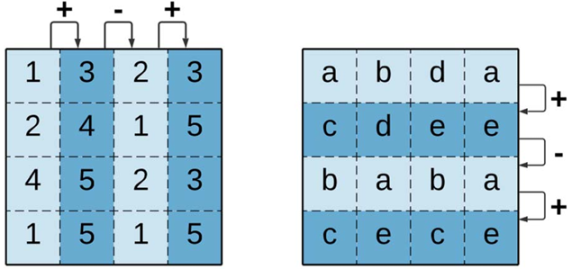
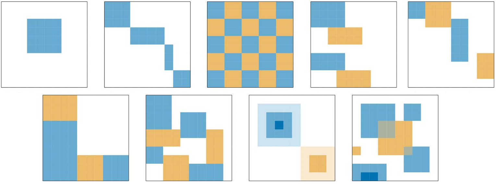

<hr style="border: 1px solid rgba(50, 0, 0, 1);">




Hasta ahora hemos abordado la tarea de predecir los valores de una respuesta variable $Y\in\RR$, continua (*regresión*) o discreta (*clasificación*) a partir de un conjunto de variables predictoras $\XX\in\RR^p$. Este tipo de problemas se enmarca en lo que se conoce como *aprendizaje supervisado*. 

En esta sección nos centraremos en el *aprendizaje no supervisado*. En este caso, el conjunto de entrenamiento es $\{\xx_i\}_{i=1}^n$ y la distribución asociada es $p(\xx)$. El objetivo ya no es predecir una variable respuesta, sino descubrir estructuras o patrones en los datos que resulten de interés. En particular, una de las tareas más comunes es la *segmentación* o *clustering*, cuyo propósito es identificar grupos dentro del conjunto de datos que se diferencien entre sí de manera significativa.

El problema de *clustering* puede abordarse desde distintas perspectivas. De manera general, se distinguen tres tipos:

- *Métodos combinatorios*: trabajan directamente sobre los datos observados, sin asumir un modelo probabilístico subyacente.

- *Modelos de mezcla*: suponen que los datos son una muestra i.i.d. de una distribución de probabilidad compuesta por varios componentes. 

- *Búsqueda de modas*: adoptan una perspectiva no paramétrica, intentando estimar directamente las modas (máximos locales) de $p(\xx)$.

<div style="margin-top:2.5em;"></div>


## $K$-medias

En los métodos combinatorios, las observaciones se asignan directamente a un cluster, estableciendo de antemano un número de clusters $K<n$.  La tarea está caracterizada por un mapeo
$$
k=C(i)
$$
que asigna a la $i$-ésima observación el $k$-ésimo cluster. Los *parámetros* de este procedimiento son cada una de las asignaciones de las observaciones, y se ajustan de manera tal de *minimizar* una función de pérdida basada en una *medida de disimilaridad* $d(\xx_i,\xx_j)$ entre pares de observaciones. Una elección natural de la función de pérdida deriva en el siguiente problema de optimización:
$$
\begin{array}{ll}
\text{minimizar } & W(C)=\displaystyle\frac{1}{2}\sum_{k=1}^K\sum_{C(i)=k}\sum_{C(j)=k}d(\xx_i,\xx_j).
\end{array}
\tag{1}
$$

<div style="margin-top:2em;"></div>

::: {.callout .question}

<span style="font-size: 1.3em;">📝</span><br>

Analice la equivalencia entre (1) y 
$$
\begin{array}{ll}
\text{maximizar } & B(C)=\displaystyle\frac{1}{2}\sum_{k=1}^K\sum_{C(i)=k}\sum_{C(j)\neq k}d(\xx_i,\xx_j).
\end{array}
$$

:::

<div style="margin-top:2em;"></div>

El problema de optimización planteado en (1) resulta computacionalmente intratable para conjuntos de datos de tamaño moderado, ya que el número de posibles asignaciones crece muy rápido con $n$ y $K$. Por ejemplo, existen más de $10^{10}$ formas de asignar $N=19$ observaciones a $K=4$ clusters. Por esta razón, los algoritmos existentes recurren a estrategias iterativas que buscan mejorar progresivamente una partición inicial. Entre estos métodos, el más utilizado y conceptualmente sencillo es el algoritmo de $K$-medias, que puede interpretarse como una forma de descenso iterativo sobre la función de pérdida $W(C)$.

En $K$-medias, la medida de disimilaridad es
$$
d(\xx_i,\xx_j)=\|\xx_i-\xx_j\|_2^2,
$$

y la función de pérdida resulta en
$$
W(C)=\sum_{k=1}^K n_k\sum_{C(i)=k}\|\xx_i-\bar{\xx}_k\|_2^2,
\tag{2}
$$

donde $\bar{\xx}_k$ es el vector de medias del $k$-ésimo cluster y $n_k$ es el tamaño de dicho cluster.  


::: {.callout .question}

<span style="font-size: 1.3em;">📝</span><br>

Verifique la expresión (2).

:::

<div style="margin-top:2em;"></div>


::: {.highlight}
<span class="badge bg-custom">Algoritmo $K$-medias</span>

---

Dado un conjunto de *centroides iniciales* $\{\bfmu_1,\ldots,\bfmu_k\}\subset\RR^p$:

<div style="margin-left: 1em">

**repetir** para $t = 0,1,2,\ldots$:

> **1°** Calcular, para todo $i=1,\ldots,n$, la asignación $$C(i)=\arg\min_{j}\|\xx_i-\bfmu_j\|_2^2.$$
>
> **2°** Actualizar, para todo $j=1,\ldots,K$, el centroide mediante $$\bfmu_j=\frac{\sum_{i=1}^n\bfone\{C(i)=j\}\,\xx_i}{\sum_{i=1}^n\bfone\{C(i)=j\}}.$$

**hasta** que el criterio de parada se satisfaga.

</div>

---

:::

<div style="margin-top: 2em;"></div>

<div class="alert alert-light text-dark" role="important">
<span class="badge bg-warning text-dark">Importante</span>

La función 
$$
J(C,\bfmu) := \sum_{i=1}^n\|\xx_i-\bfmu_{C(i)}\|_2^2
$$
se denomina *función de distorsión*; mide la pérdida de fidelidad al representar cada observación $\xx_i$ por su centroide $\bfmu_{C(i)}$. El algoritmo de $K$-medias realiza exactamente un descenso por coordenadas de $J$. En primer lugar, se minimiza $J$ con respecto a $C$ manteniendo $\bfmu$ fijo, y luego se minimiza $J$ con respecto a $\bfmu$ manteniendo $C$ fijo. 

La función de distorsión no es convexa, por lo que no está garantizado alcanzar un mínimo global. Aun así, $K$-medias funciona bien y produce agrupamientos muy buenos. Sin embargo, si se teme que el algoritmo quede atrapado en un mínimo local, una práctica común es ejecutar $K$-medias varias veces, usando diferentes valores iniciales para los centroides y, luego, entre todas las agrupaciones obtenidas, se elige aquella que tenga el menor valor de la distorsión $J$.

</div>

<div style="margin-top: 2em;"></div>

::: {.callout-example}
<span class="badge bg-primary">Ejemplo 1</span> 
<span style="color: #0d6efd; font-family: Arial; font-weight: bold; font-size: 0.85em;">
Aplicación de $K$-medias
</span>

Vamos a ver cómo evoluciona el agrupamiento del algoritmo de $K$-medias para el siguiente conjunto de datos simulados.

```{pyodide-python}
#| echo: false
#| fig-align: "center"

import numpy as np
import matplotlib.pyplot as plt
from sklearn.datasets import make_blobs

# --- 1. Simular datos con clusters más solapados ---
np.random.seed(100)
X, y_true = make_blobs(
    n_samples=750,
    centers=[[1, 1], [-1, -1], [1, -1]],  # más cercanos
    cluster_std=0.4,                   # más dispersión
    random_state=0
)

# --- 2. Graficar los datos iniciales ---
plt.figure(figsize=(5, 4))
plt.scatter(X[:, 0], X[:, 1], s=35, color='gray')
plt.xlabel('$x_1$')
plt.ylabel('$x_2$')
plt.grid(False)
plt.show()
```


Consideraremos $K=3$ y, en cada paso, graficaremos el agrupamiento resultante y calcularemos la función de distorsión.

```{pyodide-python}
#| echo: false
#| fig-align: "center"
#| context: ojs
#| input: [iter]
 
import numpy as np
import matplotlib.pyplot as plt
from sklearn.datasets import make_blobs

# --- 1. Simular datos con clusters más solapados ---
np.random.seed(100)
X, y_true = make_blobs(
    n_samples=750,
    centers=[[1, 1], [-1, -1], [1, -1]],  # más cercanos
    cluster_std=0.4,                   # más dispersión
    random_state=0
)

# --- 2. Parámetros del algoritmo ---
K = 3
max_iter = iter

# --- 3. Inicialización aleatoria ---
indices = np.random.choice(len(X), K, replace=False)
centroids = X[indices]

# --- 4. Función de distorsión ---
def distortion(X, centroids, labels):
    return np.sum(np.linalg.norm(X - centroids[labels], axis=1) ** 2)

# --- 5. Ciclo principal ---
for t in range(max_iter):
    distances = np.linalg.norm(X[:, np.newaxis, :] - centroids[np.newaxis, :, :], axis=2)
    labels = np.argmin(distances, axis=1)

    new_centroids = np.array([X[labels == k].mean(axis=0) for k in range(K)])

    J = distortion(X, centroids, labels)
    print(f"Iteración {t+1}: J = {J:.2f}")

    centroids = new_centroids

# --- 6. Graficar resultado final ---
plt.figure(figsize=(5, 4))
for k in range(K):
    plt.scatter(X[labels == k, 0], X[labels == k, 1], s=35, label=f'Cluster {k+1}')
plt.scatter(centroids[:, 0], centroids[:, 1], c='black', s=150, marker='X', label='Centroides')
plt.title('K-medias')
plt.grid(False)
plt.show()

```

```{ojs}
//| echo: false
viewof iter = Inputs.range([1, 7], {
  step: 1,
  label: "t:",
  value: 0
})

```

:::

<div style="margin-top:2.5em;"></div>


## Mezcla de Gaussianas (GMM)

Los modelos de mezcla asumen que la función de densidad de $\XX\in\RR^p$ es de la forma
$$
p(\xx)=\sum_{k=1}^K\phi_k f(\xx\mid\bftheta_k),
$$
donde $\phi_k\geq 0$ son los pesos, $\sum_{k=1}^K \phi_k=1$  y $f(\xx\mid\bftheta_k)$ es la función de densidad de la componente $k$, parametrizada por $\bftheta_k$.

El modelo de mezcla más popular surge de considerar componentes Gaussianas:
$$
f(\xx\mid\bfmu_k,\Sigma_k)=\frac{1}{(2\pi)^{p/2}|\Sigma_k|^{1/2}}\exp\left\{-\frac{1}{2}(\xx-\bfmu_k)^\top\Sigma^{-1}(\xx-\bfmu_k)\right\}.
$$

Una forma útil de interpretar este modelo es introducir una <mark>variable latente</mark> $Z\in\{1,\ldots,K\}$ que indica a qué componente pertenece cada observación. Así, la probabilidad conjunta
$$
p(\xx,z)=p(\xx\mid z)\,p(z)
$$

permite describir de forma probabilística al GMM como sigue.

:::{.myhighlight2}

<span style="font-size:0.8em;">*Supuestos del modelo*</span>
<div style="margin-top:-0.1em;"></div>

$$
\begin{array}{c}
Z\sim\text{Multinomial}(1,\boldsymbol{\phi}) \\[2pt]
\XX\mid Z=k\sim\calN(\bfmu_k,\Sigma_k)
\end{array}
$$

:::

Los parámetros del modelo son $\bfphi$, $\bfmu_k$ y $\Sigma_k$. Observar que, para un conjunto de datos $\{\xx_i\}_{i=1}^n$, la función de log-verosimilitud es
$$
\ell(\bfphi,\bfmu,\Sigma)=\sum_{i=1}^n\log p(\xx_i\mid\bfphi,\bfmu,\bfSigma)=\sum_{i=1}^n\log\sum_{k=1}^K\phi_k\, p(\xx_i\mid \bfmu_k, \Sigma_k).
$$


La optimización directa de esta función no es posible, ya que la suma dentro del logaritmo impide obtener una forma cerrada para los estimadores de máxima verosimilitud. Además, la variable latente $Z$ no es observable, lo que complica aún más dicha tarea. En consecuencia, es necesario recurrir a un algoritmo iterativo para la estimación. En particular, el algoritmo *Expectation-Maximization* (EM) ofrece una forma práctica y eficiente de pasos alternados. Nos enfocaremos en dicho algoritmo en la próxima sección.


<div style="margin-top: 2em;"></div>

::: {.callout-example}
<span class="badge bg-primary">Ejemplo 2</span> 
<span style="color: #0d6efd; font-family: Arial; font-weight: bold; font-size: 0.85em;">
Aplicación de GMM
</span>

Aplicaremos GMM a los mismos datos del Ejemplo 1, utilizando 3 componentes. 

```{pyodide-python}
#| echo: false
#| fig-align: "center"
 
import numpy as np
import matplotlib.pyplot as plt
from sklearn.datasets import make_blobs
from sklearn.mixture import GaussianMixture
from sklearn.metrics import confusion_matrix
from scipy.optimize import linear_sum_assignment
from matplotlib.patches import Ellipse

# --- 1. Simular datos ---
np.random.seed(100)
X, y_true = make_blobs(
    n_samples=750,
    centers=[[1, 1], [-1, -1], [1, -1]],  # posiciones de los clusters
    cluster_std=0.4,
    random_state=0
)

# --- 2. Ajustar GMM ---
K = 3
gmm = GaussianMixture(n_components=K, covariance_type='full', random_state=42)
gmm.fit(X)
labels = gmm.predict(X)  # asignación inicial del GMM

# --- 3. Mapear labels para que coincidan con y_true ---
cm = confusion_matrix(y_true, labels)
row_ind, col_ind = linear_sum_assignment(-cm)  # maximizar coincidencia
mapping = dict(zip(col_ind, row_ind))
labels_mapped = np.array([mapping[l] for l in labels])

# --- 4. Graficar clusters con colores consistentes ---
colors_map = np.array(['tab:green', 'tab:blue', 'tab:orange'])
plt.figure(figsize=(5,4))
for k in range(K):
    plt.scatter(X[labels_mapped == k, 0], X[labels_mapped == k, 1],
                s=35, color=colors_map[k], label=f'Cluster {k+1}')

# --- 5. Dibujar elipses de covarianza ---
for k in range(K):
    mu = gmm.means_[k]
    cov = gmm.covariances_[k]
    eigvals, eigvecs = np.linalg.eigh(cov)
    angle = np.degrees(np.arctan2(*eigvecs[:,0][::-1]))
    width, height = 2 * np.sqrt(eigvals)  # 2*sqrt(lambda) ≈ 1 std
    ell = Ellipse(mu, width, height, angle=angle,
                  edgecolor='black', facecolor='none', lw=2)
    plt.gca().add_patch(ell)

plt.xlabel('$x_1$')
plt.ylabel('$x_2$')
plt.title('GMM')
plt.grid(False)
plt.show()

```

:::


<div style="margin-top:2.5em;"></div>


## DBSCAN

Los métodos de clustering basado en densidad identifican grupos de observaciones como regiones densas del espacio de datos, separadas por áreas donde los puntos son escasos. Esto permite detectar clusters de forma arbitraria, no necesariamente esféricos, y además identificar puntos aislados o ruido que no pertenecen a ningún cluster.

Uno de los métodos más conocidos es DBSCAN (*Density-Based Spatial Clustering of Applications with Noise*), el cual define un vecindario de radio $\varepsilon>0$ alrededor de cada punto y considera *densos* aquellos puntos cuyo vecindario contiene al menos un número mínimo de puntos. Los puntos que cumplen esta condición se denominan <mark>*objetos núcleos*</mark> y sirven como semilla para formar clusters. 

Es importante remarcar que la idea de *vecindario* requiere trabajar con una métrica $d:\RR^p\times\RR^p\to\RR$. 

<figure style="text-align: center;">
  
  <figcaption> **Figura 1**. Interpretación geométrica de objetos núcleos (en verde) y objetos no núcleos (en gris), considerando un número mínimo de 3 vecinos. </figcaption>
</figure>

<div style="margin-top:2em;"></div>

 
Las siguientes definiciones son la base del método:
 
  - Dos objetos núcleos $\mathbf{p}_1$ y $\mathbf{p}_2$ son *$\varepsilon$-alcanzables* si $d(\mathbf{p}_1,\mathbf{p}_2)<\varepsilon$.

  - Dos objetos núcleos  $\mathbf{p}_1$ y $\mathbf{p}_2$ están *conectados por densidad* si, o bien son $\varepsilon$-alcanzables, o bien existen objetos núcleos $\mathbf{r}_1, \ldots, \mathbf{r}_l$ tales que $\mathbf{p_1}$ y $\mathbf{r}_1$ son $\varepsilon$-alcanzables, $\mathbf{r}_i$ y $\mathbf{r}_{i+1}$ ($1\leq i<l$) son $\varepsilon$-alcanzables, y $\mathbf{r}_l$ y $\mathbf{p}_2$ son $\varepsilon$-alcanzables.


En base a esto, se define la noción de cluster para el método DBSCAN.

::: {.myhighlight}

Dado $\varepsilon>0$ y un mínimo de puntos, un cluster $C$ es un subconjunto no vacío y maximal de objetos núcleos tal que cada par de puntos en $C$ están conectados por densidad.

:::

<div style="margin-top:2em;"></div>

<figure style="text-align: center;">
  
  <figcaption> **Figura 2**. Clusters formados por objetos núcleos de un conjunto de puntos. </figcaption>
</figure>

<div style="margin-top:2em;"></div>

Observar que un cluster contiene únicamente objetos núcleos. Para el resto de los puntos se procede de la siguiente manera:

- Un *objeto de frontera* es un punto que no es núcleo, pero que se encuentra dentro del vecindario de al menos un objeto núcleo. Los objetos de frontera se asignan al cluster correspondiente al objeto núcleo del cual son vecinos.

- Un *ruido* es un punto que no pertenece al vecindario de ningún objeto núcleo y, por lo tanto, no se asigna a ningún cluster.

<figure style="text-align: center;">
  
  <figcaption> **Figura 3**. Interpretación geométrica de objetos frontera (uno por cada cluster) y ruidos (en gris), considerando un número mínimo de 3 vecinos. </figcaption>
</figure>

<div style="margin-top: 2em;"></div>


<figure style="text-align: center;">
  
  <figcaption> **Figura 4**. Agrupamiento obtenido por DBSCAN. Los hiperparámetros son $\varepsilon>0$ y el número mínimo de vecinos. </figcaption>
</figure>


::: {.callout-example}
<span class="badge bg-primary">Ejemplo 3</span> 
<span style="color: #0d6efd; font-family: Arial; font-weight: bold; font-size: 0.85em;">
Aplicación de DBSCAN
</span>

Aplicaremos DBSCAN a los mismos datos de los Ejemplos 1 y 2. Utilizaremos un valor de $\varepsilon$ adecuado que permita distinguir al menos 3 clusters.


```{pyodide-python}
#| echo: false
#| fig-align: "center"
 
import numpy as np
import matplotlib.pyplot as plt
from sklearn.datasets import make_blobs
from sklearn.cluster import DBSCAN
from sklearn.metrics import confusion_matrix
from scipy.optimize import linear_sum_assignment

# --- 1. Datos ---
np.random.seed(100)
X, y_true = make_blobs(
    n_samples=750,
    centers=[[1, 1], [-1, -1], [1, -1]],  # posiciones de los clusters
    cluster_std=0.4,
    random_state=0
)

# --- 2. DBSCAN ---
eps = 0.3
min_samples = 10
dbscan = DBSCAN(eps=eps, min_samples=min_samples)
labels = dbscan.fit_predict(X)

# --- 3. Mapear labels de DBSCAN a y_true ---
# Ignorar el ruido (-1) al hacer la correspondencia
mask = labels != -1
cm = confusion_matrix(y_true[mask], labels[mask])
row_ind, col_ind = linear_sum_assignment(-cm)
mapping = dict(zip(col_ind, row_ind))
labels_mapped = np.array([mapping[l] if l != -1 else -1 for l in labels])

# --- 4. Graficar con colores consistentes ---
colors_map = np.array(['tab:green', 'tab:blue', 'tab:orange'])
plt.figure(figsize=(5,4))
for k, col in enumerate(colors_map):
    plt.scatter(X[labels_mapped == k, 0], X[labels_mapped == k, 1],
                s=35, color=col, label=f'Cluster {k+1}')
# Graficar ruido si lo hay
if np.any(labels_mapped == -1):
    plt.scatter(X[labels_mapped == -1, 0], X[labels_mapped == -1, 1],
                s=35, color='black', label='Ruido')

plt.xlabel('$x_1$')
plt.ylabel('$x_2$')
plt.title('DBSCAN')
plt.grid(False)
plt.show()

```

:::


::: {.callout-example}
<span class="badge bg-primary">Ejemplo 4</span> 
<span style="color: #0d6efd; font-family: Arial; font-weight: bold; font-size: 0.85em;">
Clusters no esféricos
</span>

En este ejemplo aplicamos DBSCAN a un conjunto de datos con estructura no esférica. Este tipo de geometría es difícil de separar con métodos como $K$-medias.

```{pyodide-python}
#| echo: false
#| fig-align: "center"
 
import numpy as np
import matplotlib.pyplot as plt
from sklearn.datasets import make_moons
from sklearn.cluster import DBSCAN, KMeans

# --- 1. Datos no esféricos ---
np.random.seed(42)
X, y_true = make_moons(n_samples=500, noise=0.05)

# --- 2. K-means para comparación ---
kmeans = KMeans(n_clusters=2, random_state=42)
labels_km = kmeans.fit_predict(X)

# --- 3. DBSCAN ---
dbscan = DBSCAN(eps=0.15, min_samples=5)
labels_db = dbscan.fit_predict(X)

# --- 4. Colores consistentes ---
colors_map = ['tab:blue', 'tab:orange']  # Cluster 0 y 1
noise_color = 'black'                    # Ruido de DBSCAN

# --- 5. Graficar ---
fig, axes = plt.subplots(1, 2, figsize=(12,5))

# K-means
for k, col in enumerate(colors_map):
    axes[0].scatter(X[labels_km == k,0], X[labels_km == k,1], s=50, color=col, label=f'Cluster {k+1}')
axes[0].set_title('K-medias', size=30)
axes[0].grid(False)

# DBSCAN
unique_labels = np.unique(labels_db)
for k in unique_labels:
    if k == -1:
        axes[1].scatter(X[labels_db == k,0], X[labels_db == k,1], c=noise_color, s=35, label='Ruido')
    else:
        axes[1].scatter(X[labels_db == k,0], X[labels_db == k,1], s=50, color=colors_map[k], label=f'Cluster {k+1}')
axes[1].set_title('DBSCAN', size=30)
axes[1].grid(False)

plt.show()

```

:::


<div style="margin-top:2.5em;"></div>


## Biclustering

El *biclustering* es una técnica que agrupa de forma simultánea filas y columnas de una matriz de datos. Este enfoque presenta dos claras ventajas:

- Reconoce similaridades locales, identificando grupos de observaciones que presentan comportamientos similares exclusivamente en un subconjunto de atributos.

- Permite solapamientos: tanto las observaciones como los atributos pueden pertenecer a más de un grupo.

El biclustering ha demostrado una notable versatilidad al permitir detectar contribuciones simultáneas de procesos biológicos superpuestos y descubrir diversos patrones locales en los datos. Desde su introducción en la década del 70 y su popularización con el [algoritmo de Cheng y Church (2000)](https://www.cs.princeton.edu/courses/archive/fall03/cs597F/Articles/biclustering_of_expression_data.pdf) aplicado a datos de expresión génica, se ha consolidado como una herramienta fundamental principalmente en bioinformática, donde algunas de sus aplicaciones más importantes son:

- El *análisis del nivel de expresión génica según condiciones experimentales*. Cada fila representa un gen y su nivel de expresión se mide a lo largo de un conjunto de condiciones (columnas). Estas aplicaciones incluyen la identificación de subtipos de enfermedades y la predicción de pronósticos de enfermedades en medicina personalizada.

- La *identificación de submódulos de redes biológicas*. Las redes biológicas representan interacciones entre diferentes entidades biológicas (proteínas, complejos proteicos, genes, metabolitos, fármacos y enfermedades). El biclustering se utiliza para analizar redes homogéneas (interacciones entre las mismas entidades) y redes heterogéneas (interacciones entre entidades distintas).

- El *análisis de señales cerebrales* para estudiar respuestas a estímulos a lo largo del tiempo y la conectividad cerebral, así como para agrupar sujetos según similitud de características.

Por otro lado, también se aplica a minería de texto, sistemas de recomendación y administración de recursos (consumo de agua, energía o patrones de movilidad urbana).

<div style="margin-top:2em;"></div>


::: {.definicion}
**Definición 1.** (Bicluster) Dada una matriz de datos $X\in\RR^{n\times p}$, un bicluster $B=(I,J)$ está determinado por un subconjunto $I\subset\{1,\ldots,n\}$ de filas y un subconjunto $J\subset\{1,\ldots,p\}$ de columnas.
:::

<div style="margin-top:2em;"></div>


<figure style="text-align: center;">
  
  <figcaption> **Figura 5**. Ejemplo de una matriz de datos con 8 biclusters sin solapamiento. </figcaption>
</figure>

<div style="margin-top:2em;"></div>


Algunas características de los biclusters son:

- **Tamaño**: está determinado por el número de filas $N$ en $I$ y el número de columnas $M$ en $J$ que forman un *área* $N\times M$.

- **Tipo**: los biclusters pueden ser *homogéneos* (mismo tipo de datos) o *heterogéneos*. Por ejemplo, las matrices numéricas son datos homogéneos, así como también las matrices binarias, estas últimas utilizadas en estudios de presencia o ausencia. Por su parte, los datos heterogéneos combinan distintos tipos de información o incorporan dimensiones adicionales, como el tiempo o el espacio, algo frecuentes en análisis de datos clínicos.

- **Contigüidad**: un *bicluster contiguo* (C-Bicluster) tiene un orden entre sus filas o columnas. Este tipo de biclusters es especialmente útil en dominios donde existe una secuencia natural, como en las series temporales.

{fig-align="center" width="180px"}

- **Coherencia**: describe correlaciones entre los elementos de un bicluster en ausencia de ruido.

    - un bicluster *constante* es aquel en que todos sus elementos tienen el mismo valor. También pueden ser constantes por fila o por columna. te tipo de biclusters permite detectar regiones estables o comportamientos uniformes en los datos. 
    
      {fig-align="center" width="400px"}

    - un bicluster *coherente* en datos numéricos refleja relaciones proporcionales o comportamientos sistemáticos. Puede ser aditivo (*shifting*) o multiplicativo (*scaling*). Este tipo de biclusters permite identificar patrones consistentes incluso cuando los valores absolutos difieren entre las observaciones.

      {fig-align="center" width="300px"}

    - un bicluster que *preserva el orden* en datos numéricos o categóricos ordinales permite que sus filas o columnas puedan reordenarse de manera tal que los valores sigan una tendencia monótona. Este tipo de coherencia permite identificar tendencias o patrones de evolución en los datos.

      {fig-align="center" width="350px"}

    - un bicluster *compuesto* combina distintos tipos de coherencia. Puede dividirse en varios sub-biclusters, cada uno con su propio patrón. Este tipo de estructura permite captar relaciones mixtas o jerárquicas entre las variables.

- **Calidad**: la calidad de un bicluster evalúa cuánto se ajustan sus valores al patrón asumido. Puede verse afectada por la presencia de ruido o valores faltantes dentro del bicluster.


### Estructuras de soluciones

La estructura de una solución de biclustering describe cómo se relacionan los distintos biclusters entre sí (por ejemplo, si se superponen o si cubren toda la matriz). Esta estructura depende tanto de la naturaleza de los datos como del criterio de búsqueda del algoritmo empleado. Elegir un algoritmo con las restricciones adecuadas es fundamental, ya que condiciona el tipo de patrones y relaciones que podrán descubrirse.


<figure style="text-align: center;">
  
  <figcaption> **Figura 6**. Diferentes estructuras de biclustering. </figcaption>
</figure>

<div style="margin-top:2em;"></div>


### Biclustering espectral

Los métodos espectrales de biclustering se basan en analizar la estructura algebraica de la matriz de datos mediante descomposición en valores propios o singulares. En [`scikit-learn`](https://scikit-learn.org/stable/modules/biclustering.html) se incluyen dos variantes principales de este enfoque:

- `SpectralCoclustering`: los datos se interpretan como un grafo bipartito, donde las filas y columnas constituyen dos conjuntos de vértices y cada entrada representa una conexión entre ellos. El método busca subgrafos densos, produciendo una partición disjunta de la matriz.

    <small> 📖 Dhillon, I. S. (2001). Co-clustering documents and words using bipartite spectral graph partitioning. *Proceedings of the Seventh ACM SIGKDD International Conference on Knowledge Discovery and Data Mining (KDD’01)*, 269–274. Association for Computing Machinery. </small>

- `SpectralBiclustering`: asume que la matriz presenta una estructura oculta tipo tablero de ajedrez. Las filas y columnas de una matriz con esta estructura pueden particionarse de manera que los elementos de cualquier bicluster (formado por el producto cartesiano de los grupos de filas y columnas) sean aproximadamente constantes.

    <small> 📖 Kluger, Y., Basri, R., Chang, J. T., & Gerstein, M. (2003). Spectral biclustering of microarray data: Coclustering genes and conditions. *Genome Research*, 13(4), 703–716. </small>

<div style="margin-top:2em;"></div>

El algoritmo Spectral Coclustering fue desarrollado originalmente para el análisis de textos, donde las filas representan documentos y las columnas palabras, permitiendo identificar grupos de documentos que comparten cierto vocabulario. Por su parte, Spectral Biclustering fue introducido en el contexto del análisis de expresión génica, con el fin de detectar subconjuntos de genes que muestran comportamientos coherentes. Actualmente, ambos enfoques se aplican en una amplia variedad de dominios, como la biología computacional, la minería de textos, los sistemas de recomendación y el análisis de redes.


### Evaluación

Los resultados obtenidos por un algoritmo de biclustering pueden evaluarse desde dos perspectivas: interna y externa. Las medidas internas analizan la calidad del resultado, teniendo en cuenta el análisis de las características de los biclusters obtenidos. Las medidas externas, en cambio, comparan el resultado con la solución verdadera, lo cual es especialmente útil al trabajar con datos simulados.

En la evaluación externa de biclusterings, es importante contar con una medida que compare biclusters individuales. En ejemplos prácticos, se suele usar una versión adaptada del índice de Jaccard (como en `scikit-learn`) que mide la similitud entre dos biclusters considerando las filas y columnas que lo forman. Sin embargo, en la literatura académica, se emplean con mayor frecuencia métricas específicas de biclustering, diseñadas para evaluar la calidad estructural de la solución (ver Tabla 7 en Castanho et al., 2020).

Respecto al *índice de Jaccard*, está definido como
$$
J(A,B):=\frac{|A\cap B|}{|A\cup B|},
$$

donde $A$ y $B$ son los biclusters. El índice vale 0 cuando los biclusters no se superponen y 1 cuando son idénticos.

Una vez que se han medido los biclusters de forma individual, es necesario implementar una medida que combine los resultados obtenidos en un puntaje total. `scikit-learn` utiliza `consensus_score`, que realiza el siguiente procedimiento:

1. Calcula las similitudes entre todos los pares de biclusters mediante el índice de Jaccard.

2. Encuentre la asignación de los biclusters entre conjuntos (solución obtenida vs solución verdadera) que maximice la suma de similitudes (esto mediante el algoritmo de Jonker-Volgenant).

3. Divide la suma obtenida por el tamaño del conjunto más grande.

El puntaje final toma valores entre 0 y 1: el valor 0 indica ausencia total de coincidencia, mientras que 1 señala una correspondencia perfecta entre conjuntos de biclusters.


::: {.callout-example}
<span class="badge bg-primary">Ejemplo 5</span> 
<span style="color: #0d6efd; font-family: Arial; font-weight: bold; font-size: 0.85em;">
Datos con estructura de bloques diagonales constantes
</span>

La función `make_biclusters` de `scikit-learn` genera datos con estructura de bloques diagonales constantes. Vamos a generar una matriz de datos $200\times 200$ con una estructura con 5 biclusters.

```{python}
#| code-summary: "Mostrar código"
#| code-fold: false
#| fig-align: "center"

import numpy as np
import matplotlib.pyplot as plt
from sklearn.datasets import make_biclusters

# Datos simulados:
data, rows, columns = make_biclusters(
    shape=(200, 200), n_clusters=5, noise=0.2, random_state=0
)


# 📈:
fig, axes = plt.subplots(1, 2, figsize=(10, 4))

axes[0].matshow(data, cmap="viridis")
axes[0].set_title("Datos originales");

# Estructura verdadera:
row_order = np.argsort(np.argmax(rows, axis=0))
col_order = np.argsort(np.argmax(columns, axis=0))
true_data = data[row_order][:, col_order]

axes[1].matshow(true_data, cmap="viridis")
axes[1].set_title("Estructura verdadera");
```

Vamos a aplicar los algoritmos `SpectralCoclustering` y `SpectralBiclustering` y evaluar su rendimiento. Por la estructura de los datos, se espera que el primero logre un mejor desempeño, puesto que está especialmente diseñado para este tipo de datos.

```{python}
#| code-summary: "Mostrar código"
#| code-fold: false
#| fig-align: "center"

from sklearn.cluster import SpectralCoclustering
from sklearn.cluster import SpectralBiclustering
from sklearn.metrics import consensus_score

# MODELO 1: 
model1 = SpectralCoclustering(n_clusters=5, random_state=0)
model1.fit(data)
score1 = consensus_score((rows, columns), (model1.rows_, model1.columns_))

fit_data1 = data[np.argsort(model1.row_labels_)]
fit_data1 = fit_data1[:, np.argsort(model1.column_labels_)]

# MODELO 2:
model2 = SpectralBiclustering(n_clusters=5, random_state=0)
model2.fit(data)
score2 = consensus_score((rows, columns), (model2.rows_, model2.columns_))

fit_data2 = data[np.argsort(model2.row_labels_)]
fit_data2 = fit_data2[:, np.argsort(model2.column_labels_)]


# 📈:
fig, axes = plt.subplots(1, 2, figsize=(10, 4))

axes[0].matshow(fit_data1, cmap="viridis")
axes[0].set_title(f"Spectral CoClustering\nÍndice de Jaccard: {score1:.3f}");

axes[1].matshow(fit_data2, cmap="viridis")
axes[1].set_title(f"Spectral BiClustering\nÍndice de Jaccard: {score2:.3f}");

```

:::

<div style="margin-top:2em;"></div>

::: {.callout-example}
<span class="badge bg-primary">Ejemplo 5</span> 
<span style="color: #0d6efd; font-family: Arial; font-weight: bold; font-size: 0.85em;">
Datos con estructura tipo tablero de ajedrez
</span>

La función `make_checkerboard` de `scikit-learn` genera matrices con una estructura tipo tablero de ajedrez, donde los valores dentro de cada bloque son aproximadamente constantes. Vamos a generar una matriz de datos $200 \times 200$ con 5 grupos de filas y 3 grupos de columnas.

```{python}
#| code-summary: "Mostrar código"
#| code-fold: false
#| fig-align: "center"

import numpy as np
import matplotlib.pyplot as plt
from sklearn.datasets import make_checkerboard

# Datos simulados:
data, rows, columns = make_checkerboard(
    shape=(300, 300), n_clusters=(5, 3), noise=0.5, random_state=0
)


# 📈:
fig, axes = plt.subplots(1, 2, figsize=(10, 4))

axes[0].matshow(data, cmap="viridis")
axes[0].set_title("Datos originales");

# Estructura verdadera:
row_order = np.argsort(np.argmax(rows, axis=0))
col_order = np.argsort(np.argmax(columns, axis=0))
true_data = data[row_order][:, col_order]

axes[1].matshow(true_data, cmap="viridis")
axes[1].set_title("Estructura verdadera");
```

Vamos a aplicar los algoritmos `SpectralCoclustering` y `SpectralBiclustering` y evaluar su rendimiento. Por la estructura de los datos, se espera que el primero logre un mejor desempeño, puesto que está especialmente diseñado para este tipo de datos.

```{python}
#| code-summary: "Mostrar código"
#| code-fold: false
#| fig-align: "center"

from sklearn.cluster import SpectralCoclustering
from sklearn.cluster import SpectralBiclustering
from sklearn.metrics import consensus_score

# MODELO 1: 
model1 = SpectralCoclustering(n_clusters=5, random_state=0)
model1.fit(data)
score1 = consensus_score((rows, columns), (model1.rows_, model1.columns_))

fit_data1 = data[np.argsort(model1.row_labels_)]
fit_data1 = fit_data1[:, np.argsort(model1.column_labels_)]

# MODELO 2:
model2 = SpectralBiclustering(n_clusters=(5,3), random_state=0)
model2.fit(data)
score2 = consensus_score((rows, columns), (model2.rows_, model2.columns_))

fit_data2 = data[np.argsort(model2.row_labels_)]
fit_data2 = fit_data2[:, np.argsort(model2.column_labels_)]


# 📈:
fig, axes = plt.subplots(1, 2, figsize=(10, 4))

axes[0].matshow(fit_data1, cmap="viridis")
axes[0].set_title(f"Spectral CoClustering\nÍndice de Jaccard: {score1:.3f}");

axes[1].matshow(fit_data2, cmap="viridis")
axes[1].set_title(f"Spectral BiClustering\nÍndice de Jaccard: {score2:.3f}");


```


<br><br>

## Actividades {.unnumbered}


💻 **Prácticas**  
<hr class="linea-corta">

<div style="display:flex; align-items:center; text-align:left;">
  <a href="https://colab.research.google.com/drive/1dGzSEjz_aqWtJrZsGYcoLdYIwllit1JW?usp=sharing" target="_blank">
    
  </a>
  <p style="margin:0; font-size:1em;">$K$-medias. GMM.</p>
</div>

<div style="margin-top:0.5em;"></div>

<div style="display:flex; align-items:center; text-align:left;">
  <a href="https://colab.research.google.com/drive/1YjDOvzbNEdEhqwGCespEluK368r_5myx?usp=sharing" target="_blank">
    
  </a>
  <p style="margin:0; font-size:1em;">DBSCAN. Biclustering.</p>
</div>


<div style="margin-top: 5em;"></div>

::: {.refs}
<span style="color: #444;"><strong>Referencias</strong></span>

Castanho, E. N., Aidos, H., & Madeira, S. C. (2020). Biclustering data analysis: A comprehensive survey. Wiley Interdisciplinary Reviews: Data Mining and Knowledge Discovery, 10(2), e1344. Disponible [aquí](https://academic.oup.com/bib/article/25/4/bbae342/7713725).

Han, J., Kamber, M., & Pei, J. (2012). *Data Mining: Concepts and Techniques* (3rd ed.). Morgan Kaufmann.

Hastie, T., Tibshirani, R., & Friedman, J. (2009). *The Elements of Statistical Learning: Data Mining, Inference, and Prediction* (2nd ed.). Springer.

Ng, A. Apuntes del curso Stanford CS229: Machine Learning. Disponible [aquí](https://cs229.stanford.edu/notes2022fall/main_notes.pdf).

:::